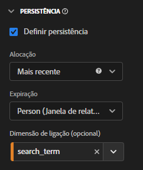

# Uso de dimensões e métricas de ligação no CJA

O Customer Journey Analytics oferece várias maneiras de persistir valores de dimensão além da ocorrência em que estão definidos. Um dos métodos de persistência que a Adobe oferece é conhecido como Ligação. Em versões anteriores do Adobe Analytics, esse conceito era conhecido como merchandising.

Embora você possa usar dimensões de ligação com dados de evento de nível superior, esse conceito é melhor usado ao trabalhar com [Arrays de objetos](object-arrays.md). Você pode atribuir uma dimensão a uma parte de um array de objetos sem aplicá-la a todos os atributos em um determinado evento. Por exemplo, você pode atribuir um termo de pesquisa a um produto no array de objetos do carrinho de compras sem vincular esse termo de pesquisa ao evento inteiro.

## Exemplo 1: uso de dimensões de ligação para conceder atributos de produto adicionais a uma compra

É possível vincular itens de dimensão em uma matriz de objetos a outra dimensão. Quando o item de dimensão vinculado é exibido, o CJA recupera a dimensão vinculada e a inclui no evento para você. Considere a seguinte jornada do cliente:

1. Um visitante visualiza a página de produto de uma máquina de lavar.

   ```json
   {
       "PersonID": "1",
       "product": [
           {
               "name": "Washing Machine 2000",
               "color": "white",
               "type": "front loader",
           },
       ],
       "timestamp": 1534219229
   }
   ```

1. O visitante então visualiza a página de produto de uma secadora.

   ```json
   {
       "PersonID": "1",
       "product": [
           {
               "name": "Dryer 2000",
               "color": "neon orange",
           },
       ],
       "timestamp": 1534219502
   }
   ```

1. Por fim, ele efetua uma compra. A cor de cada produto não foi incluída no evento de compra.

   ```json
   {
       "PersonID": "1",
       "orders": 1,
       "product": [
           {
               "name": "Washing Machine 2000",
               "price": 1600,
           },
           {
               "name": "Dryer 2000",
               "price": 499
           }
       ],
       "timestamp": 1534219768
   }
   ```

Se você desejar observar a receita por cor sem uma dimensão de ligação, a dimensão `product.color` persiste e atribui incorretamente o crédito à cor da secadora:

| product.color | receita |
| --- | --- |
| laranja neon | 2099 |

É possível acessar o Gerenciador de visualização de dados e vincular a cor do produto ao nome do produto:


Quando você define esse modelo de persistência, o CJA anota o nome do produto sempre que a cor do produto é definida. Quando o mesmo nome de produto é reconhecido em um evento subsequente para esse visitante, a cor do produto também é trazida. Ao vincular a cor do produto ao nome do produto, os mesmos dados seriam semelhantes ao seguinte:

| product.color | receita |
| --- | --- |
| branco | 1600 |
| laranja neon | 499 |

## Exemplo 2: uso de métricas de ligação para vincular um termo de pesquisa a uma compra de produto

Um dos métodos de merchandising mais comuns no Adobe Analytics tem sido o de vincular um termo de pesquisa a um produto para que cada termo de pesquisa receba crédito pelo seu produto apropriado. Considere a seguinte jornada do cliente:

1. Um visitante chega ao seu site e procura por “luvas de boxe”. A métrica de pesquisas é incrementada em um e os três principais resultados de pesquisa são exibidos.

   ```json
   {
       "PersonID": "1",
       "page_name": "Search results",
       "search": "1",
       "search_term": "boxing gloves",
       "product": [
           {
               "name": "Beginner gloves",
           },
           {
               "name": "Tier 3 gloves",
           },
           {
               "name": "Professional gloves",
           }
       ]
   }
   ```

2. Ele encontra um par de luvas que gosta e o adiciona ao carrinho.

   ```json
   {
       "PersonID": "1",
       "page_name": "Shopping cart",
       "cart_add": "1",
       "product": [
           {
               "name": "Tier 3 gloves",
           }
       ]
   }
   ```

3. O visitante então procura por “raquete de tênis”. A métrica de pesquisas é incrementada em um e os três principais resultados de pesquisa são exibidos.

   ```json
   {
       "PersonID": "1",
       "page_name": "Search results",
       "search": "1",
       "search_term": "tennis racket",
       "product": [
           {
               "name": "Shock absorb racket",
           },
           {
               "name": "Women's open racket",
           },
           {
               "name": "Extreme racket",
           }
       ]
   }
   ```

4. Ele encontra uma raquete que gosta e a adiciona ao carrinho.

   ```json
   {
       "PersonID": "1",
       "page_name": "Shopping cart",
       "cart_add": "1",
       "product": [
           {
               "name": "Tier 3 gloves",
           },
           {
               "name": "Shock absorb racket",
           }
       ]
   }
   ```

5. O visitante faz uma terceira pesquisa, por “sapatos”. A métrica de pesquisas é incrementada em um e os três principais resultados de pesquisa são exibidos.

   ```json
   {
       "PersonID": "1",
       "page_name": "Search results",
       "search": "1",
       "search_term": "shoes",
       "product": [
           {
               "name": "Men's walking shoes",
           },
           {
               "name": "Tennis shoes",
           },
           {
               "name": "Skate shoes",
           }
       ]
   }
   ```

6. Ele encontra um par de sapatos que gosta e o adiciona ao carrinho.

   ```json
   {
       "PersonID": "1",
       "page_name": "Shopping cart",
       "cart_add": "1",
       "product": [
           {
               "name": "Tier 3 gloves",
           },
           {
               "name": "Shock absorb racket",
           },
           {
               "name": "Skate shoes",
           }
       ]
   }
   ```

7. O visitante passa pelo processo de finalização e compra esses três itens.

   ```json
   {
       "PersonID": "1",
       "page_name": "Thank you for your purchase",
       "purchase": "1",
       "product": [
           {
               "name": "Tier 3 gloves",
               "price": "89.99"
           },
           {
               "name": "Shock absorb racket",
               "price": "34.99"
           },
           {
               "name": "Skate shoes",
               "price": "79.99"
           }
       ]
   }
   ```

Se você usar um modelo de alocação que não inclua uma dimensão vinculativa com termo de pesquisa, todos os três produtos atribuirão receita a apenas um único termo de pesquisa. Por exemplo, se você usou a alocação Original com a dimensão do termo de pesquisa:

| search_term | receita |
| --- | --- |
| luvas de boxe | US$ 204,97 |

Se você usou a alocação Mais recente com a dimensão de termo de pesquisa, todos os três produtos ainda atribuirão receita a um único termo de pesquisa:

| search_term | receita |
| --- | --- |
| sapatos | US$ 204,97 |

Embora este exemplo inclua apenas um visitante, muitos visitantes que pesquisam por coisas diferentes podem atribuir erroneamente termos de pesquisa a produtos diferentes, tornando difícil determinar quais são os melhores resultados de pesquisa.

Você pode vincular termos de pesquisa ao nome do produto sempre que a métrica Pesquisas estiver presente para atribuir corretamente o termo de pesquisa à receita.


No Analysis Workspace, o relatório resultante seria semelhante ao seguinte:

| search_term | receita |
| --- | --- |
| luvas de boxe | US$ 89,99 |
| raquete de tênis | US$ 34,99 |
| sapatos | US$ 79,99 |

O CJA detecta automaticamente a relação entre a dimensão selecionada e a dimensão de vínculo. Se a dimensão de vínculo estiver em uma matriz de objetos enquanto a dimensão selecionada estiver em um nível superior, será necessária uma métrica de vínculo. Uma métrica de ligação atua como um acionador de uma dimensão de ligação, de modo que se vincula apenas aos eventos em que a métrica de ligação está presente. No exemplo acima, a página de resultados da pesquisa sempre inclui uma dimensão de termo de pesquisa e uma métrica de pesquisas.

Definir a dimensão do termo de pesquisa para esse modelo de persistência executa a seguinte lógica:

* Quando a dimensão do termo de pesquisa for definida, verifique a presença do nome do produto.
* Se o nome do produto não estiver lá, nada será feito.
* Se o nome do produto estiver lá, será verificada a presença da métrica de Pesquisas.
* Se a métrica de Pesquisas não estiver lá, nada será feito.
* Se a métrica Pesquisas estiver lá, vincule o termo de pesquisa a todos os nomes de produtos nesse evento. Ele se copia para o mesmo nível que o nome do produto para esse evento. Neste exemplo, ele é tratado como product.search_term.
* Se o mesmo nome de produto for visualizado em um evento subsequente, o termo de pesquisa vinculado também será transportado para esse evento.

## Exemplo 3: Vincular termo de pesquisa de vídeo ao perfil do usuário

Você pode vincular um termo de pesquisa a um perfil de usuário, de modo que a persistência entre perfis permaneça completamente separada. Por exemplo, sua organização executa um serviço de transmissão em que uma conta abrangente pode ter vários perfis. O visitante tem um perfil filho e um perfil adulto.

1. A conta entra sob o perfil da criança e procura por um programa de TV. Observe que a variável `"ProfileID"` é `2` para representar o perfil filho.

   ```json
   {
       "PersonID": "7078",
       "ProfileID": "2",
       "Searches": "1",
       "search_term": "kids show"
   }
   ```

1. Eles encontram o programa &quot;Orangey&quot; e o tocam para que seus filhos possam vê-lo.

   ```json
   {
       "PersonID": "7078",
       "ProfileID": "2",
       "ShowName": "Orangey",
       "VideoStarts": "1"
   }
   ```

1. Mais tarde naquela noite, o pai muda para seu perfil e procura por conteúdo adulto para assistir. Observe que a variável `"ProfileID"` é `1` para representar o perfil de adulto. Ambos os perfis pertencem à mesma conta, representados pela mesma `"PersonID"`.

   ```json
   {
       "PersonID": "7078",
       "ProfileID": "1",
       "Searches": "1",
       "search_term": "grownup movie"
   }
   ```

1. Encontre o programa &quot;Analytics After Hours&quot; e desfrute de assistir à noite.

   ```json
   {
       "PersonID": "7078",
       "ProfileID": "1",
       "ShowName": "Analytics After Hours",
       "VideoStarts": "1"
   }
   ```

1. No dia seguinte, eles continuaram o programa &quot;Orangey&quot; para o filho. Eles não precisam pesquisar, pois já estão cientes do programa.

   ```json
   {
       "PersonID": "7078",
       "ProfileID": "2",
       "ShowName": "Orangey",
       "VideoStarts": "1"
   }
   ```

Se você usar a alocação Mais recente com a expiração de Pessoa, a variável `"grownup movie"` o termo de pesquisa é atribuído à última exibição do programa do garoto.

| Pesquisar termo | Início do vídeo |
| --- | --- |
| filme adulto | 2 |
| programa infantil | 1 |

No entanto, se você vincular `search_term` para `ProfileID`, cada pesquisa de perfil seria isolada em seu próprio perfil, atribuída aos programas corretos que ela procura.



O Analysis Workspace atribuiria corretamente o segundo episódio de Orangey ao termo de pesquisa `"kids show"` sem levar em conta as pesquisas de outros perfis.

| Pesquisar termo | Início do vídeo |
| --- | --- |
| programa infantil | 2 |
| filme adulto | 1 |

## Exemplo 4: Avaliar o comportamento de navegação e pesquisa em uma configuração de varejo

Você pode vincular valores a dimensões definidas em eventos anteriores. Quando você define uma variável com uma dimensão de vínculo, o CJA leva em consideração o valor persistente. Se esse comportamento for indesejado, você poderá ajustar as configurações de persistência da dimensão de vínculo. Considere o exemplo a seguir em que `product_finding_method` for definida em um evento e vinculada à métrica Adições ao carrinho no evento a seguir.

1. Um visitante faz uma pesquisa por `"camera"`. Observe que nenhum produto está definido nesta página.

   ```json
   {
       "search_term": "camera",
       "product_finding_method": "search"
   }
   ```

1. Eles clicam em uma câmera que gostam e a adicionam ao carrinho.

   ```json
   {
       "Product": [
           {
               "name": "DSLR Camera"
           }
       ],
       "CartAdd": "1"
   }
   ```

1. O visitante então navega na categoria de cintos masculinos sem realizar uma pesquisa. Observe que nenhum produto está definido nesta página.

   ```json
   {
       "category": "Men's belts",
       "product_finding_method": "browse"
   }
   ```

1. Eles clicam em um cinto de que gostam e o adicionam ao carrinho.

   ```json
   {
       "Product": [
           {
               "name": "Ratchet belt"
           }
       ],
       "CartAdd": "1"
   }
   ```

1. Eles passam pelo processo de finalização e compram esses dois itens.

   ```json
   {
       "Product": [
           {
               "name": "DSLR Camera",
               "price": "399.99"
           },
           {
               "name": "Ratchet belt",
               "price": "19.99"
           }
       ],
       "Purchase": "1"
   }
   ```

Se a persistência for definida como alocação mais recente sem uma dimensão vinculativa, todos os $419,98 da receita serão atribuídos ao valor `browse` método de descoberta.

| Método de descoberta do produto | Receita |
| --- | --- |
| navegar | 419,98 |

Se a persistência for definida usando a alocação original sem uma dimensão compulsória, todos os $419,98 da receita serão atribuídos ao `search` método de descoberta.

| Método de descoberta do produto | Receita |
| --- | --- |
| pesquisa | 419,98 |

No entanto, se você vincular `product_finding_method` para a métrica Adições ao carrinho, o relatório resultante atribui cada produto ao método de descoberta correto.

| Método de descoberta do produto | Receita |
| --- | --- |
| pesquisa | 399,99 |
| navegar | 19,99 |
