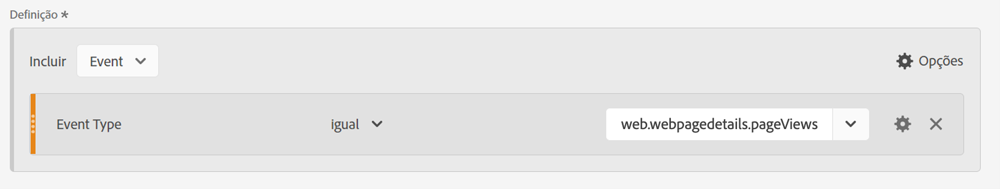
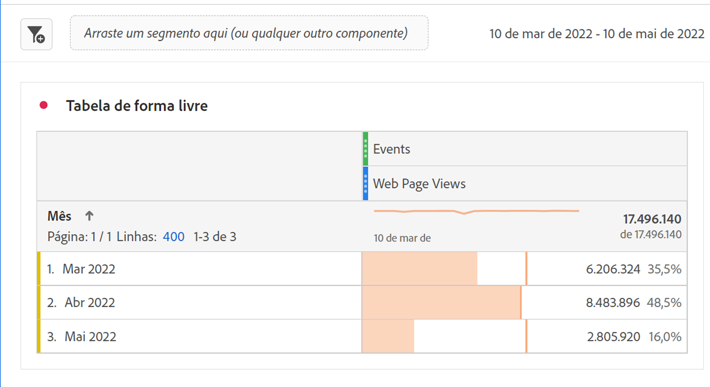
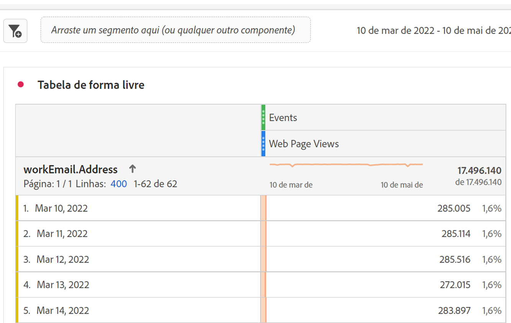

# Relatórios de dados do Marketo Engage

Você pode aproveitar os conjuntos de dados disponíveis do Marketo Engage no Experience Platform para fornecer análises e soluções de relatórios valiosas para profissionais de marketing B2B. Em seguida, relate esses conjuntos de dados na Customer Journey Analytics.

Esteja ciente que:

* Os relatórios do Marketo Engage são melhores para medir e otimizar programas de marketing diretamente no Marketo e são rápidos, prescritivos e fáceis de usar pelo profissional de marketing.
* O Customer Jornada Analytics fornece uma solução de análise personalizável muito mais ampla para jornadas de clientes que abrangem vários canais, produtos e unidades de negócios, incluindo, mas não se limitando a, dados do Marketo.

Consulte [comparação de relatórios](#reporting-comparison) para obter mais detalhes.

>[!NOTE]
>
>Você pode considerar o [Customer Journey Analytics B2B edition](/help/getting-started/cja-b2b-edition.md) para obter muito mais valor dos dados do Marketo Engage. Você pode combinar conjuntos de dados do Marketo Engage com conjuntos de dados de conta e pesquisa. E relatar o nível da conta e da oportunidade no Customer Journey Analytics B2B edition.
>

Para criar relatórios sobre dados do Marketo Engage no Customer Journey Analytics:

+++ &#x200B;1. Mapear campos de dados de origem do Marketo para seus destinos XDM

Mapeie os objetos [Pessoas](https://experienceleague.adobe.com/pt-br/docs/experience-platform/sources/connectors/adobe-applications/mapping/marketo) e [Atividades](https://experienceleague.adobe.com/pt-br/docs/experience-platform/sources/connectors/adobe-applications/mapping/marketo) aos respectivos campos de público-alvo do esquema XDM.

+++

+++ &#x200B;2. Assimilar dados do Marketo na Adobe Experience Platform

Use o [conector do Marketo Engage](https://experienceleague.adobe.com/pt-br/docs/experience-platform/sources/connectors/adobe-applications/marketo/marketo) para trazer os dados do Marketo para a Experience Platform e manter esses dados atualizados usando aplicativos conectados à Platform.

+++

+++ &#x200B;3. Configure uma conexão com esse conjunto de dados no Customer Journey Analytics

Para criar relatórios sobre conjuntos de dados do Experience Platform, primeiro é necessário estabelecer uma conexão entre os conjuntos de dados na Experience Platform e no Customer Journey Analytics. Consulte [Criar ou editar uma conexão](https://experienceleague.adobe.com/pt-br/docs/analytics-platform/using/cja-connections/create-connection).

+++

+++ &#x200B;4. Criar uma ou mais visualizações de dados

Uma [visualização de dados](/help/data-views/data-views.md) é um container específico do Customer Journey Analytics que permite determinar como interpretar dados de uma conexão. Especifica todas as dimensões e métricas disponíveis no Analysis Workspace, neste caso, métricas e dimensões específicas do Marketo. Também especifica a partir de quais colunas essas dimensões e métricas obtêm os dados. As visualizações de dados são definidas na preparação de relatórios no Analysis Workspace.

+++

+++ &#x200B;5. Relatório no Analysis Workspace

Um caso de uso que você pode explorar é: Quantas visitas de páginas da Web por clientes potenciais você teve em abril-junho de 2020?

1. Abrir [Espaço de trabalho do Analytics](/help/analysis-workspace/home.md) e criar um novo projeto.
Clientes com CDP B2B/B2P podem realizar análise no estilo B2C no Customer Journey Analytics. Os objetos B2B ainda não estão disponíveis.

1. Crie um [segmento](/help/components/segments/seg-create.md) para exibições de página da Web da seguinte maneira - Tipo de evento = web.webpagedetails.pageViews :

   

1. Puxe o segmento criado para a tabela de forma livre - Exibições de página da Web e obtenha o intervalo de datas Mês. Esta ação fornece as visitas à página da Web por clientes potenciais a cada mês:

   

1. Ou obtém as seguintes dimensões: Chave de pessoa ou endereço de email de trabalho. Esta ação fornece as visitas à página da Web por cada lead:

   

Os dados do Marketo Engage no Customer Journey Analytics podem ser diferentes do que você vê nos relatórios encontrados no Marketo Engage.

+++

## Comparação de relatórios

A comparação a seguir entre os relatórios no Customer Journey Analytics e no Marketo Engage detalha algumas diferenças importantes nos recursos de análise, flexibilidade, fontes verdadeiras e casos de uso.

### Customer Journey Analytics

O Customer Journey Analytics é uma ferramenta de análise avançada entre canais criada no Adobe Experience Platform. O Customer Journey Analytics foi projetado para equipes corporativas que precisam de relatórios avançados, flexíveis e personalizáveis em fontes de dados digitais e offline.

#### Principais recursos

* **Fontes de dados**: podem combinar vários conjuntos de dados (Web, CRM, email, call center, offline, Marketo etc.) para relatórios de jornada do cliente em 360°.
* **Análise de autoatendimento**: arraste e solte o espaço de trabalho com painéis e visualizações personalizáveis e altamente interativos.
* **Atribuição avançada**: oferece suporte a modelos de atribuição complexos, multitoque e personalizados em todos os dados conectados, não apenas em programas de marketing.
* **Análise de público-alvo e definição de caminho**: análise profunda de segmentação, coorte e definição de caminho em jornadas do comprador.
* **Insights acionáveis**: habilita a orquestração orientada por dados (por exemplo, envie insights de volta para mecanismos de marketing ou personalização).
* **Escala corporativa**: adequada para organizações que precisam de governança corporativa, várias marcas e grande volume de dados.

#### Casos de uso típicos do Customer Journey Analytics

* Mapeamento avançado de jornadas do cliente em vários canais e pontos de contato.
* Segmentação e combinação complexas de dados online e offline.
* Painéis de KPI personalizados para relatórios operacionais e de nível executivo.
* Modelagem de atribuição holística (além de apenas digital ou email).

### Marketo Engage

O Marketo Engage oferece relatórios no aplicativo com foco nos KPIs de automação de marketing, na medição de programas e campanhas e na análise de impacto de marketing. Todos esses relatórios estão diretamente vinculados à atividade no Marketo.

#### Principais recursos

* **Análise de marketing nativa**: relatórios padrão para email, páginas de aterrissagem, campanhas, clientes potenciais, oportunidades, pipeline e atribuição de receita (primeiro, último, multitoque).
* **Análise avançada de BI (complemento)**: arraste e solte, aponte e clique no criador de relatórios personalizado para analisar dados de programa/conta/cliente potencial (consulte a Visão geral recente da Análise avançada de BI).
* **Painéis pré-criados**: para desempenho da campanha, eficácia do canal, contribuição de pipeline/receita.
* **Análise de programa e canal**: atribuição e ROI específicos para jornadas gerenciadas pela Marketo.
* **Centrado em marketing**: concentrado nos usuários que precisam de transparência no funil de marketing: estatísticas de email, formulários, campanhas inteligentes e impacto na receita.

#### Casos de uso típicos do Marketo Engage

* Acompanhe e otimize o desempenho de e-mail, programa e campanha.
* Atribuir leads e pipeline às táticas de marketing.
* Monitorar tendências de engajamento e pontuar leads.
* Compartilhe insights com equipes de vendas/marketing sem recursos de engenharia de dados.
* Acesse relatórios prontos para uso e de fácil uso pelos profissionais de marketing.

Consulte abaixo uma tabela de comparação rápida sobre os recursos de relatórios entre o Marketo Engage e o Customer Journey Analytics:

| Recurso | Marketo Engage | Customer Journey Analytics |
|---|---|---|
| **Foco principal** | Relatórios centrados em campanhas e programas de marketing. | Jornada holística, omnicanal e análise e relatórios comportamentais. |
| **Fontes de dados** | Dados gerados no e por meio do Marketo Engage. | Combina dados de qualquer dado habilitado para Experience Platform, incluindo Marketo, site, aplicativo móvel, canais offline e muito mais. |
| **Atribuição** | Atribuição única e multitoque em dados do Marketo. | Atribuição personalizada entre canais em quaisquer dados disponíveis na solução. |
| **Flexibilidade e relatórios personalizados** | BI avançado (complemento) para aprofundamento de programas e contas. | Altamente flexível na forma como você cria espaços de trabalho, painéis ou relatórios personalizados usando todos os dados disponíveis. |
| **Análise de público-alvo** | Filtrar e segmentar listas de programas, engajamento e listas inteligentes. | Visualizações avançadas de persona e jornada, definição de caminho do público e análise de sobreposição de segmentos. |
| **Usuários pretendidos** | Profissionais de marketing, operadores de marketing, funcionários de geração de demanda, gerentes de receita. | Analistas, cientistas de dados, estrategistas de marketing, profissionais de experiência do cliente. |
| **Desduplicação de métrica** | Para relatórios de desempenho de email, as métricas são desduplicadas automaticamente pela id do lead, id da campanha e id de ativo de email. Se vários emails forem criados do mesmo ativo de email forem enviados para o mesmo lead do mesmo programa, esses emails serão contados apenas como um. | Sem filtros e métricas adicionais aplicados, os dados de relatório de email são relatados como uma contagem total do desempenho do email sem [desduplicação de métrica](/help/data-views/component-settings/metric-deduplication.md). |

{style="table-layout:fixed"}
