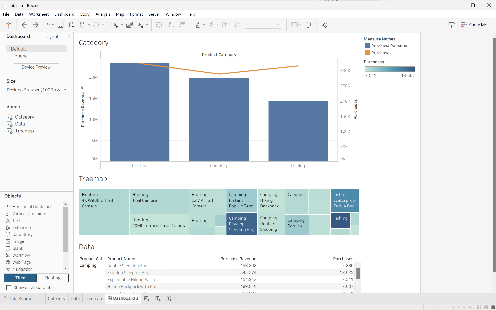

# Casos de uso da extensão do BI

Este artigo documenta como realizar vários casos de uso usando a extensão Customer Journey Analytics BI. Cada caso de uso explica a funcionalidade do Customer Journey Analytics, seguida de detalhes para cada uma das ferramentas de BI compatíveis:

* **Power BI Desktop**. A versão usada é 2.137.1102.0 de 64 bits (outubro de 2024).
* **Tableau Desktop**. A versão usada é 2024.1.5 (20241.24.0705.0334) de 64 bits.
* **Pesquisa**. Versão online 25.0.23, disponível por meio de [looker.com](https://looker.com){target="_blank"}
* **Jupyter Notebook**. A versão usada é a 7.3.2.
* **RStudio**. A versão usada é 2024.12.0, build 467.

Os seguintes casos de uso estão documentados:

* **Conectar**
   * [Conectar e listar visualizações de dados](#connect-and-validate)

* **Relatório e análise**
   * [Tendência diária](#daily-trend)
   * [Tendência horária](#hourly-trend)
   * [Tendência mensal](#monthly-trend)
   * [Dimensão única classificada](#single-dimension-ranked)
   * [Várias dimensões classificadas](#multiple-dimension-ranked)
   * [Contar valores de dimensão distintos](#count-distinct-dimension-values)
   * [Usar nomes de intervalo de datas para filtrar](#use-date-range-names-to-filter)
   * [Usar nomes de segmento para segmentar](#use-segment-names-to-segment)
   * [Usar valores de dimensão para segmentar](#use-dimension-values-to-segment)
   * [Classificar](#sort)
   * [Limites](#limits)

* **Entender**

   * [Transformações](#transformations)
   * [Visualizações](#visualizations)
   * [Avisos](#caveats)

O caso de uso **conectar** se concentra em como conectar ferramentas de BI usando a extensão Customer Journey Analytics BI.

Os casos de uso de **relatório e análise** instruem como realizar visualizações semelhantes do Customer Journey Analytics nas ferramentas de BI atualmente suportadas.

Os casos de uso **entender** fornecem mais detalhes sobre:

* Transformações que ocorrem quando você usa uma ferramenta de BI para relatar e analisar.
* Semelhanças e diferenças de visualização entre as ferramentas de Customer Journey Analytics e BI.
* Avisos sobre cada uma das ferramentas de BI que você deve estar ciente.


## Conectar e validar

Esse caso de uso configura a conexão da ferramenta de BI com o Customer Journey Analytics, lista as visualizações de dados disponíveis e seleciona uma visualização de dados para usar.

+++ Customer Journey Analytics

As instruções se referem a um ambiente de exemplo com os seguintes objetos:

* Exibição de dados: **[!UICONTROL C&amp;C - Exibição de Dados]** ??.
* Dimensões: **[!UICONTROL Nome do Produto]** ?? e **[!UICONTROL Categoria do Produto]** ??.
* Métricas: **[!UICONTROL Receita de Compra]** ?? e **[!UICONTROL Compras]** ??.
* Filtro: **[!UICONTROL Produtos de Pesca]** ??.

{zoomable="yes"}

Ao analisar os casos de uso, substitua esses objetos de exemplo por objetos apropriados para seu ambiente específico.

+++

+++ Ferramentas de BI

>[!BEGINTABS]

>[!TAB Power BI Desktop]

1. Acesse as credenciais e os parâmetros necessários da interface do usuário do Experience Platform Query Service.

   1. Navegue até a sandbox da Experience Platform.
   1. Selecione  **[!UICONTROL Consultas]** no painel esquerdo.
   1. Selecione a guia **[!UICONTROL Credenciais]** na interface **[!UICONTROL Consultas]**.
   1. Selecione `prod:cja` no menu suspenso **[!UICONTROL Banco de Dados]**.

      {zoomable="yes"}

1. Inicie o Power BI Desktop.
   1. Na interface principal, selecione **[!UICONTROL Obter dados de outras fontes]**.
   1. Na caixa de diálogo **[!UICONTROL Obter Dados]**:
      {zoomable="yes"}
      1. Procure e selecione **[!UICONTROL banco de dados PostgreSQL]**.
      1. Selecione **[!UICONTROL Conectar]**.
   1. Na caixa de diálogo **[!UICONTROL Banco de dados PostgreSQL]**:
      {zoomable="yes"}
      1. Use  para copiar e colar os valores de **[!UICONTROL Host]** e **[!UICONTROL Porta]** do painel **[!UICONTROL Consulta]** **[!UICONTROL Credenciais em Expiração]** do Experience Platform, separadas por `:` como o valor do **[!UICONTROL Servidor]**. Por exemplo: `examplecompany.platform-query.adobe.io:80`.
      1. Use  para copiar e colar o valor do **[!UICONTROL Banco de Dados]** do painel **[!UICONTROL Consulta]** **[!UICONTROL Credenciais em Expiração]** do Experience Platform. Adicione `?FLATTEN` ao valor que você colar. Por exemplo, `prod:cja?FLATTEN`.
      1. Selecione **[!UICONTROL DirectQuery]** como o **[!UICONTROL modo de conectividade de dados]**.
      1. Selecione **[!UICONTROL OK]**.
   1. Na caixa de diálogo **[!UICONTROL Banco de dados PostgreSQL]** - **[!UICONTROL Banco de Dados]**:
      {zoomable="yes"}
      1. Use  para copiar os valores de **[!UICONTROL Nome de Usuário]** e **[!UICONTROL Senha]** do painel **[!UICONTROL Consulta]** **[!UICONTROL Credenciais em Expiração]** do Experience Platform nos campos **[!UICONTROL Nome de usuário]** e **[!UICONTROL Senha]**. Se você estiver usando uma [credencial sem expiração](https://experienceleague.adobe.com/en/docs/experience-platform/query/ui/credentials?lang=en#use-credential-to-connect), use a senha da sua credencial sem expiração.
      1. Verifique se o menu suspenso de **[!UICONTROL Selecione a qual nível aplicar essas configurações]** está definido como o **[!UICONTROL Servidor]** definido anteriormente.
      1. Selecione **[!UICONTROL Conectar]**.
   1. Na caixa de diálogo **[!UICONTROL Navegador]**, as visualizações de dados são recuperadas. Essa recuperação pode levar algum tempo. Depois de recuperado, você verá o seguinte no Power BI Desktop.
      {zoomable="yes"}
      1. Selecione **[!UICONTROL public.cc_data_view]** na lista do painel esquerdo.
      1. Existem duas opções:
         1. Selecione **[!UICONTROL Carregar]** para continuar e concluir a instalação.
         1. Selecione **[!UICONTROL Transformar Dados]**. Você verá uma caixa de diálogo em que poderá aplicar transformações opcionalmente como parte da configuração.
            {zoomable="yes"}
            * Selecione **[!UICONTROL Fechar e Aplicar]**.
   1. Após alguns instantes, **[!UICONTROL public.cc_data_view]** será exibido no painel **[!UICONTROL Dados]**. Selecione  para mostrar dimensões e métricas.
      {zoomable="yes"}


### Para NIVELAR ou não

O Power BI Desktop oferece suporte aos seguintes cenários para o parâmetro `FLATTEN`. Consulte [Nivelar dados aninhados](https://experienceleague.adobe.com/pt-br/docs/experience-platform/query/key-concepts/flatten-nested-data) para obter mais informações.

| parâmetro FLATTEN | Exemplo | Suportado | Observações |
|---|---|:---:|---|
| Nenhum | `prod:cja` |  | |
| `?FLATTEN` | `prod:cja?FLATTEN` |  | **Opção recomendada para usar!** |
| `%3FFLATTEN` | `prod:cja%3FFLATTEN` |  | O Power BI Desktop exibe um erro: **[!UICONTROL Não foi possível autenticar com as credenciais fornecidas. Tente novamente.]** |

### Mais informações

* [Pré-requisitos](/help/data-views/bi-extension.md#prerequisites)
* [Guia de credenciais](https://experienceleague.adobe.com/pt-br/docs/experience-platform/query/ui/credentials)
* [Conectar o Power BI ao Serviço de Consulta](https://experienceleague.adobe.com/pt-br/docs/experience-platform/query/clients/power-bi).


>[!TAB Tableau Desktop]

1. Acesse as credenciais e os parâmetros necessários da interface do usuário do Experience Platform Query Service.

   1. Navegue até a sandbox da Experience Platform.
   1. Selecione  **[!UICONTROL Consultas]** no painel esquerdo.
   1. Selecione a guia **[!UICONTROL Credenciais]** na interface **[!UICONTROL Consultas]**.
   1. Selecione `prod:cja` no menu suspenso **[!UICONTROL Banco de Dados]**.

      {zoomable="yes"}

1. Inicie o Tableau.
   1. Selecione **[!UICONTROL PostgreSQL]** no painel esquerdo abaixo de **[!UICONTROL Para um Servidor]**. Se não estiver disponível, selecione **[!UICONTROL Mais...]** e selecione **[!UICONTROL PostgreSQL]** nos **[!UICONTROL Conectores Instalados]**.
      {zoomable="yes"}
   1. Na caixa de diálogo **[!UICONTROL PostgreSQL]**, na guia **[!UICONTROL General]**:
      {zoomable="yes"}
      1. Use  para copiar e colar o **[!UICONTROL Host]** do painel **[!UICONTROL Consulta]** **[!UICONTROL Credenciais em Expiração]** do Experience Platform no **[!UICONTROL Servidor]**.
      1. Use  para copiar e colar a **[!UICONTROL Porta]** do painel **[!UICONTROL Consulta]** **[!UICONTROL Credenciais em Expiração]** do Experience Platform para a **[!UICONTROL Porta]**.
      1. Use  para copiar e colar o **[!UICONTROL Banco de Dados]** do painel **[!UICONTROL Consulta]** **[!UICONTROL Credenciais em Expiração]** do Experience Platform no **[!UICONTROL Banco de Dados]**. Adicione `%3FFLATTEN` ao valor que você colar. Por exemplo: `prod:cja%3FFLATTEN`.
      1. Selecione **[!UICONTROL Nome de Usuário e Senha]** no menu suspenso **[!UICONTROL Autenticação]**.
      1. Use  para copiar e colar o **[!UICONTROL Nome de Usuário]** do painel **[!UICONTROL Consulta]** **[!UICONTROL Credenciais em Expiração]** do Experience Platform para o **[!UICONTROL Nome de Usuário]**.
      1. Use  para copiar e colar a **[!UICONTROL Senha]** do painel **[!UICONTROL Consulta]** **[!UICONTROL Credenciais em Expiração]** do Experience Platform para a **[!UICONTROL Senha]**. Se você estiver usando uma [credencial sem expiração](https://experienceleague.adobe.com/en/docs/experience-platform/query/ui/credentials?lang=en#use-credential-to-connect), use a senha da sua credencial sem expiração.
      1. Verifique se **[!UICONTROL Exigir SSL]** está marcado.
      1. Selecione **[!UICONTROL Fazer logon]**.

      Você verá uma caixa de diálogo **[!UICONTROL Solicitação em andamento]** enquanto o Tableau Desktop valida a conexão.
   1. Na janela principal, você vê na página **[!UICONTROL Data Source]**, no painel esquerdo:
      * O nome da conexão, abaixo de **[!UICONTROL Conexões]**.
      * O nome do banco de dados, abaixo de **[!UICONTROL Banco de Dados]**.
      * Uma lista de tabelas, abaixo de **[!UICONTROL Tabela]**.
        {zoomable="yes"}
      1. Arraste a entrada **[!UICONTROL cc_data_view]** e solte a entrada na exibição principal onde se lê **[!UICONTROL Arraste tabelas]** aqui.
   1. A janela principal exibe detalhes da exibição de dados do **[!UICONTROL cc_data_view]**.
      {zoomable="yes"}

### Para NIVELAR ou não

O Tableau Desktop oferece suporte aos seguintes cenários para o parâmetro `FLATTEN`. Consulte [Nivelar dados aninhados](https://experienceleague.adobe.com/pt-br/docs/experience-platform/query/key-concepts/flatten-nested-data) para obter mais informações.

| parâmetro FLATTEN | Exemplo | Suportado | Observações |
|---|---|:---:|---|
| Nenhum | `prod:cja` |  | |
| `?FLATTEN` | `prod:cja?FLATTEN` |  | |
| `%3FFLATTEN` | `prod:cja%3FFLATTEN` |  | **Opção recomendada para usar**. Observe que `%3FFLATTEN` é a versão de `?FLATTEN` codificada em URL. |

### Mais informações

* [Pré-requisitos](/help/data-views/bi-extension.md#prerequisites)
* [Guia de credenciais](https://experienceleague.adobe.com/pt-br/docs/experience-platform/query/ui/credentials)
* [Conecte o Tableau Desktop ao Serviço de Consulta](https://experienceleague.adobe.com/pt-br/docs/experience-platform/query/clients/tableau).


>[!TAB Pesquisador]

1. Acesse as credenciais e os parâmetros necessários da interface do usuário do Experience Platform Query Service.

   1. Navegue até a sandbox da Experience Platform.
   1. Selecione  **[!UICONTROL Consultas]** no painel esquerdo.
   1. Selecione a guia **[!UICONTROL Credenciais]** na interface **[!UICONTROL Consultas]**.
   1. Selecione `prod:cja` no menu suspenso **[!UICONTROL Banco de Dados]**.

      {zoomable="yes"}

1. Fazer logon no Looker

   1. Selecione **[!UICONTROL Admin]** no painel esquerdo.
   1. Selecione **[!UICONTROL Conexões]**.
   1. Selecione **[!UICONTROL Adicionar conexão]**.
   1. Na **[!UICONTROL tela Conectar o banco de dados ao Pesquisador]**.

      {zoomable="yes"}

      1. Digite um **[!UICONTROL Nome]** para sua conexão, por exemplo `Example Looker Connection`.
      1. Verifique se **[!UICONTROL Todos os Projetos]** está selecionado como **[!UICONTROL Escopo de Conexão]**.
      1. Selecione **[!UICONTROL PostgreSQL 9.5+]** como o Dialeto.
      1. Use  para copiar e colar o valor de **[!UICONTROL Host]** do painel **[!UICONTROL Consulta]** **[!UICONTROL Credenciais em Expiração]** do Experience Platform, como o valor de **[!UICONTROL Host]**. Por exemplo: `examplecompany.platform-query.adobe.io`.
      1. Use  para copiar e colar o valor de **[!UICONTROL Porta]** do painel **[!UICONTROL Consulta]** **[!UICONTROL Credenciais em Expiração]** do Experience Platform, como o valor de **[!UICONTROL Porta]**. Por exemplo: `80`.
      1. Use  para copiar e colar o valor do **[!UICONTROL Banco de Dados]** do painel **[!UICONTROL Consulta]** **[!UICONTROL Credenciais em Expiração]** do Experience Platform como o valor do **[!UICONTROL Banco de Dados]**. Adicione `%3FFLATTEN` ao valor que você colar. Por exemplo, `prod:cja%3FFLATTEN`.
      1. Use  para copiar e colar o valor de **[!UICONTROL Nome de Usuário]** do painel **[!UICONTROL Consulta]** **[!UICONTROL Credenciais em Expiração]** do Experience Platform como o valor de **[!UICONTROL Nome de Usuário]**.
      1. Use  para copiar e colar o valor de **[!UICONTROL Senha]** do painel **[!UICONTROL Consulta]** **[!UICONTROL Credenciais em Expiração]** do Experience Platform como o valor de **[!UICONTROL Senha]**.
      1. Selecione **[!UICONTROL Expandir tudo]** em **[!UICONTROL Configurações Opcionais]**.
      1. Defina **[!UICONTROL Máximo de conexões]** por nó como `5`.
      1. Verifique se **[!UICONTROL SSL]** está habilitado.
      1. Selecione **[!UICONTROL Testar]** para testar a conexão. Você deve ver um banner aparecer na parte superior da tela com uma mensagem como **[!UICONTROL Sucesso, pode conectar JDBC ....]**.
      1. Selecione **[!UICONTROL Conectar]** para estabelecer e salvar a conexão.
   1. Você vê a nova conexão na interface **[!UICONTROL Conexões]**.
   1. Selecione **Esquerda** de **[!UICONTROL Administrador]** para ir para a navegação principal no painel esquerdo.
   1. Selecione **[!UICONTROL Desenvolver]**.
   1. Selecione **[!UICONTROL Projetos]**.
   1. Selecione **[!UICONTROL Novo Modelo]** em Projetos LookML.
   1. Para garantir que você não afete outros usuários. selecione Enter Development Mode (Entrar no modo de desenvolvimento) quando solicitado.
   1. Na experiência **[!UICONTROL Criar Modelo]**:
      1. Em **[!UICONTROL ➊ Selecione a Conexão de Banco de Dados]**:
         1. Selecione sua conexão de banco de dados em **[!UICONTROL Selecionar conexão de banco de dados]**. Por exemplo: **[!UICONTROL example_looker_connection]**.
         1. Nomeie seu projeto em **[!UICONTROL Crie um novo Projeto LookML para este modelo]**. Para `example: example_looker_project`.
         1. Selecione **[!UICONTROL Próximo]**.
      1. Em **[!UICONTROL ➋ Selecionar Tabelas]**:
         1. Selecione **[!UICONTROL público]** e certifique-se de que sua visualização de dados do Customer Journey Analytics está selecionada. Por exemplo:  **[!UICONTROL cc_data_view]**.
         1. Selecione **[!UICONTROL Próximo]**.
      1. Em **[!UICONTROL ➌ Selecione Chaves Primárias]**:
         1. Selecione **[!UICONTROL Próximo]**.
      1. Em **[!UICONTROL ➍ Selecione Explorações para Criar]**:
         1. Certifique-se de selecionar a exibição. Por exemplo: **[!UICONTROL cc_data_view.view]**.
         1. Selecione **[!UICONTROL Próximo]**.
      1. Em **[!UICONTROL ➎ Digite O Nome Do Modelo]**:
         1. Dê um nome ao seu modelo. Por exemplo: `example_looker_model`.
      1. Selecione **[!UICONTROL Concluir e Explorar Dados]**.

   Você foi redirecionado para a interface do Looker **[!UICONTROL Explorar]**, pronta para explorar os dados.


### Para NIVELAR ou não

O pesquisador dá suporte aos seguintes cenários para o parâmetro `FLATTEN`. Consulte [Nivelar dados aninhados](https://experienceleague.adobe.com/pt-br/docs/experience-platform/query/key-concepts/flatten-nested-data) para obter mais informações.

| parâmetro FLATTEN | Exemplo | Suportado | Observações |
|---|---|:---:|---|
| Nenhum | `prod:cja` |  | |
| `?FLATTEN` | `prod:cja?FLATTEN` |  | |
| `%3FFLATTEN` | `prod:cja%3FFLATTEN` |  | **Opção recomendada para usar**. Observe que `%3FFLATTEN` é a versão de `?FLATTEN` codificada em URL. |

### Mais informações

* [Pré-requisitos](/help/data-views/bi-extension.md#prerequisites)
* [Guia de credenciais](https://experienceleague.adobe.com/pt-br/docs/experience-platform/query/ui/credentials)


>[!TAB Jupyter Notebook]

1. Acesse as credenciais e os parâmetros necessários da interface do usuário do Experience Platform Query Service.

   1. Navegue até a sandbox da Experience Platform.
   1. Selecione  **[!UICONTROL Consultas]** no painel esquerdo.
   1. Selecione a guia **[!UICONTROL Credenciais]** na interface **[!UICONTROL Consultas]**.
   1. Selecione `prod:cja` no menu suspenso **[!UICONTROL Banco de Dados]**.

      {zoomable="yes"}

1. Configure um ambiente virtual Python dedicado para executar seu ambiente Jupyter Notebook.
1. Verifique se você instalou as bibliotecas necessárias em seu ambiente virtual:
   * ipython-sql: `pip install ipython-sql`.
   * psycopg2-binary: `pip install psycopg-binary`.
   * sqlalchemy: pip `install sqlalchemy`.

1. Inicie o Jupyter Notebook a partir de seu ambiente virtual: `jupyter notebook`.
1. Crie um novo bloco de anotações ou baixe [este bloco de anotações de exemplo](assets/BI-Extension.ipynb.zip).
1. Na primeira célula, insira e execute:

   ```
   %config SqlMagic.style = '_DEPRECATED_DEFAULT'
   ```

1. Em uma nova célula, insira os parâmetros de configuração da sua conexão. Use  para copiar e colar valores do painel **[!UICONTROL Consulta]** **[!UICONTROL Credenciais em Expiração]** do Experience Platform nos valores necessários para os parâmetros de configuração. Por exemplo:

   ```
   import ipywidgets as widgets
   from IPython.display import display
   
   config_host = widgets.Text(description='Host:', value='example.platform-query-stage.adobe.io',
                           layout=widgets.Layout(width="600px"))
   display(config_host)
   config_port = widgets.IntText(description='Port:', value=80,
                              layout=widgets.Layout(width="200px"))
   display(config_port)
   config_db = widgets.Text(description='Database:', value='prod:cja',
                         layout=widgets.Layout(width="300px"))
   display(config_db)
   config_username = widgets.Text(description='Username:', value='EC582F955C8A79F70A49420E@AdobeOrg',
                               layout=widgets.Layout(width="600px"))
   display(config_username)
   config_password = widgets.Password(description='Password:', value='***',
                                   layout=widgets.Layout(width="600px"))
   display(config_password)
   ```

1. Execute a célula.
1. Use  para copiar e colar a senha do painel **[!UICONTROL Consulta]** **[!UICONTROL Credenciais em Expiração]** do Experience Platform no campo **[!UICONTROL Senha]** do Jupyter Notebook.

   {zoomable="yes"} da Configuração do Jupter Notebook

1. Em uma nova célula, insira as instruções para carregar a extensão SQL, a biblioteca necessária e conectar-se ao Customer Journey Analytics.

   ```python
   %load_ext sql
   from sqlalchemy import create_engine
   %sql postgresql://{config_username.value}:{config_password.value}@{config_host.value}:{config_port.value}/{config_db.value}?sslmode=require
   ```

   Execute o shell. Você não deve ver nenhuma saída, mas a célula deve ser executada sem nenhum aviso.

   {zoomable="yes"} da Configuração do Jupyer Notebook

1. Em uma nova chamada, insira as instruções para obter uma lista de visualizações de dados disponíveis com base na conexão.

   ```python
   %%sql
   SELECT n.nspname as "Schema",
      c.relname as "Name",
      CASE c.relkind WHEN 'r' THEN 'table' WHEN 'v' THEN 'view' WHEN 'm' THEN 'materialized view' WHEN 'i' THEN 'index' WHEN 'S' THEN 'sequence' WHEN 's' THEN 'special' WHEN 't' THEN 'TOAST table' WHEN 'f' THEN 'foreign table' WHEN 'p' THEN 'partitioned table' WHEN 'I' THEN 'partitioned index' END as "Type",
      pg_catalog.pg_get_userbyid(c.relowner) as "Owner"
   FROM pg_catalog.pg_class c
   LEFT JOIN pg_catalog.pg_namespace n ON n.oid = c.relnamespace
   WHERE c.relkind IN ('v','')
      AND n.nspname <> 'pg_catalog'
      AND n.nspname !~ '^pg_toast'
      AND n.nspname <> 'information_schema'
      AND pg_catalog.pg_table_is_visible(c.oid)
      AND c.relname NOT LIKE '%test%'
      AND c.relname NOT LIKE '%ajo%'
   ORDER BY 1,2;
   ```

   Execute o shell. Você deve ver a saída simular na captura de tela abaixo.

   {zoomable="yes"} da Configuração do Jupyter Notebook

   Você deve ver o **[!UICONTROL cc_data_view]** na lista de visualizações de dados.

### Para NIVELAR ou não

O Jupyter Notebook dá suporte aos seguintes cenários para o parâmetro `FLATTEN`. Consulte [Nivelar dados aninhados](https://experienceleague.adobe.com/pt-br/docs/experience-platform/query/key-concepts/flatten-nested-data) para obter mais informações.

| parâmetro FLATTEN | Exemplo | Suportado | Observações |
|---|---|:---:|---|
| Nenhum | `prod:cja` |  | |
| `?FLATTEN` | `prod:cja?FLATTEN` |  | |
| `%3FFLATTEN` | `prod:cja%3FFLATTEN` |  | **Opção recomendada para usar**. Observe que `%3FFLATTEN` é a versão de `?FLATTEN` codificada em URL. |

### Mais informações

* [Pré-requisitos](/help/data-views/bi-extension.md#prerequisites)
* [Guia de credenciais](https://experienceleague.adobe.com/pt-br/docs/experience-platform/query/ui/credentials)

>[!TAB RStudio]

1. Acesse as credenciais e os parâmetros necessários da interface do usuário do Experience Platform Query Service.

   1. Navegue até a sandbox da Experience Platform.
   1. Selecione  **[!UICONTROL Consultas]** no painel esquerdo.
   1. Selecione a guia **[!UICONTROL Credenciais]** na interface **[!UICONTROL Consultas]**.
   1. Selecione `prod:cja` no menu suspenso **[!UICONTROL Banco de Dados]**.

      {zoomable="yes"}

1. Iniciar RStudio.
1. Crie um novo arquivo do R Markdown ou baixe [este arquivo de exemplo do R Markdown](assets/BI-Extension.Rmd.zip).
1. Na primeira parte, insira as seguintes instruções entre ` ```{r} ` e ` ``` `. Use  para copiar e colar valores do painel **[!UICONTROL Consulta]** **[!UICONTROL Credenciais em Expiração]** do Experience Platform para os valores necessários para os vários parâmetros, como `host`, `dbname` e `user`. Por exemplo:

   ```R
   library(rstudioapi)
   library(DBI)
   library(dplyr)
   library(tidyr)
   library(RPostgres)
   library(ggplot2)
   
   host <- rstudioapi::showPrompt(title = "Host", message = "Host", default = "orangestagingco.platform-query-stage.adobe.io")
   dbname <- rstudioapi::showPrompt(title = "Database", message = "Database", default = "prod:cja?FLATTEN")
   user <- rstudioapi::showPrompt(title = "Username", message = "Username", default = "EC582F955C8A79F70A49420E@AdobeOrg")
   password <- rstudioapi::askForPassword(prompt = "Password")
   ```

1. Execute o pedaço. Você é solicitado a fornecer **[!UICONTROL Host]**, **[!UICONTROL Banco de Dados]** e **[!UICONTROL Usuário]**. Basta aceitar os valores fornecidos como parte da etapa anterior.
1. Use  para copiar e colar a senha do painel **[!UICONTROL Consulta]** **[!UICONTROL Credenciais em Expiração]** do Experience Platform no prompt da caixa de diálogo **[!UICONTROL Senha]** do RStudio.

   {zoomable="yes"}

1. Crie uma nova parte e insira as seguintes instruções entre ` ``` {r} ` e ` ``` `.

   ```R
   con <- dbConnect(
      RPostgres::Postgres(),
      host = host,
      port = 80,
      dbname = dbname,
      user = user,
      password = password,
      sslmode = 'require'
   )
   ```

1. Execute o pedaço. Você não deve ver nenhuma saída se a conexão for bem-sucedida.


1. Crie uma nova parte e insira as seguintes instruções entre ` ``` {r} ` e ` ``` `.

   ```R
   views <- dbListTables(con)
   print(views)
   ```

1. Execute o pedaço. Você deve ver `character(0)` como a única saída.


1. Crie uma nova parte e insira as seguintes instruções entre ` ``` {r} ` e ` ``` `.

   ```R
   glimpse(dv)
   ```

1. Execute o pedaço. Você deve ver a saída simular na captura de tela abaixo.

   {zoomable="yes"} da configuração do Studio

### Para NIVELAR ou não

O RStudio oferece suporte aos seguintes cenários para o parâmetro `FLATTEN`. Consulte [Nivelar dados aninhados](https://experienceleague.adobe.com/pt-br/docs/experience-platform/query/key-concepts/flatten-nested-data) para obter mais informações.

| parâmetro FLATTEN | Exemplo | Suportado | Observações |
|---|---|:---:|---|
| Nenhum | `prod:cja` |  | |
| `?FLATTEN` | `prod:cja?FLATTEN` |  | **Opção recomendada para usar**. |
| `%3FFLATTEN` | `prod:cja%3FFLATTEN` |  | |

### Mais informações

* [Pré-requisitos](/help/data-views/bi-extension.md#prerequisites)
* [Guia de credenciais](https://experienceleague.adobe.com/pt-br/docs/experience-platform/query/ui/credentials)

>[!ENDTABS]

+++


## Tendência diária

Nesse caso de uso, é necessário exibir uma tabela e uma visualização de linha simples que mostre uma tendência diária de ocorrências (eventos) de 1º de janeiro de 2023 até 31 de janeiro de 2023.

+++ Customer Journey Analytics

Um exemplo de painel **[!UICONTROL Tendência diária]** para o caso de uso:

{zoomable="yes"}

+++

+++ Ferramentas de BI

>[!PREREQUISITES]
>
>Verifique se você validou uma [conexão bem-sucedida e pode listar e usar visualizações de dados](#connect-and-validate) para a ferramenta de BI para a qual deseja experimentar este caso de uso.
>

>[!BEGINTABS]

>[!TAB Power BI Desktop]

1. No painel **[!UICONTROL Dados]**:
   1. Selecione **[!UICONTROL daterangeday]**.
   1. Selecione **[!UICONTROL ocorrências]**.

   Você verá uma tabela exibindo as ocorrências do mês atual. Para obter melhor visibilidade, aumente a visualização.

1. No painel **[!UICONTROL Filtros]**:

   1. Selecione o **[!UICONTROL daterangeday é (Todos)]** de **[!UICONTROL Filtros neste visual]**.
   1. Selecione **[!UICONTROL Filtragem avançada]** como o **[!UICONTROL Tipo de filtro]**.
   1. Defina o filtro como **[!UICONTROL Mostrar itens quando o valor]** **[!UICONTROL estiver em ou após]** `1/1/2023` **[!UICONTROL E]** **[!UICONTROL estiver antes]** `2/1/2023.`. Você pode usar o ícone de calendário para escolher e selecionar datas.
   1. Selecione **[!UICONTROL Aplicar filtro]**.

   Você vê a tabela atualizada com o filtro **[!UICONTROL daterangeday]** aplicado.

1. No painel **[!UICONTROL Visualizações]**, selecione a visualização **[!UICONTROL Gráfico de linhas]**.

   Uma visualização de gráfico de linhas substitui a tabela enquanto usa os mesmos dados que a tabela. A área de trabalho do Power BI deve ser semelhante à mostrada abaixo.

   {zoomable="yes"}

1. Na visualização do Gráfico de linha:

   1. Selecione .
   1. No menu de contexto, selecione **[!UICONTROL Mostrar como tabela]**.

   A visualização principal é atualizada para mostrar uma visualização de linha e uma tabela. A área de trabalho do Power BI deve ser semelhante à mostrada abaixo.

   {zoomable="yes"}

>[!TAB Tableau Desktop]

1. Selecione a guia **[!UICONTROL Folha 1]** na parte inferior para alternar da exibição **[!UICONTROL Fonte de Dados]**. Na exibição **[!UICONTROL Folha 1]**:
   1. Arraste a entrada **[!UICONTROL Daterange]** da lista **[!UICONTROL Tabelas]** no painel **[!UICONTROL Dados]** e solte a entrada na prateleira **[!UICONTROL Filtros]**.
   1. Na caixa de diálogo **[!UICONTROL Campo de Filtros \[Intervalo de datas\]]**, selecione **[!UICONTROL Intervalo de datas]** e selecione **[!UICONTROL Próximo >]**.
   1. Na caixa de diálogo **[!UICONTROL Filtro \[Intervalo de datas]]**, selecione **[!UICONTROL Intervalo de datas]** e especifique um período de `01/01/2023` a `01/02/2023`.

      {zoomable="yes"}

   1. Arraste e solte **[!UICONTROL Daterangeday]** da lista **[!UICONTROL Tabelas]** no painel **[!UICONTROL Dados]** e solte a entrada no campo ao lado de **[!UICONTROL Colunas]**.
      * Selecione **[!UICONTROL Dia]** no menu suspenso **[!UICONTROL Dia_da_Data]**, para que o valor seja atualizado para **[!UICONTROL Dia(Dia_da_Data)]**.
   1. Arraste e solte **[!UICONTROL Ocorrências]** da lista **[!UICONTROL Tabelas (*Nomes de Medidas*)]** no painel **[!UICONTROL Dados]** e solte a entrada no campo ao lado de **[!UICONTROL Linhas]**. O valor é convertido automaticamente em **[!UICONTROL SUM(Occurrences)]**.
   1. Modifique de **[!UICONTROL Padrão]** para **[!UICONTROL Exibição inteira]** do menu suspenso **[!UICONTROL Ajustar]** na barra de ferramentas.

      A área de trabalho do Tableau deve ser parecida com a exibida abaixo.

      {zoomable="yes"}

1. Selecione **[!UICONTROL Duplicar]** no menu de contexto da guia **[!UICONTROL Planilha 1]** para criar uma segunda planilha.
1. Selecione **[!UICONTROL Renomear]** no menu de contexto da guia **[!UICONTROL Planilha 1]** para renomear a planilha como `Graph`.
1. Selecione **[!UICONTROL Renomear]** no menu de contexto da guia **[!UICONTROL Planilha 1 (2)]** para renomear a planilha como `Data`.
1. Verifique se a folha de **[!UICONTROL Dados]** está selecionada. Na exibição **[!UICONTROL Dados]**:
   1. Selecione **[!UICONTROL Mostrar-me]** no canto superior direito e selecione **[!UICONTROL Tabela de texto]** (visualização superior esquerdo) para modificar o conteúdo do modo de exibição de Dados para uma tabela.
   1. Selecione **[!UICONTROL Trocar Linhas e Colunas]** na barra de ferramentas.
   1. Modifique de **[!UICONTROL Padrão]** para **[!UICONTROL Exibição inteira]** do menu suspenso **[!UICONTROL Ajustar]** na barra de ferramentas.

      A área de trabalho do Tableau deve ser parecida com a exibida abaixo.

      {zoomable="yes"}

1. Selecione o botão de guia **[!UICONTROL Novo Painel]** (na parte inferior) para criar um novo modo de exibição **[!UICONTROL Painel]**. No modo de exibição **[!UICONTROL Painel 1]**:
   1. Arraste e solte a planilha **[!UICONTROL Gráfico]** da prateleira **[!UICONTROL Folhas]** no modo de exibição **[!UICONTROL Painel 1]** que lê *Folhas de soltar aqui*.
   1. Arraste e solte a planilha **[!UICONTROL Dados]** da prateleira **[!UICONTROL Folhas]** abaixo da planilha **[!UICONTROL Gráfico]** no modo de exibição **[!UICONTROL Painel 1]**.
   1. Selecione a planilha **[!UICONTROL Dados]** no modo de exibição e modifique a **[!UICONTROL Exibição Inteira]** para **[!UICONTROL Corrigir Largura]**.

      A área de trabalho do Tableau deve ser parecida com a exibida abaixo.

      {zoomable="yes"}


>[!TAB Pesquisador]

1. Na interface **[!UICONTROL Explorar]** do Looker, verifique se você possui uma configuração limpa. Caso contrário, selecione  **[!UICONTROL Remover campos e filtros]**.
1. Selecione **[!UICONTROL + Filtro]** abaixo de **[!UICONTROL Filtros]**.
1. Na caixa de diálogo **[!UICONTROL Adicionar Filtro]**:
   1. Selecionar **[!UICONTROL ‣ Visualização De Dados Cc]**
   1. Na lista de campos, selecione **[!UICONTROL ‣ Data do Intervalo de Datas]** e **[!UICONTROL Data do Intervalo de Datas]**.
      {zoomable="yes"}
1. Especifique o filtro **[!UICONTROL Data do Intervalo de Datas da Visualização de Dados Cc]**, pois **[!UICONTROL está no intervalo]** **[!UICONTROL 2023/01/01]** **[!UICONTROL até (antes)]** **[!UICONTROL 2023/02/01]**.
1. Na seção **[!UICONTROL Visualização de Dados Cc]** no painel esquerdo,
   1. Selecione **[!UICONTROL ‣ Intervalo de Datas Data]**, depois **[!UICONTROL Data]** da lista de **[!UICONTROL DIMENSÕES]**.
   1. Selecione **[!UICONTROL Contagem]** abaixo de **[!UICONTROL MEDIDAS]** no painel esquerdo (na parte inferior).
1. Selecione **[!UICONTROL Executar]**.
1. Selecione **[!UICONTROL ‣ Visualização]** para exibir a visualização de linha.

Você deve ver uma visualização e tabela semelhantes, como mostrado abaixo.

{zoomable="yes"}


>[!TAB Jupyter Notebook]

1. Insira as seguintes instruções em uma nova célula.

   ```python
   import seaborn as sns
   import matplotlib.pyplot as plt
   data = %sql SELECT daterangeday AS Date, COUNT(*) AS Events \
             FROM cc_data_view \
             WHERE daterange BETWEEN '2023-01-01' AND '2023-02-01' \
             GROUP BY 1 \
             ORDER BY Date ASC
   df = data.DataFrame()
   df = df.groupby('Date', as_index=False).sum()
   plt.figure(figsize=(15, 3))
   sns.lineplot(x='Date', y='Events', data=df)
   plt.show()
   display(data)
   ```

1. Execute a célula. Você deve ver uma saída semelhante à captura de tela abaixo.

   {zoomable="yes"}


>[!TAB RStudio]

1. Insira as seguintes instruções entre ` ```{r} ` e ` ``` ` em uma nova parte.

   ```R
   ## Daily Events
   df <- dv %>%
      filter(daterange >= "2023-01-01" & daterange < "2023-02-01") %>%
      group_by(daterangeday) %>%
      count() %>%
      arrange(daterangeday, .by_group = FALSE)
   ggplot(df, aes(x = daterangeday, y = n)) +
      geom_line(color = "#69b3a2") +
      ylab("Events") +
      xlab("Date")
   print(df)
   ```

1. Execute o pedaço. Você deve ver uma saída semelhante à captura de tela abaixo.

   {zoomable="yes"}

>[!ENDTABS]

+++


## Tendência horária

Nesse caso de uso, é desejável exibir uma tabela e uma visualização de linha simples que mostre uma tendência horária de ocorrências (eventos) para 1º de janeiro de 2023.

+++ Customer Journey Analytics

Um exemplo de painel **[!UICONTROL Tendência por hora]** para o caso de uso:

{zoomable="yes"}

+++

+++ Ferramentas de BI

>[!PREREQUISITES]
>
>Verifique se você validou [uma conexão bem-sucedida, pode listar visualizações de dados e usar uma visualização de dados](#connect-and-validate) para a ferramenta de BI para a qual deseja experimentar este caso de uso.
>

>[!BEGINTABS]

>[!TAB Power BI Desktop]

O  Power BI **não** entende como lidar com campos de data e hora; portanto, dimensões como **[!UICONTROL daterangehour]** e **[!UICONTROL daterangeminute]** não são suportadas.

>[!TAB Tableau Desktop]

1. Selecione a guia **[!UICONTROL Folha 1]** na parte inferior para alternar da **[!UICONTROL Fonte de dados]**. Na exibição **[!UICONTROL Folha 1]**:
   1. Arraste a entrada **[!UICONTROL Daterange]** da lista **[!UICONTROL Tabelas]** no painel **[!UICONTROL Dados]** e solte a entrada na prateleira **[!UICONTROL Filtros]**.
   1. Na caixa de diálogo **[!UICONTROL Campo de Filtros \[Intervalo de datas\]]**, selecione **[!UICONTROL Intervalo de datas]** e selecione **[!UICONTROL Próximo >]**.
   1. Na caixa de diálogo **[!UICONTROL Filtro \[Intervalo de datas]]**, selecione **[!UICONTROL Intervalo de datas]** e especifique um período de `01/01/2023` a `02/01/2023`.

      {zoomable="yes"}

   1. Arraste e solte **[!UICONTROL Daterangehour]** da lista **[!UICONTROL Tabelas]** no painel **[!UICONTROL Dados]** e solte a entrada no campo ao lado de **[!UICONTROL Colunas]**.
      * Selecione **[!UICONTROL Mais]** > **[!UICONTROL Horas]** no menu suspenso **[!UICONTROL Daterangeday]**, para atualizar o valor para **[!UICONTROL HOUR(Daterangeday)]**.
   1. Arraste e solte **[!UICONTROL Ocorrências]** da lista **[!UICONTROL Tabelas (*Nomes de Medidas*)]** no painel **[!UICONTROL Dados]** e solte a entrada no campo ao lado de **[!UICONTROL Linhas]**. O valor é convertido automaticamente em **[!UICONTROL SUM(Occurrences)]**.
   1. Modifique de **[!UICONTROL Padrão]** para **[!UICONTROL Exibição inteira]** do menu suspenso **[!UICONTROL Ajustar]** na barra de ferramentas.

      A área de trabalho do Tableau deve ser parecida com a exibida abaixo.

      {zoomable="yes"}

1. Selecione **[!UICONTROL Duplicar]** no menu de contexto da guia **[!UICONTROL Planilha 1]** para criar uma segunda planilha.
1. Selecione **[!UICONTROL Renomear]** no menu de contexto da guia **[!UICONTROL Planilha 1]** para renomear a planilha como `Graph`.
1. Selecione **[!UICONTROL Renomear]** no menu de contexto da guia **[!UICONTROL Planilha 1 (2)]** para renomear a planilha como `Data`.
1. Verifique se a folha de **[!UICONTROL Dados]** está selecionada. Na exibição **[!UICONTROL Dados]**:
   1. Selecione **[!UICONTROL Mostrar-me]** no canto superior direito e selecione **[!UICONTROL Tabela de texto]** (visualização superior esquerdo) para modificar o conteúdo do modo de exibição de Dados para uma tabela.
   1. Arraste **[!UICONTROL HOUR(Daterangeday)]** de **[!UICONTROL Colunas]** para **[!UICONTROL Linhas]**.
   1. Modifique de **[!UICONTROL Padrão]** para **[!UICONTROL Exibição inteira]** do menu suspenso **[!UICONTROL Ajustar]** na barra de ferramentas.

      A área de trabalho do Tableau deve ser parecida com a exibida abaixo.

      {zoomable="yes"}

1. Selecione o botão de guia **[!UICONTROL Novo Painel]** (na parte inferior) para criar um novo modo de exibição **[!UICONTROL Painel]**. No modo de exibição **[!UICONTROL Painel 1]**:
   1. Arraste e solte a planilha **[!UICONTROL Gráfico]** da prateleira **[!UICONTROL Folhas]** no modo de exibição **[!UICONTROL Painel 1]** que lê *Folhas de soltar aqui*.
   1. Arraste e solte a planilha **[!UICONTROL Dados]** da prateleira **[!UICONTROL Folhas]** abaixo da planilha **[!UICONTROL Gráfico]** no modo de exibição **[!UICONTROL Painel 1]**.
   1. Selecione a planilha **[!UICONTROL Dados]** no modo de exibição e modifique a **[!UICONTROL Exibição Inteira]** para **[!UICONTROL Corrigir Largura]**.

      A exibição do **[!UICONTROL Painel 1]** deve ser semelhante à mostrada abaixo.

      {zoomable="yes"}


>[!TAB Pesquisador]


1. Na interface **[!UICONTROL Explorar]** do Looker, verifique se você possui uma configuração limpa. Caso contrário, selecione  **[!UICONTROL Remover campos e filtros]**.
1. Selecione **[!UICONTROL + Filtro]** abaixo de **[!UICONTROL Filtros]**.
1. Na caixa de diálogo **[!UICONTROL Adicionar Filtro]**:
   1. Selecionar **[!UICONTROL ‣ Visualização De Dados Cc]**
   1. Na lista de campos, selecione **[!UICONTROL ‣ Data do Intervalo de Datas]** e **[!UICONTROL Data do Intervalo de Datas]**.
      {zoomable="yes"}
1. Especifique o filtro **[!UICONTROL Data do Intervalo de Datas da Visualização de Dados Cc]**, pois **[!UICONTROL está no intervalo]** **[!UICONTROL 2023/01/01]** **[!UICONTROL até (antes)]** **[!UICONTROL 2023/01/02]**.
1. Na seção **[!UICONTROL Visualização de Dados Cc]** no painel esquerdo,
   1. Selecione **[!UICONTROL ‣ Data Daterangehour]**, depois **[!UICONTROL Hora]** da lista de **[!UICONTROL DIMENSÕES]**.
   1. Selecione **[!UICONTROL Contagem]** abaixo de **[!UICONTROL MEDIDAS]** no painel esquerdo (na parte inferior).
1. Selecione **[!UICONTROL Executar]**.
1. Selecione **[!UICONTROL ‣ Visualização]** para exibir a visualização de linha.

Você deve ver uma visualização e tabela semelhantes, como mostrado abaixo.

{zoomable="yes"}


>[!TAB Jupyter Notebook]

1. Insira as seguintes instruções em uma nova célula.

   ```python
   import seaborn as sns
   import matplotlib.pyplot as plt
   data = %sql SELECT daterangehour AS Hour, COUNT(*) AS Events \
               FROM cc_data_view \
               WHERE daterange BETWEEN '2023-01-01' AND '2023-01-02' \
               GROUP BY 1 \
                ORDER BY Hour ASC
   df = data.DataFrame()
   df = df.groupby('Hour', as_index=False).sum()
   plt.figure(figsize=(15, 3))
   sns.lineplot(x='Hour', y='Events', data=df)
   plt.show()
   display(data)
   ```

1. Execute a célula. Você deve ver uma saída semelhante à captura de tela abaixo.

   {zoomable="yes"}


>[!TAB RStudio]

1. Insira as seguintes instruções entre ` ```{r} ` e ` ``` ` em uma nova parte.

   ```R
   ## Hourly Events
   df <- dv %>%
      filter(daterange >= "2023-01-01" & daterange < "2023-01-02") %>%
      group_by(daterangehour) %>%
      count() %>%
      arrange(daterangehour, .by_group = FALSE)
   ggplot(df, aes(x = daterangehour, y = n)) +
      geom_line(color = "#69b3a2") +
      ylab("Events") +
      xlab("Hour")
   print(df)
   ```

1. Execute o pedaço. Você deve ver uma saída semelhante à captura de tela abaixo.

   {zoomable="yes"}

>[!ENDTABS]

+++


## Tendência mensal

Nesse caso de uso, é necessário exibir uma tabela e uma visualização de linha simples que mostre uma tendência mensal de ocorrência (eventos) para 2023.

+++ Customer Journey Analytics

Um exemplo de painel **[!UICONTROL Tendência mensal]** para o caso de uso:

{zoomable="yes"}

+++

+++ Ferramentas de BI

>[!PREREQUISITES]
>
>Verifique se você validou [uma conexão bem-sucedida, pode listar visualizações de dados e usar uma visualização de dados](#connect-and-validate) para a ferramenta de BI para a qual deseja experimentar este caso de uso.
>

>[!BEGINTABS]

>[!TAB Power BI Desktop]

1. No painel **[!UICONTROL Dados]**:
   1. Selecione **[!UICONTROL daterangemmonth]**.
   1. Selecione **[!UICONTROL ocorrências]**.

   Você verá uma tabela exibindo as ocorrências do mês atual. Para obter melhor visibilidade, aumente a visualização.

1. No painel **[!UICONTROL Filtros]**:

   1. Selecione o **[!UICONTROL daterangemonth é (Todos)]** de **[!UICONTROL Filtros neste visual]**.
   1. Selecione **[!UICONTROL Filtragem avançada]** como o **[!UICONTROL Tipo de filtro]**.
   1. Defina o filtro como **[!UICONTROL Mostrar itens quando o valor]** **[!UICONTROL estiver em ou após]** `1/1/2023` **[!UICONTROL E]** **[!UICONTROL estiver antes]** `1/1/2024.`. Você pode usar o ícone de calendário para escolher e selecionar datas.
   1. Selecione **[!UICONTROL Aplicar filtro]**.

   Você vê a tabela atualizada com o filtro aplicado **[!UICONTROL daterangemonth]**.

1. No painel **[!UICONTROL Visualizações]**:

   1. Selecione a visualização **[!UICONTROL Gráfico de linhas]**.

   Uma visualização de gráfico de linhas substitui a tabela enquanto usa os mesmos dados que a tabela. A área de trabalho do Power BI deve ser semelhante à mostrada abaixo.

   {zoomable="yes"}

1. Na visualização do Gráfico de linha:

   1. Selecione .
   1. No menu de contexto, selecione **[!UICONTROL Mostrar como tabela]**.

   A visualização principal é atualizada para mostrar uma visualização de linha e uma tabela. A área de trabalho do Power BI deve ser semelhante à mostrada abaixo.

   {zoomable="yes"}

>[!TAB Tableau Desktop]

1. Selecione a guia **[!UICONTROL Folha 1]** na parte inferior para alternar da **[!UICONTROL Fonte de dados]**. Na exibição **[!UICONTROL Folha 1]**:
   1. Arraste a entrada **[!UICONTROL Daterange]** da lista **[!UICONTROL Tabelas]** no painel **[!UICONTROL Dados]** e solte a entrada na prateleira **[!UICONTROL Filtros]**.
   1. Na caixa de diálogo **[!UICONTROL Campo de Filtros \[Intervalo de datas\]]**, selecione **[!UICONTROL Intervalo de datas]** e selecione **[!UICONTROL Próximo >]**.
   1. Na caixa de diálogo **[!UICONTROL Filtro \[Intervalo de datas]]**, selecione **[!UICONTROL Intervalo de datas]** e especifique um período de `01/01/2023` a `01/01/2024`.

      {zoomable="yes"}

   1. Arraste e solte **[!UICONTROL Daterangeday]** da lista **[!UICONTROL Tabelas]** no painel **[!UICONTROL Dados]** e solte a entrada no campo ao lado de **[!UICONTROL Colunas]**.
      * Selecione **[!UICONTROL MÊS]** no menu suspenso **[!UICONTROL Dia_da_data]**, para que o valor seja atualizado para **[!UICONTROL MÊS(Dia_da_data)]**.
   1. Arraste e solte **[!UICONTROL Ocorrências]** da lista **[!UICONTROL Tabelas (*Nomes de Medidas*)]** no painel **[!UICONTROL Dados]** e solte a entrada no campo ao lado de **[!UICONTROL Linhas]**. O valor é convertido automaticamente em **[!UICONTROL SUM(Occurrences)]**.
   1. Modifique de **[!UICONTROL Padrão]** para **[!UICONTROL Exibição inteira]** do menu suspenso **[!UICONTROL Ajustar]** na barra de ferramentas.

      A área de trabalho do Tableau deve ser parecida com a exibida abaixo.

      {zoomable="yes"}

1. Selecione **[!UICONTROL Duplicar]** no menu de contexto da guia **[!UICONTROL Planilha 1]** para criar uma segunda planilha.
1. Selecione **[!UICONTROL Renomear]** no menu de contexto da guia **[!UICONTROL Planilha 1]** para renomear a planilha como `Graph`.
1. Selecione **[!UICONTROL Renomear]** no menu de contexto da guia **[!UICONTROL Planilha 1 (2)]** para renomear a planilha como `Data`.
1. Verifique se a folha de **[!UICONTROL Dados]** está selecionada. Na visualização de dados:
   1. Selecione **[!UICONTROL Mostrar-me]** no canto superior direito e selecione **[!UICONTROL Tabela de texto]** (visualização superior esquerdo) para modificar o conteúdo do modo de exibição de Dados para uma tabela.
   1. Arraste **[!UICONTROL MONTH(Daterangeday)]** de **[!UICONTROL Colunas]** para **[!UICONTROL Linhas]**.
   1. Modifique de **[!UICONTROL Padrão]** para **[!UICONTROL Exibição inteira]** do menu suspenso **[!UICONTROL Ajustar]** na barra de ferramentas.

      A área de trabalho do Tableau deve ser parecida com a exibida abaixo.

      {zoomable="yes"}

1. Selecione o botão de guia **[!UICONTROL Novo Painel]** (na parte inferior) para criar um novo modo de exibição **[!UICONTROL Painel]**. No modo de exibição **[!UICONTROL Painel 1]**:
   1. Arraste e solte a planilha **[!UICONTROL Gráfico]** da prateleira **[!UICONTROL Folhas]** no modo de exibição **[!UICONTROL Painel 1]** que lê *Folhas de soltar aqui*.
   1. Arraste e solte a planilha **[!UICONTROL Dados]** da prateleira **[!UICONTROL Folhas]** abaixo da planilha **[!UICONTROL Gráfico]** no modo de exibição **[!UICONTROL Painel 1]**.
   1. Selecione a planilha **[!UICONTROL Dados]** no modo de exibição e modifique a **[!UICONTROL Exibição Inteira]** para **[!UICONTROL Corrigir Largura]**.

      A área de trabalho do Tableau deve ser parecida com a exibida abaixo.

      {zoomable="yes"}


>[!TAB Pesquisador]

1. Na interface **[!UICONTROL Explorar]** do Looker, verifique se você possui uma configuração limpa. Caso contrário, selecione  **[!UICONTROL Remover campos e filtros]**.
1. Selecione **[!UICONTROL + Filtro]** abaixo de **[!UICONTROL Filtros]**.
1. Na caixa de diálogo **[!UICONTROL Adicionar Filtro]**:
   1. Selecionar **[!UICONTROL ‣ Visualização De Dados Cc]**
   1. Na lista de campos, selecione **[!UICONTROL ‣ Data do Intervalo de Datas]** e **[!UICONTROL Data do Intervalo de Datas]**.
      {zoomable="yes"}
1. Especifique o filtro **[!UICONTROL Data do Intervalo de Datas da Visualização de Dados Cc]**, pois **[!UICONTROL está no intervalo]** **[!UICONTROL 2023/01/01]** **[!UICONTROL até (antes)]** **[!UICONTROL 2024/01/01]**.
1. No painel **[!UICONTROL Exibição De Dados Cc]** esquerdo,
   1. Selecione **[!UICONTROL ‣ Daterangemonth Date]**, depois **[!UICONTROL Month]** da lista de **[!UICONTROL DIMENSIONS]**.
   1. Selecione **[!UICONTROL Contagem]** abaixo de **[!UICONTROL MEDIDAS]** no painel esquerdo (na parte inferior).
1. Selecione **[!UICONTROL Executar]**.
1. Selecione **[!UICONTROL ‣ Visualização]** para exibir a visualização de linha.

Você deve ver uma visualização e tabela semelhantes, como mostrado abaixo.

{zoomable="yes"}


>[!TAB Jupyter Notebook]

1. Insira as seguintes instruções em uma nova célula.

   ```python
   import seaborn as sns
   import matplotlib.pyplot as plt
   data = %sql SELECT daterangemonth AS Month, COUNT(*) AS Events \
               FROM cc_data_view \
               WHERE daterange BETWEEN '2023-01-01' AND '2024-01-01' \
               GROUP BY 1 \
               ORDER BY Month ASC
   df = data.DataFrame()
   df = df.groupby('Month', as_index=False).sum()
   plt.figure(figsize=(15, 3))
   sns.lineplot(x='Month', y='Events', data=df)
   plt.show()
   display(data)
   ```

1. Execute a célula. Você deve ver uma saída semelhante à captura de tela abaixo.

   {zoomable="yes"}


>[!TAB RStudio]

1. Insira as seguintes instruções entre ` ```{r} ` e ` ``` ` em uma nova parte.

   ```R
   ## Hourly Events
   df <- dv %>%
      filter(daterange >= "2023-01-01" & daterange < "2023-01-02") %>%
      group_by(daterangehour) %>%
      count() %>%
      arrange(daterangehour, .by_group = FALSE)
   ggplot(df, aes(x = daterangehour, y = n)) +
      geom_line(color = "#69b3a2") +
      ylab("Events") +
      xlab("Hour")
   print(df)
   ```

1. Execute o pedaço. Você deve ver uma saída semelhante à captura de tela abaixo.

   {zoomable="yes"}

>[!ENDTABS]

+++


## Dimensão única classificada

Nesse caso de uso, é desejável exibir uma tabela e uma visualização de barra simples que mostre a receita de compras e compras de nomes de produtos em 2023.

+++ Customer Journey Analytics

Um exemplo de painel **[!UICONTROL Dimension único classificado]** para o caso de uso:

{zoomable="yes"}
+++

+++ Ferramentas de BI

>[!PREREQUISITES]
>
>Verifique se você validou [uma conexão bem-sucedida, pode listar visualizações de dados e usar uma visualização de dados](#connect-and-validate) para a ferramenta de BI para a qual deseja experimentar este caso de uso.
>

>[!BEGINTABS]

>[!TAB Power BI Desktop]

1. No painel **[!UICONTROL Dados]**:
   1. Selecione **[!UICONTROL intervalo de datas]**.
   1. Selecione **[!UICONTROL product_name]**.
   1. Selecione **[!UICONTROL _purchase_revenue]**.
   1. Selecione **[!UICONTROL compras]**.

   Você vê uma tabela vazia exibindo somente os cabeçalhos de coluna do elemento selecionado. Para obter melhor visibilidade, aumente a visualização.

1. No painel **[!UICONTROL Filtros]**:

   1. Selecione o **[!UICONTROL intervalo de datas é (Todos)]** de **[!UICONTROL Filtros neste visual]**.
   1. Selecione **[!UICONTROL Data relativa]** como o **[!UICONTROL Tipo de filtro]**.
   1. Defina o filtro como **[!UICONTROL Mostrar itens quando o valor]** **[!UICONTROL estiver nos últimos]** `1` **[!UICONTROL anos]**.
   1. Selecione **[!UICONTROL Aplicar filtro]**.

   Você vê a tabela atualizada com o filtro **[!UICONTROL dataterange]** aplicado.

1. No painel **[!UICONTROL Visualização]**:

   1. Use  para remover **[!UICONTROL daterange]** de **[!UICONTROL Colunas]**.
   1. Arraste e solte **[!UICONTROL Soma de purchases_revenue]** abaixo de **[!UICONTROL Soma de compras]** em **[!UICONTROL Colunas]**.

1. Na visualização de tabela:

   1. Selecione **[!UICONTROL Sum of purchase_revenue]** para classificar os nomes de produtos em ordem de receita de compra decrescente. A área de trabalho do Power BI deve ser semelhante à mostrada abaixo.

   {zoomable="yes"}

1. No painel **[!UICONTROL Filtros]**:

   1. Selecione **[!UICONTROL product_name is (All)]**.
   1. Definir **[!UICONTROL Tipo de filtro]** como **[!UICONTROL N principais]**.
   1. Defina o filtro como **[!UICONTROL Mostrar itens]** **[!UICONTROL Superior]** `10` **[!UICONTROL Por valor]**.
   1. Arraste e solte **[!UICONTROL purchase_revenue]** em **[!UICONTROL By value]** **[!UICONTROL Adicionar campos de dados aqui]**.
   1. Selecione **[!UICONTROL Aplicar filtro]**.

   Você vê a tabela atualizada com valores para a receita de compra em sincronia com a visualização da tabela de forma livre no Analysis Workspace.

1. No painel **[!UICONTROL Visualizações]**:

   1. Selecione a visualização **[!UICONTROL Gráfico de linhas e colunas empilhadas]**.

   Uma visualização de gráfico de linhas e colunas empilhadas substitui a tabela enquanto usa os mesmos dados que a tabela.

1. Arraste e solte **[!UICONTROL compras]** no **[!UICONTROL eixo Y da linha]** no painel **[!UICONTROL Visualizações]**.

   O gráfico de linhas e colunas empilhadas é atualizado. A área de trabalho do Power BI deve ser semelhante à mostrada abaixo.

   {zoomable="yes"}

1. Na visualização do gráfico de linhas e colunas empilhadas:

   1. Selecione .
   1. No menu de contexto, selecione **[!UICONTROL Mostrar como tabela]**.

   A visualização principal é atualizada para mostrar uma visualização de linha e uma tabela.

   {zoomable="yes"}

>[!TAB Tableau Desktop]

1. Selecione a guia **[!UICONTROL Folha 1]** na parte inferior para alternar da **[!UICONTROL Fonte de dados]**. Na exibição **[!UICONTROL Folha 1]**:
   1. Arraste a entrada **[!UICONTROL Daterange]** da lista **[!UICONTROL Tabelas]** no painel **[!UICONTROL Dados]** e solte a entrada na prateleira **[!UICONTROL Filtros]**.
   1. Na caixa de diálogo **[!UICONTROL Campo de Filtros \[Intervalo de datas\]]**, selecione **[!UICONTROL Intervalo de datas]** e selecione **[!UICONTROL Próximo >]**.
   1. Na caixa de diálogo **[!UICONTROL Filtro \[Intervalo de datas]]**, selecione **[!UICONTROL Intervalo de datas]** e especifique um período de `01/01/2023` a `31/12/2023`. Selecione **[!UICONTROL Aplicar]** e **[!UICONTROL OK]**.

      {zoomable="yes"}

   1. Arraste e solte o **[!UICONTROL Nome do Produto]** da lista **[!UICONTROL Tabelas]** no painel **[!UICONTROL Dados]** e solte a entrada no campo ao lado de **[!UICONTROL Linhas]**.
   1. Arraste e solte **[!UICONTROL Compras]** da lista **[!UICONTROL Tabelas (*Nomes de Medidas*)]** no painel **[!UICONTROL Dados]** e solte a entrada no campo ao lado de **[!UICONTROL Linhas]**. O valor é convertido automaticamente em **[!UICONTROL SUM(Purchases)]**.
   1. Arraste e solte a **[!UICONTROL Receita de Compra]** da lista **[!UICONTROL Tabelas (*Nomes de Medidas*)]** no painel **[!UICONTROL Dados]** e solte a entrada no campo ao lado de **[!UICONTROL Colunas]** e à esquerda de **[!UICONTROL SOMA(Compras)]**. O valor é convertido automaticamente em **[!UICONTROL SUM(Purchase Revenue)]**.
   1. Para ordenar ambos os gráficos em ordem decrescente de receita de compra, passe o mouse sobre o título **[!UICONTROL Receita de compra]** e selecione o ícone de classificação.
   1. Para limitar o número de entradas nos gráficos, selecione **[!UICONTROL SUM(Purchase Revenue)]** em **[!UICONTROL Linhas]** e, no menu suspenso, selecione **[!UICONTROL Filtro]**.
   1. Na caixa de diálogo **[!UICONTROL Filtrar \[Comprar receita\]]**, selecione **[!UICONTROL Intervalo de valores]** e insira os valores apropriados. Por exemplo: `1,000,000` - `2,000,000`. Selecione **[!UICONTROL Aplicar]** e **[!UICONTROL OK]**.
   1. Para converter os dois gráficos de barras em um gráfico de combinação dupla, selecione **[!UICONTROL SOMA(Compras)]** em **[!UICONTROL Linhas]** e, no menu suspenso, selecione **[!UICONTROL Eixo Duplo]**. Os gráficos de barras se transformam em um gráfico de dispersão.
   1. Para modificar o gráfico de dispersão para um gráfico de barras:
      1. Selecione **[!UICONTROL SUM(Purchases)]** na área **[!UICONTROL Marcas]** e selecione **[!UICONTROL Linha]** no menu suspenso.
      1. Selecione **[!UICONTROL SUM(Purchase Revenue)]** na área **[!UICONTROL Marcas]** e selecione **[!UICONTROL Barra]** no menu suspenso.

   A área de trabalho do Tableau deve ser parecida com a exibida abaixo.

   {zoomable="yes"}

1. Selecione **[!UICONTROL Duplicar]** no menu de contexto da guia **[!UICONTROL Planilha 1]** para criar uma segunda planilha.
1. Selecione **[!UICONTROL Renomear]** no menu de contexto da guia **[!UICONTROL Planilha 1]** para renomear a planilha como `Data`.
1. Selecione **[!UICONTROL Renomear]** no menu de contexto da guia **[!UICONTROL Planilha 1 (2)]** para renomear a planilha como `Graph`.
1. Verifique se a folha de **[!UICONTROL Dados]** está selecionada.
   1. Selecione **[!UICONTROL Mostrar-me]** no canto superior direito e selecione **[!UICONTROL Tabela de texto]** (visualização superior esquerdo) para modificar o conteúdo dos dois gráficos para uma tabela.
   1. Para solicitar a receita de compra em ordem decrescente, passe o mouse sobre **[!UICONTROL Receita de compra]** na tabela e selecione .
   1. Selecione **[!UICONTROL Exibição inteira]** no menu suspenso **[!UICONTROL Ajustar]**.

   A área de trabalho do Tableau deve ser parecida com a exibida abaixo.

   {zoomable="yes"}

1. Selecione o botão de guia **[!UICONTROL Novo Painel]** (na parte inferior) para criar um novo modo de exibição **[!UICONTROL Painel]**. No modo de exibição **[!UICONTROL Painel 1]**:
   1. Arraste e solte a planilha **[!UICONTROL Gráfico]** da prateleira **[!UICONTROL Folhas]** no modo de exibição **[!UICONTROL Painel 1]** que lê *Folhas de soltar aqui*.
   1. Arraste e solte a planilha **[!UICONTROL Dados]** da prateleira **[!UICONTROL Folhas]** abaixo da planilha **[!UICONTROL Gráfico]** no modo de exibição **[!UICONTROL Painel 1]**.
   1. Selecione a planilha **[!UICONTROL Dados]** no modo de exibição e modifique a **[!UICONTROL Exibição Inteira]** para **[!UICONTROL Corrigir Largura]**.

   A exibição do **[!UICONTROL Painel 1]** deve ser semelhante à mostrada abaixo.

   {zoomable="yes"}


>[!TAB Pesquisador]

1. Na interface **[!UICONTROL Explorar]** do Looker, verifique se você possui uma configuração limpa. Caso contrário, selecione  **[!UICONTROL Remover campos e filtros]**.
1. Selecione **[!UICONTROL + Filtro]** abaixo de **[!UICONTROL Filtros]**.
1. Na caixa de diálogo **[!UICONTROL Adicionar Filtro]**:
   1. Selecionar **[!UICONTROL ‣ Visualização De Dados Cc]**
   1. Na lista de campos, selecione **[!UICONTROL ‣ Data do Intervalo de Datas]** e **[!UICONTROL Data do Intervalo de Datas]**.
      {zoomable="yes"}
1. Especifique o filtro **[!UICONTROL Data do Intervalo de Datas da Visualização de Dados Cc]**, pois **[!UICONTROL está no intervalo]** **[!UICONTROL 2023/01/01]** **[!UICONTROL até (antes)]** **[!UICONTROL 2024/01/01]**.
1. Na seção **[!UICONTROL ‣ Cc Data View]** no painel esquerdo, selecione **[!UICONTROL Nome do Produto]**.
1. Na seção **[!UICONTROL ‣ Campos Personalizados]** no painel esquerdo:
   1. Selecione **[!UICONTROL Medida Personalizada]** no menu suspenso **[!UICONTROL + Adicionar]**.
   1. No diálogo **[!UICONTROL Criar medida personalizada]**:
      1. Selecione **[!UICONTROL Receita de compra]** no menu suspenso **[!UICONTROL Campo a medir]**.
      1. Selecione **[!UICONTROL Soma]** no menu suspenso **[!UICONTROL Tipo de medida]**.
      1. Insira um nome de campo personalizado para **[!UICONTROL Nome]**. Por exemplo: `Purchase Revenue`.
      1. Selecione a guia **[!UICONTROL Detalhes do campo]**.
      1. Selecione **[!UICONTROL Decimais]** no menu suspenso **[!UICONTROL Formatar]** e verifique se `0` está inserido em **[!UICONTROL Decimais]**.
         {zoomable="yes"}
      1. Selecione **[!UICONTROL Salvar]**.
   1. Selecione **[!UICONTROL Medida Personalizada]** mais uma vez no menu suspenso **[!UICONTROL + Adicionar]**. Na caixa de diálogo **[!UICONTROL Criar medida personalizada]**:
      1. Selecione **[!UICONTROL Compras]** no menu suspenso **[!UICONTROL Campo a medir]**.
      1. Selecione **[!UICONTROL Soma]** no menu suspenso **[!UICONTROL Tipo de medida]**.
      1. Insira um nome de campo personalizado para **[!UICONTROL Nome]**. Por exemplo: `Sum of Purchases`.
      1. Selecione a guia **[!UICONTROL Detalhes do campo]**.
      1. Selecione **[!UICONTROL Decimais]** no menu suspenso **[!UICONTROL Formatar]** e verifique se `0` está inserido em **[!UICONTROL Decimais]**.
      1. Selecione **[!UICONTROL Salvar]**.
   1. Ambos os campos são adicionados automaticamente à visualização de dados.
1. Selecione **[!UICONTROL + Filtro]** para adicionar outros **[!UICONTROL Filtros]** e limitar os dados.
1. Na caixa de diálogo **[!UICONTROL Adicionar Filtro]**, selecione **[!UICONTROL ‣ Campos Personalizados]** e **[!UICONTROL Comprar Receita]**.
1. Faça as seleções apropriadas e insira os valores propostos, assim, o filtro lê **[!UICONTROL está entre inclusivo]** `1000000` **[!UICONTROL E]** `2000000`.
1. Selecione **[!UICONTROL Executar]**.
1. Selecione **[!UICONTROL ‣ Visualização]** para exibir a visualização de linha.
1. Selecione **[!UICONTROL Editar]** em **[!UICONTROL Visualização]** para atualizar a visualização. Na caixa de diálogo pop-up:
   1. Selecione a guia **[!UICONTROL Série]**.
   1. Role para baixo para ver **[!UICONTROL Compras]** e altere o **[!UICONTROL Tipo]** para **[!UICONTROL Linha]**.
   1. Selecione a guia **[!UICONTROL A]**.
   1. Arraste **[!UICONTROL Compras]** do contêiner **[!UICONTROL Esquerda]** para onde lê **[!UICONTROL *Arraste a série para criar um novo eixo esquerdo *]**. Esta ação cria um contêiner**[!UICONTROL  Left 2 ]**.
      {zoomable="yes"}
   1. Selecione  ao lado de **[!UICONTROL Edit]** para ocultar a caixa de diálogo pop-up

Você deve ver uma visualização e tabela semelhantes, como mostrado abaixo.

{zoomable="yes"}


>[!TAB Jupyter Notebook]

1. Insira as seguintes instruções em uma nova célula.

   ```python
   import seaborn as sns
   import matplotlib.pyplot as plt
   data = %sql SELECT product_name AS `Product Name`, SUM(purchase_revenue) AS `Purchase Revenue`, SUM(purchases) AS `Purchases` \
               FROM cc_data_view \
               WHERE daterange BETWEEN '2023-01-01' AND '2024-01-01' \
               GROUP BY 1 \
               LIMIT 10;
   df = data.DataFrame()
   df = df.groupby('Product Name', as_index=False).sum()
   plt.figure(figsize=(15, 3))
   sns.barplot(x='Purchase Revenue', y='Product Name', data=df)
   plt.show()
   display(data)
   ```

1. Execute a célula. Você deve ver uma saída semelhante à captura de tela abaixo.

   {zoomable="yes"}


>[!TAB RStudio]

1. Insira as seguintes instruções entre ` ```{r} ` e ` ``` ` em uma nova parte.

   ```R
   library(tidyr)
   
   ## Single dimension ranked
   df <- dv %>%
      filter(daterange >= "2023-01-01" & daterange < "2024-01-01") %>%
      group_by(product_name) %>%
      summarise(purchase_revenue = sum(purchase_revenue), purchases = sum(purchases)) %>%
      arrange(product_name, .by_group = FALSE)
   dfV <- df %>%
      head(5)
   ggplot(dfV, aes(x = purchase_revenue, y = product_name)) +
      geom_col(position = "dodge") +
      geom_text(aes(label = purchase_revenue), vjust = -0.5)
   print(df)
   ```

1. Execute o pedaço. Você deve ver uma saída semelhante à captura de tela abaixo.

   {zoomable="yes"}

>[!ENDTABS]

+++


## Várias dimensões classificadas

Nesse caso de uso, você deseja exibir uma tabela que detalha a receita de compra e as compras de nomes de produtos nas categorias de produtos ao longo de 2023. Além disso, você deseja usar algumas visualizações para ilustrar a distribuição de categoria de produto e as contribuições de nome de produto dentro de cada categoria de produto.

+++ Customer Journey Analytics

Um exemplo de painel **[!UICONTROL Vários Dimension Classificados]** para o caso de uso:

{zoomable="yes"}

+++

+++ Ferramentas de BI

>[!PREREQUISITES]
>
>Verifique se você validou [uma conexão bem-sucedida, pode listar visualizações de dados e usar uma visualização de dados](#connect-and-validate) para a ferramenta de BI para a qual deseja experimentar este caso de uso.
>

>[!BEGINTABS]

>[!TAB Power BI Desktop]

1. Para garantir que o intervalo de datas se aplique a todas as visualizações, arraste e solte **[!UICONTROL daterangeday]** do painel **[!UICONTROL Dados]** em **[!UICONTROL Filtros nesta página]**.
   1. Selecione o **[!UICONTROL daterangeday é (Todos)]** de **[!UICONTROL Filtros nesta página]**.
   1. Selecione **[!UICONTROL Data relativa]** como o **[!UICONTROL Tipo de filtro]**.
   1. Defina o filtro como **[!UICONTROL Mostrar itens quando o valor]** **[!UICONTROL estiver nos últimos]** `1` **[!UICONTROL anos]**.
   1. Selecione **[!UICONTROL Aplicar filtro]**.

1. No painel **[!UICONTROL Dados]**:
   1. Selecione **[!UICONTROL datarangeday]**.
   1. Selecione **[!UICONTROL product_category]**.
   1. Selecione **[!UICONTROL product_name]**.
   1. Selecione **[!UICONTROL _purchase_revenue]**
   1. Selecionar **[!UICONTROL compras]**

1. Para modificar o gráfico de barras vertical para uma Tabela, verifique se a tabela está selecionada e selecione **[!UICONTROL Matriz]** no painel **[!UICONTROL Visualizações]**.
   * Arraste **[!UICONTROL product_name]** de **[!UICONTROL Colunas]** e solte o campo sob **[!UICONTROL product_categor]**y em **[!UICONTROL Linhas]** no painel **[!UICONTROL Visualização]**.

1. Para limitar o número de produtos exibidos na tabela, selecione **[!UICONTROL product_name is (All)]** no painel **[!UICONTROL Filtros]**.

   1. Selecione **[!UICONTROL Filtragem avançada]**.
   1. Selecione **[!UICONTROL Tipo de filtro]** **[!UICONTROL N principais]** **[!UICONTROL Mostrar itens]** **[!UICONTROL Principais]** `15` **[!UICONTROL Por Valor]**.
   1. Arraste **[!UICONTROL compras]** do painel **[!UICONTROL Dados]** até **[!UICONTROL Adicionar campos de dados aqui]**.
   1. Selecione **[!UICONTROL Aplicar filtro]**.

1. Para melhorar a legibilidade, selecione **[!UICONTROL Exibir]** no menu superior e selecione **[!UICONTROL Exibição de página]** > **[!UICONTROL Tamanho real]** e redimensione a visualização de tabela.

1. Para detalhar cada categoria na tabela, selecione **[!UICONTROL +]** no nível da categoria do produto. A área de trabalho do Power BI deve ser semelhante à mostrada abaixo.

   {zoomable="yes"}

1. Selecione **[!UICONTROL Página Inicial]** no menu superior e selecione **[!UICONTROL Novo visual]**. Um novo visual é adicionado ao relatório.

1. No painel **[!UICONTROL Dados]**:
   1. Selecione **[!UICONTROL product_category]**.
   1. Selecione **[!UICONTROL product_name]**.
   1. Selecione **[!UICONTROL purchase_revenue]**.

1. Para modificar o visual, selecione o gráfico de barras e selecione **[!UICONTROL Treemap]** no painel **[!UICONTROL Visualizações]**.
1. Verifique se a **[!UICONTROL product_category]** está listada abaixo da **[!UICONTROL Category]** e se o **[!UICONTROL product_name]** está listado abaixo dos **[!UICONTROL Details]** no painel **[!UICONTROL Visualizações]**.

   A área de trabalho do Power BI deve ser semelhante à mostrada abaixo.

   {zoomable="yes"}

1. Selecione **[!UICONTROL Página Inicial]** no menu superior e selecione **[!UICONTROL Novo visual]**. Um novo visual é adicionado ao relatório.

1. No painel **[!UICONTROL Dados]**:
   1. Selecione **[!UICONTROL product_category]**.
   1. Selecione **[!UICONTROL purchase_revenue]**.
   1. Selecione **[!UICONTROL comprar]**.

1. No painel **[!UICONTROL Visualizações]**:
   1. Para modificar a visualização, selecione **[!UICONTROL Gráfico de linhas e colunas empilhadas]**.
   1. Arraste **[!UICONTROL sum_of_purchases]** do **[!UICONTROL eixo y da coluna]** para o **[!UICONTROL eixo y da linha]**.

1. No relatório, embaralhe as visualizações individuais.

   A área de trabalho do Power BI deve ser semelhante à mostrada abaixo.

   {zoomable="yes"}


>[!TAB Tableau Desktop]

1. Selecione a guia **[!UICONTROL Folha 1]** na parte inferior para alternar da **[!UICONTROL Fonte de dados]**. Na exibição **[!UICONTROL Folha 1]**:
   1. Arraste a entrada **[!UICONTROL Daterange]** da lista **[!UICONTROL Tabelas]** no painel **[!UICONTROL Dados]** e solte a entrada na prateleira **[!UICONTROL Filtros]**.
   1. Na caixa de diálogo **[!UICONTROL Campo de Filtros \[Intervalo de datas\]]**, selecione **[!UICONTROL Intervalo de datas]** e selecione **[!UICONTROL Próximo >]**.
   1. Na caixa de diálogo **[!UICONTROL Filtro \[Intervalo de datas]]**, selecione **[!UICONTROL Datas relativas]**, selecione **[!UICONTROL Anos]** e especifique **[!UICONTROL Ano anterior]**. Selecione **[!UICONTROL Aplicar]** e **[!UICONTROL OK]**.

      A área de trabalho do Tableau deve ser parecida com a exibida abaixo.

      {zoomable="yes"}

   1. Arraste **[!UICONTROL Categoria do Produto]** e solte ao lado de **[!UICONTROL Colunas]**.
   1. Arraste **[!UICONTROL Receita de Compra]** e solte ao lado de **[!UICONTROL Linhas]**. O valor muda para **[!UICONTROL SUM(Purchase Revenue)]**.
   1. Arraste Compras e solte ao lado de **[!UICONTROL Linhas]**. O valor muda para **[!UICONTROL SUM(Purchases)]**.
   1. Selecione **[!UICONTROL SOMA(Compras)]** e, no menu suspenso, selecione **[!UICONTROL Eixo Duplo]**.
   1. Selecione **[!UICONTROL SUM(Purchases)]** em **[!UICONTROL Marks]** e selecione **[!UICONTROL Line]** no menu suspenso.
   1. Selecione **[!UICONTROL SUM(Purchase Revenue)]** em **[!UICONTROL Marcas]** e selecione **[!UICONTROL Barra]** no menu suspenso.
   1. Selecione **[!UICONTROL Exibição Inteira]** no menu **[!UICONTROL Ajustar]**.
   1. Selecione o título **[!UICONTROL Receita de compra]** no gráfico e verifique se a receita de compra está em ordem crescente.

      A área de trabalho do Tableau deve ser parecida com a exibida abaixo.

      {zoomable="yes"}

1. Renomeie a **[!UICONTROL Planilha 1]** atual para `Category`.
1. Selecione **[!UICONTROL Nova Planilha]** para criar uma nova planilha e renomeá-la para `Data`.

   1. Arraste a entrada **[!UICONTROL Daterange]** da lista **[!UICONTROL Tabelas]** no painel **[!UICONTROL Dados]** e solte a entrada na prateleira **[!UICONTROL Filtros]**.
   1. Na caixa de diálogo **[!UICONTROL Campo de Filtros \[Intervalo de datas\]]**, selecione **[!UICONTROL Intervalo de datas]** e selecione **[!UICONTROL Próximo >]**.
   1. Na caixa de diálogo **[!UICONTROL Filtro \[Intervalo de datas]]**, selecione **[!UICONTROL Datas relativas]**, selecione **[!UICONTROL Anos]** e especifique **[!UICONTROL Ano anterior]**. Selecione **[!UICONTROL Aplicar]** e **[!UICONTROL OK]**.
   1. Arraste **[!UICONTROL Receita de Compra]** do painel **[!UICONTROL Dados]** para **[!UICONTROL Colunas]**. O valor muda para **[!UICONTROL SUM(Purchase Revenue)]**.
   1. Arraste **[!UICONTROL Compra]** do painel **[!UICONTROL Dados]** para **[!UICONTROL Colunas]**, ao lado de **[!UICONTROL Receita de Compra]**. O valor muda para **[!UICONTROL SUM(Purchases)]**.
   1. Arraste **[!UICONTROL Categoria do Produto]** do painel **[!UICONTROL Dados]** para **[!UICONTROL Linhas]**.
   1. Arraste **[!UICONTROL Nome do Produto]** do painel **[!UICONTROL Dados]** para **[!UICONTROL Linhas]**, ao lado de **[!UICONTROL Categoria do Produto]**.
   1. Para alterar as duas barras horizontais para uma tabela, selecione **[!UICONTROL Tabela de Texto]** de **[!UICONTROL Mostre-me]**.
   1. Para limitar o número de produtos, selecione **[!UICONTROL Compras]** em **[!UICONTROL Valores de Medida]**. No menu suspenso, selecione **[!UICONTROL Filtro]**.
   1. Na caixa de diálogo **[!UICONTROL Filtrar \[Compras\]]**, selecione **[!UICONTROL Pelo menos]** e digite `7000`. Selecione **[!UICONTROL Aplicar]** e **[!UICONTROL OK]**.
   1. Selecione **[!UICONTROL Ajustar largura]** de **[!UICONTROL no menu suspenso]** Ajustar.

      A área de trabalho do Tableau deve ser parecida com a exibida abaixo.

      {zoomable="yes"}

1. Selecione **[!UICONTROL Nova planilha]** para criar uma nova planilha e renomeá-la como **[!UICONTROL Treemap]**.
   1. Arraste a entrada **[!UICONTROL Daterange]** da lista **[!UICONTROL Tabelas]** no painel **[!UICONTROL Dados]** e solte a entrada na prateleira **[!UICONTROL Filtros]**.
   1. Na caixa de diálogo **[!UICONTROL Campo de Filtros \[Intervalo de datas\]]**, selecione **[!UICONTROL Intervalo de datas]** e selecione **[!UICONTROL Próximo >]**.
   1. Na caixa de diálogo **[!UICONTROL Filtro \[Intervalo de datas]]**, selecione **[!UICONTROL Datas relativas]**, selecione **[!UICONTROL Anos]** e especifique **[!UICONTROL Ano anterior]**. Selecione **[!UICONTROL Aplicar]** e **[!UICONTROL OK]**.
   1. Arraste **[!UICONTROL Receita de Compra]** do painel **[!UICONTROL Dados]** para **[!UICONTROL Linhas]**. O valor é alterado para **[!UICONTROL SUM(Purchase Revenue)]**.
   1. Arraste **[!UICONTROL Purchase]** do painel **[!UICONTROL Data]** para **[!UICONTROL Rows]**, ao lado de **[!UICONTROL Purchase Revenue]**. O valor muda para **[!UICONTROL SUM(Purchases)]**.
   1. Arraste **[!UICONTROL Categoria do Produto]** do painel **[!UICONTROL Dados]** para **[!UICONTROL Colunas]**.
   1. Arraste **[!UICONTROL Nome do Produto]** do painel **[!UICONTROL Dados]** para **[!UICONTROL Colunas]**.
   1. Para alterar os dois gráficos de barras verticais para um mapa de árvore, selecione **[!UICONTROL Mapa de árvore]** em **[!UICONTROL Mostrar-me]**.
   1. Para limitar o número de produtos, selecione **[!UICONTROL Compras]** em **[!UICONTROL Valores de Medida]**. No menu suspenso, selecione **[!UICONTROL Filtro]**.
   1. Na caixa de diálogo **[!UICONTROL Filtrar \[Compras\]]**, selecione **[!UICONTROL Pelo menos]** e digite `7000`. Selecione **[!UICONTROL Aplicar]** e **[!UICONTROL OK]**.
   1. Selecione **[!UICONTROL Ajustar largura]** no menu suspenso **[!UICONTROL Ajustar]**.

      A área de trabalho do Tableau deve ser parecida com a exibida abaixo.

      {zoomable="yes"}

1. Selecione o botão de guia **[!UICONTROL Novo Painel]** (na parte inferior) para criar um novo modo de exibição **[!UICONTROL Painel]**. No modo de exibição **[!UICONTROL Painel 1]**:
   1. Arraste e solte a folha **[!UICONTROL Categoria]** da prateleira **[!UICONTROL Folhas]** na exibição **[!UICONTROL Painel 1]** onde se lê *Folhas de soltar aqui*.
   1. Arraste e solte a folha **[!UICONTROL Mapa de árvore]** da prateleira **[!UICONTROL Folhas]** abaixo da folha **[!UICONTROL Categoria]** na exibição **[!UICONTROL Painel 1]**.
   1. Arraste e solte a planilha **[!UICONTROL Dados]** da prateleira **[!UICONTROL Folhas]** abaixo da planilha **[!UICONTROL Mapa de árvore]** na exibição **[!UICONTROL Painel 1]**.
   1. Redimensionar cada uma das planilhas na visualização.

   A exibição do **[!UICONTROL Painel 1]** deve ser semelhante à mostrada abaixo.

   {zoomable="yes"}


>[!TAB Pesquisador]

1. Na interface **[!UICONTROL Explorar]** do Looker, verifique se você possui uma configuração limpa. Caso contrário, selecione  **[!UICONTROL Remover campos e filtros]**.
1. Selecione **[!UICONTROL + Filtro]** abaixo de **[!UICONTROL Filtros]**.
1. Na caixa de diálogo **[!UICONTROL Adicionar Filtro]**:
   1. Selecionar **[!UICONTROL ‣ Visualização De Dados Cc]**
   1. Na lista de campos, selecione **[!UICONTROL ‣ Data do Intervalo de Datas]** e **[!UICONTROL Data do Intervalo de Datas]**.
      {zoomable="yes"}
1. Especifique o filtro **[!UICONTROL Data do Intervalo de Datas da Visualização de Dados Cc]**, pois **[!UICONTROL está no intervalo]** **[!UICONTROL 2023/01/01]** **[!UICONTROL até (antes)]** **[!UICONTROL 2024/01/01]**.
1. Na seção **[!UICONTROL ‣ Cc Data View]** no painel esquerdo:
   1. Selecione a **[!UICONTROL Categoria do produto]**.
   1. Selecione **[!UICONTROL Nome do Produto]**.
1. Na seção **[!UICONTROL ‣ Campos Personalizados]** no painel esquerdo:
   1. Selecione **[!UICONTROL Medida Personalizada]** no menu suspenso **[!UICONTROL + Adicionar]**.
   1. No diálogo **[!UICONTROL Criar medida personalizada]**:
      1. Selecione **[!UICONTROL Receita de compra]** no menu suspenso **[!UICONTROL Campo a medir]**.
      1. Selecione **[!UICONTROL Soma]** no menu suspenso **[!UICONTROL Tipo de medida]**.
      1. Insira um nome de campo personalizado para **[!UICONTROL Nome]**. Por exemplo: `Sum of Purchase Revenue`.
      1. Selecione a guia **[!UICONTROL Detalhes do campo]**.
      1. Selecione **[!UICONTROL Decimais]** no menu suspenso **[!UICONTROL Formatar]** e verifique se `0` está inserido em **[!UICONTROL Decimais]**.
         {zoomable="yes"}
      1. Selecione **[!UICONTROL Salvar]**.
   1. Selecione **[!UICONTROL Medida Personalizada]** mais uma vez no menu suspenso **[!UICONTROL + Adicionar]**. Na caixa de diálogo **[!UICONTROL Criar medida personalizada]**:
      1. Selecione **[!UICONTROL Compras]** no menu suspenso **[!UICONTROL Campo a medir]**.
      1. Selecione **[!UICONTROL Soma]** no menu suspenso **[!UICONTROL Tipo de medida]**.
      1. Insira um nome de campo personalizado para **[!UICONTROL Nome]**. Por exemplo: `Sum of Purchases`.
      1. Selecione a guia **[!UICONTROL Detalhes do campo]**.
      1. Selecione **[!UICONTROL Decimais]** no menu suspenso **[!UICONTROL Formatar]** e verifique se `0` está inserido em **[!UICONTROL Decimais]**.
      1. Selecione **[!UICONTROL Salvar]**.
   1. Ambos os campos são adicionados automaticamente à visualização de dados.
1. Na seção **[!UICONTROL Filtros]**, selecione **[!UICONTROL + Filtro]**. Na caixa de diálogo **[!UICONTROL Adicionar Filtro]**. Selecione **[!UICONTROL ‣ Campos Personalizados]** e depois **[!UICONTROL Receita de Compra]**.
1. Selecione **[!UICONTROL é >]** e digite `800000` para limitar os resultados.
1. Selecione **[!UICONTROL Executar]**.
1. Selecione **[!UICONTROL ‣ Visualização]** para exibir a visualização de linha.
1. Selecione **[!UICONTROL Editar]** em **[!UICONTROL Visualização]** para atualizar a visualização. Na caixa de diálogo pop-up:
   1. Selecione a guia **[!UICONTROL Plot]**.
   1. Role para baixo e selecione **[!UICONTROL Editar configuração do gráfico]**.
   1. Modifique o JSON na **[!UICONTROL Configuração do Gráfico (Substituir)]** como na captura de tela abaixo e selecione **[!UICONTROL Visualizar]**.

      {zoomable="yes"}

   1. Selecione **[!UICONTROL Aplicar]**.
   1. Selecione  ao lado de **[!UICONTROL Edit]** para ocultar a caixa de diálogo pop-up

Você deve ver uma visualização e tabela semelhantes, como mostrado abaixo.

{zoomable="yes"}


>[!TAB Jupyter Notebook]

1. Insira as seguintes instruções em uma nova célula.

   ```python
   import seaborn as sns
   import matplotlib.pyplot as plt
   data = %sql SELECT product_category AS `Product Category`, product_name AS `Product Name`, SUM(purchase_revenue) AS `Purchase Revenue`, SUM(purchases) AS `Purchases` \
               FROM cc_data_view \
               WHERE daterange BETWEEN '2023-01-01' AND '2024-01-01' \
               GROUP BY 1, 2 \
               ORDER BY `Purchase Revenue` DESC \
               LIMIT 10;
   df = data.DataFrame()
   df = df.groupby(['Product Category', 'Product Name'], as_index=False).sum()
   plt.figure(figsize=(8, 8))
   sns.scatterplot(x='Product Category', y='Product Name', size='Purchase Revenue', sizes=(10, 200), hue='Purchases', palette='husl', data=df)
   plt.show()
   display(data)
   ```

1. Execute a célula. Você deve ver uma saída semelhante à captura de tela abaixo.

   {zoomable="yes"}


>[!TAB RStudio]

1. Insira as seguintes instruções entre ` ```{r} ` e ` ``` ` em uma nova parte.

   ```R
   ## Multiple dimensions ranked
   df <- dv %>%
      filter(daterange >= "2023-01-01" & daterange < "2024-01-01") %>%
      group_by(product_category, product_name) %>%
      summarise(purchase_revenue = sum(purchase_revenue), purchases = sum(purchases), .groups = "keep") %>%
      arrange(desc(purchase_revenue), .by_group = FALSE)
   print(df)
   ```

1. Execute o pedaço. Você deve ver uma saída semelhante à captura de tela abaixo.

   {zoomable="yes"}


>[!ENDTABS]

+++


## Contar valores de dimensão distintos

Nesse caso de uso, você deseja obter o número distinto de nomes de produtos reportados em durante janeiro de 2023.

+++ Customer Journey Analytics

Para criar relatórios sobre uma contagem distinta de nomes de produtos, você configura uma métrica calculada no Customer Journey Analytics, com **[!UICONTROL Título]** `Product Name (Count Distinct)` e **[!UICONTROL Id Externa]** `product_name_count_distinct`.

{zoomable="yes"}

Você pode usar essa métrica em um exemplo de **[!UICONTROL painel Contar valores Dimension distintos]** para o caso de uso:

{zoomable="yes"}

+++

+++ Ferramentas de BI

>[!PREREQUISITES]
>
>Verifique se você validou [uma conexão bem-sucedida, pode listar visualizações de dados e usar uma visualização de dados](#connect-and-validate) para a ferramenta de BI para a qual deseja experimentar este caso de uso.
>

>[!BEGINTABS]

>[!TAB Power BI Desktop]

1. Para garantir que o intervalo de datas se aplique a todas as visualizações, arraste e solte **[!UICONTROL daterangeday]** do painel **[!UICONTROL Dados]** em **[!UICONTROL Filtros]** nesta página.
   1. Selecione o **[!UICONTROL daterangeday é (Todos)]** de **[!UICONTROL Filtros nesta página]**.
   1. Selecione **[!UICONTROL Filtragem avançada]** como o **[!UICONTROL Tipo de filtro]**.
   1. Defina o filtro como **[!UICONTROL Mostrar itens quando o valor]** **[!UICONTROL estiver em ou após]** `1/1/2023` **[!UICONTROL E]** **[!UICONTROL estiver antes de]** `2/1/2023`.
   1. Selecione **[!UICONTROL Aplicar filtro]**.

1. No painel **[!UICONTROL Dados]**:
   1. Selecione **[!UICONTROL datarangeday]**.
   1. Selecione **[!UICONTROL cm_product_name_count_distinct]**, que é a métrica calculada definida no Customer Journey Analytics.

1. Para modificar o gráfico de barras vertical para uma Tabela, verifique se o gráfico está selecionado e selecione **[!UICONTROL Tabela]** no painel **[!UICONTROL Visualizações]**.

   A área de trabalho do Power BI deve ser semelhante à mostrada abaixo.

   {zoomable="yes"}

1. Selecione a visualização de tabela. No menu de contexto, selecione **[!UICONTROL Cópia]** > **[!UICONTROL Cópia visual]**.
1. Cole a visualização usando **[!UICONTROL ctrl-v]**. A cópia exata da visualização se sobrepõe à original. Mova-o para a direita na área de relatório.
1. Para modificar a visualização copiada de uma tabela para um cartão, selecione **[!UICONTROL Cartão]** de **[!UICONTROL Visualizações]**.

   A área de trabalho do Power BI deve ser semelhante à mostrada abaixo.

   {zoomable="yes"}

Como alternativa, você pode usar a funcionalidade de contagem distinta da Power BI.

1. Selecione a dimensão **[!UICONTROL product_name]**.
1. Aplique a função **[!UICONTROL Contagem (Distinta)]** na dimensão **[!UICONTROL product_name]** em **[!UICONTROL Colunas]**.

   {zoomable="yes"}


>[!TAB Tableau Desktop]

1. Selecione a guia **[!UICONTROL Folha 1]** na parte inferior para alternar da **[!UICONTROL Fonte de dados]**. Na exibição **[!UICONTROL Folha 1]**:
   1. Arraste a entrada **[!UICONTROL Daterange]** da lista **[!UICONTROL Tabelas]** no painel **[!UICONTROL Dados]** e solte a entrada na prateleira **[!UICONTROL Filtros]**.
   1. Na caixa de diálogo **[!UICONTROL Filtrar Campo \[Intervalo de Datas\]]**, selecione **[!UICONTROL Intervalo de Datas]** e selecione **[!UICONTROL Avançar >]**.
   1. Na caixa de diálogo **[!UICONTROL Filtro \[Intervalo de datas]]**, selecione **[!UICONTROL Intervalo de datas]** e selecione `01/01/2023` - `31/1/2023`. Selecione **[!UICONTROL Aplicar]** e **[!UICONTROL OK]**.
   1. Arraste **[!UICONTROL Contagem Distinta de Nome de Produto]** Cm para **[!UICONTROL Linhas]**. O valor é alterado para **[!UICONTROL SUM(Cm Product Name Count Distinct)]**. Esse campo é a métrica calculada que você definiu no Customer Journey Analytics.
   1. Arraste **[!UICONTROL Daterangeday]** e solte ao lado de **[!UICONTROL Colunas]**. Selecione **[!UICONTROL Daterangeday]** e, no menu suspenso, selecione **[!UICONTROL Day]**.
   1. Para modificar a visualização de linhas para uma tabela, selecione **[!UICONTROL Tabela de Texto]** em **[!UICONTROL Mostre-me]**.
   1. Selecione **[!UICONTROL Trocar Linhas e Colunas]** na barra de ferramentas.
   1. Selecione **[!UICONTROL Ajustar largura]** no menu suspenso **[!UICONTROL Ajustar]**.

      A área de trabalho do Tableau deve ser parecida com a exibida abaixo.

      {zoomable="yes"}

1. Selecione **[!UICONTROL Duplicar]** no menu de contexto da guia **[!UICONTROL Planilha 1]** para criar uma segunda planilha.
1. Selecione **[!UICONTROL Renomear]** no menu de contexto da guia **[!UICONTROL Planilha 1]** para renomear a planilha como `Data`.
1. Selecione **[!UICONTROL Renomear]** no menu de contexto da guia **[!UICONTROL Planilha 1 (2)]** para renomear a planilha como `Card`.

1. Verifique se você selecionou a exibição **[!UICONTROL Cartão]**.
1. Selecione **[!UICONTROL DAY(Daterangeday)]** e, no menu suspenso, selecione **[!UICONTROL Mês]**. O valor muda para **[!UICONTROL MONTH(Daterangeday)]**.
1. Selecione **[!UICONTROL SUM(Cm Product Name Count Distinct)]** em **[!UICONTROL Marcas]** e, no menu suspenso, selecione **[!UICONTROL Formato]**.
1. Para alterar o tamanho da fonte, no painel **[!UICONTROL Formatar SUM(CM Nome do Produto Contagem Distinta)]**, selecione **[!UICONTROL Fonte]** em **[!UICONTROL Padrão]** e selecione **[!UICONTROL 72]** para o tamanho da fonte.
1. Para alinhar o número, selecione **[!UICONTROL Automático]** ao lado de **[!UICONTROL Alinhamento]** e defina **[!UICONTROL Horizontal]** para centralizado.
1. Para usar números inteiros, selecione **[!UICONTROL 123.456]** ao lado de **[!UICONTROL Números]** e selecione **[!UICONTROL Número (Personalizado)]**. Defina **[!UICONTROL casas decimais]** para `0`.

   A área de trabalho do Tableau deve ser parecida com a exibida abaixo.

   {zoomable="yes"}

1. Selecione o botão de guia **[!UICONTROL Novo Painel]** (na parte inferior) para criar um novo modo de exibição **[!UICONTROL Painel]**. No modo de exibição **[!UICONTROL Painel 1]**:
   1. Arraste e solte a folha **[!UICONTROL Cartão]** da prateleira **[!UICONTROL Folhas]** no modo de exibição **[!UICONTROL Painel 1]** onde se lê *Folhas de soltar aqui*.
   1. Arraste e solte a folha **[!UICONTROL Dados]** da estante **[!UICONTROL Folhas]** abaixo da folha **[!UICONTROL Cartão]** na exibição **[!UICONTROL Painel 1]**.

   A exibição do **[!UICONTROL Painel 1]** deve ser semelhante à mostrada abaixo.

   {zoomable="yes"}


Como alternativa, você pode usar a funcionalidade de contagem distinta do Tableau Desktop.

1. Use **[!UICONTROL Nome Do Produto]** Em Vez De **[!UICONTROL Contagem Distinta De Nome De Produto De Cm]**.
1. Aplicar **[!UICONTROL Medida]** > **[!UICONTROL Contagem (Distinta)]** no **[!UICONTROL Nome do Produto]** em **[!UICONTROL Marcas]**.

   {zoomable="yes"}


>[!TAB Pesquisador]

1. Na interface **[!UICONTROL Explorar]** do Looker, verifique se você possui uma configuração limpa. Caso contrário, selecione  **[!UICONTROL Remover campos e filtros]**.
1. Selecione **[!UICONTROL + Filtro]** abaixo de **[!UICONTROL Filtros]**.
1. Na caixa de diálogo **[!UICONTROL Adicionar Filtro]**:
   1. Selecionar **[!UICONTROL ‣ Visualização De Dados Cc]**
   1. Na lista de campos, selecione **[!UICONTROL ‣ Data do Intervalo de Datas]** e **[!UICONTROL Data do Intervalo de Datas]**.
      {zoomable="yes"}
1. Especifique o filtro **[!UICONTROL Data do Intervalo de Datas da Visualização de Dados Cc]**, pois **[!UICONTROL está no intervalo]** **[!UICONTROL 2023/01/01]** **[!UICONTROL até (antes)]** **[!UICONTROL 2023/02/01]**.
1. Na seção **[!UICONTROL ‣ Cc Data View]** no painel esquerdo:
   1. Selecione **[!UICONTROL Data do Intervalo de Datas]**, depois **[!UICONTROL Data]**.
   1. Selecione **[!UICONTROL Agregar Contagem distinta]** no menu de contexto **Mais** no **[!UICONTROL Nome do produto]**.
      {zoomable="yes"}
1. Selecione **[!UICONTROL Executar]**.
1. Selecione **[!UICONTROL ‣ Visualização]** e selecione 6︎⃣ na barra de ferramentas para exibir uma visualização de Valor único.

Você deve ver uma visualização e tabela semelhantes, como mostrado abaixo.

{zoomable="yes"}


>[!TAB Jupyter Notebook]

1. Insira as seguintes instruções em uma nova célula.

   ```python
   data = %sql SELECT COUNT(DISTINCT(product_name)) AS `Product Name` \
      FROM cc_data_view \
      WHERE daterange BETWEEN '2023-01-01' AND '2023-02-01';
   display(data)
   ```

1. Execute a célula. Você deve ver uma saída semelhante à captura de tela abaixo.

   {zoomable="yes"}


>[!TAB RStudio]

1. Insira as seguintes instruções entre ` ```{r} ` e ` ``` ` em uma nova parte.

   ```R
   ## Count Distinct
   df <- dv %>%
      filter(daterange >= "2023-01-01" & daterange < "2023-02-01") %>%
      summarise(product_name_count_distinct = n_distinct(product_name))
   print(df)
   ```

1. Execute o pedaço. Você deve ver uma saída semelhante à captura de tela abaixo.

   {zoomable="yes"}


>[!ENDTABS]

+++


## Usar nomes de intervalo de datas para filtrar

Nesse caso de uso, é necessário usar um intervalo de datas definido no Customer Journey Analytics para filtrar e relatar ocorrências (eventos) durante o último ano.

+++ Customer Journey Analytics

Para criar relatórios usando um intervalo de datas, você configurou um intervalo de datas no Customer Journey Analytics, com **[!UICONTROL Título]** `Last Year 2023`.

{zoomable="yes"}

Você pode usar esse intervalo de datas em um exemplo **[!UICONTROL Usando nomes de intervalo de datas para filtrar]** painel para o caso de uso:

{zoomable="yes"}

Observe como o intervalo de datas definido na visualização da tabela de forma livre substitui o intervalo de datas aplicado ao painel.

+++

+++ Ferramentas de BI

>[!PREREQUISITES]
>
>Verifique se você validou [uma conexão bem-sucedida, pode listar visualizações de dados e usar uma visualização de dados](#connect-and-validate) para a ferramenta de BI para a qual deseja experimentar este caso de uso.
>

>[!BEGINTABS]

>[!TAB Power BI Desktop]

1. No painel **[!UICONTROL Dados]**:
   1. Selecione **[!UICONTROL daterangemmonth]**.
   1. Selecione **[!UICONTROL dataterangeName]**.
   1. Selecione **[!UICONTROL ocorrências]**.

   Você vê uma visualização exibindo **[!UICONTROL Erro ao buscar dados para este visual]**.

1. No painel **[!UICONTROL Filtros]**:

   1. Selecione o **[!UICONTROL daterangeName é (Todos)]** de **[!UICONTROL Filtros neste visual]**.
   1. Selecione **[!UICONTROL Filtragem básica]** como o **[!UICONTROL Tipo de filtro]**.
   1. Abaixo do campo **[!UICONTROL Pesquisa]**, selecione **[!UICONTROL Ano Passado 2023]**, que é o nome do intervalo de datas definido no Customer Journey Analytics.
   1. Selecione  para remover **[!UICONTROL daterangeName]** de **[!UICONTROL Colunas]**.

   Você vê a tabela atualizada com o filtro **[!UICONTROL daterangeName]** aplicado. A área de trabalho do Power BI deve ser semelhante à mostrada abaixo.

   {zoomable="yes"}

>[!TAB Tableau Desktop]

1. Selecione a guia **[!UICONTROL Folha 1]** na parte inferior para alternar da **[!UICONTROL Fonte de dados]**. Na exibição **[!UICONTROL Folha 1]**:
   1. Arraste a entrada **[!UICONTROL Nome do Intervalo de Datas]** da lista **[!UICONTROL Tabelas]** na prateleira **[!UICONTROL Filtros]**.
   1. Na caixa de diálogo **[!UICONTROL Filtrar \[Nome do Intervalo de Datas\]]**, certifique-se de que **[!UICONTROL Selecionar da lista]** esteja selecionado e selecione **[!UICONTROL Ano Passado 2023]** na lista. Selecione **[!UICONTROL Aplicar]** e **[!UICONTROL OK]**.
   1. Arraste a entrada **[!UICONTROL Daterangemonth]** da lista **[!UICONTROL Tabelas]** e solte a entrada no campo ao lado de **[!UICONTROL Linhas]**. Selecione **[!UICONTROL Daterangemonth]** e selecione **[!UICONTROL Month]**. O valor muda para **[!UICONTROL MONTH(Daterangemonth)]**.
   1. Arraste a entrada **[!UICONTROL Ocorrências]** da lista **[!UICONTROL Tabelas]** e solte a entrada no campo ao lado de **[!UICONTROL Colunas]**. O valor é alterado para **[!UICONTROL SUM(Occurrences)]**.
   1. Selecione **[!UICONTROL Tabela de Texto]** de **[!UICONTROL Mostre-me]**.
   1. Selecione **[!UICONTROL Trocar Linhas e Colunas]** na barra de ferramentas.
   1. Selecione **[!UICONTROL Ajustar largura]** no menu suspenso **[!UICONTROL Ajustar]**.

      A área de trabalho do Tableau deve ser parecida com a exibida abaixo.

      {zoomable="yes"}

>[!TAB Pesquisador]

1. Na interface **[!UICONTROL Explorar]** do Looker, verifique se você possui uma configuração limpa. Caso contrário, selecione  **[!UICONTROL Remover campos e filtros]**.
1. Selecione **[!UICONTROL + Filtro]** abaixo de **[!UICONTROL Filtros]**.
1. Na caixa de diálogo **[!UICONTROL Adicionar Filtro]**:
   1. Selecionar **[!UICONTROL ‣ Visualização De Dados Cc]**
   1. Na lista de campos, selecione **[!UICONTROL ‣ Nome do Intervalo de Datas]**.
1. Especifique o filtro **[!UICONTROL Nome do Intervalo de Datas da Visualização de Dados Cc]** como **[!UICONTROL is]** e selecione **[!UICONTROL Ano Passado 2023]** na lista de valores.
1. Na seção **[!UICONTROL ‣ Cc Data View]** no painel esquerdo:
   1. Selecione **[!UICONTROL Mês do Intervalo de Datas]**, depois **[!UICONTROL Mês]**.
   1. Selecione **[!UICONTROL Contagem]** abaixo de **[!UICONTROL MEDIDAS]** no painel esquerdo (na parte inferior).
1. Selecione **[!UICONTROL Executar]**.
1. Selecione **[!UICONTROL ‣ Visualização]**.

Você deve ver uma visualização e tabela semelhantes, como mostrado abaixo.

{zoomable="yes"}


>[!TAB Jupyter Notebook]

1. Insira as seguintes instruções em uma nova célula.

   ```python
   data = %sql SELECT daterangeName FROM cc_data_view;
   style = {'description_width': 'initial'}
   daterange_name = widgets.Dropdown(
      options=[d for d, in data],
      description='Date Range Name:',
      style=style
   )
   display(daterange_name)
   ```

1. Execute a célula. Você deve ver uma saída semelhante à captura de tela abaixo.

   {zoomable="yes"}

1. Selecione **[!UICONTROL Produtos de pesca]** no menu suspenso.

1. Insira as seguintes instruções em uma nova célula.

   ```python
   import seaborn as sns
   import matplotlib.pyplot as plt
   data = %sql SELECT daterangemonth AS Month, COUNT(*) AS Events \
               FROM cc_data_view \
               WHERE daterangeName = '{daterange_name.value}' \
               GROUP BY 1 \
               ORDER BY Month ASC
   df = data.DataFrame()
   df = df.groupby('Month', as_index=False).sum()
   plt.figure(figsize=(15, 3))
   sns.lineplot(x='Month', y='Events', data=df)
   plt.show()
   display(data)
   ```

1. Execute a célula. Você deve ver uma saída semelhante à captura de tela abaixo.

   {zoomable="yes"}


>[!TAB RStudio]

1. Insira as seguintes instruções entre ` ```{r} ` e ` ``` ` em uma nova parte. Certifique-se de usar o nome do intervalo de datas apropriado. Por exemplo, `Last Year 2023`.

   ```R
   ## Monthly Events for Last Year
   df <- dv %>%
      filter(daterangeName == "Last Year 2023") %>%
      group_by(daterangemonth) %>%
      count() %>%
      arrange(daterangemonth, .by_group = FALSE)
   ggplot(df, aes(x = daterangemonth, y = n)) +
      geom_line(color = "#69b3a2") +
      ylab("Events") +
      xlab("Hour")
   print(df)
   ```

1. Execute o pedaço. Você deve ver uma saída semelhante à captura de tela abaixo.

   {zoomable="yes"}

>[!ENDTABS]

+++


## Usar nomes de segmento para segmentar

Nesse caso de uso, é possível usar um segmento existente para a categoria Produtos de pesca, que você definiu no Customer Journey Analytics. Segmentar e relatar nomes de produtos e ocorrências (eventos) durante janeiro de 2023.

+++ Customer Journey Analytics

Inspecione o segmento que deseja usar no Customer Journey Analytics.

{zoomable="yes"}

Você pode usar esse segmento em um exemplo de **[!UICONTROL painel Usar nomes de segmentos para segmentos]** para o caso de uso:

{zoomable="yes"}

+++

+++ Ferramentas de BI

>[!PREREQUISITES]
>
>Verifique se você validou [uma conexão bem-sucedida, pode listar visualizações de dados e usar uma visualização de dados](#connect-and-validate) para a ferramenta de BI para a qual deseja experimentar este caso de uso.
>

>[!BEGINTABS]

>[!TAB Power BI Desktop]

1. No painel **[!UICONTROL Dados]**:
   1. Selecione **[!UICONTROL intervalo de datas]**.
   1. Selecione **[!UICONTROL filterName]**.
   1. Selecione **[!UICONTROL product_name]**.
   1. Selecione **[!UICONTROL ocorrências]**.

Você vê uma visualização exibindo **[!UICONTROL Erro ao buscar dados para este visual]**.

1. No painel **[!UICONTROL Filtros]**:

   1. Selecione **[!UICONTROL filterName is (All)]** from **[!UICONTROL Filters on this visual]**.
   1. Selecione **[!UICONTROL Filtragem básica]** como o **[!UICONTROL Tipo de filtro]**.
   1. Abaixo do campo **[!UICONTROL Pesquisa]**, selecione **[!UICONTROL Produtos de Pesca]**, que é o nome do filtro existente definido no Customer Journey Analytics.
   1. Selecione **[!UICONTROL o intervalo de datas é (Todos)]** de **[!UICONTROL Filtros neste visual]**.
   1. Selecione **[!UICONTROL Filtragem avançada]** como o **[!UICONTROL Tipo de filtro]**.
   1. Defina o filtro como **[!UICONTROL Mostrar itens quando o valor]** **[!UICONTROL estiver em ou após]** `1/1/2023` **[!UICONTROL E]** **[!UICONTROL estiver antes de]** `2/1/2023`.
   1. Selecione  para remover **[!UICONTROL filterName]** de **[!UICONTROL Colunas]**.
   1. Selecione  para remover **[!UICONTROL daterange]** de **[!UICONTROL Colunas]**.

   Você vê a tabela atualizada com o filtro **[!UICONTROL filterName]** aplicado. A área de trabalho do Power BI deve ser semelhante à mostrada abaixo.

   {zoomable="yes"}


>[!TAB Tableau Desktop]

1. Selecione a guia **[!UICONTROL Folha 1]** na parte inferior para alternar da **[!UICONTROL Fonte de dados]**. Na exibição **[!UICONTROL Folha 1]**:
   1. Arraste a entrada **[!UICONTROL Nome do Filtro]** da lista **[!UICONTROL Tabelas]** na prateleira **[!UICONTROL Filtros]**.
   1. Na caixa de diálogo **[!UICONTROL Filtrar \[Nome do Filtro\]]**, certifique-se de que **[!UICONTROL Selecionar na lista]** esteja selecionado e selecione **[!UICONTROL Produtos de Pesca]** na lista. Selecione **[!UICONTROL Aplicar]** e **[!UICONTROL OK]**.
   1. Arraste a entrada **[!UICONTROL Daterange]** da lista **[!UICONTROL Tabelas]** na prateleira **[!UICONTROL Filtros]**.
   1. Na caixa de diálogo **[!UICONTROL Filtrar Campo \[Intervalo de Datas\]]**, selecione **[!UICONTROL Intervalo de Datas]** e selecione **[!UICONTROL Avançar >]**.
   1. Na caixa de diálogo **[!UICONTROL Filtro \[Intervalo de datas]]**, selecione **[!UICONTROL Intervalo de datas]** e selecione `01/01/2023` - `01/02/2023`. Selecione **[!UICONTROL Aplicar]** e **[!UICONTROL OK]**.
   1. Arraste **[!UICONTROL Nome do Produto]** da lista **[!UICONTROL Tabelas]** para **[!UICONTROL Linhas]**.
   1. Arraste a entrada **[!UICONTROL Ocorrências]** da lista **[!UICONTROL Tabelas]** e solte a entrada no campo ao lado de **[!UICONTROL Colunas]**. O valor é alterado para **[!UICONTROL SUM(Occurrences)]**.
   1. Selecione **[!UICONTROL Tabela de Texto]** de **[!UICONTROL Mostre-me]**.
   1. Selecione **[!UICONTROL Ajustar largura]** no menu suspenso **[!UICONTROL Ajustar]**.

      A área de trabalho do Tableau deve ser parecida com a exibida abaixo.

      {zoomable="yes"}

>[!TAB Pesquisador]

1. Na interface **[!UICONTROL Explorar]** do Looker, verifique se você possui uma configuração limpa. Caso contrário, selecione  **[!UICONTROL Remover campos e filtros]**.
1. Selecione **[!UICONTROL + Filtro]** abaixo de **[!UICONTROL Filtros]**.
1. Na caixa de diálogo **[!UICONTROL Adicionar Filtro]**:
   1. Selecionar **[!UICONTROL ‣ Visualização De Dados Cc]**
   1. Na lista de campos, selecione **[!UICONTROL ‣ Data do Intervalo de Datas]** e **[!UICONTROL Data do Intervalo de Datas]**.
      {zoomable="yes"}
1. Especifique o filtro **[!UICONTROL Data do Intervalo de Datas da Visualização de Dados Cc]**, pois **[!UICONTROL está no intervalo]** **[!UICONTROL 2023/01/01]** **[!UICONTROL até (antes)]** **[!UICONTROL 2023/02/01]**.
1. Selecione **[!UICONTROL + Filtro]** abaixo de **[!UICONTROL Filtros]** para adicionar outro filtro.
1. Na caixa de diálogo **[!UICONTROL Adicionar Filtro]**:
   1. Selecionar **[!UICONTROL ‣ Visualização De Dados Cc]**
   1. Na lista de campos, selecione **[!UICONTROL ‣ Nome do filtro]**.
1. Verifique se **[!UICONTROL é]** a seleção do filtro.
1. Selecione **[!UICONTROL Produtos de pesca]** na lista de valores possíveis.
1. Na seção **[!UICONTROL ‣ Cc Data View]** no painel esquerdo:
   1. Selecione **[!UICONTROL Nome do Produto]**.
   1. Selecione **[!UICONTROL Contagem]** abaixo de **[!UICONTROL MEDIDAS]** no painel esquerdo (na parte inferior).
1. Selecione **[!UICONTROL Executar]**.
1. Selecione **[!UICONTROL ‣ Visualização]**.

Você deve ver uma visualização e tabela semelhantes, como mostrado abaixo.

{zoomable="yes"}


>[!TAB Jupyter Notebook]

1. Insira as seguintes instruções em uma nova célula.

   ```python
   data = %sql SELECT filterName FROM cc_data_view;
   style = {'description_width': 'initial'}
   filter_name = widgets.Dropdown(
      options=[d for d, in data],
      description='Filter Name:',
      style=style
   )
   display(filter_name)
   ```

1. Execute a célula. Você deve ver uma saída semelhante à captura de tela abaixo.

   {zoomable="yes"}

1. Selecione **[!UICONTROL Produtos de pesca]** no menu suspenso.

1. Insira as seguintes instruções em uma nova célula.

   ```python
   import seaborn as sns
   import matplotlib.pyplot as plt
   data = %sql SELECT product_name AS `Product Name`, COUNT(*) AS Events \
               FROM cc_data_view \
               WHERE daterange BETWEEN '2023-01-01' AND '2023-02-01' \
                  AND filterName = '{filter_name.value}' \
               GROUP BY 1 \
               LIMIT 10;
   df = data.DataFrame()
   df = df.groupby('Product Name', as_index=False).sum()
   plt.figure(figsize=(15, 3))
   sns.barplot(x='Events', y='Product Name', data=df)
   plt.show()
   display(data)
   ```

1. Execute a célula. Você deve ver uma saída semelhante à captura de tela abaixo.

   {zoomable="yes"}


>[!TAB RStudio]

1. Insira as seguintes instruções entre ` ```{r} ` e ` ``` ` em uma nova parte. Certifique-se de usar o nome de filtro apropriado. Por exemplo, `Fishing Products`.

   ```R
   ## Dimension filtered by name
   df <- dv %>%
      filter(daterange >= "2023-01-01" & daterange < "2023-02-01" & filterName == "Fishing Products") %>%
      group_by(product_name) %>%
      count() %>%
      arrange(desc(n), .by_group = FALSE)
   print(df)
   ```

1. Execute o pedaço. Você deve ver uma saída semelhante à captura de tela abaixo.

   {zoomable="yes"}


>[!ENDTABS]

+++


## Usar valores de dimensão para segmentar

Você usa o valor dinâmico de **[!UICONTROL Caça]** para **[!UICONTROL Categoria de Produto]** para segmentar produtos da categoria de caça. Como alternativa, para as ferramentas de BI que não oferecem suporte à recuperação dinâmica de valores de categoria de produto, você cria um novo segmento no Customer Journey Analytics que segmenta produtos da categoria de produto de caça.
Em seguida, use o novo segmento para relatar nomes de produtos e ocorrências (eventos) de produtos da categoria de caça durante janeiro de 2023.

+++ Customer Journey Analytics

Crie um novo segmento com **[!UICONTROL Título]** `Hunting Products` no Customer Journey Analytics.

{zoomable="yes"}

Você pode usar esse segmento em um exemplo **[!UICONTROL usando o painel Valores de Dimension para Filtrar]** para o caso de uso:

{zoomable="yes"}

+++

+++ Ferramentas de BI

>[!PREREQUISITES]
>
>Verifique se você validou [uma conexão bem-sucedida, pode listar visualizações de dados e usar uma visualização de dados](#connect-and-validate) para a ferramenta de BI para a qual deseja experimentar este caso de uso.
>

>[!BEGINTABS]

>[!TAB Power BI Desktop]

1. Selecione **[!UICONTROL Página inicial]** no menu e **[!UICONTROL Atualizar]** na barra de ferramentas. É necessário atualizar a conexão para coletar o novo filtro que você acabou de definir no Customer Journey Analytics.

1. No painel **[!UICONTROL Dados]**:
   1. Selecione **[!UICONTROL intervalo de datas]**.
   1. Selecione **[!UICONTROL product_category]**.
   1. Selecione **[!UICONTROL product_name]**.
   1. Selecione **[!UICONTROL ocorrências]**.

Você vê uma visualização exibindo **[!UICONTROL Erro ao buscar dados para este visual]**.

1. No painel **[!UICONTROL Filtros]**:
   1. Selecione **[!UICONTROL filterName is (All)]** from **[!UICONTROL Filters on this visual]**.
   1. Selecione **[!UICONTROL Filtragem básica]** como o **[!UICONTROL Tipo de filtro]**.
   1. Selecione **[!UICONTROL o intervalo de datas é (Todos)]** de **[!UICONTROL Filtros neste visual]**.
   1. Selecione **[!UICONTROL Filtragem avançada]** como o **[!UICONTROL Tipo de filtro]**.
   1. Defina o filtro como **[!UICONTROL Mostrar itens quando o valor]** **[!UICONTROL estiver em ou após]** `1/1/2023` **[!UICONTROL E]** **[!UICONTROL estiver antes de]** `2/1/2023`.
   1. Selecione **[!UICONTROL Filtro básico]** como o **[!UICONTROL Tipo de filtro]** para **[!UICONTROL product_category]** e selecione **[!UICONTROL Caça]** na lista de valores possíveis.
   1. Selecione  para remover **[!UICONTROL filterName]** de **[!UICONTROL Colunas]**.
   1. Selecione  para remover **[!UICONTROL daterange]** de **[!UICONTROL Colunas]**.

   Você vê a tabela atualizada com o filtro **[!UICONTROL product_category]** aplicado. A área de trabalho do Power BI deve ser semelhante à mostrada abaixo.

   {zoomable="yes"}


>[!TAB Tableau Desktop]

O  Tableau Desktop não oferece suporte à busca da lista dinâmica de categorias de produtos do Customer Journey Analytics. Em vez disso, este caso de uso usa o filtro recém-criado para **[!UICONTROL Produtos de caça]** e usa os critérios de nome do filtro.

1. Na exibição **[!UICONTROL Data Source]**, abaixo de **[!UICONTROL Data]**, no menu de contexto em **[!UICONTROL cc_data_view(prod:cja%3FFLATTEN)]**, selecione **[!UICONTROL Atualizar]**. É necessário atualizar a conexão para coletar o novo filtro que você acabou de definir no Customer Journey Analytics.
1. Selecione a guia **[!UICONTROL Folha 1]** na parte inferior para alternar da **[!UICONTROL Fonte de dados]**. Na exibição **[!UICONTROL Folha 1]**:
   1. Arraste a entrada **[!UICONTROL Nome do Filtro]** da lista **[!UICONTROL Tabelas]** na prateleira **[!UICONTROL Filtros]**.
   1. Na caixa de diálogo **[!UICONTROL Filtrar \[Nome do Filtro\]]**, certifique-se de que **[!UICONTROL Selecionar da lista]** esteja selecionado e selecione **[!UICONTROL Produtos de Caça]** na lista. Selecione **[!UICONTROL Aplicar]** e **[!UICONTROL OK]**.
   1. Arraste a entrada **[!UICONTROL Daterange]** da lista **[!UICONTROL Tabelas]** na prateleira **[!UICONTROL Filtros]**.
   1. Na caixa de diálogo **[!UICONTROL Filtrar Campo \[Intervalo de Datas\]]**, selecione **[!UICONTROL Intervalo de Datas]** e selecione **[!UICONTROL Avançar >]**.
   1. Na caixa de diálogo **[!UICONTROL Filtro \[Intervalo de datas]]**, selecione **[!UICONTROL Intervalo de datas]** e selecione `01/01/2023` - `1/2/2023`. Selecione **[!UICONTROL Aplicar]** e **[!UICONTROL OK]**.
   1. Arraste **[!UICONTROL Nome do Produto]** da lista **[!UICONTROL Tabelas]** para **[!UICONTROL Linhas]**.
   1. Arraste a entrada **[!UICONTROL Ocorrências]** da lista **[!UICONTROL Tabelas]** e solte a entrada no campo ao lado de **[!UICONTROL Colunas]**. O valor é alterado para **[!UICONTROL SUM(Occurrences)]**.
   1. Selecione **[!UICONTROL Tabela de Texto]** de **[!UICONTROL Mostre-me]**.
   1. Selecione **[!UICONTROL Ajustar largura]** no menu suspenso **[!UICONTROL Ajustar]**.

      A área de trabalho do Tableau deve ser parecida com a exibida abaixo.

      {zoomable="yes"}

>[!TAB Pesquisador]

1. No 1. Na interface **[!UICONTROL Explorar]** do Looker, atualize a conexão. Selecione  **[!UICONTROL Limpar cache e atualizar]**.
1. Na interface **[!UICONTROL Explorar]** do Looker, verifique se você possui uma configuração limpa. Caso contrário, selecione  **[!UICONTROL Remover campos e filtros]**.
1. Selecione **[!UICONTROL + Filtro]** abaixo de **[!UICONTROL Filtros]**.
1. Na caixa de diálogo **[!UICONTROL Adicionar Filtro]**:
   1. Selecionar **[!UICONTROL ‣ Visualização De Dados Cc]**
   1. Na lista de campos, selecione **[!UICONTROL ‣ Data do Intervalo de Datas]** e **[!UICONTROL Data do Intervalo de Datas]**.
      {zoomable="yes"}
1. Especifique o filtro **[!UICONTROL Data do Intervalo de Datas da Visualização de Dados Cc]**, pois **[!UICONTROL está no intervalo]** **[!UICONTROL 2023/01/01]** **[!UICONTROL até (antes)]** **[!UICONTROL 2023/02/01]**.
1. Selecione **[!UICONTROL + Filtro]** abaixo de **[!UICONTROL Filtros]** para adicionar outro filtro.
1. Na caixa de diálogo **[!UICONTROL Adicionar Filtro]**:
   1. Selecionar **[!UICONTROL ‣ Visualização De Dados Cc]**
   1. Na lista de campos, selecione **[!UICONTROL ‣ Categoria do Produto]**.
1. Verifique se **[!UICONTROL é]** como a seleção do filtro.

As Pesquisas de  não mostram a lista de valores possíveis para **[!UICONTROL Categoria do Produto]**.

{zoomable="yes"}


>[!TAB Jupyter Notebook]

1. Insira as seguintes instruções em uma nova célula.

   ```python
   data = %sql SELECT DISTINCT product_category FROM cc_data_view WHERE daterange BETWEEN '2023-01-01' AND '2024-01-01';
   style = {'description_width': 'initial'}
   category_filter = widgets.Dropdown(
      options=[d for d, in data],
      description='Product Category:',
      style=style
   )
   display(category_filter)
   ```

1. Execute a célula. Você deve ver uma saída semelhante à captura de tela abaixo.

   {zoomable="yes"}

1. Selecione **[!UICONTROL Caça]** no menu suspenso.

1. Insira as seguintes instruções em uma nova célula.

   ```python
   import seaborn as sns
   import matplotlib.pyplot as plt
   data = %sql SELECT product_name AS `Product Name`, COUNT(*) AS Events \
               FROM cc_data_view \
               WHERE daterange BETWEEN '2023-01-01' AND '2023-02-01' \
               AND product_category = '{category_filter.value}' \
               GROUP BY 1 \
               ORDER BY Events DESC \
               LIMIT 10;
   df = data.DataFrame()
   df = df.groupby('Product Name', as_index=False).sum()
   plt.figure(figsize=(15, 3))
   sns.barplot(x='Events', y='Product Name', data=df)
   plt.show()
   display(data)
   ```

1. Execute a célula. Você deve ver uma saída semelhante à captura de tela abaixo.

   {zoomable="yes"}


>[!TAB RStudio]

1. Insira as seguintes instruções entre ` ```{r} ` e ` ``` ` em uma nova parte. Certifique-se de usar uma categoria apropriada. Por exemplo, `Hunting`.

   ```R
   ## Dimension 1 Filtered by Dimension 2 value
   df <- dv %>%
      filter(daterange >= "2023-01-01" & daterange < "2023-02-01" & product_category == "Hunting") %>%
      group_by(product_name) %>%
      count() %>%
      arrange(desc(n), .by_group = FALSE)
   print(df)
   ```

1. Execute o pedaço. Você deve ver uma saída semelhante à captura de tela abaixo.

   {zoomable="yes"}

>[!ENDTABS]

+++


## Classificar

Nesse caso de uso, você deseja relatar a receita de compra e as compras para nomes de produtos durante janeiro de 2023, classificadas em ordem de receita de compra decrescente.

+++ Customer Journey Analytics

Um exemplo de painel **[!UICONTROL Sort]** para o caso de uso:

{zoomable="yes"}

+++

+++ Ferramentas de BI

>[!PREREQUISITES]
>
>Verifique se você validou [uma conexão bem-sucedida, pode listar visualizações de dados e usar uma visualização de dados](#connect-and-validate) para a ferramenta de BI para a qual deseja experimentar este caso de uso.
>

>[!BEGINTABS]

>[!TAB Power BI Desktop]

1. No painel **[!UICONTROL Dados]**:
   1. Selecione **[!UICONTROL intervalo de datas]**.
   1. Selecione o **[!UICONTROL product_name]**.
   1. Selecione **[!UICONTROL _purchase_revenue]**.
   1. Selecione **[!UICONTROL compras]**.

1. No painel **[!UICONTROL Filtros]**:
   1. Selecione **[!UICONTROL o intervalo de datas é (Todos)]** de **[!UICONTROL Filtros neste visual]**.
   1. Selecione **[!UICONTROL Filtragem avançada]** como o **[!UICONTROL Tipo de filtro]**.
   1. Defina o filtro como **[!UICONTROL Mostrar itens quando o valor]** **[!UICONTROL estiver em ou após]** `1/1/2023` **[!UICONTROL E]** **[!UICONTROL estiver antes de]** `2/1/2023`.

1. No painel Visualizações:
   1. Selecione  para remover o intervalo de datas das Colunas.
   1. Arraste **[!UICONTROL Soma da purchase_revenue]** para a parte inferior dos itens de **[!UICONTROL Coluna]**.

1. No relatório, selecione **[!UICONTROL Soma de purchase_revenue]** para classificar a tabela em ordem decrescente de receita de compra.

   A área de trabalho do Power BI deve ser semelhante à mostrada abaixo.

   {zoomable="yes"}

A consulta executada pelo Power BI Desktop usando a extensão BI não inclui uma instrução `sort`. A falta de uma instrução `sort` implica que a classificação é executada no lado do cliente.

```sql
select "_"."product_name",
    "_"."a0",
    "_"."a1"
from 
(
    select "rows"."product_name" as "product_name",
        sum("rows"."purchases") as "a0",
        sum("rows"."purchase_revenue") as "a1"
    from 
    (
        select "_"."daterangeName",
            "_"."daterange",
            "_"."filterId",
            "_"."filterName",
            "_"."timestamp",
            "_"."affiliate_name",
            "_"."affiliate_url",
            "_"."commerce.order.priceTotal",
            "_"."customer_city",
            "_"."customer_region",
            "_"."daterangeday",
            "_"."daterangefifteenminute",
            "_"."daterangefiveminute",
            "_"."daterangehour",
            "_"."daterangeminute",
            "_"."daterangemonth",
            "_"."daterangequarter",
            "_"."daterangesecond",
            "_"."daterangethirtyminute",
            "_"."daterangeweek",
            "_"."daterangeyear",
            "_"."hitdatetime",
            "_"."page_name",
            "_"."page_url",
            "_"."product_category",
            "_"."product_name",
            "_"."product_short_review",
            "_"."product_subCategory",
            "_"."referrer_url",
            "_"."search_engine",
            "_"."search_keywords",
            "_"."store_city",
            "_"."store_name",
            "_"."store_region",
            "_"."store_type",
            "_"."timepartdayofmonth",
            "_"."timepartdayofweek",
            "_"."timepartdayofyear",
            "_"."timeparthourofday",
            "_"."timepartminuteofhour",
            "_"."timepartmonthofyear",
            "_"."timepartquarterofyear",
            "_"."timepartweekofyear",
            "_"."cm_session_end_rate_defaultmetric",
            "_"."cm_session_person_defaultmetric",
            "_"."cm_session_start_rate_defaultmetric",
            "_"."cm_timespent_person_defaultmetric",
            "_"."cm_timespent_session_defaultmetric",
            "_"."cm_product_name_count_distinct",
            "_"."ad_views",
            "_"."adobe_sessionends",
            "_"."adobe_sessionstarts",
            "_"."adobe_timespent",
            "_"."exchange_buybacks",
            "_"."exchange_cost",
            "_"."exchange_purchases",
            "_"."exchange_revenue",
            "_"."occurrences",
            "_"."page_views",
            "_"."product_quantity",
            "_"."product_reviews",
            "_"."product_views",
            "_"."purchase_revenue",
            "_"."purchases",
            "_"."visitors",
            "_"."visits"
        from "public"."cc_data_view" "_"
        where "_"."daterange" < date '2023-02-01' and "_"."daterange" >= date '2023-01-01'
    ) "rows"
    group by "product_name"
) "_"
where not "_"."a0" is null or not "_"."a1" is null
limit 1000001
```


>[!TAB Tableau Desktop]

1. Selecione a guia **[!UICONTROL Folha 1]** na parte inferior para alternar da **[!UICONTROL Fonte de dados]**. Na exibição **[!UICONTROL Folha 1]**:
   1. Arraste a entrada **[!UICONTROL Daterange]** da lista **[!UICONTROL Tabelas]** na prateleira **[!UICONTROL Filtros]**.
   1. Na caixa de diálogo **[!UICONTROL Filtrar Campo \[Intervalo de Datas\]]**, selecione **[!UICONTROL Intervalo de Datas]** e selecione **[!UICONTROL Avançar >]**.
   1. Na caixa de diálogo **[!UICONTROL Filtro \[Intervalo de datas]]**, selecione **[!UICONTROL Intervalo de datas]** e selecione `01/01/2023` - `1/2/2023`. Selecione **[!UICONTROL Aplicar]** e **[!UICONTROL OK]**.
   1. Arraste **[!UICONTROL Nome do Produto]** da lista **[!UICONTROL Tabelas]** e solte a entrada no campo ao lado de **[!UICONTROL Linhas]**.
   1. Arraste a entrada **[!UICONTROL Compras]** da lista **[!UICONTROL Tabelas]** e solte a entrada no campo ao lado de **[!UICONTROL Colunas]**. O valor muda para **[!UICONTROL SUM(Purchases)]**.
   1. Arraste a entrada **[!UICONTROL Receita de Compra]** da lista **[!UICONTROL Tabelas]** e solte a entrada no campo ao lado de **[!UICONTROL Colunas]**, ao lado de **[!UICONTROL SOMA(Compras)]**. O valor muda para **[!UICONTROL SUM(Purchase Revenue)]**.
   1. Selecione **[!UICONTROL Tabela de Texto]** de **[!UICONTROL Mostre-me]**.
   1. Selecione **[!UICONTROL Ajustar largura]** no menu suspenso **[!UICONTROL Ajustar]**.
   1. Selecione o cabeçalho da coluna **[!UICONTROL Receita de compra]** e classifique a tabela nesta coluna em ordem decrescente.

      A área de trabalho do Tableau deve ser parecida com a exibida abaixo.

      {zoomable="yes"}

A consulta executada pelo Tableau Desktop usando a extensão BI não inclui uma instrução `sort`. A falta dessa instrução `sort` implica que a classificação é executada no lado do cliente.

```sql
SELECT CAST("cc_data_view"."product_name" AS TEXT) AS "product_name",
  SUM("cc_data_view"."occurrences") AS "sum:occurrences:ok",
  SUM("cc_data_view"."purchase_revenue") AS "sum:purchase_revenue:ok",
  SUM("cc_data_view"."purchases") AS "sum:purchases:ok"
FROM "public"."cc_data_view" "cc_data_view"
WHERE (("cc_data_view"."daterange" >= (DATE '2023-01-01')) AND ("cc_data_view"."daterange" <= (DATE '2023-02-01')))
GROUP BY 1
```

>[!TAB Pesquisador]

1. Na interface **[!UICONTROL Explorar]** do Looker, atualize a conexão. Selecione  **[!UICONTROL Limpar cache e atualizar]**.
1. Na interface **[!UICONTROL Explorar]** do Looker, verifique se você possui uma configuração limpa. Caso contrário, selecione  **[!UICONTROL Remover campos e filtros]**.
1. Selecione **[!UICONTROL + Filtro]** abaixo de **[!UICONTROL Filtros]**.
1. Na caixa de diálogo **[!UICONTROL Adicionar Filtro]**:
   1. Selecionar **[!UICONTROL ‣ Visualização De Dados Cc]**
   1. Na lista de campos, selecione **[!UICONTROL ‣ Data do Intervalo de Datas]** e **[!UICONTROL Data do Intervalo de Datas]**.
      {zoomable="yes"}
1. Especifique o filtro **[!UICONTROL Data do Intervalo de Datas da Visualização de Dados Cc]**, pois **[!UICONTROL está no intervalo]** **[!UICONTROL 2023/01/01]** **[!UICONTROL até (antes)]** **[!UICONTROL 2023/02/01]**.
1. Na seção **[!UICONTROL ‣ Cc Data View]** no painel esquerdo, selecione **[!UICONTROL Nome do Produto]**.
1. Na seção **[!UICONTROL ‣ Campos Personalizados]** no painel esquerdo:
   1. Selecione **[!UICONTROL Medida Personalizada]** no menu suspenso **[!UICONTROL + Adicionar]**.
   1. No diálogo **[!UICONTROL Criar medida personalizada]**:
      1. Selecione **[!UICONTROL Receita de compra]** no menu suspenso **[!UICONTROL Campo a medir]**.
      1. Selecione **[!UICONTROL Soma]** no menu suspenso **[!UICONTROL Tipo de medida]**.
      1. Insira um nome de campo personalizado para **[!UICONTROL Nome]**. Por exemplo: `Sum of Purchase Revenue`.
      1. Selecione a guia **[!UICONTROL Detalhes do campo]**.
      1. Selecione **[!UICONTROL Decimais]** no menu suspenso **[!UICONTROL Formatar]** e verifique se `0` está inserido em **[!UICONTROL Decimais]**.
         {zoomable="yes"}
      1. Selecione **[!UICONTROL Salvar]**.
1. Selecione **** (**[!UICONTROL Decrescente, Ordem de classificação: 1]**) na coluna **[!UICONTROL Receita de compra]**.
1. Selecione **[!UICONTROL Executar]**.
1. Selecione **[!UICONTROL ‣ Visualização]**.

Você deve ver uma visualização e tabela semelhantes, como mostrado abaixo.

{zoomable="yes"}


A consulta gerada pelo Pesquisador usando a extensão BI inclui `ORDER BY`, o que implica que a classificação é executada por meio do Pesquisador e da extensão BI.

```sql
-- Looker Query Context '{"user_id":6,"history_slug":"fc83573987b999306eaf6e1a3f2cde70","instance_slug":"71d4667f0b76c0011463658f45c3f7a3"}' 
SELECT
    cc_data_view."product_name"  AS "cc_data_view.product_name",
    COALESCE(SUM(CAST(( cc_data_view."purchase_revenue"  ) AS DOUBLE PRECISION)), 0) AS "purchase_revenue"
FROM
    "public"."cc_data_view" AS "cc_data_view"
WHERE ((( cc_data_view."daterange"  ) >= (DATE_TRUNC('day', DATE '2024-01-31')) AND ( cc_data_view."daterange"  ) < (DATE_TRUNC('day', DATE '2023-02-01'))))
GROUP BY
    1
ORDER BY
    2 DESC
FETCH NEXT 500 ROWS ONLY
```


>[!TAB Jupyter Notebook]

1. Insira as seguintes instruções em uma nova célula.

   ```python
   data = %sql SELECT product_name AS `Product Name`, SUM(purchase_revenue) AS `Purchase Revenue`, SUM(purchases) AS `Purchases` \
               FROM cc_data_view \
               WHERE daterange BETWEEN '2023-01-01' AND '2023-02-01' \
               GROUP BY 1 \
               ORDER BY `Purchase Revenue` DESC \
               LIMIT 5;
   display(data)
   ```

1. Execute a célula. Você deve ver uma saída semelhante à captura de tela abaixo.

   {zoomable="yes"}

A consulta é executada pela extensão BI, conforme definido no Jupyter Notebook.


>[!TAB RStudio]

1. Insira as seguintes instruções entre ` ```{r} ` e ` ``` ` em uma nova parte.

   ```R
   ## Dimension 1 Sorted
   df <- dv %>%
      filter(daterange >= "2023-01-01" & daterange < "2023-02-01") %>%
      group_by(product_name) %>%
      summarise(purchase_revenue = sum(purchase_revenue), purchases = sum(purchases), .groups = "keep") %>%
      arrange(desc(purchase_revenue), .by_group = FALSE)
   print(df)
   ```

1. Execute o pedaço. Você deve ver uma saída semelhante à captura de tela abaixo.

   {zoomable="yes"}

A consulta gerada pelo RStudio usando a extensão de BI inclui `ORDER BY`, o que implica que a ordem é aplicada por meio do RStudio e da extensão de BI.

```sql
SELECT
  "product_name",
  SUM("purchase_revenue") AS "purchase_revenue",
  SUM("purchases") AS "purchases"
FROM (
  SELECT "cc_data_view".*
  FROM "cc_data_view"
  WHERE ("daterange" >= '2023-01-01' AND "daterange" < '2023-02-01')
) AS "q01"
GROUP BY "product_name"
ORDER BY "purchase_revenue" DESC
LIMIT 1000
```

>[!ENDTABS]

+++

## Limites

Nesse caso de uso, você deseja relatar as 5 principais ocorrências de nomes de produtos durante 2023.

+++ Customer Journey Analytics

Um exemplo de painel **[!UICONTROL Limite]** para o caso de uso:

{zoomable="yes"}

+++

+++ Ferramentas de BI

>[!PREREQUISITES]
>
>Verifique se você validou [uma conexão bem-sucedida, pode listar visualizações de dados e usar uma visualização de dados](#connect-and-validate) para a ferramenta de BI para a qual deseja experimentar este caso de uso.
>

>[!BEGINTABS]

>[!TAB Power BI Desktop]

1. No painel **[!UICONTROL Dados]**:
   1. Selecione **[!UICONTROL intervalo de datas]**.
   1. Selecione **[!UICONTROL product_name]**.
   1. Selecione **[!UICONTROL ocorrências]**.

1. No painel **[!UICONTROL Filtros]**:
   1. Selecione **[!UICONTROL o intervalo de datas é (Todos)]** de **[!UICONTROL Filtros neste visual]**.
   1. Selecione **[!UICONTROL Data relativa]** como o **[!UICONTROL Tipo de filtro]**.
   1. Defina o filtro como **[!UICONTROL Mostrar itens quando o valor]** **[!UICONTROL estiver nos últimos]** `1` **[!UICONTROL anos]**.
   1. Selecione **[!UICONTROL Aplicar filtro]**.
   1. Selecione **[!UICONTROL product_name is (All)]** em **[!UICONTROL Filtros neste visual]**.
   1. Selecione **[!UICONTROL N Superior]** como o **[!UICONTROL Tipo de filtro]**.
   1. Selecione **[!UICONTROL Mostrar Itens]** **[!UICONTROL Superior]** `5` **[!UICONTROL Por valor]**.
   1. Arraste e solte **[!UICONTROL ocorrências]** do painel **[!UICONTROL Dados]** e solte-o em **[!UICONTROL Adicionar campos de dados aqui]**.
   1. Selecione **[!UICONTROL Aplicar filtro]**.

1. No painel Visualização:
   * Selecione  para remover o intervalo de datas das Colunas.

   A área de trabalho do Power BI deve ser semelhante à mostrada abaixo.

   {zoomable="yes"}

A consulta executada pelo Power BI Desktop usando a extensão BI inclui uma instrução `limit`, mas não a esperada. O limite para as 5 principais ocorrências é aplicado pelo Power BI Desktop usando resultados explícitos de nome de produto.

```sql
select "_"."product_name",
    "_"."a0"
from 
(
    select "rows"."product_name" as "product_name",
        sum("rows"."occurrences") as "a0"
    from 
    (
        select "_"."daterangeName",
            "_"."daterange",
            "_"."filterId",
            "_"."filterName",
            "_"."timestamp",
            "_"."affiliate_name",
            "_"."affiliate_url",
            "_"."commerce.order.priceTotal",
            "_"."customer_city",
            "_"."customer_region",
            "_"."daterangeday",
            "_"."daterangefifteenminute",
            "_"."daterangefiveminute",
            "_"."daterangehour",
            "_"."daterangeminute",
            "_"."daterangemonth",
            "_"."daterangequarter",
            "_"."daterangesecond",
            "_"."daterangethirtyminute",
            "_"."daterangeweek",
            "_"."daterangeyear",
            "_"."hitdatetime",
            "_"."page_name",
            "_"."page_url",
            "_"."product_category",
            "_"."product_name",
            "_"."product_short_review",
            "_"."product_subCategory",
            "_"."referrer_url",
            "_"."search_engine",
            "_"."search_keywords",
            "_"."store_city",
            "_"."store_name",
            "_"."store_region",
            "_"."store_type",
            "_"."timepartdayofmonth",
            "_"."timepartdayofweek",
            "_"."timepartdayofyear",
            "_"."timeparthourofday",
            "_"."timepartminuteofhour",
            "_"."timepartmonthofyear",
            "_"."timepartquarterofyear",
            "_"."timepartweekofyear",
            "_"."cm_session_end_rate_defaultmetric",
            "_"."cm_session_person_defaultmetric",
            "_"."cm_session_start_rate_defaultmetric",
            "_"."cm_timespent_person_defaultmetric",
            "_"."cm_timespent_session_defaultmetric",
            "_"."cm_product_name_count_distinct",
            "_"."ad_views",
            "_"."adobe_sessionends",
            "_"."adobe_sessionstarts",
            "_"."adobe_timespent",
            "_"."exchange_buybacks",
            "_"."exchange_cost",
            "_"."exchange_purchases",
            "_"."exchange_revenue",
            "_"."occurrences",
            "_"."page_views",
            "_"."product_quantity",
            "_"."product_reviews",
            "_"."product_views",
            "_"."purchase_revenue",
            "_"."purchases",
            "_"."visitors",
            "_"."visits"
        from "public"."cc_data_view" "_"
        where (("_"."product_name" in ('Saltwater Monofilament Line', 'Pop-Up Beach Tent', 'Instant Pop-Up Tent', 'Envelop Sleeping Bag', 'Waterproof Tackle Bag')) and "_"."daterange" < date '2024-01-01') and "_"."daterange" >= date '2023-01-01'
    ) "rows"
    group by "product_name"
) "_"
where not "_"."a0" is null
limit 1000001
```

>[!TAB Tableau Desktop]

1. Selecione a guia **[!UICONTROL Folha 1]** na parte inferior para alternar da **[!UICONTROL Fonte de dados]**. Na exibição **[!UICONTROL Folha 1]**:
   1. Arraste a entrada **[!UICONTROL Daterange]** da lista **[!UICONTROL Tabelas]** na prateleira **[!UICONTROL Filtros]**.
   1. Na caixa de diálogo **[!UICONTROL Filtrar Campo \[Intervalo de Datas\]]**, selecione **[!UICONTROL Intervalo de Datas]** e selecione **[!UICONTROL Avançar >]**.
   1. Na caixa de diálogo **[!UICONTROL Filtro \[Intervalo de datas]]**, selecione **[!UICONTROL Datas relativas]**, selecione **[!UICONTROL Anos]** e selecione **[!UICONTROL Anos anteriores]**. Selecione **[!UICONTROL Aplicar]** e **[!UICONTROL OK]**.
   1. Arraste **[!UICONTROL Nome do Produto]** da lista **[!UICONTROL Tabelas]** para **[!UICONTROL Linhas]**.
   1. Arraste a entrada **[!UICONTROL Ocorrências]** da lista **[!UICONTROL Tabelas]** e solte a entrada no campo ao lado de **[!UICONTROL Colunas]**. O valor é alterado para **[!UICONTROL SUM(Occurrences)]**.
   1. Selecione **[!UICONTROL Tabela de Texto]** de **[!UICONTROL Mostre-me]**.
   1. Selecione **[!UICONTROL Ajustar largura]** no menu suspenso **[!UICONTROL Ajustar]**.
   1. Selecione o **[!UICONTROL Nome do Produto]** em **[!UICONTROL Linhas]**. Selecione **[!UICONTROL Filtro]** no menu suspenso.
      1. Na caixa de diálogo **[!UICONTROL Filtrar \[Nome do Produto\]]**, selecione a guia **[!UICONTROL Superior]**.
      1. Selecionar **[!UICONTROL Por campo:]** **[!UICONTROL Superior]** `5` **[!UICONTROL por Ocorrências]** **[!UICONTROL Soma]**.
      1. Selecione **[!UICONTROL Aplicar]** e **[!UICONTROL OK]**.

          Você percebe que a tabela desaparece. A seleção dos 5 principais nomes de produtos por ocorrências **não** funciona corretamente usando este filtro.
      1. Selecione o **[!UICONTROL Nome do Produto]** na prateleira **[!UICONTROL Filtro]** e, no menu suspenso, selecione **[!UICONTROL Remover]**. A tabela reaparece.
   1. Selecione **[!UICONTROL SUM(Occurrences)]** na prateleira **[!UICONTROL Marcas]**. Selecione **[!UICONTROL Filtro]** no menu suspenso.
      1. Na caixa de diálogo **[!UICONTROL Filtrar \[Ocorrências\]]**, selecione **[!UICONTROL Pelo menos]**.
      1. Digite `47.799` como valor. Esse valor garante que apenas os 5 itens principais sejam mostrados na tabela. Selecione **[!UICONTROL Aplicar]** e **[!UICONTROL OK]**.

         A área de trabalho do Tableau deve ser parecida com a exibida abaixo.

         {zoomable="yes"}

Como mostrado acima, essa consulta executada pelo Tableau Desktop, ao definir um filtro Cinco principais ocorrências em nomes de produtos, falha.

```sql
SELECT CAST("cc_data_view"."product_name" AS TEXT) AS "product_name",
  SUM("cc_data_view"."occurrences") AS "sum:occurrences:ok"
FROM "public"."cc_data_view" "cc_data_view"
  INNER JOIN (
  SELECT CAST("cc_data_view"."product_name" AS TEXT) AS "product_name",
    SUM("cc_data_view"."occurrences") AS "$__alias__0"
  FROM "public"."cc_data_view" "cc_data_view"
  GROUP BY 1
  ORDER BY 2 DESC,
    1 ASC
  LIMIT 5
) "t0" ON (CAST("cc_data_view"."product_name" AS TEXT) = "t0"."product_name")
WHERE (("cc_data_view"."daterange" >= (TIMESTAMP '2023-01-01 00:00:00.000')) AND ("cc_data_view"."daterange" < (TIMESTAMP '2024-01-01 00:00:00.000')))
GROUP BY 1
```

A consulta executada pelo Tableau Desktop, ao definir um filtro 5 principais em ocorrências, é mostrada abaixo. O limite não está visível na consulta e aplicado no lado do cliente.

```sql
SELECT CAST("cc_data_view"."product_name" AS TEXT) AS "product_name",
  SUM("cc_data_view"."occurrences") AS "sum:occurrences:ok"
FROM "public"."cc_data_view" "cc_data_view"
WHERE (("cc_data_view"."daterange" >= (TIMESTAMP '2023-01-01 00:00:00.000')) AND ("cc_data_view"."daterange" < (TIMESTAMP '2024-01-01 00:00:00.000')))
GROUP BY 1
```

>[!TAB Pesquisador]

1. Na interface **[!UICONTROL Explorar]** do Looker, atualize a conexão. Selecione  **[!UICONTROL Limpar cache e atualizar]**.
1. Na interface **[!UICONTROL Explorar]** do Looker, verifique se você possui uma configuração limpa. Caso contrário, selecione  **[!UICONTROL Remover campos e filtros]**.
1. Selecione **[!UICONTROL + Filtro]** abaixo de **[!UICONTROL Filtros]**.
1. Na caixa de diálogo **[!UICONTROL Adicionar Filtro]**:
   1. Selecionar **[!UICONTROL ‣ Visualização De Dados Cc]**
   1. Na lista de campos, selecione **[!UICONTROL ‣ Data do Intervalo de Datas]** e **[!UICONTROL Data do Intervalo de Datas]**.
      {zoomable="yes"}
1. Especifique o filtro **[!UICONTROL Data do Intervalo de Datas da Visualização de Dados Cc]**, pois **[!UICONTROL está no intervalo]** **[!UICONTROL 2023/01/01]** **[!UICONTROL até (antes)]** **[!UICONTROL 2024/01/01]**.
1. Na seção **[!UICONTROL ‣ Cc Data View]** no painel esquerdo:
   1. Selecione **[!UICONTROL Nome do Produto]**.
   1. Selecione **[!UICONTROL Contagem]** abaixo de **[!UICONTROL MEDIDAS]** no painel esquerdo (na parte inferior).
1. Selecione **** (**[!UICONTROL Decrescente, Ordem de classificação: 1]**) na coluna **[!UICONTROL Receita de compra]**.
1. Selecione **** (**[!UICONTROL Decrescente, Ordem de classificação: 1]**) na coluna **[!UICONTROL Receita de compra]**.
1. Selecione **[!UICONTROL Executar]**.
1. Selecione **[!UICONTROL ‣ Visualização]**.

Você deve ver uma visualização e tabela semelhantes, como mostrado abaixo.

{zoomable="yes"}

A consulta gerada pelo Pesquisador usando a extensão BI inclui `FETCH NEXT 5 ROWS ONLY`, o que implica que o limite é executado por meio do Pesquisador e da extensão BI.

```sql
-- Looker Query Context '{"user_id":6,"history_slug":"a8f3b1ebd5712413ca1ae695090f70db","instance_slug":"71d4667f0b76c0011463658f45c3f7a3"}' 
SELECT
    cc_data_view."product_name"  AS "cc_data_view.product_name",
    COUNT(*) AS "cc_data_view.count"
FROM
    "public"."cc_data_view" AS "cc_data_view"
WHERE ((( cc_data_view."daterange"  ) >= (DATE_TRUNC('day', DATE '2023-01-31')) AND ( cc_data_view."daterange"  ) < (DATE_TRUNC('day', DATE '2024-01-01'))))
GROUP BY
    1
ORDER BY
    2 DESC
FETCH NEXT 5 ROWS ONLY
```


>[!TAB Jupyter Notebook]

1. Insira as seguintes instruções em uma nova célula.

   ```python
   data = %sql SELECT product_name AS `Product Name`, COUNT(*) AS Events \
               FROM cc_data_view \
               WHERE daterange BETWEEN '2023-01-01' AND '2023-02-01' \
               GROUP BY 1 \
               ORDER BY `Events` DESC \
               LIMIT 5;
   display(data)
   ```

1. Execute a célula. Você deve ver uma saída semelhante à captura de tela abaixo.

   {zoomable="yes"}

A consulta é executada pela extensão BI, conforme definido no Jupyter Notebook.

>[!TAB RStudio]

1. Insira as seguintes instruções entre ` ```{r} ` e ` ``` ` em uma nova parte.

   ```R
   ## Dimension 1 Limited
   df <- dv %>%
      filter(daterange >= "2023-01-01" & daterange < "2024-01-01") %>%
      group_by(product_name) %>%
      count() %>%
      arrange(desc(n), .by_group = FALSE) %>%
      head(5)
   print(df)
   ```

1. Execute o pedaço. Você deve ver uma saída semelhante à captura de tela abaixo.

   {zoomable="yes"}

A consulta gerada pelo RStudio usando a extensão de BI inclui `LIMIT 5`, o que implica que o limite é aplicado por meio do RStudio e da extensão de BI.

```sql
SELECT "product_name", COUNT(*) AS "n"
FROM (
  SELECT "cc_data_view".*
  FROM "cc_data_view"
  WHERE ("daterange" >= '2023-01-01' AND "daterange" < '2024-01-01')
) AS "q01"
GROUP BY "product_name"
ORDER BY "n" DESC
LIMIT 5
```

>[!ENDTABS]

+++

## Transformações

Você deseja entender as transformações de objetos do Customer Journey Analytics, como dimensões, métricas, filtros, métricas calculadas e intervalos de datas, por meio de várias ferramentas de BI.

+++ Customer Journey Analytics

No Customer Journey Analytics, você define em uma [visualização de dados](/help/data-views/data-views.md), quais e como os componentes dos seus conjuntos de dados são expostos como [dimensões](/help/components/dimensions/overview.md) e [métricas](/help/components/apply-create-metrics.md). Essa definição de dimensão e métrica é exposta às ferramentas de BI usando a extensão de BI.
Você usa componentes como [Filtros](/help/components/filters/filters-overview.md), [Métricas calculadas](/help/components/calc-metrics/calc-metr-overview.md) e [Intervalos de datas](/help/components/date-ranges/overview.md) como parte de seus projetos do Workspace. Esses componentes também são expostos às ferramentas de BI usando a extensão de BI.

+++

+++ Ferramentas de BI

>[!PREREQUISITES]
>
>Verifique se você validou [uma conexão bem-sucedida, pode listar visualizações de dados e usar uma visualização de dados](#connect-and-validate) para a ferramenta de BI para a qual deseja experimentar este caso de uso.
>

>[!BEGINTABS]

>[!TAB Power BI Desktop]

Os objetos Customer Journey Analytics estão disponíveis no painel **[!UICONTROL Dados]** e são recuperados da tabela selecionada no Power BI Desktop. Por exemplo, **[!UICONTROL public.cc_data_view]**. O nome da tabela é igual à ID externa que você definiu para a visualização de dados no Customer Journey Analytics. Por exemplo, visualização de dados com **[!UICONTROL Título]** `C&C - Data View` e **[!UICONTROL ID Externa]** `cc_data_view`.

**Dimensões**
As dimensões do Customer Journey Analytics são identificadas pela [!UICONTROL ID do Componente]. A [!UICONTROL ID do Componente] está definida na sua visualização de dados do Customer Journey Analytics. Por exemplo, a dimensão **[!UICONTROL Nome do Produto]** no Customer Journey Analytics tem um [!UICONTROL ID de Componente] **[!UICONTROL nome_do_produto]**, que é o nome da dimensão no Power BI Desktop.
Dimensões de intervalo de datas do Customer Journey Analytics, como **[!UICONTROL Dia]**, **[!UICONTROL Semana]**, **[!UICONTROL Mês]** e muito mais estão disponíveis como **[!UICONTROL daterangeday]**, **[!UICONTROL daterangeweek]**, **[!UICONTROL daterangemonth]** e muito mais.

**Métricas**
As métricas do Customer Journey Analytics são identificadas pela [!UICONTROL ID do Componente]. A [!UICONTROL ID do Componente] está definida na sua visualização de dados do Customer Journey Analytics. Por exemplo, a métrica **[!UICONTROL Receita de compra]** no Customer Journey Analytics tem um [!UICONTROL ID de componente] **[!UICONTROL purchase_revenue]**, que é o nome da métrica no Power BI Desktop. Um **** indica métricas. Quando você usa uma métrica em qualquer visualização, ela é renomeada para **[!UICONTROL Soma da *métrica *]**.

**Filtros**
Os filtros definidos no Customer Journey Analytics estão disponíveis como parte do campo **[!UICONTROL filterName]**. Ao usar um campo **[!UICONTROL filterName]** na área de trabalho do Power BI, você pode especificar qual filtro usar.

**Métricas calculadas**
As métricas calculadas definidas no Customer Journey Analytics são identificadas pela [!UICONTROL ID Externa] definida para a métrica calculada. Por exemplo, a métrica calculada **[!UICONTROL Nome do produto (Contagem distinta)]** tem [!UICONTROL Identificação externa] **[!UICONTROL product_name_count_distinct]** e é mostrada como **[!UICONTROL cm_product_name_count_distinct]**t no Power BI Desktop.

**Intervalos de datas**
Intervalos de datas definidos no Customer Journey Analytics estão disponíveis como parte do campo **[!UICONTROL dataterangeName]**. Ao usar um campo **[!UICONTROL dataterangeName]**, você pode especificar qual intervalo de datas usar.

**Transformações personalizadas**
O Power BI Desktop fornece funcionalidade de transformação personalizada usando [Data Analysis Expressions (DAX)](https://learn.microsoft.com/en-us/dax/dax-overview). Como exemplo, você deseja executar a [Dimensão única classificada](#single-dimension-ranked) caso de uso com nomes de produtos em minúsculas.

1. Na exibição de relatório, selecione a visualização de barra.
1. Selecione **[!UICONTROL product_name]** no painel Dados.
1. Selecione **[!UICONTROL Nova coluna]** na barra de ferramentas.
1. No editor de fórmulas, defina uma nova coluna chamada `product_name_lower`, como `product_name_lower = LOWER('public.cc_data_view[product_name])`.
   {zoomable="yes"}
1. Selecione a nova coluna **[!UICONTROL product_name_lower]** no painel **[!UICONTROL Dados]** em vez da coluna **[!UICONTROL product_name]**.
1. Selecione **[!UICONTROL Relatório como Tabela]** de  na visualização da tabela.

   A área de trabalho do Power BI deve ser semelhante à mostrada abaixo.
   {zoomable="yes"}

A transformação personalizada resulta em uma atualização das consultas SQL. Consulte o uso da função `lower` no exemplo SQL abaixo:

```sql
select "_"."product_name_lower",
    "_"."a0",
    "_"."a1"
from 
(
    select "rows"."product_name_lower" as "product_name_lower",
        sum("rows"."purchases") as "a0",
        sum("rows"."purchase_revenue") as "a1"
    from 
    (
        select "_"."daterange" as "daterange",
            "_"."product_name" as "product_name",
            "_"."purchase_revenue" as "purchase_revenue",
            "_"."purchases" as "purchases",
            lower("_"."product_name") as "product_name_lower"
        from 
        (
            select "_"."daterange",
                "_"."product_name",
                "_"."purchase_revenue",
                "_"."purchases"
            from 
            (
                select "daterange",
                    "product_name",
                    "purchase_revenue",
                    "purchases"
                from "public"."cc_data_view" "$Table"
            ) "_"
            where ("_"."daterange" < date '2024-01-01' and "_"."daterange" >= date '2023-01-01') and ("_"."product_name" in ('4G Cellular Trail Camera', '4K Wildlife Trail Camera', 'Wireless Trail Camera', '8-Person Cabin Tent', '20MP No-Glow Trail Camera', 'HD Wildlife Camera', '4-Season Mountaineering Tent', 'Trail Camera', '16MP Trail Camera with Solar Panel', '10-Person Family Tent'))
        ) "_"
    ) "rows"
    group by "product_name_lower"
) "_"
where not "_"."a0" is null or not "_"."a1" is null
limit 1000001
```

>[!TAB Tableau Desktop]

Os objetos Customer Journey Analytics ficam disponíveis na barra lateral **[!UICONTROL Dados]** sempre que você trabalha em uma planilha. E são recuperados da tabela selecionada como parte da página **[!UICONTROL Fonte de dados]** no Tableau. Por exemplo, **[!UICONTROL cc_data_view]**. O nome da tabela é igual à ID externa que você definiu para a visualização de dados no Customer Journey Analytics. Por exemplo, visualização de dados com **[!UICONTROL Título]** `C&C - Data View` e **[!UICONTROL ID Externa]** `cc_data_view`.

**Dimensões**
As dimensões do Customer Journey Analytics são identificadas pelo [!UICONTROL Nome do componente]. O [!UICONTROL nome do componente] está definido na sua visualização de dados do Customer Journey Analytics. Por exemplo, a dimensão **[!UICONTROL Nome do Produto]** no Customer Journey Analytics tem um [!UICONTROL Nome do Componente] **[!UICONTROL Nome do Produto]**, que é o nome da dimensão no Tableau. Todas as dimensões são identificadas por **[!UICONTROL Abc]**.
Dimensões de intervalo de datas do Customer Journey Analytics, como **[!UICONTROL Dia]**, **[!UICONTROL Semana]**, **[!UICONTROL Mês]** e mais estão disponíveis como **[!UICONTROL Daterangeday]**, **[!UICONTROL Daterangeweek]**, **[!UICONTROL Daterangemonth]** e muito mais. Ao usar uma dimensão de intervalo de datas, é necessário selecionar uma definição apropriada de data ou hora para aplicar a essa dimensão de intervalo de datas no menu suspenso. Por exemplo, **[!UICONTROL Ano]**, **[!UICONTROL Trimestre]**, **[!UICONTROL Mês]**, **[!UICONTROL Dia]**.

**Métricas**
As métricas do Customer Journey Analytics são identificadas pelo [!UICONTROL Nome do Componente]. O [!UICONTROL Nome do Componente] está definido na sua visualização de dados do Customer Journey Analytics. Por exemplo, a métrica **[!UICONTROL Receita de compra]** no Customer Journey Analytics tem um [!UICONTROL Nome do componente] **[!UICONTROL Receita de compra]**, que é o nome da métrica no Tableau. Todas as métricas são identificadas por **[!UICONTROL #]**. Quando você usa uma métrica em qualquer visualização, ela é renomeada para **[!UICONTROL Sum(*metric*)]**.

**Filtros**
Os filtros definidos no Customer Journey Analytics estão disponíveis como parte do campo **[!UICONTROL Nome do filtro]**. Ao usar um campo **[!UICONTROL Nome do Filtro]** no Tableau, você pode especificar qual filtro usar.

**Métricas calculadas**
As métricas calculadas definidas no Customer Journey Analytics são identificadas pelo [!UICONTROL Título] definido para a métrica calculada. Por exemplo, a métrica calculada **[!UICONTROL Nome do Produto (Contagem Distinta)]** tem [!UICONTROL Título] **[!UICONTROL Nome do Produto (Contagem Distinta)]** e é exibida como **[!UICONTROL Cm Nome do Produto Contagem Distinta]** no Tableau.

**Intervalos de datas**
Intervalos de datas definidos no Customer Journey Analytics estão disponíveis como parte do campo **[!UICONTROL Nome do intervalo de datas]**. Ao usar um campo **[!UICONTROL Nome do intervalo de datas]**, você pode especificar qual intervalo de datas usar.

**Transformações personalizadas**
O Tableau Desktop fornece funcionalidade de transformação personalizada usando [Campos Calculados](https://help.tableau.com/current/pro/desktop/en-us/calculations_calculatedfields_create.htm). Como exemplo, você deseja executar a [Dimensão única classificada](#single-dimension-ranked) caso de uso com nomes de produtos em minúsculas.

1. Selecione **[!UICONTROL Análise]** > **[!UICONTROL Criar campo calculado]** no menu principal.
   1. Defina o **[!UICONTROL Nome do Produto em Minúsculas]** usando a função `LOWER([Product Name])`.
      {zoomable="yes"}
   1. Selecione **[!UICONTROL OK]**.
1. Selecione a planilha de **[!UICONTROL Dados]**.
   1. Arraste **[!UICONTROL Nome do Produto em Minúsculas]** de **[!UICONTROL Tabelas]** e solte a entrada no campo ao lado de **[!UICONTROL Linhas]**.
   1. Remover **[!UICONTROL Nome do Produto]** de **[!UICONTROL Linhas]**.
1. Selecione a exibição **[!UICONTROL Painel 1]**.

A área de trabalho do Tableau deve ser parecida com a exibida abaixo.

{zoomable="yes"}

A transformação personalizada resulta em atualizações nas consultas SQL. Consulte o uso da função `LOWER` no exemplo SQL abaixo:

```sql
SELECT LOWER(CAST(CAST("cc_data_view"."product_name" AS TEXT) AS TEXT)) AS "Calculation_1562467608097775616",
  SUM("cc_data_view"."purchase_revenue") AS "sum:purchase_revenue:ok",
  SUM("cc_data_view"."purchases") AS "sum:purchases:ok"
FROM "public"."cc_data_view" "cc_data_view"
WHERE (("cc_data_view"."daterange" >= (DATE '2023-01-01')) AND ("cc_data_view"."daterange" <= (DATE '2023-12-31')))
GROUP BY 1
HAVING ((SUM("cc_data_view"."purchase_revenue") >= 999999.99999998999) AND (SUM("cc_data_view"."purchase_revenue") <= 2000000.00000002))
```

>[!TAB Pesquisador]

Os objetos do Customer Journey Analytics estão disponíveis na interface **[!UICONTROL Explorar]**. E são recuperados como parte da configuração da conexão, do projeto e do modelo no Looker. Por exemplo, **[!UICONTROL cc_data_view]**. O nome da exibição é igual à ID externa que você definiu para a exibição de dados no Customer Journey Analytics. Por exemplo, visualização de dados com **[!UICONTROL Título]** `C&C - Data View` e **[!UICONTROL ID Externa]** `cc_data_view`.

**Dimensões**
As dimensões do Customer Journey Analytics estão listadas como **[!UICONTROL DIMENSION]** no **[!UICONTROL Modo de Exibição de Dados Cc]** no painel esquerdo. A dimensão é definida na visualização de dados do Customer Journey Analytics. Por exemplo, a dimensão **[!UICONTROL Nome do Produto]** no Customer Journey Analytics tem um **[!UICONTROL Nome do Produto]** do **[!UICONTROL DIMENSION]**, que é o nome da dimensão no Looker.
Dimensões de intervalo de datas da Customer Journey Analytics, como **[!UICONTROL Dia]**, **[!UICONTROL Semana]**, **[!UICONTROL Mês]** e mais estão disponíveis como **[!UICONTROL Data Daterangeday]**, **[!UICONTROL Data Daterangeweek]**, **[!UICONTROL Data Daterangeweek]** e muito mais.  Ao usar uma dimensão de intervalo de datas, é necessário selecionar uma definição apropriada de data ou hora. Por exemplo, **[!UICONTROL Ano]**, **[!UICONTROL Trimestre]**, **[!UICONTROL Mês]**, **[!UICONTROL Data]**.

**Métricas**
As métricas do Customer Journey Analytics estão listadas como **[!UICONTROL DIMENSION]** no painel esquerdo da **[!UICONTROL Exibição de Dados da Cc]**. Por exemplo, a métrica **[!UICONTROL Receita de compra]** no Customer Journey Analytics tem uma **[!UICONTROL Receita de compra]** **[!UICONTROL DIMENSION]**. Para usar como uma métrica, crie um campo de medida personalizado conforme mostrado nos exemplos acima ou use o atalho em uma dimensão. Por exemplo, ****, selecione **[!UICONTROL Agregado]** e **[!UICONTROL Soma]**.

**Filtros**
Os filtros definidos no Customer Journey Analytics estão disponíveis como parte do campo **[!UICONTROL Nome do filtro]**. Ao usar um campo **[!UICONTROL Nome do Filtro]** no Looker, você pode especificar qual filtro usar.

**Métricas calculadas**
As métricas calculadas definidas no Customer Journey Analytics são identificadas pelo [!UICONTROL Título] definido para a métrica calculada. Por exemplo, a métrica calculada **[!UICONTROL Nome do Produto (Contagem Distinta)]** tem [!UICONTROL Título] **[!UICONTROL Nome do Produto (Contagem Distinta)]** e é exibida como **[!UICONTROL Cm Nome do Produto Contagem Distinta]** no Pesquisador.

**Intervalos de datas**
Intervalos de datas definidos no Customer Journey Analytics estão disponíveis como parte do campo **[!UICONTROL Nome do intervalo de datas]**. Ao usar um campo **[!UICONTROL Nome do intervalo de datas]**, você pode especificar qual intervalo de datas usar.

**Transformações personalizadas**
O Looker fornece a funcionalidade de transformação personalizada usando construtores de campo personalizados, conforme mostrado acima. Como exemplo, você deseja executar a [Dimensão única classificada](#single-dimension-ranked) caso de uso com nomes de produtos em minúsculas.

1. Na seção **[!UICONTROL ‣ Campos Personalizados]** no painel esquerdo:
   1. Selecione **[!UICONTROL Dimension Personalizado]** no menu suspenso **[!UICONTROL + Adicionar]**.
   1. Digite `lower(${cc_data_view.product_name})` na área de texto **[!UICONTROL Expressão]**. Você é auxiliado com a sintaxe correta quando começa a digitar `Product Name`.
      {zoomable="yes"}
   1. Digite `product name` como **[!UICONTROL Nome]**.
   1. Selecione **[!UICONTROL Salvar]**.

Você deve ver uma tabela semelhante como mostrado abaixo.

{zoomable="yes"}


A transformação personalizada resulta em atualizações nas consultas SQL. Consulte o uso da função `LOWER` no exemplo SQL abaixo:

```sql
SELECT
    LOWER((cc_data_view."product_name")) AS "product_name",
    COALESCE(SUM(CAST(( cc_data_view."purchase_revenue"  ) AS DOUBLE PRECISION)), 0) AS "sum_of_purchase_revenue",
    COALESCE(SUM(CAST(( cc_data_view."purchases"  ) AS DOUBLE PRECISION)), 0) AS "sum_of_purchases"
FROM public.cc_data_view  AS cc_data_view
WHERE ((( cc_data_view."daterange"  ) >= (DATE_TRUNC('day', DATE '2023-01-01')) AND ( cc_data_view."daterange"  ) < (DATE_TRUNC('day', DATE '2024-01-01'))))
GROUP BY
    1
ORDER BY
    2 DESC
FETCH NEXT 500 ROWS ONLY
```

>[!TAB Jupyter Notebook]

Os objetos do Customer Journey Analytics (dimensões, métricas, filtros, métricas calculadas e intervalos de datas) estão disponíveis como parte das consultas SQL incorporadas que você cria. Consulte exemplos anteriores.

**Transformações personalizadas**

1. Insira as seguintes instruções em uma nova célula.

   ```python
   data = %sql SELECT LOWER(product_category) AS `Product Category`, COUNT(*) AS EVENTS \
               FROM cc_data_view \
               WHERE daterange BETWEEN '2023-01-01' AND '2024-01-01' \
               GROUP BY 1 \
               ORDER BY `Events` DESC \
               LIMIT 5;
   display(data)
   ```

1. Execute a célula. Você deve ver uma saída semelhante à captura de tela abaixo.

   {zoomable="yes"}

A consulta é executada pela extensão BI, conforme definido no Jupyter Notebook.

>[!TAB RStudio]

Os componentes do Customer Journey Analytics (dimensões, métricas, filtros, métricas calculadas e intervalos de datas) estão disponíveis como objetos nomeados semelhantes na linguagem R. Consulte os componentes usando o componente. Consulte os exemplos anteriores.

**Transformações personalizadas**

1. Insira as seguintes instruções entre ` ```{r} ` e ` ``` ` em uma nova parte.

   ```R
   df <- dv %>%
      filter(daterange >= "2023-01-01" & daterange <= "2024-01-01") %>%
      mutate(d2=lower(product_category)) %>%
      group_by(d2) %>%
      count() %>%
      arrange(d2, .by_group = FALSE)
   print(df)
   ```

1. Execute o pedaço. Você deve ver uma saída semelhante à captura de tela abaixo.

   {zoomable="yes"}

A consulta gerada pelo RStudio usando a extensão de BI inclui `lower`, o que implica que a transformação personalizada é executada pelo RStudio e a extensão de BI.

```sql
SELECT "d2", COUNT(*) AS "n"
FROM (
  SELECT "cc_data_view".*, lower("product_category") AS "d2"
  FROM "cc_data_view"
  WHERE ("daterange" >= '2023-01-01' AND "daterange" <= '2024-01-01')
) AS "q01"
GROUP BY "d2"
ORDER BY "d2"
LIMIT 1000
```

>[!ENDTABS]

+++


## Visualizações

Você quer entender como as visualizações, disponíveis no Customer Journey Analytics, podem ser criadas de forma semelhante usando as visualizações disponíveis nas ferramentas de BI.

+++ Customer Journey Analytics

O Customer Journey Analytics tem várias visualizações. Consulte [Visualizações](/help/analysis-workspace/visualizations/freeform-analysis-visualizations.md) para obter uma introdução e uma visão geral de todas as visualizações possíveis.

+++

+++ Ferramentas de BI

>[!BEGINTABS]

>[!TAB Power BI Desktop]

### Comparação

Para a maioria das visualizações do Customer Journey Analytics, o Power BI Desktop oferece experiências equivalentes. Consulte a tabela abaixo.

| Ícone | Visualização do Customer Journey Analytics | Visualização do Power BI Desktop |
| :---: | --- | ---| 
|  | [Área](/help/analysis-workspace/visualizations/area.md) | [Gráfico de área, gráfico de área empilhada e gráfico de área 100%](https://learn.microsoft.com/en-us/power-bi/visuals/power-bi-visualization-types-for-reports-and-q-and-a#area-charts-basic-layered-and-stacked) |
|  | [Barra](/help/analysis-workspace/visualizations/bar.md) | [Gráfico de colunas agrupado](https://learn.microsoft.com/en-us/power-bi/visuals/power-bi-visualization-types-for-reports-and-q-and-a#bar-and-column-charts) |
|  | [Barra empilhada](/help/analysis-workspace/visualizations/bar.md) | [Gráfico de colunas empilhadas e gráfico de colunas 100% empilhadas](https://learn.microsoft.com/en-us/power-bi/visuals/power-bi-visualization-types-for-reports-and-q-and-a#bar-and-column-charts) |
| </p> | [Marcador](/help/analysis-workspace/visualizations/bullet-graph.md) |  |
|  | [Tabela de coorte](/help/analysis-workspace/visualizations/cohort-table/cohort-analysis.md) |  |
|  | [Combo](/help/analysis-workspace/visualizations/combo-charts.md) | [Gráfico de linhas e colunas empilhadas e Gráfico de linhas e colunas agrupadas](https://learn.microsoft.com/en-us/power-bi/visuals/power-bi-visualization-types-for-reports-and-q-and-a#combo-charts) |
|  | [Rosca](/help/analysis-workspace/visualizations/donut.md) | [Gráfico de rosca](https://learn.microsoft.com/en-us/power-bi/visuals/power-bi-visualization-types-for-reports-and-q-and-a#doughnut-charts) |
|  | [Fallout](/help/analysis-workspace/visualizations/fallout/fallout-flow.md) | [Funil](https://learn.microsoft.com/en-us/power-bi/visuals/power-bi-visualization-types-for-reports-and-q-and-a#funnel-charts). |
|  | [Fluxo](/help/analysis-workspace/visualizations/c-flow/flow.md) | Árvore de decomposição? |
| </p> | [Tabela de forma livre](/help/analysis-workspace/visualizations/freeform-table/freeform-table.md) | [Tabela](https://learn.microsoft.com/en-us/power-bi/visuals/power-bi-visualization-types-for-reports-and-q-and-a#tables) e [Matriz](https://learn.microsoft.com/en-us/power-bi/visuals/power-bi-visualization-types-for-reports-and-q-and-a#matrix) |
|  | [Histograma](/help/analysis-workspace/visualizations/histogram.md) |  |
|  | [Barra horizontal](/help/analysis-workspace/visualizations/horizontal-bar.md) | [Gráfico de barras clusterizado](https://learn.microsoft.com/en-us/power-bi/visuals/power-bi-visualization-types-for-reports-and-q-and-a#bar-and-column-charts) |
|  | [Barra horizontal empilhada](/help/analysis-workspace/visualizations/horizontal-bar.md) | [Gráfico de barras empilhadas e gráfico de barras 100% empilhadas](https://learn.microsoft.com/en-us/power-bi/visuals/power-bi-visualization-types-for-reports-and-q-and-a#bar-and-column-charts) |
|  | [Tela da jornada](/help/analysis-workspace/visualizations/journey-canvas/journey-canvas.md) | [Árvore de decomposição](https://learn.microsoft.com/en-us/power-bi/visuals/power-bi-visualization-types-for-reports-and-q-and-a#decomposition-tree) |
|  | [Resumo das métricas principais](/help/analysis-workspace/visualizations/key-metric.md) |  |
|  | [Linha](/help/analysis-workspace/visualizations/line.md) | [Gráfico de linhas](https://learn.microsoft.com/en-us/power-bi/visuals/power-bi-visualization-types-for-reports-and-q-and-a#line-charts) |
|  | [Dispersão](/help/analysis-workspace/visualizations/scatterplot.md) | [Gráfico de dispersão](https://learn.microsoft.com/en-us/power-bi/visuals/power-bi-visualization-types-for-reports-and-q-and-a#scatter) |
|  | [Cabeçalho de seção](/help/analysis-workspace/visualizations/section-header.md) | [Caixa de texto](https://learn.microsoft.com/en-us/power-bi/paginated-reports/report-design/textbox/add-move-or-delete-a-text-box-report-builder-and-service) |
|  | [Alteração de resumo](/help/analysis-workspace/visualizations/summary-number-change.md) | Cartão [1}](https://learn.microsoft.com/en-us/power-bi/visuals/power-bi-visualization-types-for-reports-and-q-and-a#cards) |
| </p> | [Número do resumo](/help/analysis-workspace/visualizations/summary-number-change.md) | Cartão [1}](https://learn.microsoft.com/en-us/power-bi/visuals/power-bi-visualization-types-for-reports-and-q-and-a#cards) |
|  | [Texto](/help/analysis-workspace/visualizations/text.md) | [Caixa de texto](https://learn.microsoft.com/en-us/power-bi/paginated-reports/report-design/textbox/add-move-or-delete-a-text-box-report-builder-and-service) |
|  | [Mapas de árvore](/help/analysis-workspace/visualizations/treemap.md)<p> | [Mapas de árvore](https://learn.microsoft.com/en-us/power-bi/visuals/power-bi-visualization-types-for-reports-and-q-and-a#treemaps) |
|  | [Venn](/help/analysis-workspace/visualizations/venn.md) | |


### Detalhar

O Power BI oferece suporte ao [modo de análise](https://learn.microsoft.com/en-us/power-bi/consumer/end-user-drill) para explorar detalhes detalhados sobre determinadas visualizações. No exemplo abaixo, você analisa a receita de compra para categorias de produto. No menu de contexto de uma barra que representa uma categoria de produto, você pode selecionar **[!UICONTROL Detalhar]**.

{zoomable="yes"}

O detalhamento atualiza a visualização com receita de compra para produtos na categoria de produto selecionada.

{zoomable="yes"}

O detalhamento resulta na seguinte consulta SQL que usa uma cláusula `WHERE`:

```sql
select "_"."product_category" as "c25",
    "_"."product_name" as "c26",
    "_"."a0" as "a0"
from 
(
    select "_"."product_category",
        "_"."product_name",
        "_"."a0"
    from 
    (
        select "_"."product_category",
            "_"."product_name",
            "_"."a0"
        from 
        (
            select "rows"."product_category" as "product_category",
                "rows"."product_name" as "product_name",
                sum("rows"."purchase_revenue") as "a0"
            from 
            (
                select "_"."product_category",
                    "_"."product_name",
                    "_"."purchase_revenue"
                from "public"."cc_data_view" "_"
                where ("_"."daterange" >= date '2023-01-01' and "_"."product_category" = 'Fishing') and "_"."daterange" < date '2024-01-01'
            ) "rows"
            group by "product_category",
                "product_name"
        ) "_"
        where not "_"."a0" is null
    ) "_"
) "_"
order by "_"."product_category",
        "_"."product_name"
limit 1001
```

>[!TAB Tableau Desktop]

### Comparação

Para a maioria das visualizações do Customer Journey Analytics, o Tableau Desktop oferece experiências equivalentes. Consulte a tabela abaixo.

| Ícone | Visualização do Customer Journey Analytics | Visualização do Power BI Desktop |
| :---: | --- | ---| 
|  | [Área](/help/analysis-workspace/visualizations/area.md) | [Gráfico de Área](https://help.tableau.com/current/pro/desktop/en-us/qs_area_charts.htm) |
|  | [Barra](/help/analysis-workspace/visualizations/bar.md) | [Gráfico de Barras](https://help.tableau.com/current/pro/desktop/en-us/buildexamples_bar.htm) |
|  | [Barra empilhada](/help/analysis-workspace/visualizations/bar.md) |  |
| </p> | [Marcador](/help/analysis-workspace/visualizations/bullet-graph.md) | [Gráfico em marcadores](https://help.tableau.com/current/pro/desktop/en-us/qs_bullet_graphs.htm) |
|  | [Tabela de coorte](/help/analysis-workspace/visualizations/cohort-table/cohort-analysis.md) |  |
|  | [Combo](/help/analysis-workspace/visualizations/combo-charts.md) | [Gráficos de Combinação](https://help.tableau.com/current/pro/desktop/en-us/qs_combo_charts.htm) |
|  | [Rosca](/help/analysis-workspace/visualizations/donut.md) | |
|  | [Fallout](/help/analysis-workspace/visualizations/fallout/fallout-flow.md) | |
|  | [Fluxo](/help/analysis-workspace/visualizations/c-flow/flow.md) |  |
| </p> | [Tabela de forma livre](/help/analysis-workspace/visualizations/freeform-table/freeform-table.md) | [Tabela de texto](https://help.tableau.com/current/pro/desktop/en-us/buildexamples_text.htm) |
|  | [Histograma](/help/analysis-workspace/visualizations/histogram.md) | [Histograma](https://help.tableau.com/current/pro/desktop/en-us/buildexamples_histogram.htm) |
|  | [Barra horizontal](/help/analysis-workspace/visualizations/horizontal-bar.md) | [Gráfico de Barras](https://help.tableau.com/current/pro/desktop/en-us/buildexamples_bar.htm) |
|  | [Barra horizontal empilhada](/help/analysis-workspace/visualizations/horizontal-bar.md) | [Gráfico de Barras](https://help.tableau.com/current/pro/desktop/en-us/buildexamples_bar.htm) |
|  | [Tela da jornada](/help/analysis-workspace/visualizations/journey-canvas/journey-canvas.md) | |
|  | [Resumo das métricas principais](/help/analysis-workspace/visualizations/key-metric.md) |  |
|  | [Linha](/help/analysis-workspace/visualizations/line.md) | [Gráfico de Linhas](https://help.tableau.com/current/pro/desktop/en-us/buildexamples_line.htm) |
|  | [Dispersão](/help/analysis-workspace/visualizations/scatterplot.md) | [Gráfico de dispersão](https://help.tableau.com/current/pro/desktop/en-us/buildexamples_scatter.htm) |
|  | [Cabeçalho de seção](/help/analysis-workspace/visualizations/section-header.md) |  |
|  | [Alteração de resumo](/help/analysis-workspace/visualizations/summary-number-change.md) | |
| </p> | [Número do resumo](/help/analysis-workspace/visualizations/summary-number-change.md) | |
|  | [Texto](/help/analysis-workspace/visualizations/text.md) | |
|  | [Mapas de árvore](/help/analysis-workspace/visualizations/treemap.md)<p> | [Mapas de árvore](https://help.tableau.com/current/pro/desktop/en-us/buildexamples_treemap.htm) |
|  | [Venn](/help/analysis-workspace/visualizations/venn.md) | |


### Detalhar

Tableau dá suporte ao [modo de análise](https://learn.microsoft.com/en-us/power-bi/consumer/end-user-drill) por meio de [hierarquias](https://help.tableau.com/current/pro/desktop/en-us/qs_hierarchies.htm). No exemplo abaixo, você cria uma hierarquia ao selecionar o campo **[!UICONTROL Nome do Produto]** em **[!UICONTROL Tabelas]** e arrastá-lo para cima de **[!UICONTROL Categoria do Produto]**. Em seguida, no menu de contexto de uma barra que representa uma categoria de produto, você pode selecionar **[!UICONTROL + Detalhar]**.

{zoomable="yes"}

O detalhamento atualiza a visualização com receita de compra para produtos na categoria de produto selecionada.

{zoomable="yes"}

O drill-down resulta na seguinte consulta SQL que está usando uma cláusula GROUP BY:

```sql
SELECT CAST("cc_data_view"."product_category" AS TEXT) AS "product_category",
  CAST("cc_data_view"."product_name" AS TEXT) AS "product_name",
  SUM("cc_data_view"."purchase_revenue") AS "sum:purchase_revenue:ok"
FROM "public"."cc_data_view" "cc_data_view"
WHERE (("cc_data_view"."daterange" >= (TIMESTAMP '2023-01-01 00:00:00.000')) AND ("cc_data_view"."daterange" < (TIMESTAMP '2024-01-01 00:00:00.000')))
GROUP BY 1,
  2
```

A consulta **não** limita os resultados à categoria de produto selecionada; somente a visualização mostra a categoria de produto selecionada.

{zoomable="yes"}

Como alternativa, você pode criar um painel detalhado no qual um visual é o resultado da seleção em outro visual. No exemplo abaixo, a visualização **[!UICONTROL Categorias de produto]** é usada como filtro para atualizar a tabela **[!UICONTROL Nomes de produto]**. Este filtro de visualização é somente para cliente e não resulta em uma consulta SQL adicional.

{zoomable="yes"}


>[!TAB Pesquisador]

### Comparação

Para a maioria das visualizações do Customer Journey Analytics, o Looker oferece experiências equivalentes. Consulte a tabela abaixo.

| Ícone | Visualização do Customer Journey Analytics | Visualização do Power BI Desktop |
| :---: | --- | ---| 
|  | [Área](/help/analysis-workspace/visualizations/area.md) | [Gráfico de Área](https://cloud.google.com/looker/docs/area-options) |
|  | [Barra](/help/analysis-workspace/visualizations/bar.md) | [Gráfico de Barras](https://cloud.google.com/looker/docs/bar-options) |
|  | [Barra empilhada](/help/analysis-workspace/visualizations/bar.md) | [Gráfico de Barras](https://cloud.google.com/looker/docs/bar-options) |
| </p> | [Marcador](/help/analysis-workspace/visualizations/bullet-graph.md) | [Gráfico em marcadores](https://cloud.google.com/looker/docs/bullet-chart) |
|  | [Tabela de coorte](/help/analysis-workspace/visualizations/cohort-table/cohort-analysis.md) |  |
|  | [Combo](/help/analysis-workspace/visualizations/combo-charts.md) | [Personalizando visualizações](https://cloud.google.com/looker/docs/creating-visualizations#customizing_visualizations_with_chart_settings) |
|  | [Rosca](/help/analysis-workspace/visualizations/donut.md) | [Rosca](https://cloud.google.com/looker/docs/donut-multiples-options) |
|  | [Fallout](/help/analysis-workspace/visualizations/fallout/fallout-flow.md) | [Funil](https://cloud.google.com/looker/docs/funnel-options) |
|  | [Fluxo](/help/analysis-workspace/visualizations/c-flow/flow.md) | [Tecla De Aperto](https://cloud.google.com/looker/docs/sankey) |
| </p> | [Tabela de forma livre](/help/analysis-workspace/visualizations/freeform-table/freeform-table.md) | [Tabela](https://cloud.google.com/looker/docs/table-options) |
|  | [Histograma](/help/analysis-workspace/visualizations/histogram.md) | |
|  | [Barra horizontal](/help/analysis-workspace/visualizations/horizontal-bar.md) | [Gráfico de Barras](https://cloud.google.com/looker/docs/bar-options) |
|  | [Barra horizontal empilhada](/help/analysis-workspace/visualizations/horizontal-bar.md) | [Gráfico de Barras](https://cloud.google.com/looker/docs/bar-options) |
|  | [Tela da jornada](/help/analysis-workspace/visualizations/journey-canvas/journey-canvas.md) |  |
|  | [Resumo das métricas principais](/help/analysis-workspace/visualizations/key-metric.md) |  |
|  | [Linha](/help/analysis-workspace/visualizations/line.md) | [Gráfico de Linhas](https://cloud.google.com/looker/docs/line-options) |
|  | [Dispersão](/help/analysis-workspace/visualizations/scatterplot.md) | [Gráfico de dispersão](https://cloud.google.com/looker/docs/scatter-options) |
|  | [Cabeçalho de seção](/help/analysis-workspace/visualizations/section-header.md) |  |
|  | [Alteração de resumo](/help/analysis-workspace/visualizations/summary-number-change.md) | [Valor Único](https://cloud.google.com/looker/docs/single-value-options) |
| </p> | [Número do resumo](/help/analysis-workspace/visualizations/summary-number-change.md) | [Valor Único](https://cloud.google.com/looker/docs/single-value-options) |
|  | [Texto](/help/analysis-workspace/visualizations/text.md) | [Valor Único](https://cloud.google.com/looker/docs/single-value-options) |
|  | [Mapas de árvore](/help/analysis-workspace/visualizations/treemap.md) | [Mapas de árvore](https://cloud.google.com/looker/docs/treemap) |
|  | [Diagrama de Venn](/help/analysis-workspace/visualizations/venn.md) | [Diagrama de Venn](https://cloud.google.com/looker/docs/venn) |

>[!TAB Jupyter Notebook]

A comparação dos recursos de visualização de **matplotlib.pyplot**, a interface baseada em estado com matplotlib, está além da finalidade deste artigo. Veja os exemplos acima para inspiração e a documentação de [matplotlib.pyplot](https://matplotlib.org/3.5.3/api/_as_gen/matplotlib.pyplot.html).


>[!TAB RStudio]

A comparação dos recursos de visualização do **ggplot2**, o pacote de visualização de dados no R, está além da finalidade deste artigo. Veja os exemplos acima para inspiração e a documentação do [ggplot2](https://ggplot2.tidyverse.org/articles/ggplot2.html).

>[!ENDTABS]


+++


## Avisos

Cada uma das ferramentas de BI compatíveis tem algumas limitações ao trabalhar com a extensão Customer Journey Analytics BI.

+++ Ferramentas de BI

>[!BEGINTABS]

>[!TAB Power BI Desktop]

* A filtragem avançada de intervalo de datas do Power BI Desktop é exclusiva.  Para a data final, é necessário selecionar um após o dia em que deseja criar o relatório. Por exemplo, **[!UICONTROL está em ou após]** `1/1/2023` **[!UICONTROL e antes]** `1/2/2023`.
* O padrão da Área de Trabalho do Power BI é **[!UICONTROL Importar]** quando você cria uma conexão. Use a **[!UICONTROL Consulta Direta]**.
* O Power BI Desktop expõe as transformações de dados por meio do Power Query.  O Power Query funciona principalmente com conexões do tipo Importar, de modo que muitas transformações aplicadas, como funções de data ou sequência, exibem um erro informando que é necessário alternar para uma conexão do tipo Importar.  Se você precisar transformar dados no momento da consulta, use dimensões e métricas derivadas para que o Power BI não precise fazer as transformações por si só.
* O Power BI Desktop não entende como lidar com colunas do tipo date-time, portanto, as dimensões **[!UICONTROL daterange *X *]**, como**[!UICONTROL daterangehour ]**e**[!UICONTROL daterangeminute ]**, não são suportadas.
* O Power BI Desktop, por padrão, tenta fazer várias conexões usando mais sessões do Serviço de consulta.  Acesse as configurações do Power BI para o seu projeto e desative as consultas paralelas.
* O Power BI Desktop faz toda a classificação e limitação no lado do cliente. O Power BI Desktop também tem diferentes semânticas para a filtragem *X* superior que inclui valores vinculados. Portanto, não é possível criar a mesma classificação e limitação que você pode criar no Analysis Workspace.
* Versões anteriores da versão de outubro de 2024 do Power BI Desktop quebram as fontes de dados PostgreSQL. Certifique-se de usar a versão mencionada neste artigo.

>[!TAB Tableau Desktop]

* A filtragem de Intervalo de Datas do Tableau Desktop é exclusiva. Para a data final, é necessário selecionar um após o dia em que deseja criar o relatório.
* Por padrão, quando você adiciona uma dimensão de data ou hora como **[!UICONTROL Daterangemonth]** às linhas de uma planilha, o Tableau Desktop envolve o campo em uma função **[!UICONTROL YEAR()]**.  Para obter o que deseja, selecione essa dimensão e, no menu suspenso, selecione a função de data que deseja usar.  Por exemplo, altere **[!UICONTROL Year]** para **[!UICONTROL Month]** quando estiver tentando usar **[!UICONTROL Daterangemonth]**.
* Limitar os resultados ao *X* Superior não é óbvio no Tableau Desktop. É possível limitar os resultados explicitamente ou usando um campo calculado e a função **[!UICONTROL INDEX()]**.  Adicionar um filtro *X* Superior a uma dimensão gera um SQL complexo usando uma junção interna que não tem suporte.

>[!TAB Pesquisador]

* O Looker tem um número máximo de conexões por configuração de nó que deve estar entre 5 e 100.  Não é possível definir esse valor como 1.  Essa configuração implica que uma conexão de Pesquisador sempre use no mínimo 5 das sessões de Serviço de consulta disponíveis.
* O Looker permite criar um projeto com uma visualização baseada em uma visualização de dados do Customer Journey Analytics. Em seguida, o Looker cria um modelo com base nas dimensões e métricas, disponíveis na visualização de dados, usando o LookerML.  Esta Visualização de projeto não é atualizada automaticamente para corresponder à origem.  Se você fizer alterações ou adições às dimensões, métricas, métricas calculadas ou segmentos da Visualização de dados do CJA, essas alterações não serão exibidas automaticamente no Looker.  Você precisa atualizar manualmente a Visão do Projeto ou criar um novo Projeto.
* A experiência do usuário do pesquisador em campos de data ou hora como **[!UICONTROL Data do intervalo de datas]** ou **[!UICONTROL Data do intervalo de datas]** é confusa.
* O intervalo de datas do observador é exclusivo em vez de inclusivo.  O **[!UICONTROL até (antes)]** está em cinza, portanto, você pode perder esse aspecto.  Para o dia final, é necessário selecionar um após o dia em que deseja criar o relatório.
* O Looker não trata automaticamente suas métricas como métricas.  Quando você seleciona uma métrica, por padrão, o Looker tenta tratar a métrica como uma dimensão na consulta.  Para tratar uma métrica como uma métrica, é necessário criar um campo personalizado conforme ilustrado acima. Como atalho, você pode selecionar ****, selecionar **[!UICONTROL Agregação]** e depois selecionar **[!UICONTROL Soma]**.

>[!TAB Jupyter Notebook]

* A principal advertência do Jupyter Notebook é que a ferramenta não faz uma interface de usuário de arrastar e soltar como outras ferramentas de BI. Você pode criar bons visuais, mas precisa escrever código para conseguir isso.

>[!TAB RStudio]

* A implantação do R funciona com um esquema simples, de modo que a opção **[!UICONTROL FLATTEN]** é necessária.
* O principal aviso do RStudio é que a ferramenta não faz uma interface de usuário de arrastar e soltar como outras ferramentas de BI. Você pode criar bons visuais, mas precisa escrever código para conseguir isso.

>[!ENDTABS]

+++
