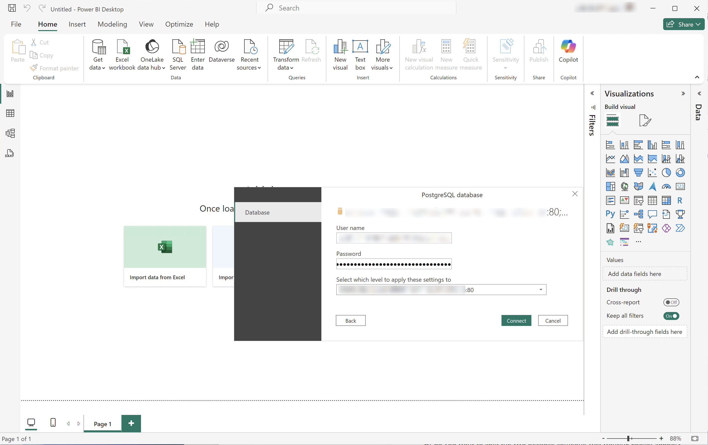
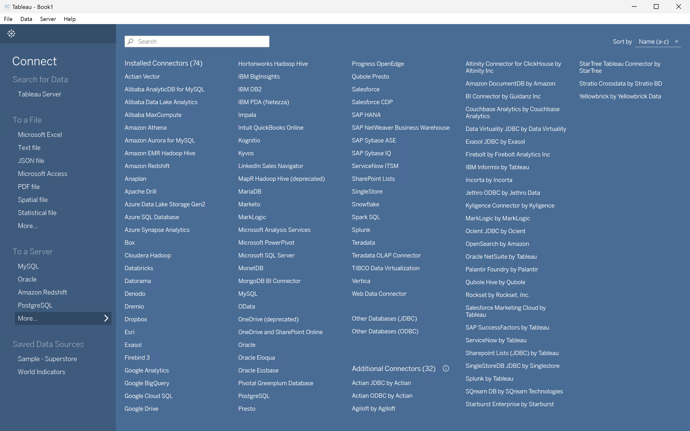
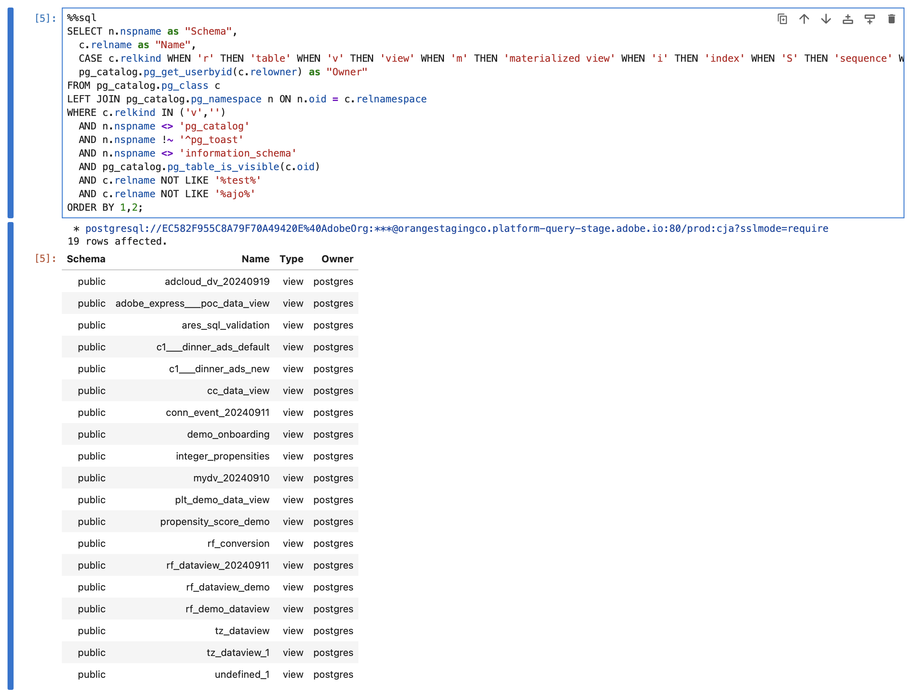

# Conectar e validar


Esse caso de uso configura a conexão da ferramenta de BI com o Customer Journey Analytics, lista as visualizações de dados disponíveis e seleciona uma visualização de dados para usar.

+++ Customer Journey Analytics

As instruções se referem a um ambiente de exemplo com os seguintes objetos:

* Exibição de dados: **[!UICONTROL C&amp;C - Exibição de Dados]** 🅐.
* Dimensões: **[!UICONTROL Nome do Produto]** 🅑 e **[!UICONTROL Categoria do Produto]** 🅒.
* Métricas: **[!UICONTROL Receita de Compra]** 🅓 e **[!UICONTROL Compras]** 🅔.
* Filtro: **[!UICONTROL Produtos de Pesca]** 🅕.


Ao analisar os casos de uso, substitua esses objetos de exemplo por objetos apropriados para seu ambiente específico.

+++

+++ Ferramentas de BI

>[!BEGINTABS]

>[!TAB Power BI Desktop]

1. Acesse as credenciais e os parâmetros necessários da interface do usuário do Experience Platform Query Service.

   1. Navegue até a sandbox da Experience Platform.
   1. Selecione  **[!UICONTROL Consultas]** no painel esquerdo.
   1. Selecione a guia **[!UICONTROL Credenciais]** na interface **[!UICONTROL Consultas]**.
   1. Selecione `prod:cja` no menu suspenso **[!UICONTROL Banco de Dados]**.

      

1. Inicie o Power BI Desktop.
   1. Na interface principal, selecione **[!UICONTROL Obter dados de outras fontes]**.
   1. Na caixa de diálogo **[!UICONTROL Obter Dados]**:
      
      1. Procure e selecione **[!UICONTROL banco de dados PostgreSQL]**.
      1. Selecione **[!UICONTROL Conectar]**.
   1. Na caixa de diálogo **[!UICONTROL Banco de dados PostgreSQL]**:
      
      1. Use  para copiar e colar os valores de **[!UICONTROL Host]** e **[!UICONTROL Porta]** do painel **[!UICONTROL Consulta]** **[!UICONTROL Credenciais em Expiração]** do Experience Platform, separadas por `:` como o valor do **[!UICONTROL Servidor]**. Por exemplo: `examplecompany.platform-query.adobe.io:80`.
      1. Use  para copiar e colar o valor do **[!UICONTROL Banco de Dados]** do painel **[!UICONTROL Consulta]** **[!UICONTROL Credenciais em Expiração]** do Experience Platform. Adicione `?FLATTEN` ao valor que você colar. Por exemplo, `prod:cja?FLATTEN`.
      1. Selecione **[!UICONTROL DirectQuery]** como o **[!UICONTROL modo de conectividade de dados]**.
      1. Selecione **[!UICONTROL OK]**.
   1. Na caixa de diálogo **[!UICONTROL Banco de dados PostgreSQL]** - **[!UICONTROL Banco de Dados]**:
      
      1. Use  para copiar os valores de **[!UICONTROL Nome de Usuário]** e **[!UICONTROL Senha]** do painel **[!UICONTROL Consulta]** **[!UICONTROL Credenciais em Expiração]** do Experience Platform nos campos **[!UICONTROL Nome de usuário]** e **[!UICONTROL Senha]**. Se você estiver usando uma [credencial sem expiração](https://experienceleague.adobe.com/pt-br/docs/experience-platform/query/ui/credentials?lang=en#use-credential-to-connect), use a senha da sua credencial sem expiração.
      1. Verifique se o menu suspenso do **[!UICONTROL Selecione a qual nível aplicar essas configurações]** está definido como o **[!UICONTROL Servidor]** definido anteriormente.
      1. Selecione **[!UICONTROL Conectar]**.
   1. Na caixa de diálogo **[!UICONTROL Navegador]**, as visualizações de dados são recuperadas. Essa recuperação pode levar algum tempo. Depois de recuperado, você verá o seguinte no Power BI Desktop.
      
      1. Selecione **[!UICONTROL public.cc_data_view]** na lista do painel esquerdo.
      1. Você tem duas opções:
         1. Selecione **[!UICONTROL Carregar]** para continuar e concluir a instalação.
         1. Selecione **[!UICONTROL Transformar Dados]**. Você verá uma caixa de diálogo em que poderá aplicar transformações opcionalmente como parte da configuração.
            
            * Selecione **[!UICONTROL Fechar e Aplicar]**.
   1. Após alguns instantes, **[!UICONTROL public.cc_data_view]** será exibido no painel **[!UICONTROL Dados]**. Selecione  para mostrar dimensões e métricas.
      


## Para NIVELAR ou não

O Power BI Desktop oferece suporte aos seguintes cenários para o parâmetro `FLATTEN`. Consulte [Nivelar dados aninhados](https://experienceleague.adobe.com/pt-br/docs/experience-platform/query/key-concepts/flatten-nested-data) para obter mais informações.

| parâmetro FLATTEN | Exemplo | Suportado | Observações |
|---|---|:---:|---|
| Nenhum | `prod:cja` |  | |
| `?FLATTEN` | `prod:cja?FLATTEN` |  | **Opção recomendada para usar!** |
| `%3FFLATTEN` | `prod:cja%3FFLATTEN` |  | O Power BI Desktop exibe um erro: **[!UICONTROL Não foi possível autenticar com as credenciais fornecidas. Tente novamente.]** |

### Mais informações

* [Pré-requisitos](/help/data-views/bi-extension.md#prerequisites)
* [Guia de credenciais](https://experienceleague.adobe.com/pt-br/docs/experience-platform/query/ui/credentials)
* [Conectar o Power BI ao Serviço de Consulta](https://experienceleague.adobe.com/pt-br/docs/experience-platform/query/clients/power-bi).


>[!TAB Tableau Desktop]

1. Acesse as credenciais e os parâmetros necessários da interface do usuário do Experience Platform Query Service.

   1. Navegue até a sandbox da Experience Platform.
   1. Selecione  **[!UICONTROL Consultas]** no painel esquerdo.
   1. Selecione a guia **[!UICONTROL Credenciais]** na interface **[!UICONTROL Consultas]**.
   1. Selecione `prod:cja` no menu suspenso **[!UICONTROL Banco de Dados]**.

      

1. Inicie o Tableau.
   1. Selecione **[!UICONTROL PostgreSQL]** no painel esquerdo abaixo de **[!UICONTROL Para um Servidor]**. Se não estiver disponível, selecione **[!UICONTROL Mais...]** e selecione **[!UICONTROL PostgreSQL]** nos **[!UICONTROL Conectores Instalados]**.
      
   1. Na caixa de diálogo **[!UICONTROL PostgreSQL]**, na guia **[!UICONTROL General]**:
      
      1. Use  para copiar e colar o **[!UICONTROL Host]** do painel **[!UICONTROL Consulta]** **[!UICONTROL Credenciais em Expiração]** do Experience Platform no **[!UICONTROL Servidor]**.
      1. Use  para copiar e colar a **[!UICONTROL Porta]** do painel **[!UICONTROL Consulta]** **[!UICONTROL Credenciais em Expiração]** do Experience Platform para a **[!UICONTROL Porta]**.
      1. Use  para copiar e colar o **[!UICONTROL Banco de Dados]** do painel **[!UICONTROL Consulta]** **[!UICONTROL Credenciais em Expiração]** do Experience Platform no **[!UICONTROL Banco de Dados]**. Adicione `%3FFLATTEN` ao valor que você colar. Por exemplo: `prod:cja%3FFLATTEN`.
      1. Selecione **[!UICONTROL Nome de Usuário e Senha]** no menu suspenso **[!UICONTROL Autenticação]**.
      1. Use  para copiar e colar o **[!UICONTROL Nome de Usuário]** do painel **[!UICONTROL Consulta]** **[!UICONTROL Credenciais em Expiração]** do Experience Platform para o **[!UICONTROL Nome de Usuário]**.
      1. Use  para copiar e colar a **[!UICONTROL Senha]** do painel **[!UICONTROL Consulta]** **[!UICONTROL Credenciais em Expiração]** do Experience Platform para a **[!UICONTROL Senha]**. Se você estiver usando uma [credencial sem expiração](https://experienceleague.adobe.com/pt-br/docs/experience-platform/query/ui/credentials?lang=en#use-credential-to-connect), use a senha da sua credencial sem expiração.
      1. Verifique se **[!UICONTROL Exigir SSL]** está marcado.
      1. Selecione **[!UICONTROL Fazer logon]**.

      Você verá uma caixa de diálogo **[!UICONTROL Solicitação em andamento]** enquanto o Tableau Desktop valida a conexão.
   1. Na janela principal, você vê na página **[!UICONTROL Data Source]**, no painel esquerdo:
      * O nome da conexão, abaixo de **[!UICONTROL Conexões]**.
      * O nome do banco de dados, abaixo de **[!UICONTROL Banco de Dados]**.
      * Uma lista de tabelas, abaixo de **[!UICONTROL Tabela]**.
        
      1. Arraste a entrada **[!UICONTROL cc_data_view]** e solte a entrada na exibição principal onde se lê **[!UICONTROL Arraste tabelas]** aqui.
   1. A janela principal exibe detalhes da exibição de dados do **[!UICONTROL cc_data_view]**.
      

## Para NIVELAR ou não

O Tableau Desktop oferece suporte aos seguintes cenários para o parâmetro `FLATTEN`. Consulte [Nivelar dados aninhados](https://experienceleague.adobe.com/pt-br/docs/experience-platform/query/key-concepts/flatten-nested-data) para obter mais informações.

| parâmetro FLATTEN | Exemplo | Suportado | Observações |
|---|---|:---:|---|
| Nenhum | `prod:cja` |  | |
| `?FLATTEN` | `prod:cja?FLATTEN` |  | |
| `%3FFLATTEN` | `prod:cja%3FFLATTEN` |  | **Opção recomendada para usar**. Observe que `%3FFLATTEN` é a versão de `?FLATTEN` codificada em URL. |

## Mais informações

* [Pré-requisitos](/help/data-views/bi-extension.md#prerequisites)
* [Guia de credenciais](https://experienceleague.adobe.com/pt-br/docs/experience-platform/query/ui/credentials)
* [Conecte o Tableau Desktop ao Serviço de Consulta](https://experienceleague.adobe.com/pt-br/docs/experience-platform/query/clients/tableau).


>[!TAB Pesquisador]

1. Acesse as credenciais e os parâmetros necessários da interface do usuário do Experience Platform Query Service.

   1. Navegue até a sandbox da Experience Platform.
   1. Selecione  **[!UICONTROL Consultas]** no painel esquerdo.
   1. Selecione a guia **[!UICONTROL Credenciais]** na interface **[!UICONTROL Consultas]**.
   1. Selecione `prod:cja` no menu suspenso **[!UICONTROL Banco de Dados]**.

      

1. Fazer logon no Looker

   1. Selecione **[!UICONTROL Admin]** no painel esquerdo.
   1. Selecione **[!UICONTROL Conexões]**.
   1. Selecione **[!UICONTROL Adicionar conexão]**.
   1. Na **[!UICONTROL tela Conectar o banco de dados ao Pesquisador]**.

      

      1. Digite um **[!UICONTROL Nome]** para sua conexão, por exemplo `Example Looker Connection`.
      1. Verifique se **[!UICONTROL Todos os Projetos]** está selecionado como **[!UICONTROL Escopo de Conexão]**.
      1. Selecione **[!UICONTROL PostgreSQL 9.5+]** como o Dialeto.
      1. Use  para copiar e colar o valor de **[!UICONTROL Host]** do painel **[!UICONTROL Consulta]** **[!UICONTROL Credenciais em Expiração]** do Experience Platform, como o valor de **[!UICONTROL Host]**. Por exemplo: `examplecompany.platform-query.adobe.io`.
      1. Use  para copiar e colar o valor de **[!UICONTROL Porta]** do painel **[!UICONTROL Consulta]** **[!UICONTROL Credenciais em Expiração]** do Experience Platform, como o valor de **[!UICONTROL Porta]**. Por exemplo: `80`.
      1. Use  para copiar e colar o valor do **[!UICONTROL Banco de Dados]** do painel **[!UICONTROL Consulta]** **[!UICONTROL Credenciais em Expiração]** do Experience Platform como o valor do **[!UICONTROL Banco de Dados]**. Adicione `%3FFLATTEN` ao valor que você colar. Por exemplo, `prod:cja%3FFLATTEN`.
      1. Use  para copiar e colar o valor de **[!UICONTROL Nome de Usuário]** do painel **[!UICONTROL Consulta]** **[!UICONTROL Credenciais em Expiração]** do Experience Platform como o valor de **[!UICONTROL Nome de Usuário]**.
      1. Use  para copiar e colar o valor de **[!UICONTROL Senha]** do painel **[!UICONTROL Consulta]** **[!UICONTROL Credenciais em Expiração]** do Experience Platform como o valor de **[!UICONTROL Senha]**.
      1. Selecione **[!UICONTROL Expandir tudo]** em **[!UICONTROL Configurações Opcionais]**.
      1. Defina **[!UICONTROL Máximo de conexões]** por nó como `5`.
      1. Verifique se **[!UICONTROL SSL]** está habilitado.
      1. Selecione **[!UICONTROL Testar]** para testar a conexão. Você deve ver um banner aparecer na parte superior da tela com uma mensagem como **[!UICONTROL Sucesso, pode conectar JDBC ....]**.
      1. Selecione **[!UICONTROL Conectar]** para estabelecer e salvar a conexão.
   1. Você vê a nova conexão na interface **[!UICONTROL Conexões]**.
   1. Selecione **Esquerda** de **[!UICONTROL Administrador]** para ir para a navegação principal no painel esquerdo.
   1. Selecione **[!UICONTROL Desenvolver]**.
   1. Selecione **[!UICONTROL Projetos]**.
   1. Selecione **[!UICONTROL Novo Modelo]** em Projetos LookML.
   1. Para garantir que você não afete outros usuários. selecione Enter Development Mode (Entrar no modo de desenvolvimento) quando solicitado.
   1. Na experiência **[!UICONTROL Criar Modelo]**:
      1. Em **[!UICONTROL ➊, Selecione A Conexão De Banco De Dados]**:
         1. Selecione sua conexão de banco de dados em **[!UICONTROL Selecionar conexão de banco de dados]**. Por exemplo: **[!UICONTROL example_looker_connection]**.
         1. Nomeie seu projeto em **[!UICONTROL Crie um novo Projeto LookML para este modelo]**. Para `example: example_looker_project`.
         1. Selecione **[!UICONTROL Próximo]**.
      1. Em **[!UICONTROL ➋Selecione Tabelas]**:
         1. Selecione **[!UICONTROL público]** e certifique-se de que sua visualização de dados do Customer Journey Analytics está selecionada. Por exemplo:  **[!UICONTROL cc_data_view]**.
         1. Selecione **[!UICONTROL Próximo]**.
      1. Em **[!UICONTROL ➌, Selecione Chaves Primárias]**:
         1. Selecione **[!UICONTROL Próximo]**.
      1. Em **[!UICONTROL ➍, Selecione Explorações para Criar]**:
         1. Certifique-se de selecionar a exibição. Por exemplo: **[!UICONTROL cc_data_view.view]**.
         1. Selecione **[!UICONTROL Próximo]**.
      1. Em **[!UICONTROL ➎Insira O Nome Do Modelo]**:
         1. Dê um nome ao seu modelo. Por exemplo: `example_looker_model`.
      1. Selecione **[!UICONTROL Concluir e Explorar Dados]**.

   Você foi redirecionado para a interface do Looker **[!UICONTROL Explorar]**, pronta para explorar os dados.


## Para NIVELAR ou não

O pesquisador dá suporte aos seguintes cenários para o parâmetro `FLATTEN`. Consulte [Nivelar dados aninhados](https://experienceleague.adobe.com/pt-br/docs/experience-platform/query/key-concepts/flatten-nested-data) para obter mais informações.

| parâmetro FLATTEN | Exemplo | Suportado | Observações |
|---|---|:---:|---|
| Nenhum | `prod:cja` |  | |
| `?FLATTEN` | `prod:cja?FLATTEN` |  | |
| `%3FFLATTEN` | `prod:cja%3FFLATTEN` |  | **Opção recomendada para usar**. Observe que `%3FFLATTEN` é a versão de `?FLATTEN` codificada em URL. |

## Mais informações

* [Pré-requisitos](/help/data-views/bi-extension.md#prerequisites)
* [Guia de credenciais](https://experienceleague.adobe.com/pt-br/docs/experience-platform/query/ui/credentials)


>[!TAB Jupyter Notebook]

1. Acesse as credenciais e os parâmetros necessários da interface do usuário do Experience Platform Query Service.

   1. Navegue até a sandbox da Experience Platform.
   1. Selecione  **[!UICONTROL Consultas]** no painel esquerdo.
   1. Selecione a guia **[!UICONTROL Credenciais]** na interface **[!UICONTROL Consultas]**.
   1. Selecione `prod:cja` no menu suspenso **[!UICONTROL Banco de Dados]**.

      

1. Configure um ambiente virtual Python dedicado para executar seu ambiente Jupyter Notebook.
1. Verifique se você instalou as bibliotecas necessárias em seu ambiente virtual:
   * ipython-sql: `pip install ipython-sql`.
   * psycopg2-binary: `pip install psycopg-binary`.
   * sqlalchemy: pip `install sqlalchemy`.

1. Inicie o Jupyter Notebook a partir de seu ambiente virtual: `jupyter notebook`.
1. Crie um novo bloco de anotações ou baixe [este bloco de anotações de exemplo](../assets/BI-Extension.ipynb.zip).
1. Na primeira célula, insira e execute:

   ```
   %config SqlMagic.style = '_DEPRECATED_DEFAULT'
   ```

1. Em uma nova célula, insira os parâmetros de configuração da sua conexão. Use  para copiar e colar valores do painel **[!UICONTROL Consulta]** **[!UICONTROL Credenciais em Expiração]** do Experience Platform nos valores necessários para os parâmetros de configuração. Por exemplo:

   ```
   import ipywidgets as widgets
   from IPython.display import display
   
   config_host = widgets.Text(description='Host:', value='example.platform-query-stage.adobe.io',
                           layout=widgets.Layout(width="600px"))
   display(config_host)
   config_port = widgets.IntText(description='Port:', value=80,
                              layout=widgets.Layout(width="200px"))
   display(config_port)
   config_db = widgets.Text(description='Database:', value='prod:cja',
                         layout=widgets.Layout(width="300px"))
   display(config_db)
   config_username = widgets.Text(description='Username:', value='EC582F955C8A79F70A49420E@AdobeOrg',
                               layout=widgets.Layout(width="600px"))
   display(config_username)
   config_password = widgets.Password(description='Password:', value='***',
                                   layout=widgets.Layout(width="600px"))
   display(config_password)
   ```

1. Execute a célula.
1. Use  para copiar e colar a senha do painel **[!UICONTROL Consulta]** **[!UICONTROL Credenciais em Expiração]** do Experience Platform no campo **[!UICONTROL Senha]** do Jupyter Notebook.

    da Configuração do Jupter Notebook

1. Em uma nova célula, insira as instruções para carregar a extensão SQL, a biblioteca necessária e conectar-se ao Customer Journey Analytics.

   ```python
   %load_ext sql
   from sqlalchemy import create_engine
   %sql postgresql://{config_username.value}:{config_password.value}@{config_host.value}:{config_port.value}/{config_db.value}?sslmode=require
   ```

   Execute o shell. Você não deve ver nenhuma saída, mas a célula deve ser executada sem nenhum aviso.

    da Configuração do Jupyer Notebook

1. Em uma nova chamada, insira as instruções para obter uma lista de visualizações de dados disponíveis com base na conexão.

   ```python
   %%sql
   SELECT n.nspname as "Schema",
      c.relname as "Name",
      CASE c.relkind WHEN 'r' THEN 'table' WHEN 'v' THEN 'view' WHEN 'm' THEN 'materialized view' WHEN 'i' THEN 'index' WHEN 'S' THEN 'sequence' WHEN 's' THEN 'special' WHEN 't' THEN 'TOAST table' WHEN 'f' THEN 'foreign table' WHEN 'p' THEN 'partitioned table' WHEN 'I' THEN 'partitioned index' END as "Type",
      pg_catalog.pg_get_userbyid(c.relowner) as "Owner"
   FROM pg_catalog.pg_class c
   LEFT JOIN pg_catalog.pg_namespace n ON n.oid = c.relnamespace
   WHERE c.relkind IN ('v','')
      AND n.nspname <> 'pg_catalog'
      AND n.nspname !~ '^pg_toast'
      AND n.nspname <> 'information_schema'
      AND pg_catalog.pg_table_is_visible(c.oid)
      AND c.relname NOT LIKE '%test%'
      AND c.relname NOT LIKE '%ajo%'
   ORDER BY 1,2;
   ```

   Execute o shell. Você deve ver a saída simular na captura de tela abaixo.

    da Configuração do Jupyter Notebook

   Você deve ver o **[!UICONTROL cc_data_view]** na lista de visualizações de dados.

## Para NIVELAR ou não

O Jupyter Notebook dá suporte aos seguintes cenários para o parâmetro `FLATTEN`. Consulte [Nivelar dados aninhados](https://experienceleague.adobe.com/pt-br/docs/experience-platform/query/key-concepts/flatten-nested-data) para obter mais informações.

| parâmetro FLATTEN | Exemplo | Suportado | Observações |
|---|---|:---:|---|
| Nenhum | `prod:cja` |  | |
| `?FLATTEN` | `prod:cja?FLATTEN` |  | |
| `%3FFLATTEN` | `prod:cja%3FFLATTEN` |  | **Opção recomendada para usar**. Observe que `%3FFLATTEN` é a versão de `?FLATTEN` codificada em URL. |

## Mais informações

* [Pré-requisitos](/help/data-views/bi-extension.md#prerequisites)
* [Guia de credenciais](https://experienceleague.adobe.com/pt-br/docs/experience-platform/query/ui/credentials)

>[!TAB RStudio]

1. Acesse as credenciais e os parâmetros necessários da interface do usuário do Experience Platform Query Service.

   1. Navegue até a sandbox da Experience Platform.
   1. Selecione  **[!UICONTROL Consultas]** no painel esquerdo.
   1. Selecione a guia **[!UICONTROL Credenciais]** na interface **[!UICONTROL Consultas]**.
   1. Selecione `prod:cja` no menu suspenso **[!UICONTROL Banco de Dados]**.

      

1. Iniciar RStudio.
1. Crie um novo arquivo do R Markdown ou baixe [este arquivo de exemplo do R Markdown](../assets/BI-Extension.Rmd.zip).
1. Na primeira parte, insira as seguintes instruções entre ` ` ``{r} ` e ` `` ` `. Use  para copiar e colar valores do painel **[!UICONTROL Consulta]** **[!UICONTROL Credenciais em Expiração]** do Experience Platform para os valores necessários para os vários parâmetros, como `host`, `dbname` e `user`. Por exemplo:

   ```R
   library(rstudioapi)
   library(DBI)
   library(dplyr)
   library(tidyr)
   library(RPostgres)
   library(ggplot2)
   
   host <- rstudioapi::showPrompt(title = "Host", message = "Host", default = "orangestagingco.platform-query-stage.adobe.io")
   dbname <- rstudioapi::showPrompt(title = "Database", message = "Database", default = "prod:cja?FLATTEN")
   user <- rstudioapi::showPrompt(title = "Username", message = "Username", default = "EC582F955C8A79F70A49420E@AdobeOrg")
   password <- rstudioapi::askForPassword(prompt = "Password")
   ```

1. Execute o pedaço. Você é solicitado a fornecer **[!UICONTROL Host]**, **[!UICONTROL Banco de Dados]** e **[!UICONTROL Usuário]**. Basta aceitar os valores fornecidos como parte da etapa anterior.
1. Use  para copiar e colar a senha do painel **[!UICONTROL Consulta]** **[!UICONTROL Credenciais em Expiração]** do Experience Platform no prompt da caixa de diálogo **[!UICONTROL Senha]** do RStudio.

   

1. Crie uma nova parte e insira as seguintes instruções entre ` ` `` {r} ` e ` `` ` `.

   ```R
   con <- dbConnect(
      RPostgres::Postgres(),
      host = host,
      port = 80,
      dbname = dbname,
      user = user,
      password = password,
      sslmode = 'require'
   )
   ```

1. Execute o pedaço. Você não deve ver nenhuma saída se a conexão for bem-sucedida.


1. Crie uma nova parte e insira as seguintes instruções entre ` ` `` {r} ` e ` `` ` `.

   ```R
   views <- dbListTables(con)
   print(views)
   ```

1. Execute o pedaço. Você deve ver `character(0)` como a única saída.


1. Crie uma nova parte e insira as seguintes instruções entre ` ` `` {r} ` e ` `` ` `.

   ```R
   glimpse(dv)
   ```

1. Execute o pedaço. Você deve ver a saída simular na captura de tela abaixo.

    da configuração do Studio

## Para NIVELAR ou não

O RStudio oferece suporte aos seguintes cenários para o parâmetro `FLATTEN`. Consulte [Nivelar dados aninhados](https://experienceleague.adobe.com/pt-br/docs/experience-platform/query/key-concepts/flatten-nested-data) para obter mais informações.

| parâmetro FLATTEN | Exemplo | Suportado | Observações |
|---|---|:---:|---|
| Nenhum | `prod:cja` |  | |
| `?FLATTEN` | `prod:cja?FLATTEN` |  | **Opção recomendada para usar**. |
| `%3FFLATTEN` | `prod:cja%3FFLATTEN` |  | |

## Mais informações

* [Pré-requisitos](/help/data-views/bi-extension.md#prerequisites)
* [Guia de credenciais](https://experienceleague.adobe.com/pt-br/docs/experience-platform/query/ui/credentials)

>[!ENDTABS]

+++
