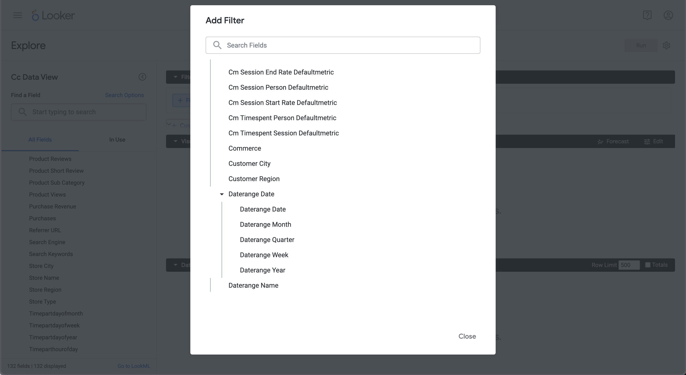

# Limites


Nesse caso de uso, você deseja relatar as 5 principais ocorrências de nomes de produtos durante 2023.

+++ Customer Journey Analytics

Um exemplo de painel **[!UICONTROL Limite]** para o caso de uso:


+++

+++ Ferramentas de BI

>[!PREREQUISITES]
>
>Verifique se você validou [uma conexão bem-sucedida, pode listar visualizações de dados e usar uma visualização de dados](connect-and-validate.md) para a ferramenta de BI para a qual deseja experimentar este caso de uso.
>

>[!BEGINTABS]

>[!TAB Power BI Desktop]

1. No painel **[!UICONTROL Dados]**:
   1. Selecione **[!UICONTROL intervalo de datas]**.
   1. Selecione **[!UICONTROL product_name]**.
   1. Selecione **[!UICONTROL somar ocorrências]**.

1. No painel **[!UICONTROL Filtros]**:
   1. Selecione **[!UICONTROL o intervalo de datas é (Todos)]** de **[!UICONTROL Filtros neste visual]**.
   1. Selecione **[!UICONTROL Data relativa]** como o **[!UICONTROL Tipo de filtro]**.
   1. Defina o filtro como **[!UICONTROL Mostrar itens quando o valor]** **[!UICONTROL estiver nos últimos]** `1` **[!UICONTROL anos]**.
   1. Selecione **[!UICONTROL Aplicar filtro]**.
   1. Selecione **[!UICONTROL product_name is (All)]** em **[!UICONTROL Filtros neste visual]**.
   1. Selecione **[!UICONTROL N Superior]** como o **[!UICONTROL Tipo de filtro]**.
   1. Selecione **[!UICONTROL Mostrar Itens]** **[!UICONTROL Superior]** `5` **[!UICONTROL Por valor]**.
   1. Arraste e solte **[!UICONTROL somar ocorrências]** do painel **[!UICONTROL Dados]** e solte-o em **[!UICONTROL Adicionar campos de dados aqui]**.
   1. Selecione **[!UICONTROL Aplicar filtro]**.

1. No painel Visualização:
   * Selecione  para remover o intervalo de datas das Colunas.

   A área de trabalho do Power BI deve ser semelhante à mostrada abaixo.

   

A consulta executada pelo Power BI Desktop usando a extensão BI inclui uma instrução `limit`, mas não a esperada. O limite para as 5 principais ocorrências é aplicado pelo Power BI Desktop usando resultados explícitos de nome de produto.

```sql
select "_"."product_name",
    "_"."a0"
from 
(
    select "rows"."product_name" as "product_name",
        sum("rows"."occurrences") as "a0"
    from 
    (
        select "_"."daterangeName",
            "_"."daterange",
            "_"."filterId",
            "_"."filterName",
            "_"."timestamp",
            "_"."affiliate_name",
            "_"."affiliate_url",
            "_"."commerce.order.priceTotal",
            "_"."customer_city",
            "_"."customer_region",
            "_"."daterangeday",
            "_"."daterangefifteenminute",
            "_"."daterangefiveminute",
            "_"."daterangehour",
            "_"."daterangeminute",
            "_"."daterangemonth",
            "_"."daterangequarter",
            "_"."daterangesecond",
            "_"."daterangethirtyminute",
            "_"."daterangeweek",
            "_"."daterangeyear",
            "_"."hitdatetime",
            "_"."page_name",
            "_"."page_url",
            "_"."product_category",
            "_"."product_name",
            "_"."product_short_review",
            "_"."product_subCategory",
            "_"."referrer_url",
            "_"."search_engine",
            "_"."search_keywords",
            "_"."store_city",
            "_"."store_name",
            "_"."store_region",
            "_"."store_type",
            "_"."timepartdayofmonth",
            "_"."timepartdayofweek",
            "_"."timepartdayofyear",
            "_"."timeparthourofday",
            "_"."timepartminuteofhour",
            "_"."timepartmonthofyear",
            "_"."timepartquarterofyear",
            "_"."timepartweekofyear",
            "_"."cm_session_end_rate_defaultmetric",
            "_"."cm_session_person_defaultmetric",
            "_"."cm_session_start_rate_defaultmetric",
            "_"."cm_timespent_person_defaultmetric",
            "_"."cm_timespent_session_defaultmetric",
            "_"."cm_product_name_count_distinct",
            "_"."ad_views",
            "_"."adobe_sessionends",
            "_"."adobe_sessionstarts",
            "_"."adobe_timespent",
            "_"."exchange_buybacks",
            "_"."exchange_cost",
            "_"."exchange_purchases",
            "_"."exchange_revenue",
            "_"."occurrences",
            "_"."page_views",
            "_"."product_quantity",
            "_"."product_reviews",
            "_"."product_views",
            "_"."purchase_revenue",
            "_"."purchases",
            "_"."visitors",
            "_"."visits"
        from "public"."cc_data_view" "_"
        where (("_"."product_name" in ('Saltwater Monofilament Line', 'Pop-Up Beach Tent', 'Instant Pop-Up Tent', 'Envelop Sleeping Bag', 'Waterproof Tackle Bag')) and "_"."daterange" < date '2024-01-01') and "_"."daterange" >= date '2023-01-01'
    ) "rows"
    group by "product_name"
) "_"
where not "_"."a0" is null
limit 1000001
```

>[!TAB Tableau Desktop]

1. Selecione a guia **[!UICONTROL Folha 1]** na parte inferior para alternar da **[!UICONTROL Fonte de dados]**. Na exibição **[!UICONTROL Folha 1]**:
   1. Arraste a entrada **[!UICONTROL Daterange]** da lista **[!UICONTROL Tabelas]** na prateleira **[!UICONTROL Filtros]**.
   1. Na caixa de diálogo **[!UICONTROL Filtrar Campo \[Intervalo de Datas\]]**, selecione **[!UICONTROL Intervalo de Datas]** e selecione **[!UICONTROL Avançar >]**.
   1. Na caixa de diálogo **[!UICONTROL Filtro \[Intervalo de datas\]]**, selecione **[!UICONTROL Datas relativas]**, selecione **[!UICONTROL Anos]** e selecione **[!UICONTROL Anos anteriores]**. Selecione **[!UICONTROL Aplicar]** e **[!UICONTROL OK]**.
   1. Arraste **[!UICONTROL Nome do Produto]** da lista **[!UICONTROL Tabelas]** para **[!UICONTROL Linhas]**.
   1. Arraste a entrada **[!UICONTROL Ocorrências]** da lista **[!UICONTROL Tabelas]** e solte a entrada no campo ao lado de **[!UICONTROL Colunas]**. O valor é alterado para **[!UICONTROL SUM(Occurrences)]**.
   1. Selecione **[!UICONTROL Tabela de Texto]** de **[!UICONTROL Mostre-me]**.
   1. Selecione **[!UICONTROL Ajustar largura]** no menu suspenso **[!UICONTROL Ajustar]**.
   1. Selecione o **[!UICONTROL Nome do Produto]** em **[!UICONTROL Linhas]**. Selecione **[!UICONTROL Filtro]** no menu suspenso.
      1. Na caixa de diálogo **[!UICONTROL Filtrar \[Nome do Produto\]]**, selecione a guia **[!UICONTROL Superior]**.
      1. Selecionar **[!UICONTROL Por campo:]** **[!UICONTROL Superior]** `5` **[!UICONTROL por Ocorrências]** **[!UICONTROL Soma]**.
      1. Selecione **[!UICONTROL Aplicar]** e **[!UICONTROL OK]**.

          Você percebe que a tabela desaparece. A seleção dos 5 principais nomes de produtos por ocorrências **não** funciona corretamente usando este filtro.
      1. Selecione o **[!UICONTROL Nome do Produto]** na prateleira **[!UICONTROL Filtro]** e, no menu suspenso, selecione **[!UICONTROL Remover]**. A tabela reaparece.
   1. Selecione **[!UICONTROL SUM(Occurrences)]** na prateleira **[!UICONTROL Marcas]**. Selecione **[!UICONTROL Filtro]** no menu suspenso.
      1. Na caixa de diálogo **[!UICONTROL Filtrar \[Ocorrências\]]**, selecione **[!UICONTROL Pelo menos]**.
      1. Digite `47.799` como valor. Esse valor garante que apenas os 5 itens principais sejam mostrados na tabela. Selecione **[!UICONTROL Aplicar]** e **[!UICONTROL OK]**.

         A área de trabalho do Tableau deve ser parecida com a exibida abaixo.

         

Como mostrado acima, essa consulta executada pelo Tableau Desktop, ao definir um filtro Cinco principais ocorrências em nomes de produtos, falha.

```sql
SELECT CAST("cc_data_view"."product_name" AS TEXT) AS "product_name",
  SUM("cc_data_view"."occurrences") AS "sum:occurrences:ok"
FROM "public"."cc_data_view" "cc_data_view"
  INNER JOIN (
  SELECT CAST("cc_data_view"."product_name" AS TEXT) AS "product_name",
    SUM("cc_data_view"."occurrences") AS "$__alias__0"
  FROM "public"."cc_data_view" "cc_data_view"
  GROUP BY 1
  ORDER BY 2 DESC,
    1 ASC
  LIMIT 5
) "t0" ON (CAST("cc_data_view"."product_name" AS TEXT) = "t0"."product_name")
WHERE (("cc_data_view"."daterange" >= (TIMESTAMP '2023-01-01 00:00:00.000')) AND ("cc_data_view"."daterange" < (TIMESTAMP '2024-01-01 00:00:00.000')))
GROUP BY 1
```

A consulta executada pelo Tableau Desktop, ao definir um filtro 5 principais em ocorrências, é mostrada abaixo. O limite não está visível na consulta e aplicado no lado do cliente.

```sql
SELECT CAST("cc_data_view"."product_name" AS TEXT) AS "product_name",
  SUM("cc_data_view"."occurrences") AS "sum:occurrences:ok"
FROM "public"."cc_data_view" "cc_data_view"
WHERE (("cc_data_view"."daterange" >= (TIMESTAMP '2023-01-01 00:00:00.000')) AND ("cc_data_view"."daterange" < (TIMESTAMP '2024-01-01 00:00:00.000')))
GROUP BY 1
```

>[!TAB Pesquisador]

1. Na interface **[!UICONTROL Explorar]** do Looker, atualize a conexão. Selecione  **[!UICONTROL Limpar cache e atualizar]**.
1. Na interface **[!UICONTROL Explorar]** do Looker, verifique se você possui uma configuração limpa. Caso contrário, selecione  **[!UICONTROL Remover campos e filtros]**.
1. Selecione **[!UICONTROL + Filtro]** abaixo de **[!UICONTROL Filtros]**.
1. Na caixa de diálogo **[!UICONTROL Adicionar Filtro]**:
   1. Selecionar **[!UICONTROL ‣ Visualização De Dados Cc]**
   1. Na lista de campos, selecione **[!UICONTROL ‣ Data do Intervalo de Datas]** e **[!UICONTROL Data do Intervalo de Datas]**.
      
1. Especifique o filtro **[!UICONTROL Data do Intervalo de Datas da Visualização de Dados Cc]**, pois **[!UICONTROL está no intervalo]** **[!UICONTROL 2023/01/01]** **[!UICONTROL até (antes)]** **[!UICONTROL 2024/01/01]**.
1. Na seção **[!UICONTROL ‣ Cc Data View]** no painel esquerdo:
   1. Selecione **[!UICONTROL Nome do Produto]**.
   1. Selecione **[!UICONTROL Contagem]** abaixo de **[!UICONTROL MEDIDAS]** no painel esquerdo (na parte inferior).
1. Selecione **&#x200B;**&#x200B;(**[!UICONTROL Decrescente, Ordem de classificação: 1]**) na coluna **[!UICONTROL Receita de compra]**.
1. Selecione **&#x200B;**&#x200B;(**[!UICONTROL Decrescente, Ordem de classificação: 1]**) na coluna **[!UICONTROL Receita de compra]**.
1. Selecione **[!UICONTROL Executar]**.
1. Selecione **[!UICONTROL ‣ Visualização]**.

Você deve ver uma visualização e tabela semelhantes, como mostrado abaixo.


A consulta gerada pelo Pesquisador usando a extensão BI inclui `FETCH NEXT 5 ROWS ONLY`, o que implica que o limite é executado por meio do Pesquisador e da extensão BI.

```sql
-- Looker Query Context '{"user_id":6,"history_slug":"a8f3b1ebd5712413ca1ae695090f70db","instance_slug":"71d4667f0b76c0011463658f45c3f7a3"}' 
SELECT
    cc_data_view."product_name"  AS "cc_data_view.product_name",
    COUNT(*) AS "cc_data_view.count"
FROM
    "public"."cc_data_view" AS "cc_data_view"
WHERE ((( cc_data_view."daterange"  ) >= (DATE_TRUNC('day', DATE '2023-01-31')) AND ( cc_data_view."daterange"  ) < (DATE_TRUNC('day', DATE '2024-01-01'))))
GROUP BY
    1
ORDER BY
    2 DESC
FETCH NEXT 5 ROWS ONLY
```


>[!TAB Jupyter Notebook]

1. Insira as seguintes instruções em uma nova célula.

   ```python
   data = %sql SELECT product_name AS `Product Name`, COUNT(*) AS Events \
               FROM cc_data_view \
               WHERE daterange BETWEEN '2023-01-01' AND '2023-02-01' \
               GROUP BY 1 \
               ORDER BY `Events` DESC \
               LIMIT 5;
   display(data)
   ```

1. Execute a célula. Você deve ver uma saída semelhante à captura de tela abaixo.

   

A consulta é executada pela extensão BI, conforme definido no Jupyter Notebook.

>[!TAB RStudio]

1. Insira as seguintes instruções entre ` ` ``{r} ` e ` `` ` ` em uma nova parte.

   ```R
   ## Dimension 1 Limited
   df <- dv %>%
      filter(daterange >= "2023-01-01" & daterange < "2024-01-01") %>%
      group_by(product_name) %>%
      count() %>%
      arrange(desc(n), .by_group = FALSE) %>%
      head(5)
   print(df)
   ```

1. Execute o pedaço. Você deve ver uma saída semelhante à captura de tela abaixo.

   

A consulta gerada pelo RStudio usando a extensão de BI inclui `LIMIT 5`, o que implica que o limite é aplicado por meio do RStudio e da extensão de BI.

```sql
SELECT "product_name", COUNT(*) AS "n"
FROM (
  SELECT "cc_data_view".*
  FROM "cc_data_view"
  WHERE ("daterange" >= '2023-01-01' AND "daterange" < '2024-01-01')
) AS "q01"
GROUP BY "product_name"
ORDER BY "n" DESC
LIMIT 5
```

>[!ENDTABS]

+++
