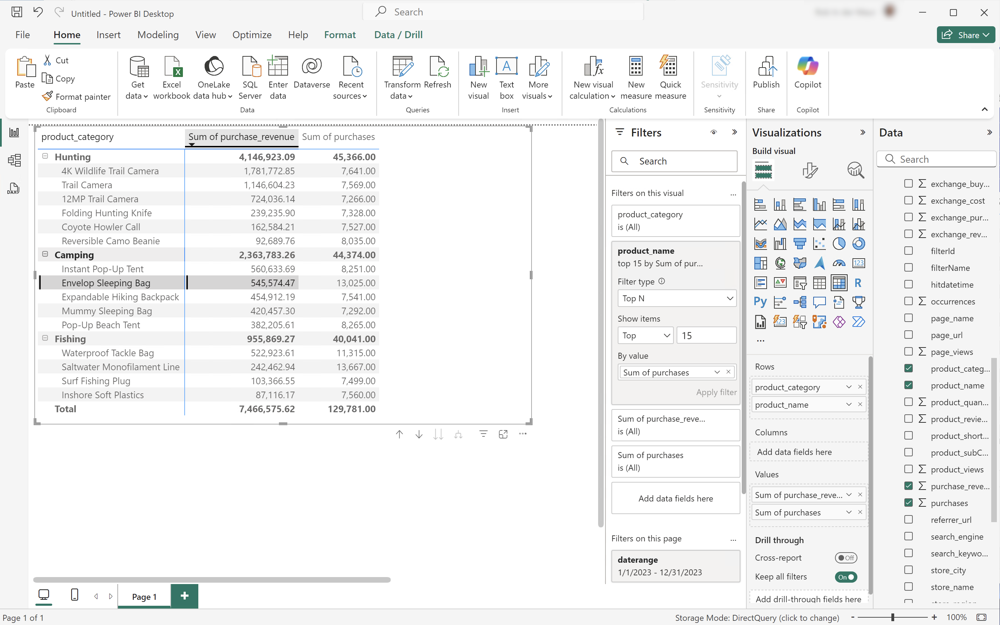

# Várias dimensões classificadas


Nesse caso de uso, você deseja exibir uma tabela que detalha a receita de compra e as compras de nomes de produtos nas categorias de produtos ao longo de 2023. Além disso, você deseja usar algumas visualizações para ilustrar a distribuição de categoria de produto e as contribuições de nome de produto dentro de cada categoria de produto.

+++ Customer Journey Analytics

Um exemplo de painel **[!UICONTROL Vários Dimension Classificados]** para o caso de uso:


+++

+++ Ferramentas de BI

>[!PREREQUISITES]
>
>Verifique se você validou [uma conexão bem-sucedida, pode listar visualizações de dados e usar uma visualização de dados](connect-and-validate.md) para a ferramenta de BI para a qual deseja experimentar este caso de uso.
>

>[!BEGINTABS]

>[!TAB Power BI Desktop]

1. Para garantir que o intervalo de datas se aplique a todas as visualizações, arraste e solte **[!UICONTROL daterangeday]** do painel **[!UICONTROL Dados]** em **[!UICONTROL Filtros nesta página]**.
   1. Selecione o **[!UICONTROL daterangeday é (Todos)]** de **[!UICONTROL Filtros nesta página]**.
   1. Selecione **[!UICONTROL Data relativa]** como o **[!UICONTROL Tipo de filtro]**.
   1. Defina o filtro como **[!UICONTROL Mostrar itens quando o valor]** **[!UICONTROL estiver nos últimos]** `1` **[!UICONTROL anos]**.
   1. Selecione **[!UICONTROL Aplicar filtro]**.

1. No painel **[!UICONTROL Dados]**:
   1. Selecione **[!UICONTROL datarangeday]**.
   1. Selecione **[!UICONTROL product_category]**.
   1. Selecione **[!UICONTROL product_name]**.
   1. Selecionar **[!UICONTROL soma_receita_compra]**
   1. Selecionar **[!UICONTROL soma de compras]**

1. Para modificar o gráfico de barras vertical para uma Tabela, verifique se a tabela está selecionada e selecione **[!UICONTROL Matriz]** no painel **[!UICONTROL Visualizações]**.
   * Arraste **[!UICONTROL product_name]** de **[!UICONTROL Colunas]** e solte o campo sob **[!UICONTROL product_categor]**&#x200B;y em **[!UICONTROL Linhas]** no painel **[!UICONTROL Visualização]**.

1. Para limitar o número de produtos exibidos na tabela, selecione **[!UICONTROL product_name is (All)]** no painel **[!UICONTROL Filtros]**.

   1. Selecione **[!UICONTROL Filtragem avançada]**.
   1. Selecione **[!UICONTROL Tipo de filtro]** **[!UICONTROL N principais]** **[!UICONTROL Mostrar itens]** **[!UICONTROL Principais]** `15` **[!UICONTROL Por Valor]**.
   1. Arraste **[!UICONTROL compras]** do painel **[!UICONTROL Dados]** até **[!UICONTROL Adicionar campos de dados aqui]**.
   1. Selecione **[!UICONTROL Aplicar filtro]**.

1. Para melhorar a legibilidade, selecione **[!UICONTROL Exibir]** no menu superior e selecione **[!UICONTROL Exibição de página]** > **[!UICONTROL Tamanho real]** e redimensione a visualização de tabela.

1. Para detalhar cada categoria na tabela, selecione **[!UICONTROL +]** no nível da categoria do produto. A área de trabalho do Power BI deve ser semelhante à mostrada abaixo.

   

1. Selecione **[!UICONTROL Página Inicial]** no menu superior e selecione **[!UICONTROL Novo visual]**. Um novo visual é adicionado ao relatório.

1. No painel **[!UICONTROL Dados]**:
   1. Selecione **[!UICONTROL product_category]**.
   1. Selecione **[!UICONTROL product_name]**.
   1. Selecione **[!UICONTROL purchase_revenue]**.

1. Para modificar o visual, selecione o gráfico de barras e selecione **[!UICONTROL Treemap]** no painel **[!UICONTROL Visualizações]**.
1. Verifique se a **[!UICONTROL product_category]** está listada abaixo da **[!UICONTROL Category]** e se o **[!UICONTROL product_name]** está listado abaixo dos **[!UICONTROL Details]** no painel **[!UICONTROL Visualizações]**.

   A área de trabalho do Power BI deve ser semelhante à mostrada abaixo.

   

1. Selecione **[!UICONTROL Página Inicial]** no menu superior e selecione **[!UICONTROL Novo visual]**. Um novo visual é adicionado ao relatório.

1. No painel **[!UICONTROL Dados]**:
   1. Selecione **[!UICONTROL product_category]**.
   1. Selecione **[!UICONTROL purchase_revenue]**.
   1. Selecione **[!UICONTROL comprar]**.

1. No painel **[!UICONTROL Visualizações]**:
   1. Para modificar a visualização, selecione **[!UICONTROL Gráfico de linhas e colunas empilhadas]**.
   1. Arraste **[!UICONTROL sum_of_purchases]** do **[!UICONTROL eixo y da coluna]** para o **[!UICONTROL eixo y da linha]**.

1. No relatório, embaralhe as visualizações individuais.

   A área de trabalho do Power BI deve ser semelhante à mostrada abaixo.

   


>[!TAB Tableau Desktop]

1. Selecione a guia **[!UICONTROL Folha 1]** na parte inferior para alternar da **[!UICONTROL Fonte de dados]**. Na exibição **[!UICONTROL Folha 1]**:
   1. Arraste a entrada **[!UICONTROL Daterange]** da lista **[!UICONTROL Tabelas]** no painel **[!UICONTROL Dados]** e solte a entrada na prateleira **[!UICONTROL Filtros]**.
   1. Na caixa de diálogo **[!UICONTROL Campo de Filtros \[Intervalo de datas\]]**, selecione **[!UICONTROL Intervalo de datas]** e selecione **[!UICONTROL Próximo >]**.
   1. Na caixa de diálogo **[!UICONTROL Filtro \[Intervalo de datas\]]**, selecione **[!UICONTROL Datas relativas]**, selecione **[!UICONTROL Anos]** e especifique **[!UICONTROL Ano anterior]**. Selecione **[!UICONTROL Aplicar]** e **[!UICONTROL OK]**.

      A área de trabalho do Tableau deve ser parecida com a exibida abaixo.

      

   1. Arraste **[!UICONTROL Categoria do Produto]** e solte ao lado de **[!UICONTROL Colunas]**.
   1. Arraste **[!UICONTROL Receita de Compra]** e solte ao lado de **[!UICONTROL Linhas]**. O valor muda para **[!UICONTROL SUM(Purchase Revenue)]**.
   1. Arraste Compras e solte ao lado de **[!UICONTROL Linhas]**. O valor muda para **[!UICONTROL SUM(Purchases)]**.
   1. Selecione **[!UICONTROL SUM(Purchases)]** e, no menu suspenso, selecione **[!UICONTROL Eixo duplo]**.
   1. Selecione **[!UICONTROL SUM(Purchases)]** em **[!UICONTROL Marks]** e selecione **[!UICONTROL Line]** no menu suspenso.
   1. Selecione **[!UICONTROL SOMA(Receita da Compra)]** em **[!UICONTROL Marcas]** e selecione **[!UICONTROL Barra]** no menu suspenso.
   1. Selecione **[!UICONTROL Exibição Inteira]** no menu **[!UICONTROL Ajustar]**.
   1. Selecione o título **[!UICONTROL Receita de compra]** no gráfico e verifique se a receita de compra está em ordem crescente.

      A área de trabalho do Tableau deve ser parecida com a exibida abaixo.

      

1. Renomeie a **[!UICONTROL Planilha 1]** atual para `Category`.
1. Selecione **[!UICONTROL Nova Planilha]** para criar uma nova planilha e renomeá-la para `Data`.

   1. Arraste a entrada **[!UICONTROL Daterange]** da lista **[!UICONTROL Tabelas]** no painel **[!UICONTROL Dados]** e solte a entrada na prateleira **[!UICONTROL Filtros]**.
   1. Na caixa de diálogo **[!UICONTROL Campo de Filtros \[Intervalo de datas\]]**, selecione **[!UICONTROL Intervalo de datas]** e selecione **[!UICONTROL Próximo >]**.
   1. Na caixa de diálogo **[!UICONTROL Filtro \[Intervalo de datas\]]**, selecione **[!UICONTROL Datas relativas]**, selecione **[!UICONTROL Anos]** e especifique **[!UICONTROL Ano anterior]**. Selecione **[!UICONTROL Aplicar]** e **[!UICONTROL OK]**.
   1. Arraste **[!UICONTROL Receita de Compra]** do painel **[!UICONTROL Dados]** para **[!UICONTROL Colunas]**. O valor muda para **[!UICONTROL SUM(Purchase Revenue)]**.
   1. Arraste **[!UICONTROL Compra]** do painel **[!UICONTROL Dados]** para **[!UICONTROL Colunas]**, ao lado de **[!UICONTROL Receita de Compra]**. O valor muda para **[!UICONTROL SUM(Purchases)]**.
   1. Arraste **[!UICONTROL Categoria do Produto]** do painel **[!UICONTROL Dados]** para **[!UICONTROL Linhas]**.
   1. Arraste **[!UICONTROL Nome do Produto]** do painel **[!UICONTROL Dados]** para **[!UICONTROL Linhas]**, ao lado de **[!UICONTROL Categoria do Produto]**.
   1. Para alterar as duas barras horizontais para uma tabela, selecione **[!UICONTROL Tabela de Texto]** de **[!UICONTROL Mostre-me]**.
   1. Para limitar o número de produtos, selecione **[!UICONTROL Compras]** em **[!UICONTROL Valores de Medida]**. No menu suspenso, selecione **[!UICONTROL Filtro]**.
   1. Na caixa de diálogo **[!UICONTROL Filtrar \[Compras\]]**, selecione **[!UICONTROL Pelo menos]** e digite `7000`. Selecione **[!UICONTROL Aplicar]** e **[!UICONTROL OK]**.
   1. Selecione **[!UICONTROL Ajustar largura]** de **[!UICONTROL no menu suspenso]** Ajustar.

      A área de trabalho do Tableau deve ser parecida com a exibida abaixo.

      

1. Selecione **[!UICONTROL Nova planilha]** para criar uma nova planilha e renomeá-la como **[!UICONTROL Treemap]**.
   1. Arraste a entrada **[!UICONTROL Daterange]** da lista **[!UICONTROL Tabelas]** no painel **[!UICONTROL Dados]** e solte a entrada na prateleira **[!UICONTROL Filtros]**.
   1. Na caixa de diálogo **[!UICONTROL Campo de Filtros \[Intervalo de datas\]]**, selecione **[!UICONTROL Intervalo de datas]** e selecione **[!UICONTROL Próximo >]**.
   1. Na caixa de diálogo **[!UICONTROL Filtro \[Intervalo de datas\]]**, selecione **[!UICONTROL Datas relativas]**, selecione **[!UICONTROL Anos]** e especifique **[!UICONTROL Ano anterior]**. Selecione **[!UICONTROL Aplicar]** e **[!UICONTROL OK]**.
   1. Arraste **[!UICONTROL Receita de Compra]** do painel **[!UICONTROL Dados]** para **[!UICONTROL Linhas]**. O valor é alterado para **[!UICONTROL SUM(Purchase Revenue)]**.
   1. Arraste **[!UICONTROL Purchase]** do painel **[!UICONTROL Data]** para **[!UICONTROL Rows]**, ao lado de **[!UICONTROL Purchase Revenue]**. O valor muda para **[!UICONTROL SUM(Purchases)]**.
   1. Arraste **[!UICONTROL Categoria do Produto]** do painel **[!UICONTROL Dados]** para **[!UICONTROL Colunas]**.
   1. Arraste **[!UICONTROL Nome do Produto]** do painel **[!UICONTROL Dados]** para **[!UICONTROL Colunas]**.
   1. Para alterar os dois gráficos de barras verticais para um mapa de árvore, selecione **[!UICONTROL Mapa de árvore]** em **[!UICONTROL Mostrar-me]**.
   1. Para limitar o número de produtos, selecione **[!UICONTROL Compras]** em **[!UICONTROL Valores de Medida]**. No menu suspenso, selecione **[!UICONTROL Filtro]**.
   1. Na caixa de diálogo **[!UICONTROL Filtrar \[Compras\]]**, selecione **[!UICONTROL Pelo menos]** e digite `7000`. Selecione **[!UICONTROL Aplicar]** e **[!UICONTROL OK]**.
   1. Selecione **[!UICONTROL Ajustar largura]** no menu suspenso **[!UICONTROL Ajustar]**.

      A área de trabalho do Tableau deve ser parecida com a exibida abaixo.

      

1. Selecione o botão de guia **[!UICONTROL Novo Painel]** (na parte inferior) para criar um novo modo de exibição **[!UICONTROL Painel]**. No modo de exibição **[!UICONTROL Painel 1]**:
   1. Arraste e solte a folha **[!UICONTROL Categoria]** da prateleira **[!UICONTROL Folhas]** na exibição **[!UICONTROL Painel 1]** onde se lê *Folhas de soltar aqui*.
   1. Arraste e solte a folha **[!UICONTROL Mapa de árvore]** da prateleira **[!UICONTROL Folhas]** abaixo da folha **[!UICONTROL Categoria]** na exibição **[!UICONTROL Painel 1]**.
   1. Arraste e solte a planilha **[!UICONTROL Dados]** da prateleira **[!UICONTROL Folhas]** abaixo da planilha **[!UICONTROL Mapa de árvore]** na exibição **[!UICONTROL Painel 1]**.
   1. Redimensionar cada uma das planilhas na visualização.

   A exibição do **[!UICONTROL Painel 1]** deve ser semelhante à mostrada abaixo.

   


>[!TAB Pesquisador]

1. Na interface **[!UICONTROL Explorar]** do Looker, verifique se você possui uma configuração limpa. Caso contrário, selecione  **[!UICONTROL Remover campos e filtros]**.
1. Selecione **[!UICONTROL + Filtro]** abaixo de **[!UICONTROL Filtros]**.
1. Na caixa de diálogo **[!UICONTROL Adicionar Filtro]**:
   1. Selecionar **[!UICONTROL ‣ Visualização De Dados Cc]**
   1. Na lista de campos, selecione **[!UICONTROL ‣ Data do Intervalo de Datas]** e **[!UICONTROL Data do Intervalo de Datas]**.
      
1. Especifique o filtro **[!UICONTROL Data do Intervalo de Datas da Visualização de Dados Cc]**, pois **[!UICONTROL está no intervalo]** **[!UICONTROL 2023/01/01]** **[!UICONTROL até (antes)]** **[!UICONTROL 2024/01/01]**.
1. Na seção **[!UICONTROL ‣ Cc Data View]** no painel esquerdo:
   1. Selecione a **[!UICONTROL Categoria do produto]**.
   1. Selecione **[!UICONTROL Nome do Produto]**.
1. Na seção **[!UICONTROL ‣ Campos Personalizados]** no painel esquerdo:
   1. Selecione **[!UICONTROL Medida Personalizada]** no menu suspenso **[!UICONTROL + Adicionar]**.
   1. No diálogo **[!UICONTROL Criar medida personalizada]**:
      1. Selecione **[!UICONTROL Receita de compra]** no menu suspenso **[!UICONTROL Campo a medir]**.
      1. Selecione **[!UICONTROL Soma]** no menu suspenso **[!UICONTROL Tipo de medida]**.
      1. Insira um nome de campo personalizado para **[!UICONTROL Nome]**. Por exemplo: `Sum of Purchase Revenue`.
      1. Selecione a guia **[!UICONTROL Detalhes do campo]**.
      1. Selecione **[!UICONTROL Decimais]** no menu suspenso **[!UICONTROL Formatar]** e verifique se `0` está inserido em **[!UICONTROL Decimais]**.
         
      1. Selecione **[!UICONTROL Salvar]**.
   1. Selecione **[!UICONTROL Medida Personalizada]** mais uma vez no menu suspenso **[!UICONTROL + Adicionar]**. Na caixa de diálogo **[!UICONTROL Criar medida personalizada]**:
      1. Selecione **[!UICONTROL Compras]** no menu suspenso **[!UICONTROL Campo a medir]**.
      1. Selecione **[!UICONTROL Soma]** no menu suspenso **[!UICONTROL Tipo de medida]**.
      1. Insira um nome de campo personalizado para **[!UICONTROL Nome]**. Por exemplo: `Sum of Purchases`.
      1. Selecione a guia **[!UICONTROL Detalhes do campo]**.
      1. Selecione **[!UICONTROL Decimais]** no menu suspenso **[!UICONTROL Formatar]** e verifique se `0` está inserido em **[!UICONTROL Decimais]**.
      1. Selecione **[!UICONTROL Salvar]**.
   1. Ambos os campos são adicionados automaticamente à visualização de dados.
1. Na seção **[!UICONTROL Filtros]**, selecione **[!UICONTROL + Filtro]**. Na caixa de diálogo **[!UICONTROL Adicionar Filtro]**. Selecione **[!UICONTROL ‣ Campos Personalizados]** e depois **[!UICONTROL Receita de Compra]**.
1. Selecione **[!UICONTROL é >]** e digite `800000` para limitar os resultados.
1. Selecione **[!UICONTROL Executar]**.
1. Selecione **[!UICONTROL ‣ Visualização]** para exibir a visualização de linha.
1. Selecione **[!UICONTROL Editar]** em **[!UICONTROL Visualização]** para atualizar a visualização. Na caixa de diálogo pop-up:
   1. Selecione a guia **[!UICONTROL Plot]**.
   1. Role para baixo e selecione **[!UICONTROL Editar configuração do gráfico]**.
   1. Modifique o JSON na **[!UICONTROL Configuração do Gráfico (Substituir)]** como na captura de tela abaixo e selecione **[!UICONTROL Visualizar]**.

      

   1. Selecione **[!UICONTROL Aplicar]**.
   1. Selecione  ao lado de **[!UICONTROL Edit]** para ocultar a caixa de diálogo pop-up

Você deve ver uma visualização e tabela semelhantes, como mostrado abaixo.


>[!TAB Jupyter Notebook]

1. Insira as seguintes instruções em uma nova célula.

   ```
   import seaborn as sns
   import matplotlib.pyplot as plt
   data = %sql SELECT product_category AS `Product Category`, product_name AS `Product Name`, SUM(purchase_revenue) AS `Purchase Revenue`, SUM(purchases) AS `Purchases` \
               FROM cc_data_view \
               WHERE daterange BETWEEN '2023-01-01' AND '2024-01-01' \
               GROUP BY 1, 2 \
               ORDER BY `Purchase Revenue` DESC \
               LIMIT 10;
   df = data.DataFrame()
   df = df.groupby(['Product Category', 'Product Name'], as_index=False).sum()
   plt.figure(figsize=(8, 8))
   sns.scatterplot(x='Product Category', y='Product Name', size='Purchase Revenue', sizes=(10, 200), hue='Purchases', palette='husl', data=df)
   plt.show()
   display(data)
   ```

1. Execute a célula. Você deve ver uma saída semelhante à captura de tela abaixo.

   


>[!TAB RStudio]

1. Insira as seguintes instruções entre ` ` ``{r} ` e ` `` ` ` em uma nova parte.

   ```R
   ## Multiple dimensions ranked
   df <- dv %>%
      filter(daterange >= "2023-01-01" & daterange < "2024-01-01") %>%
      group_by(product_category, product_name) %>%
      summarise(purchase_revenue = sum(purchase_revenue), purchases = sum(purchases), .groups = "keep") %>%
      arrange(desc(purchase_revenue), .by_group = FALSE)
   print(df)
   ```

1. Execute o pedaço. Você deve ver uma saída semelhante à captura de tela abaixo.

   


>[!ENDTABS]

+++
