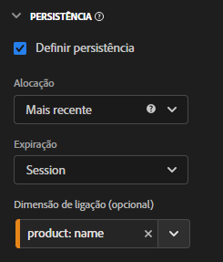
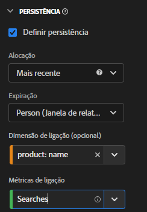

# Uso de dimensões e métricas de ligação

O Customer Journey Analytics oferece várias maneiras de persistir valores de dimensão além da ocorrência em que estão definidos. Um dos métodos de persistência que a Adobe oferece é conhecido como Ligação. Em versões anteriores do Adobe Analytics, esse conceito era conhecido como merchandising.

Embora você possa usar dimensões de ligação com dados de evento de nível superior, esse conceito é melhor usado ao trabalhar com [Matrizes de objetos](/help/use-cases/object-arrays.md). Você pode atribuir uma dimensão a uma parte de um array de objetos sem aplicar a dimensão a todos os atributos em um determinado evento. Por exemplo, você pode atribuir um termo de pesquisa a um produto na matriz de objetos do carrinho de compras sem vincular esse termo de pesquisa ao evento inteiro.

## Exemplo 1: uso de dimensões de ligação para conceder atributos de produto adicionais a uma compra

É possível vincular itens de dimensão em uma matriz de objetos a outra dimensão. Quando o item de dimensão vinculado é exibido, o Customer Journey Analytics recupera a dimensão vinculada e a inclui no evento para você. Considere a seguinte jornada do cliente:

1. Um visitante visualiza a página do produto de uma máquina de lavar.

   ```json
   {
       "PersonID": "1",
       "product": [
           {
               "name": "Washing Machine 2000",
               "color": "white",
               "type": "front loader",
           },
       ],
       "timestamp": 1534219229
   }
   ```

1. O visitante então visualiza a página do produto de uma secadora.

   ```json
   {
       "PersonID": "1",
       "product": [
           {
               "name": "Dryer 2000",
               "color": "neon orange",
           },
       ],
       "timestamp": 1534219502
   }
   ```

1. Por fim, ele efetua uma compra. A cor de cada produto não foi incluída no evento de compra.

   ```json
   {
       "PersonID": "1",
       "orders": 1,
       "product": [
           {
               "name": "Washing Machine 2000",
               "price": 1600,
           },
           {
               "name": "Dryer 2000",
               "price": 499
           }
       ],
       "timestamp": 1534219768
   }
   ```

Se você desejar observar a receita por cor sem uma dimensão de ligação, a dimensão `product.color` persiste e atribui incorretamente o crédito à cor da secadora:

| product.color | receita |
| --- | --- |
| laranja neon | 2099 |

Acesse **[!UICONTROL Visualizações de dados]** e associe a dimensão [!DNL Product Color] a [!DNL Product Name]:



Ao definir esse modelo de persistência, a Customer Journey Analytics anota o nome do produto sempre que a cor do produto é definida. Quando o mesmo nome de produto é reconhecido em um evento subsequente para essa pessoa, a cor do produto também é trazida. Ao vincular a cor do produto ao nome do produto, os mesmos dados seriam semelhantes ao seguinte:

| product.color | receita |
| --- | --- |
| branco | 1600 |
| laranja neon | 499 |

## Exemplo 2: uso de métricas de ligação para vincular um termo de pesquisa a uma compra de produto

Um dos métodos de merchandising mais comuns no Adobe Analytics tem sido o de vincular um termo de pesquisa a um produto para que cada termo de pesquisa receba crédito pelo produto apropriado. Considere a seguinte jornada do cliente:

1. Um visitante chega ao seu site e procura por `boxing gloves`. A métrica de pesquisa é incrementada por um e os três principais resultados de pesquisa são exibidos.

   ```json
   {
       "PersonID": "1",
       "page_name": "Search results",
       "search": "1",
       "search_term": "boxing gloves",
       "product": [
           {
               "name": "Beginner gloves",
           },
           {
               "name": "Tier 3 gloves",
           },
           {
               "name": "Professional gloves",
           }
       ]
   }
   ```

2. Ele encontra um par de luvas de que gosta e o adiciona ao carrinho.

   ```json
   {
       "PersonID": "1",
       "page_name": "Shopping cart",
       "cart_add": "1",
       "product": [
           {
               "name": "Tier 3 gloves",
           }
       ]
   }
   ```

3. O visitante então procura por `tennis racket`. A métrica de pesquisa é incrementada por um e os três principais resultados de pesquisa são exibidos.

   ```json
   {
       "PersonID": "1",
       "page_name": "Search results",
       "search": "1",
       "search_term": "tennis racket",
       "product": [
           {
               "name": "Shock absorb racket",
           },
           {
               "name": "Women's open racket",
           },
           {
               "name": "Extreme racket",
           }
       ]
   }
   ```

4. Ele encontra uma raquete de que gosta e a adiciona ao carrinho.

   ```json
   {
       "PersonID": "1",
       "page_name": "Shopping cart",
       "cart_add": "1",
       "product": [
           {
               "name": "Tier 3 gloves",
           },
           {
               "name": "Shock absorb racket",
           }
       ]
   }
   ```

5. O visitante faz uma terceira pesquisa por `shoes`. A métrica de pesquisa é incrementada por um e os três principais resultados de pesquisa são exibidos.

   ```json
   {
       "PersonID": "1",
       "page_name": "Search results",
       "search": "1",
       "search_term": "shoes",
       "product": [
           {
               "name": "Men's walking shoes",
           },
           {
               "name": "Tennis shoes",
           },
           {
               "name": "Skate shoes",
           }
       ]
   }
   ```

6. Ele encontra um par de sapatos que gosta e o adiciona ao carrinho.

   ```json
   {
       "PersonID": "1",
       "page_name": "Shopping cart",
       "cart_add": "1",
       "product": [
           {
               "name": "Tier 3 gloves",
           },
           {
               "name": "Shock absorb racket",
           },
           {
               "name": "Skate shoes",
           }
       ]
   }
   ```

7. O visitante passa pelo processo de check-out e compra esses três itens.

   ```json
   {
       "PersonID": "1",
       "page_name": "Thank you for your purchase",
       "purchase": "1",
       "product": [
           {
               "name": "Tier 3 gloves",
               "price": "89.99"
           },
           {
               "name": "Shock absorb racket",
               "price": "34.99"
           },
           {
               "name": "Skate shoes",
               "price": "79.99"
           }
       ]
   }
   ```

Se você usar um modelo de alocação que não inclua uma dimensão de ligação com termo de pesquisa, todos os três produtos atribuirão receita a apenas um único termo de pesquisa. Por exemplo, se você usou a alocação [!UICONTROL Original] com a dimensão de termo de pesquisa:

| search_term | receita |
| --- | --- |
| luvas de boxe | US$ 204,97 |

Se você usou a alocação [!UICONTROL Mais recente] com a dimensão de termo de pesquisa, os três produtos ainda atribuirão a receita a um único termo de pesquisa:

| search_term | receita |
| --- | --- |
| sapatos | US$ 204,97 |

Embora este exemplo inclua apenas uma pessoa, muitas pessoas que pesquisam por coisas diferentes podem atribuir erroneamente termos de pesquisa a produtos diferentes. Várias pessoas pesquisam por coisas diferentes, o que torna difícil determinar quais são os melhores resultados de pesquisa.

Agora você pode vincular [!DNL Search Term] a [!DNL Product Name] sempre que a métrica [!DNL Searches] estiver presente para atribuir o termo de pesquisa corretamente à receita.



No Analysis Workspace, o relatório resultante seria semelhante ao seguinte:

| search_term | receita |
| --- | --- |
| luvas de boxe | US$ 89,99 |
| raquete de tênis | US$ 34,99 |
| sapatos | US$ 79,99 |

O Customer Journey Analytics detecta automaticamente a relação entre a dimensão selecionada e a dimensão de ligação. Se a dimensão de ligação estiver em uma matriz de objetos enquanto a dimensão selecionada estiver em um nível superior, será necessária uma métrica de ligação. Uma métrica de ligação atua como um acionador de uma dimensão de ligação, de modo que se vincula apenas aos eventos em que a métrica de ligação está presente. Neste exemplo de implementação acima, a página de resultados da pesquisa sempre inclui uma dimensão de termo de pesquisa e uma métrica de pesquisa.

Definir a dimensão do termo de pesquisa para esse modelo de persistência executa a seguinte lógica:

* Quando a dimensão do termo de pesquisa for definida, verifique a presença de um nome de produto.
* Se o nome do produto não estiver lá, nada será feito.
* Se o nome do produto estiver lá, será verificada a presença da métrica de Pesquisas.
* Se a métrica de Pesquisas não estiver lá, nada será feito.
* Se a métrica de pesquisa estiver lá, vincule o termo de pesquisa a todos os nomes de produtos nesse evento. Ele se copia para o mesmo nível que o nome do produto para esse evento. Neste exemplo, ele é tratado como `product.search_term`.
* Se o mesmo nome de produto for visualizado em um evento subsequente, o termo de pesquisa vinculado também será transportado para esse evento.

## Exemplo 3: vincular o termo de pesquisa de vídeo ao perfil do usuário

Você pode vincular um termo de pesquisa a um perfil de usuário, de modo que a persistência entre perfis permaneça completamente separada. Por exemplo, sua organização executa um serviço de transmissão em que uma conta abrangente pode ter vários perfis. O visitante tem um perfil infantil e um perfil adulto.

1. A conta entra com o perfil infantil e procura por um programa de TV para crianças. Observe que `"ProfileID"` é `2` para representar o perfil infantil.

   ```json
   {
       "PersonID": "7078",
       "ProfileID": "2",
       "Searches": "1",
       "search_term": "kids show"
   }
   ```

1. Ele encontra o programa &quot;Orangey&quot; e reproduz para que seu filho possa assistir.

   ```json
   {
       "PersonID": "7078",
       "ProfileID": "2",
       "ShowName": "Orangey",
       "VideoStarts": "1"
   }
   ```

1. Mais tarde naquela noite, o pai muda para seu perfil adulto e procura por conteúdo adulto para assistir. Observe que `"ProfileID"` é `1` para representar o perfil adulto. Ambos os perfis pertencem à mesma conta, representados pela mesma `"PersonID"`.

   ```json
   {
       "PersonID": "7078",
       "ProfileID": "1",
       "Searches": "1",
       "search_term": "grownup movie"
   }
   ```

1. Ele encontra o programa &quot;Analytics After Hours&quot; e desfruta de uma noite agradável, assistindo ao programa.

   ```json
   {
       "PersonID": "7078",
       "ProfileID": "1",
       "ShowName": "Analytics After Hours",
       "VideoStarts": "1"
   }
   ```

1. No dia seguinte, o programa &quot;Orangey&quot; continua a ser exibido para o filho. Ele não precisa pesquisar, pois já está ciente do programa.

   ```json
   {
       "PersonID": "7078",
       "ProfileID": "2",
       "ShowName": "Orangey",
       "VideoStarts": "1"
   }
   ```

Se você usar a alocação mais recente com a expiração de pessoa, o termo de pesquisa `grownup movie` é atribuído à última exibição do programa para crianças.

| Termo de pesquisa | Início do vídeo |
| --- | --- |
| filme adulto | 2 |
| programa infantil | 1 |

No entanto, se você vincular o `search_term` ao `ProfileID`, cada pesquisa de perfil seria isolada em seu próprio perfil e atribuída aos programas corretos que ela procura.


O Analysis Workspace atribui o segundo episódio de Orangey ao termo de pesquisa `kids show` sem levar em conta as pesquisas de outros perfis.

| Termo de pesquisa | Início do vídeo |
| --- | --- |
| programa infantil | 2 |
| filme adulto | 1 |

## Exemplo 4: avaliar o comportamento de navegação versus comportamento de pesquisa em uma configuração de varejo

É possível vincular valores a dimensões definidas em eventos anteriores. Ao definir uma variável com uma dimensão de ligação, o Customer Journey Analytics leva em consideração o valor persistente. Se esse comportamento for indesejado, é possível ajustar as configurações de persistência da dimensão de vínculo. Considere o exemplo a seguir em que o `product_finding_method` é definido em um evento e vinculado à métrica Adições ao carrinho no evento a seguir.

1. Um visitante pesquisa por `camera`. Observe que nenhum produto está definido nesta página.

   ```json
   {
       "search_term": "camera",
       "product_finding_method": "search"
   }
   ```

1. Ele clica numa câmera que gosta e a adiciona ao carrinho.

   ```json
   {
       "Product": [
           {
               "name": "DSLR Camera"
           }
       ],
       "CartAdd": "1"
   }
   ```

1. O visitante então navega na categoria de cintos masculinos sem realizar uma pesquisa. Observe que nenhum produto está definido nesta página.

   ```json
   {
       "category": "Men's belts",
       "product_finding_method": "browse"
   }
   ```

1. Ele clica num cinto que gosta e o adiciona ao carrinho.

   ```json
   {
       "Product": [
           {
               "name": "Ratchet belt"
           }
       ],
       "CartAdd": "1"
   }
   ```

1. Ele passa pelo processo de check-out e compra esses dois itens.

   ```json
   {
       "Product": [
           {
               "name": "DSLR Camera",
               "price": "399.99"
           },
           {
               "name": "Ratchet belt",
               "price": "19.99"
           }
       ],
       "Purchase": "1"
   }
   ```

Se a persistência for definida como alocação mais recente sem uma dimensão vinculativa, todos os U$ 419,98 da receita serão atribuídos ao método de descoberta `browse`.

| Método de descoberta de produto | Receita |
| --- | --- |
| navegar | 419,98 |

Se a persistência for definida usando a alocação original sem uma dimensão de vinculação, todos os U$ 419,98 da receita serão atribuídos ao método de descoberta `search`.

| Método de descoberta de produto | Receita |
| --- | --- |
| pesquisa | 419,98 |

No entanto, se você vincular o `product_finding_method` à métrica Adições ao carrinho, o relatório resultante atribui cada produto ao método de descoberta correto.

| Método de descoberta de produto | Receita |
| --- | --- |
| pesquisa | 399,99 |
| navegar | 19,99 |


>[!MORELIKETHIS]
>
>[Tutorial de Dimensões de Ligação em Visualizações de Dados](https://experienceleague.adobe.com/docs/customer-journey-analytics-learn/tutorials/data-views/binding-dimensions-in-data-views.html?lang=pt-BR).
