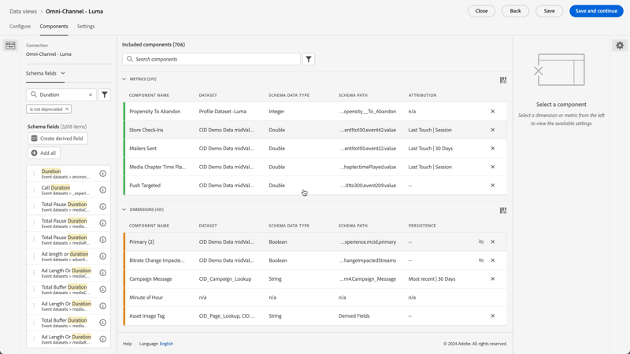
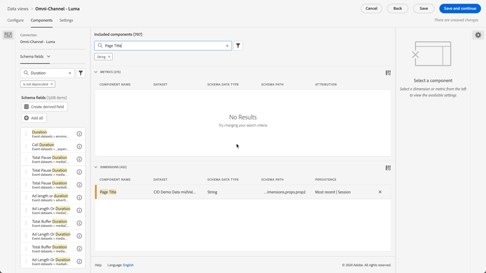

# Casos de uso de visualizações de dados

Esses casos de uso ilustram a flexibilidade e o potencial das visualizações de dados no Customer Journey Analytics.

## Uso de métricas de dimensões de ligação

Consulte o caso de uso [Usar métricas de dimensões de ligação](binding-dimensions-metrics.md) para obter mais detalhes.

## Usar dados de resumo

Consulte o caso de uso [Usar dados de resumo](summary-data.md) para obter mais detalhes.

## Casos de uso da extensão do BI

Consulte os [casos de uso de extensão do BI](bi-extension-usecases.md) para saber como realizar vários casos de uso usando a extensão do Customer Journey Analytics BI.

## Criar uma métrica com base em um campo de esquema de sequência {#string}

Por exemplo, ao criar uma visualização de dados, você pode criar uma métrica [!UICONTROL Pedidos] a partir de um campo de esquema [!UICONTROL Título da página] que seja uma sequência.

1. Na guia **[!UICONTROL Componentes]**, arraste o **[!UICONTROL Título da Página]** para a seção **[!UICONTROL Métricas]** em [!UICONTROL Componentes incluídos].
1. Destaque a métrica que você acabou de arrastar e renomeie-a para `Orders` nas **[!UICONTROL Configurações de componente]** em
1. Abra a seção **[!UICONTROL Incluir/Excluir Valores]** e especifique o seguinte:
   1. Habilitar **[!UICONTROL Definir inclusão/exclusão de valores]**.
   1. Selecione **[!UICONTROL Se todos os critérios forem atendidos]** de **[!UICONTROL Corresponder]**.
   1. Especifique `confirmation`. O texto para **[!UICONTROL page_title]** indica que esta página está relacionada à colocação de um pedido. Depois de revisar todos os títulos de página em que esses critérios são atendidos, um `1` será contado para cada instância. O resultado é uma nova métrica (não uma métrica calculada). Uma métrica que tenha valores incluídos/excluídos pode ser usada em qualquer outra métrica. Essas métricas funcionam com atribuição, segmentos e em qualquer lugar que você puder usar as métricas padrão.

   {width=100%}
1. Você pode especificar ainda mais um modelo de atribuição para essa métrica, como [!UICONTROL Último contato], com uma [!UICONTROL Janela de pesquisa] de [!UICONTROL Sessão].
Você também pode criar outra métrica [!UICONTROL Pedidos] do mesmo campo e especificar um modelo de atribuição diferente. Como [!UICONTROL Primeiro contato] e uma [!UICONTROL Janela de pesquisa] diferente, como [!UICONTROL 30 dias].

Outro exemplo seria usar a ID de pessoa, uma dimensão, como uma métrica para determinar quantas IDs de pessoa sua empresa tem.

## Usar números inteiros como dimensões {#integers}

Anteriormente, os números inteiros eram automaticamente tratados como métricas no Customer Journey Analytics. Agora, os números (incluindo eventos personalizados do Adobe Analytics) podem ser tratados como dimensões. Exemplo:

1. Arraste o inteiro **[!UICONTROL Duration]** para a seção **[!UICONTROL Dimensions]** em [!UICONTROL Componentes incluídos]:
1. Agora você pode adicionar **[!UICONTROL Classificação de valores]** para apresentar essa dimensão de forma segmentada nos relatórios. Sem a classificação, cada instância dessa dimensão seria exibida como um item da linha nos relatórios do Workspace.
   {width=100%}

## Usar dimensões numéricas como métricas em diagramas de fluxo {#numeric}

Você pode usar uma dimensão numérica para inserir métricas na visualização [!UICONTROL &#x200B; Fluxo].

1. Na guia Visualizações de dados [Componentes](https://experienceleague.adobe.com/pt-br/docs/analytics-platform/using/cja-dataviews/create-dataview), arraste o campo de esquema [!UICONTROL Canais de marketing] para a área [!UICONTROL Métricas] em [!UICONTROL Componentes incluídos].
2. No relatório do Espaço de trabalho, esse fluxo mostra [!UICONTROL Canais de marketing] fluindo para [!UICONTROL Pedidos]:

## Fazer filtragem de subeventos {#sub-event}

Esse recurso é especificamente aplicável a campos com base em matriz. A funcionalidade de inclusão/exclusão permite filtrar no nível do subevento, enquanto os segmentos criados no Construtor de segmentos fornecem apenas a segmentação no nível do evento. Você pode fazer a filtragem de subeventos usando incluir/excluir em Visualizações de dados e, em seguida, fazer referência a essa nova métrica/dimensão em um segmento no nível do evento.

Por exemplo, use a funcionalidade de inclusão/exclusão nas Visualizações de dados para focalizar produtos que geraram vendas superiores a US$ 50. Portanto, se você tiver um pedido que inclua uma compra de produto de US$ 50 e uma compra de produto de US$ 25, a funcionalidade de inclusão/exclusão removerá a compra de produto de US$ 25, não o pedido inteiro.

1. Na guia Visualizações de dados [Componentes](https://experienceleague.adobe.com/pt-br/docs/analytics-platform/using/cja-dataviews/create-dataview), arraste o campo de esquema **[!UICONTROL Receita]** para a área **[!UICONTROL Métricas]** em [!UICONTROL Componentes incluídos].
1. Selecione a métrica e configure o seguinte no lado direito:
a. Em **[!UICONTROL Formato]**, selecione **[!UICONTROL Moeda]**.
b. Em **[!UICONTROL Moeda]**, selecione **[!UICONTROL USD]**.
c. Em **[!UICONTROL Incluir/Excluir valores]**, marque a caixa de seleção ao lado de **[!UICONTROL Definir valores de inclusão/exclusão]**.
d. Em **[!UICONTROL Corresponder]**, selecione **[!UICONTROL Se todos os critérios forem atendidos]**.
e. Em **[!UICONTROL Critérios]**, selecione **[!UICONTROL é maior ou igual a]**.
f. Especifique `50` como o valor.

Essas novas configurações permitem que você visualize somente a receita de alto valor e filtre qualquer valor abaixo de US$ 50.

## Usar a configuração [!UICONTROL Nenhuma opção de valor] {#no-value}

Sua empresa pode ter passado tempo treinando os usuários para esperar &quot;Não especificado&quot; para dimensões em relatórios. O padrão para dimensões em visualizações de dados é *Nenhum valor*. No entanto, é possível especificar por dimensão como Nenhum valor deve ser relatado. Consulte as opções **[!UICONTROL Nenhum valor]** para um componente de dimensão.

{width=100%}

## Criar várias métricas com diferentes configurações de atribuição {#attribution}

Usando o recurso **[!UICONTROL Duplicar]** no canto superior direito, para criar várias métricas de Receita Total com diferentes configurações de atribuição, como **[!UICONTROL Primeiro Contato]**, **[!UICONTROL Último Contato]** e **[!UICONTROL Algorítmico]**.

Não se esqueça de renomear cada métrica para refletir as diferenças, como `Total Revenue (Algorithmic)`

{width=100%}

Para obter mais informações sobre outras configurações de visualizações de dados, consulte [Criar visualizações de dados](/help/data-views/create-dataview.md).
Para obter uma visão geral conceitual das visualizações de dados, consulte [Visão geral das visualizações de dados](/help/data-views/data-views.md).

## Relatórios de nova sessão e sessão de retorno {#new-repeat}

Você pode determinar se uma sessão é realmente a primeira sessão de um usuário ou uma sessão de retorno. Com base na janela de relatório que você definiu para essa visualização de dados e uma janela de retrospectiva de 13 meses. Esses relatórios permitem determinar, por exemplo:

* Que porcentagem de seus pedidos vem de sessões novas ou de retorno?

* Para um determinado canal de marketing ou uma campanha específica, você está direcionando usuários pela primeira vez ou usuários de retorno? Como essa escolha influencia as taxas de conversão?

Uma dimensão e duas métricas facilitam esse relatório:

* [Tipo de sessão](https://experienceleague.adobe.com/pt-br/docs/analytics-platform/using/cja-dataviews/component-reference) - Esta dimensão tem dois valores: [!UICONTROL Novo] e [!UICONTROL Retorno]. O item de linha [!UICONTROL Novo] inclui todo o comportamento (ou seja, métricas em relação a essa dimensão) de uma sessão que foi determinada como a primeira sessão definida por uma pessoa. Todo o restante está incluído no item da linha [!UICONTROL Retorno] (supondo que tudo pertença a uma sessão). Quando as métricas não fazem parte de nenhuma sessão, elas se encaixam no intervalo “Não aplicável” dessa dimensão.

* [Primeiras sessões](https://experienceleague.adobe.com/pt-br/docs/analytics-platform/using/cja-dataviews/component-reference). A métrica Primeiras sessões é definida como a primeira sessão definida de uma pessoa na janela de relatórios.

* [Sessões de Retorno](https://experienceleague.adobe.com/pt-br/docs/analytics-platform/using/cja-dataviews/component-reference) A métrica de Sessões de Retorno é o número de sessões que não foram a primeira sessão de uma pessoa.—>

Para acessar os componentes:

1. Acesse o editor de visualização de dados.
1. Selecione a guia **[!UICONTROL Componentes]** e selecione **[!UICONTROL Componentes padrão]** no painel esquerdo.
1. Arraste os componentes **[!UICONTROL Tipo de sessão]**, **[!UICONTROL Primeiras sessões]** e **[!UICONTROL Retornar sessões]** para a visualização de dados.

As novas sessões são relatadas com precisão quase sempre. As únicas exceções são:

* Quando uma primeira sessão ocorreu antes da janela de retrospectiva de 13 meses.  Esta sessão foi ignorada.
* Quando uma sessão passa pela janela de retrospectiva e pela janela de relatórios. Por exemplo, você executa um relatório de 1º de junho de 2022 a 15 de junho de 2022. A janela de retrospectiva se estenderia de 1º de maio de 2021 a 31 de maio de 2022. Se uma sessão tiver início em 30 de maio de 2022 e terminar em 1º de junho de 2022, ela será incluída na janela de retrospectiva. E todas as sessões na janela de relatórios são contadas como sessões de retorno.

## Usar as funcionalidades de Data e Data e hora {#date}

Os esquemas na Adobe Experience Platform contêm campos de [!UICONTROL Data] e [!UICONTROL Data e hora]. As visualizações de dados do Customer Journey Analytics agora são compatíveis com esses campos. Ao arrastar esses campos para uma visualização de dados como uma dimensão, você pode especificar seus [formatos](/help/data-views/component-settings/format.md). Essa configuração de formato determina como os campos são exibidos em relatórios. Por exemplo:

* Para o formato Data, se você selecionar **[!UICONTROL Dia]** com o formato **[!UICONTROL Dia, Mês, Ano]**, um exemplo de saída no relatório pode ser semelhante a: 23 de agosto de 2022.

* Para o formato Data e hora, se você selecionar **[!UICONTROL Minuto do dia]** com o formato **[!UICONTROL Hora:Minuto]**, sua saída pode se parecer com: 20:20.

Datas após 1º de janeiro de 1900 (com a única exceção de 1º de janeiro de 1970) e valores de data-hora após 1º de janeiro de 2000 00:00:00 são suportados.

### Casos de uso de data e data e hora

* Data: uma empresa de viagens coleta a data de partida para viagens como um campo em seus dados. A empresa gostaria de ter um relatório, que compara o [!UICONTROL Dia da semana] de todas as datas de partida coletadas para saber qual é o mais popular. E a empresa gostaria de fazer o mesmo para o [!UICONTROL Mês do Ano].

* Data e hora: uma empresa de varejo coleta o tempo de cada compra de ponto de venda (POS) da loja. Em um determinado mês, a empresa gostaria de entender os períodos de compras mais movimentados por [!UICONTROL Hora do dia].

>[!MORELIKETHIS]
>
>[Data e Data e hora na configuração do componente Formato](/help/data-views/component-settings/format.md)
>

