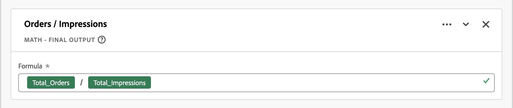

# Diretrizes de campos derivados

Os [campos derivados](/help/data-views/derived-fields/derived-fields.md) da Customer Journey Analytics permitem transformar, classificar e enriquecer dados no momento da consulta sem modificar os conjuntos de dados de origem. Essa flexibilidade pode apresentar complexidade, problemas de desempenho e sobrecarga de manutenção se aplicada sem disciplina.

Este artigo fornece diretrizes (práticas recomendadas, medidas de proteção e armadilhas comuns) para trabalhar com campos derivados. O público-alvo desejado são arquitetos de dados, administradores de produtos e analistas que precisam:

* **Otimizar desempenho**: identifique padrões que retardam a execução de consultas ou atinjam limites do sistema, para selecionar a ferramenta certa para o trabalho:

   * [Campos derivados](/help/data-views/derived-fields/derived-fields.md)
   * [Configurações de visualização de dados](/help/data-views/component-settings/overview.md)
   * [Preparação de dados](https://experienceleague.adobe.com/pt-br/docs/experience-platform/data-prep/home)
   * [Métricas calculadas](/help/components/calc-metrics/calc-metr-overview.md)
   * [Conjuntos de dados de pesquisa](/help/getting-started/cja-upgrade/cja-upgrade-dataset-lookup.md)

* **Aprimoramento da capacidade de manutenção**: crie uma lógica de campo derivada clara, modular e fácil de atualizar.
* **Garanta a correção**: evite erros lógicos comuns na classificação, atribuição e transformação de dados.

Este artigo organiza as seções em torno dos seguintes temas:

* [Campos derivados de alta cardinalidade](#high-cardinality-derived-fields)
* [Cadeias de regras Case When muito complexas](#over-complex-case-when-rule-chains)
* [Uso incorreto](#wrong-usage)
* [Classificações incorretas de métricas e dimensões](#misclassifications-of-metrics-and-dimensions)
* [Armadilhas do canal de marketing e da lógica de campanha](#marketing-channel-and-campaign-logic-pitfalls)
* [Chaves de sequência de caracteres não normalizadas usadas em pesquisas](#non-normalized-string-keys-used-in-lookups)
* [Uso indevido ou excesso de Regex](#regex-misuse-or-overreach)
* [Lógica de estilo da métrica calculada em campos derivados](#calculated-metric-style-logic-in-derived-fields)
* [Uso excessivo de funções Next, Previous ou sequenciais](#over-usage-of-next-or-previous-or-sequential-functions)
* [Ignorando contexto de sessão e nível de pessoa](#ignoring-session-and-person-level-context)
* [Atingir ou se aproximar dos limites de função documentados](#hitting-or-nearing-documented-function-limits)
* [Regras de otimização específicas da visualização de dados](#data-view-specific-optimization-rules)

Cada seção inclui:

* **Padrões** a serem detectados: sinais observáveis nas definições de campos derivados.
* **Diagnóstico de risco**: por que o padrão é problemático. Possíveis motivos são efeitos negativos no **desempenho**, **qualidade dos dados** ou **manutenção**.
* **Recomendações**: etapas concretas para refatorar ou melhorar a implementação.

Essas diretrizes ajudam você a criar implementações eficientes, escaláveis e semanticamente corretas no Customer Journey Analytics. Aplique essas diretrizes ao auditar visualizações de dados existentes, criar novos campos derivados ou criar ferramentas de governança.

## Campos derivados de alta cardinalidade

Esta seção discute os segmentos padrão de visualizações de dados que fazem referência a campos derivados de alta cardinalidade.

**Padrões**

* Os dados visualizam segmentos padrão que fazem referência a um campo derivado criado em uma dimensão de alta cardinalidade (aproximadamente um milhão de valores distintos). Por exemplo: URL de página inteira.
* Operações simples como [Letras minúsculas](/help/data-views/derived-fields/derived-fields.md#lowercase), [Aparar](/help/data-views/derived-fields/derived-fields.md#trim) ou [Letras maiúsculas e minúsculas quando](/help/data-views/derived-fields/derived-fields.md#case-when) verificações na URL da página geralmente são mais caras do que a mesma lógica em campos de baixa cardinalidade.

**Diagnóstico de riscos: desempenho**

* Os segmentos padrão que filtram por campos derivados que tocam o URL da página ou outras dimensões de alta cardinalidade adicionam latência a cada consulta em relação à visualização de dados.

**Recomendações**

* Evite referenciar URLs de página inteira ou componentes de alta cardinalidade de forma semelhante diretamente nos segmentos padrão de visualização de dados. Envie por push a lógica de URL pesada (complexa [Caso Quando](/help/data-views/derived-fields/derived-fields.md#case-when), [Substituição de Regex](/help/data-views/derived-fields/derived-fields.md#regex-replace), várias funções de cadeia de caracteres) upstream para [Preparo de dados](https://experienceleague.adobe.com/pt-br/docs/experience-platform/data-prep/home) ou [conjuntos de dados de pesquisa](/help/getting-started/cja-upgrade/cja-upgrade-dataset-lookup.md), de modo que as classificações resultantes sejam direcionadas para dimensões mais simples e de menor cardinalidade.
* Prefira chaves de cardinalidade mais baixa, como nome de página normalizado, seção do site ou grupos de URL pré-classificados.
* Auditoria periódica de segmentos padrão de visualizações de dados existentes e campos derivados para referências a dimensões de alta cardinalidade (URL da página, IDs da campanha, cadeias de caracteres de consulta brutas) e refatoração para chaves normalizadas ou agrupadas.

## Cadeias de regras Case When muito complexas

Esta seção discute cadeias excessivamente complexas de regras [Case When](/help/data-views/derived-fields/derived-fields.md#case-when).

O Customer Journey Analytics impõe [limites explícitos de função e operador](/help/data-views/derived-fields/derived-fields.md#limitations) por campo derivado (por exemplo, número máximo de operadores, número máximo de funções por tipo). Funções e cadeias excessivamente complexas dentro das funções são mais difíceis de manter e mais propensas a erros.

**Padrões**

* Funções muito grandes [Case When](/help/data-views/derived-fields/derived-fields.md#case-when) com cadeias complexas **[!UICONTROL If]** e **[!UICONTROL Else If]**:
   * Muitas condições (por exemplo: mais de 20 operadores) ou aninhamento profundo (mais de 3 ou 4 níveis de caso [aninhado Quando](/help/data-views/derived-fields/derived-fields.md#case-when) **[!UICONTROL Se]** e lógica **[!UICONTROL Else If]**).
   * Condições repetidas no mesmo campo com valores diferentes.
* Correspondência constante de sequência repetida.

  +++ Exemplo

  

  +++

**Diagnóstico de risco: desempenho, qualidade dos dados, alta manutenção**

* Capacidade de manutenção e risco de erro: a lógica codificada como um bloco de regra monolítica é difícil de depurar e atualizar.
* Possível desempenho e risco de limite: você pode atingir ou se aproximar de [limites de operador ou de função](/help/data-views/derived-fields/derived-fields.md#limitations), especialmente com padrões do tipo classificação.

**Recomendações**

* Dividir em vários campos derivados. Por exemplo, separe a *normalização de campanha* (mapeando identificadores de campanha inconsistentes para um valor canônico) da segmentação de canais em vez de combinar tudo em uma regra gigante.
* Use conjuntos de dados de pesquisa. Muitas condições **[!UICONTROL If Valor _valor_ Critério _critério_ Então definir _valor_ para valor]** são melhor implementadas como um [conjunto de dados de pesquisa](/help/getting-started/cja-upgrade/cja-upgrade-dataset-lookup.md) combinado com a função [Pesquisa](/help/data-views/derived-fields/derived-fields.md#lookup) em vez de usar longas cadeias [Case When](/help/data-views/derived-fields/derived-fields.md#case-when).
* Use filtros do componente de visualização de dados. Se parte da lógica simplesmente filtrar valores incorretos, use [incluir excluir](/help/data-views/component-settings/include-exclude-values.md) no nível do componente de visualização de dados em vez de incorporar essa lógica em um campo derivado.

## Uso incorreto

Esta seção discute o uso incorreto de campos derivados. Especialmente onde as alternativas são uma solução melhor.

>[!NOTE]
>
>Mover a lógica de um campo derivado para uma configuração de componente de visualização de dados por si só não melhora o desempenho da consulta. Ambas as abordagens são compiladas para a mesma lógica derivada subjacente. As recomendações desta seção abordam clareza, governança e reutilização, em vez de velocidade.

**Padrões**

* Um campo derivado replica o comportamento já disponível nas configurações do componente:
   * Normalização de maiúsculas e minúsculas, remoção ou filtragem simples (por exemplo: excluindo `unknown`, `undefined` ou `null`) sem complexidade adicional.
   * Classificação básica em intervalos numéricos.

     +++ Exemplo

     

     +++

     Em vez disso, use a [segmentação de valores](/help/data-views/component-settings/value-bucketing.md) em uma dimensão na visualização de dados.
   * Lógica de persistência ou atribuição codificada com [Próximo ou Anterior](/help/data-views/derived-fields/derived-fields.md#next-or-previous) ou lógica de sequência manual onde as configurações de [atribuição](/help/data-views/component-settings/attribution.md) e [expiração](/help/data-views/component-settings/persistence.md) da exibição de dados seriam suficientes.
   * Uma métrica derivada que simplesmente conta uma métrica existente sob uma condição.

     +++ Exemplo

     

     +++

     Esta abordagem replica o que uma métrica filtrada ou [Incluir valores de exclusão](/help/data-views/component-settings/include-exclude-values.md) poderia alcançar.

**Diagnóstico de risco: qualidade dos dados, alta manutenção**

* Complexidade redundante: campos derivados são usados onde existem recursos de visualização de dados integrados mais simples.
* Risco de governança: outros usuários podem não entender por que um campo derivado existe, em vez de uma configuração nativa. O padrão aumenta a desordem na administração de campos derivados.
* Reutilização reduzida: codificar sinalizadores condicionais como campos derivados dificulta a reutilização de métricas base com filtros diferentes em todos os projetos.

**Recomendações**

* Cortar / Minúsculas: use as configurações dos componentes [Substring](/help/data-views/component-settings/substring.md) e [Behavior](/help/data-views/component-settings/behavior.md), a menos que você precise de transformações combinadas de várias etapas.
* Exclusão de valor: use [Incluir valores de exclusão](/help/data-views/component-settings/include-exclude-values.md) para métricas ou valores de dimensão no nível do componente de visualização de dados, não em um campo derivado.
* Atribuição e persistência: use as configurações de [Persistência](/help/data-views/component-settings/persistence.md) da exibição de dados (**[!UICONTROL Modelo de alocação]** e **[!UICONTROL Expiração]**) para dimensões em vez de simulá-las em um campo derivado com [Próximo ou Anterior](/help/data-views/derived-fields/derived-fields.md#next-or-previous) ou outra lógica sequencial.
* Classificação numérica: mantenha o campo derivado numérico e permita que a visualização de dados crie uma dimensão classificada na parte superior, em vez de rótulos de intervalo codificados em uma cadeia [Case When](/help/data-views/derived-fields/derived-fields.md#case-when).
* Lógica condicional: converter a lógica simples de sinalizador 0 ou 1 em:
   * a métrica original com a lógica de filtro incluir ou excluir valores, conforme aplicada no Analysis Workspace.
   * uma métrica filtrada usando a configuração das configurações do componente visualização de dados.

## Classificações incorretas de métricas e dimensões

Esta seção discute a classificação incorreta de métricas e dimensões.

**Padrões**

* Um campo derivado produz claramente:
   * Saídas numéricas (contagem, proporção ou aritmética), mas o componente é configurado como uma dimensão.
   * Saídas categóricas (rótulos ou cadeias de caracteres), mas o componente é configurado como uma métrica.
* Um campo derivado codifica sinalizadores 0/1 como cadeias de caracteres.

O Customer Journey Analytics permite forçar campos numéricos a dimensões e campos de sequência a métricas no nível de visualização de dados, mas o desalinhamento pode criar relatórios confusos.

**Diagnóstico de riscos: qualidade dos dados**

* Incompatibilidade semântica: o tipo de componente não corresponde à natureza do resultado derivado, tornando o tipo de componente mais difícil de analisar ou agregar corretamente.

**Recomendações**

* Se a saída for numérica:
   * Defina o tipo de componente como **[!UICONTROL Métrica]** na exibição de dados.
   * Se o componente representar uma métrica de subconjunto (por exemplo, **[!UICONTROL Exibições de página de check-out]**), use uma métrica filtrada na exibição de dados, em vez de uma cadeia de caracteres derivada mais uma métrica calculada na parte superior.
* Se a saída for um rótulo:
   * Defina o tipo de componente como **[!UICONTROL Dimension]** e defina as configurações de [Persistência](/help/data-views/component-settings/persistence.md) (**[!UICONTROL Modelo de alocação]** e **[!UICONTROL Expiração]**) adequadamente.

## Armadilhas do canal de marketing e da lógica de campanha

Esta seção discute os erros do canal de marketing e da lógica da campanha.

>[!NOTE]
>
>Considere a simplificação de upstream: use o [Preparo de dados](https://experienceleague.adobe.com/pt-br/docs/experience-platform/data-prep/home), os [conjuntos de dados de pesquisa](/help/getting-started/cja-upgrade/cja-upgrade-dataset-lookup.md) ou as funções de campo derivadas, como o [Classify](/help/data-views/derived-fields/derived-fields.md#classify), para consolidar regras de canal de marketing semelhantes e reduzir o número de operadores na sua lógica do [Case When](/help/data-views/derived-fields/derived-fields.md#case-when). Além disso, limite o número de campos de alta cardinalidade referenciados na lógica de classificação de canal (por exemplo: muitas chaves de parâmetro de consulta distintas), pois esses campos aumentam a cardinalidade e o custo da consulta.

**Padrões**

* Os canais de marketing do Customer Journey Analytics geralmente são implementados usando campos derivados.

   * Campos derivados que implementam canal de marketing ou segmentação de campanha com base em parâmetros de URL, referenciador, página de aterrissagem e muito mais.
   * Ordenação suspeita: uma regra genérica &quot;pega tudo&quot; é exibida antes da aplicação de regras mais específicas.
   * Tratamento incompleto de todas as opções possíveis: nenhuma ramificação explícita para **[!UICONTROL Domínio de Referência não está definida]** ou **[!UICONTROL Parâmetro de Consulta não está definido]**.

**Diagnóstico de riscos: qualidade dos dados**

* Erro de ordenação lógica: regras posteriores na cadeia que potencialmente substituem canais específicos e levam ao tráfego mal classificado.
* Rotulagem incorreta de tráfego direto: o tráfego sem correspondência cai em um canal não intencional ou é rotulado como `Other`.

**Recomendações**

* Imponha a ordenação de prioridade de cima para baixo. Coloque os sinais mais fortes primeiro (por exemplo: domínios internos para excluir parâmetros de campanha paga).
* Inclua um caso final explícito **[!UICONTROL Caso contrário, defina o valor como]**. Defina o fallback como **[!UICONTROL Nenhum valor]** para evitar a substituição de canais anteriores. Não defina o valor como **[!UICONTROL Valor personalizado da cadeia de caracteres]** e depois o **[!UICONTROL Valor personalizado da cadeia de caracteres]** como `Direct`, `None` ou `Unclassified` nesta etapa &quot;catch-all&quot;.
* Use modelos. Use os modelos de campo derivado de canal de marketing, quando possível. Ou pelo menos alinhe a lógica com as práticas recomendadas do canal de marketing da Adobe.

## Chaves de sequência de caracteres não normalizadas usadas em pesquisas

Esta seção discute o uso de chaves de string não normalizadas em pesquisas.

**Padrões**

* Uma função [Pesquisa](/help/data-views/derived-fields/derived-fields.md#lookup) sobre um evento ou campo de perfil que alimenta um conjunto de dados de pesquisa.
* Nenhuma [Letra minúscula](/help/data-views/derived-fields/derived-fields.md#lowercase), [Aparar](/help/data-views/derived-fields/derived-fields.md#trim) ou [Substituição de Regex](/help/data-views/derived-fields/derived-fields.md#regex-replace) precedente padroniza a chave.
* Candidatos comuns: URL, ID da campanha, email, ID da conta.

**Diagnóstico de riscos: qualidade dos dados, alta manutenção**

* Risco de qualidade dos dados: as pesquisas falham quando o uso de maiúsculas e minúsculas ou os espaços em branco são diferentes da tabela de pesquisa, resultando em *sem correspondência* valores e lacunas nos relatórios.

**Recomendações**

* Adicione as funções [Minúsculas](/help/data-views/derived-fields/derived-fields.md#lowercase) e [Cortar](/help/data-views/derived-fields/derived-fields.md#trim) antes da função [Pesquisa](/help/data-views/derived-fields/derived-fields.md#lookup), a menos que haja um motivo documentado para preservar maiúsculas ou minúsculas.
* Se várias transformações já estiverem encadeadas, verifique sua ordem: normalize primeiro e, em seguida, procure.

## Uso indevido ou excesso de Regex

Esta seção discute o uso incorreto ou o excesso de alcance da funcionalidade do regex para campos derivados.

**Padrões**

* [Substituição de Regex](/help/data-views/derived-fields/derived-fields.md#regex-replace) ou as condições baseadas em regex usam padrões amplos; as funções [Caso Quando](/help/data-views/derived-fields/derived-fields.md#case-when) mais simples com **[!UICONTROL Contém]** ou **[!UICONTROL Começa com]** são alternativas melhores.

  +++ Exemplo

  

  

  +++

* Várias condições de regex se sobrepõem ou estão em conflito.
* Uso intenso de regex para analisar URLs em vez de usar a função [Análise de URL](/help/data-views/derived-fields/derived-fields.md#url-parse).

**Diagnóstico de risco: desempenho, qualidade dos dados, alta manutenção**

* Risco de desempenho e capacidade de manutenção: padrões complexos de regex são mais difíceis de depurar e podem ser mais lentos.
* Risco de exatidão: regex excessivamente amplo pode capturar valores não desejados.

**Recomendações**

* Preferir [Análise de URL](/help/data-views/derived-fields/derived-fields.md#url-parse) para elementos de URL padrão (domínio, caminho, parâmetros de consulta) em vez de [Substituição de Regex](/help/data-views/derived-fields/derived-fields.md#regex-replace).
* Para verificações de padrões simples, use a lógica [Caso Quando](/help/data-views/derived-fields/derived-fields.md#case-when) com **[!UICONTROL Contém]**, **[!UICONTROL Começa com]** ou **[!UICONTROL Termina com]**, em vez de expressões regulares com [Substituição de Regex](/help/data-views/derived-fields/derived-fields.md#regex-replace).
* Sinalizar expressões regulares que usam vários grupos aninhados ou alternações para padrões simples. Ou expressões regulares que podem ser substituídas usando funções de sequência de caracteres de campo derivadas.

## Lógica de estilo da métrica calculada em campos derivados

Esta seção discute o uso da lógica de estilo calculada em um campo derivado.

>[!NOTE]
>
>Os campos derivados são avaliados no nível do evento (linha) antes da agregação, enquanto as métricas calculadas do Analysis Workspace operam em valores já agregados. Os cálculos de proporções, médias e estilo distinto podem, portanto, produzir resultados diferentes dependendo se esses cálculos são implementados como um campo derivado ou como uma métrica calculada. Seja deliberado sobre onde mora a aritmética, porque a essência da avaliação muda a resposta.

**Padrões**

* Aritmética pura em campos numéricos dentro de um campo derivado (soma, subtração, divisão) que se parece com uma métrica calculada.

  +++ Exemplos

  

  .

  +++

* Nenhum uso de manipulação ou classificação de sequência; a lógica é puramente numérica.

**Diagnóstico de riscos: qualidade dos dados**

* Questão de governança e design: a aritmética pode estar melhor colocada como:
   * Uma métrica de campo derivada (se desejar que o campo derivado seja uma métrica padrão controlada para todos os usuários).
   * Uma métrica calculada no Analysis Workspace (se a métrica calculada for específica para análise).

**Recomendações**

* Se o resultado aritmético for geralmente útil em usuários e projetos, mantenha o resultado como uma métrica de campo derivada. Verifique se o tipo de componente é métrica e a formatação (moeda, porcentagem) está configurada no nível de visualização de dados.
* Se o resultado for específico de nicho ou analista, mova o resultado para uma métrica calculada e simplifique a visualização de dados.

## Uso excessivo de funções Next, Previous ou sequenciais

Esta seção discute o uso excessivo de [funções Next ou Previous](/help/data-views/derived-fields/derived-fields.md#next-or-previous) ou sequenciais.

**Padrões**

* Um campo derivado usa várias funções [Next ou Previous](/help/data-views/derived-fields/derived-fields.md#next-or-previous) (próximas ao limite por campo documentado).
* [Próximo ou Anterior](/help/data-views/derived-fields/derived-fields.md#next-or-previous) é usado para implementar uma lógica de persistência (por exemplo: carregar uma campanha adiante) em vez de usar a persistência de visualização de dados.

**Diagnóstico de risco: qualidade dos dados, alta manutenção**

* Complexidade e fragilidade: é mais difícil raciocinar sobre a lógica sequencial pesada e ela pode ser quebrada se as regras de sessão ou a ordem forem alteradas.
* Redundância com persistência de dimensão: as configurações de [Persistência](/help/data-views/component-settings/persistence.md) da visualização de dados (modelo de Alocação) na dimensão cobrem melhor alguns casos de uso (por exemplo, canal de Último contato em uma sessão).

**Recomendações**

* Para padrões que se assemelham à persistência padrão (por exemplo, carregar um valor adiante através de uma sessão ou pessoa), use as configurações de [Persistência](/help/data-views/component-settings/persistence.md) da dimensão (**[!UICONTROL Modelo de alocação]** e **[!UICONTROL Expiração]**) na exibição de dados em vez de simular esses padrões com [Próximo ou Anterior](/help/data-views/derived-fields/derived-fields.md#next-or-previous).
* Reserve [Próximo ou Anterior](/help/data-views/derived-fields/derived-fields.md#next-or-previous) para caminhos avançados de várias etapas ou rótulos de funnel que a persistência de dimensão sozinha não pode atingir (por exemplo: concatenação de sequência de canal).

## Ignorando contexto de sessão e nível de pessoa

Esta seção discute como ignorar o contexto de sessão e nível de pessoa ao definir um campo derivado.

>[!NOTE]
>
>Em alguns casos, um segmento com escopo no nível da sessão ou da pessoa no Analysis Workspace pode modelar o comportamento de forma mais simples do que um campo derivado. Considere usar segmentos em vez de campos complexos derivados entre escopos, quando apropriado.

**Padrões**

* Um campo derivado assume implicitamente um [nível de contêiner](/help/getting-started/cja-b2b-concepts-features.md#containers) específico (evento, sessão ou pessoa), mas:

   * O campo derivado não faz referência a atributos de nível de sessão ou pessoa.
   * As configurações de sessão da visualização de dados estão em conflito com a lógica pretendida.

**Diagnóstico de riscos: qualidade dos dados**

* Incompatibilidade conceitual: a semântica de campo derivado pode não corresponder ao nível de agregação que os analistas esperam (por exemplo: um campo baseado em persona que pode mudar com cada evento).

**Recomendações**

* Se a lógica for para ser em nível de sessão: verifique se as [configurações de sessão](/help/data-views/session-settings.md) estão configuradas corretamente e considere usar componentes com escopo de sessão ou resumo no Analysis Workspace ou em uma [ferramenta de BI integrada](/help/data-views/bi-extension.md).
* Se a lógica tiver a intenção de ser no nível de pessoa: use conjuntos de dados de perfil ou conjuntos de dados de pesquisa e faça referência a esses conjuntos de dados em campos derivados.
* Avalie se um segmento com escopo de sessão ou de pessoa no Analysis Workspace alcançaria o mesmo resultado de forma mais simples do que um campo derivado.

## Atingir ou se aproximar dos limites de função documentados

Esta seção discute as implicações de atingir ou se aproximar dos limites de função de campo derivado documentado.

>[!NOTE]
>
>Reduza a dependência em campos de alta cardinalidade dentro de campos derivados complexos quando possível (por exemplo: use chaves normalizadas ou classificações agrupadas) para limitar o custo da consulta e a probabilidade de atingir [limites de operador ou função](/help/data-views/derived-fields/derived-fields.md#limitations).

Máximo de funções e operadores por campo derivado do CustomCustomer Jornada Analytics [documents](/help/data-views/derived-fields/derived-fields.md#limitations), incluindo limites por tipo de função.atterns**

* Um campo derivado usa muitas operações [Lookup](/help/data-views/derived-fields/derived-fields.md#lookup), [Math](/help/data-views/derived-fields/derived-fields.md#math), [Split](/help/data-views/derived-fields/derived-fields.md#split) ou outras funções.
* O número de operadores está próximo dos [limites documentados](/help/data-views/derived-fields/derived-fields.md#limitations) (por exemplo: mais de 70% - 80% das contagens permitidas).

**Diagnóstico de risco: desempenho, alta manutenção**

* Risco de escalabilidade: adições futuras podem falhar ou se comportar inesperadamente se o campo atingir seu limite de função.

**Recomendações**

* Sinalizador pró-ativo quando o uso exceder um limite (por exemplo: > 70% de qualquer limite de função ou operador).
* Divida a lógica em vários campos derivados que são encadeados (por exemplo: um campo derivado A que normaliza uma chave de pesquisa e um campo derivado B que usa a chave de pesquisa normalizada para pesquisar um rótulo).
* Use o Preparo de dados externo ou um conjunto de dados de pesquisa em que classificações especialmente grandes são necessárias.

## Regras de otimização específicas da visualização de dados

Esta seção discute regras de otimização específicas da visualização de dados para campos derivados.

Verifique também a configuração da visualização de dados para cada componente derivado.

**Padrões**

* Uma dimensão derivada tem atribuição padrão (por exemplo: Último contato com expiração de sessão), mas o nome do campo derivado implica uma semântica diferente (por exemplo: `First Campaign of Visit`, `Original Source`).
* Uma dimensão derivada tem configurações padrão de [Persistência](/help/data-views/component-settings/persistence.md) (por exemplo: **[!UICONTROL Alocação mais recente]** com expiração de **[!UICONTROL Sessão]**), mas o nome da dimensão derivada implica uma semântica diferente (por exemplo, `First Campaign of Visit` ou `Original Source`).

**Diagnóstico de riscos: qualidade dos dados**

* Incompatibilidade semântica: o rótulo da dimensão sugere um comportamento de alocação ou expiração diferente (por exemplo, alocação Original ou expiração no nível da Pessoa) do que está realmente configurado.
* Essa incompatibilidade aumenta o risco de os analistas interpretarem incorretamente os relatórios ou compararem componentes que parecem semelhantes por nome, mas usam modelos de alocação diferentes.

**Recomendações**

* Ajuste o [modelo de alocação e a expiração](/help/data-views/component-settings/persistence.md) nessa dimensão para alinhar nome e comportamento. Por exemplo, uma dimensão de campo derivada chamada `Original Source` deve usar a atribuição de Primeiro contato com expiração definida como Pessoa.
* Ajuste o **[!UICONTROL Modelo de alocação]** e a **[!UICONTROL Expiração]** nas configurações de [Persistência](/help/data-views/component-settings/persistence.md) da dimensão para alinhar o nome e o comportamento. Por exemplo, `Original Source` deve definir o **[!UICONTROL Modelo de alocação]** como **[!UICONTROL Original]** com **[!UICONTROL Expiração]** definido como **[!UICONTROL Pessoa]**.
