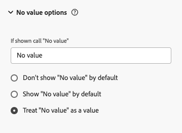

# Como lidar com Nenhum valor

Ao trabalhar com o Customer Journey Analytics, encontrar entradas de **[!UICONTROL Nenhum valor]** em relatórios e painéis levanta questões importantes sobre a qualidade dos dados, os métodos de coleta e a precisão dos relatórios. Essas instâncias precisam de monitoramento cuidadoso, pois revelam lacunas ocultas na coleta de dados. O desafio está em distinguir entre dois cenários: quando **[!UICONTROL Sem valor]** as entradas precisam de investigação por provedores de fonte de dados e quando **[!UICONTROL Sem valor]** as entradas refletem o fluxo natural de dados para o Customer Journey Analytics. Entender essa distinção é fundamental para manter operações de análise eficientes. Este guia ajuda você a tomar decisões informadas sobre **[!UICONTROL Nenhum valor]** aparências na implementação do Customer Journey Analytics.

## Compreender que não há valor

**[!UICONTROL Nenhum valor]** aparece quando uma dimensão não tem um valor correspondente para um evento que contém uma métrica. Ver **[!UICONTROL Nenhum valor]** em um relatório nem sempre é um problema. Em muitos casos, ela reflete a estrutura esperada do conjunto de dados.

Os itens do Dimension se encaixam em uma das três categorias:

* **Esperado [!UICONTROL Nenhum valor]**: um resultado natural de como os usuários se movem pelos seus dados, como visitantes que ainda não entraram ou dimensões que não se aplicam a todos os eventos
* **Problema [!UICONTROL Sem valor]**: o resultado de uma falha na coleta de dados ou de um erro de implementação, em que existe um valor, mas ele está ausente
* **Valor válido**: a dimensão capturou um valor com êxito

O diagrama a seguir mostra como o Customer Journey Analytics chega a cada uma dessas categorias conforme os dados são movidos da origem para o Adobe Experience Platform.

O fluxograma ilustra como as avaliações do Customer Journey Analytics se concentram nos dados recebidos, verificando primeiro a presença de valores e determinando se os valores ausentes são esperados ou problemáticos. Essa avaliação clara ajuda os administradores e analistas a diferenciarem entre **[!UICONTROL Nenhum valor]** casos que exigem investigação de origem e aqueles que representam operações normais.

## Quando Nenhum valor é esperado

Os motivos a seguir são comuns e esperados para **[!UICONTROL Nenhum valor]** aparecer em um relatório:

* Uma dimensão se aplica somente a cenários específicos, como fonte de tráfego ou tipo de dispositivo
* Um visitante pela primeira vez ainda não recebeu um identificador
* Um visitante está em um estado pré-logon e não forneceu informações de usuário
* Um recurso ou interação de produto não se aplica a uma jornada de usuário específica
* Um cenário entre dispositivos não transporta valores de dimensão entre dispositivos

Nesses casos, **[!UICONTROL Nenhum valor]** indica onde um usuário está em sua jornada de autenticação, durante a transição de um estado não identificado para um estado identificado, conforme ilustrado abaixo.

## Quando Nenhum valor precisa de atenção

Investigar **[!UICONTROL Nenhum valor]** entradas quando elas resultarem de qualquer um dos seguintes:

**Problemas de implementação na fonte de dados:**

* Elementos de dados ausentes ou valores nulos
* Mapeamento de variável incorreto
* Uma camada de dados configurada incorretamente
* Falha na coleta de dados
* Uma incompatibilidade entre os dados de entrada e o esquema definido

**Problemas de qualidade de dados:**

* Código de rastreamento corrompido
* Coleta de dados incompleta
* Falhas de integração
* Erros introduzidos durante a transformação de dados
* Interrupções no pipeline de dados

## Gerenciar Nenhum valor nas configurações de visualização de dados

As configurações de exibição de dados fornecem controle sobre como **[!UICONTROL Nenhum valor]** itens são exibidos nos relatórios, incluindo renomeação do rótulo, exibição ou ocultação dos itens por padrão e tratamento de **[!UICONTROL Nenhum valor]** como um valor de sequência de caracteres legítimo. Consulte [Configurações do componente Opções de valor nulo](/help/data-views/component-settings/no-value-options.md) para obter a lista completa de configurações e como elas afetam as distribuições percentuais, a filtragem e a segmentação.

Ao definir essas configurações, avalie seus requisitos de relatórios e como a presença de **[!UICONTROL Nenhum valor]** afeta sua análise. Considere os efeitos imediatos na visibilidade dos dados e os impactos a longo prazo na análise de tendências e na consistência dos relatórios. Configurações bem escolhidas melhoram a clareza dos dados, enquanto mantêm os insights comerciais acessíveis e acionáveis, independentemente de como as entradas de **[!UICONTROL Nenhum valor]** aparecem em seus relatórios. A configuração ideal equilibra a representação de dados com necessidades analíticas práticas, criando um ambiente de relatórios que fornece insights precisos e significativos mesmo quando dados de **[!UICONTROL Nenhum valor]** estão presentes.

A tabela a seguir resume as várias configurações disponíveis.

<table>
<thead>
<tr>
<th>Categoria</th>
<th>Configuração</th>
<th>O que faz</th>
<th>Impacto</th>
</tr>
</thead>
<tbody>
<tr>
<td rowspan="2">Mostrar opções</td>
<td></td>
<td rowspan="2">Pode ser incluído ou excluído por meio da seleção de caixas de seleção no filtro de pesquisa de tabela de forma livre.</td>
<td rowspan="2">Visibilidade</td>
</tr>
<tr>
<td></td>
</tr>
<tr>
<td rowspan="2">Nomeação personalizada</td>
<td></td>
<td rowspan="2">Afeta a exibição do valor da dimensão de relatório e possivelmente a consolidação do valor e a agregação de métricas.</td>
<td rowspan="2">Nomenclatura</td>
</tr>
<tr>
<td></td>
</tr>
<tr>
<td rowspan="3">Opções de tratamento</td>
<td></td>
<td>Aplica-se somente a dimensões não numéricas.
Afeta a atribuição e a opção incluir **[!UICONTROL Nenhum valor]** no filtro de pesquisa da tabela de forma livre.</td>
<td>Manuseio de valor e visibilidade</td>
</tr>
<tr>
<td rowspan="2">Suporte para dimensão numérica:  </td>
<td rowspan="2">Pode ser incluído ou excluído por meio da seleção de caixas de seleção no filtro de pesquisa de tabela de forma livre</td>
<td rowspan="2">Visibilidade</td>
</tr>
<tr>
</tr>
</tbody>
</table>

### Se exibido, chamar de &quot;Valor nulo&quot;

Esta configuração permite personalizar como as linhas **[!UICONTROL Sem valor]** são exibidas nos relatórios. Você pode inserir um nome personalizado para o item de dimensão **[!UICONTROL Sem valor]** no campo de texto, fornecendo um contexto mais significativo por meio de **[!UICONTROL Se exibido, chame &quot;Sem valor&quot;]**. Usar termos claros e intuitivos, em vez de `No value`, ajuda sua organização a entender melhor os valores do relatório. Embora não seja possível usar **[!UICONTROL Nenhum valor]** diretamente como uma cadeia de caracteres em segmentos, você pode obter o mesmo efeito usando o operador **[!UICONTROL não existe]**.

Você pode substituir `No value` por termos descritivos como `Pre-login User` para status de autenticação, `No Customer Tier` para clientes sem camadas ou `No Tracked Marketing Channel` para fontes de marketing não identificadas. Isso cria relatórios mais intuitivos. O `Pre-login User` mostra claramente onde um cliente está em sua jornada, enquanto o `No Customer Tier` fornece um contexto específico. Lembre-se de que a descrição escolhida se aplica a todas as instâncias de **[!UICONTROL Nenhum valor]** dessa dimensão. Portanto, selecione termos que reflitam com precisão todos os cenários nos quais os valores de dimensão estão ausentes.

### Não mostrar Nenhum valor por padrão

Esta configuração determina se as linhas **[!UICONTROL Sem valor]** devem ser ocultadas por padrão nos relatórios. Quando ativadas, essas linhas são filtradas inicialmente, mas ainda podem ser exibidas em uma tabela de forma livre, se necessário, por meio da seleção da caixa de seleção no filtro de pesquisa da tabela de forma livre. Observe que ocultar as linhas **[!UICONTROL Nenhum valor]** afeta a distribuição percentual dos valores restantes, pois as porcentagens são recalculadas somente com base nos itens visíveis.

### Mostrar Nenhum valor por padrão

Esta configuração controla se **[!UICONTROL Nenhum valor]** aparece por padrão nos relatórios. Quando habilitadas, as entradas **[!UICONTROL Nenhum valor]** ficam visíveis, embora os usuários possam excluí-las usando a caixa de seleção no filtro de pesquisa de tabela de forma livre. A inclusão ou exclusão de **[!UICONTROL Nenhuma linha de valor]** afeta as distribuições de porcentagem, pois as porcentagens são calculadas somente com base nos itens visíveis.

### Tratar Nenhum valor como um valor

Esta configuração trata **[!UICONTROL Nenhum valor]** como um valor de sequência de caracteres (exceto para dimensões numéricas), permitindo que você personalize sua representação como um valor de dimensão. Essa personalização afeta a atribuição e a opção **[!UICONTROL Não incluir valor]** no filtro de pesquisa da tabela de forma livre. Lembre-se de que, ao atribuir um valor de sequência personalizado, todos os valores correspondentes no conjunto de dados são consolidados sob o mesmo valor de sequência de caracteres de dimensão.

A configuração **[!UICONTROL Tratar &quot;Nenhum valor&quot; como um valor]** tem uma finalidade diferente de mostrar **[!UICONTROL Nenhum valor]** por padrão. Ao mostrar por padrão somente controla a visibilidade, o tratamento como um valor altera a forma como o Customer Journey Analytics lida logicamente com essas entradas. Veja por que essa distinção é importante:

* Ele permite um controle mais granular na filtragem e segmentação, tornando **[!UICONTROL Nenhum valor]** um valor de dimensão distinto e acionável.
* Ela mantém atribuição e representação consistentes em toda a análise, tratando **[!UICONTROL Nenhum valor]** como um valor de dimensão legítimo em modelos de atribuição e visualizações.

Você trata **[!UICONTROL Nenhum valor]** como um valor quando:

* A ausência de dados em si é importante para sua análise (como estados pré-logon ou tráfego não atribuído).
* Você precisa criar segmentos ou métricas calculadas que direcionem ou excluam especificamente esses casos.

Por outro lado, mostrar **[!UICONTROL Nenhum valor]** por padrão é mais adequado quando você precisa de visibilidade básica de dados ausentes, sem a complexidade da lógica e atribuição adicionais que acompanham seu tratamento como um valor.

### Sem suporte de valor para dimensões numéricas

Para dimensões numéricas, várias opções de configuração estão disponíveis. Nas configurações das dimensões de Exibição de dados, é possível configurar todas as opções de **[!UICONTROL Nenhum valor]** exceto **[!UICONTROL Tratar &quot;Nenhum valor&quot; como um valor]**. Você também pode gerenciar **[!UICONTROL Incluir &quot;Nenhum valor&quot;]** para dimensões numéricas ao marcar uma caixa de seleção no filtro de pesquisa de tabela de forma livre. Ao criar segmentos, você pode usar os operadores **[!UICONTROL existe]** ou **[!UICONTROL não existe]** com dimensões numéricas.

### Sem dimensões de valor e nível de item

Algumas dimensões se aplicam no nível do item em uma matriz, em vez de no nível superior de um evento. Por exemplo, `productListItems.SKU`, tem um valor somente quando existe um item da lista de produtos para esse evento. Esta diferença no intervalo de dados altera o comportamento de **[!UICONTROL Nenhum valor]**.

Para uma dimensão de nível superior padrão, o Customer Journey Analytics pode colocar uma métrica em um bucket de **[!UICONTROL Nenhum valor]** sempre que essa dimensão estiver ausente ou tiver um valor nulo em um evento que transporta uma métrica. Uma dimensão em nível de item depende do item existente em primeiro lugar. Se um evento transporta uma métrica, mas não tem itens de lista de produtos, o Customer Journey Analytics não tem nenhuma linha para anexar essa métrica ou marcar os dados como **[!UICONTROL Nenhum valor]**.

O Customer Journey Analytics não cria um espaço reservado ou uma linha vazia para matrizes ausentes ou vazias. Como resultado, você pode definir suas configurações de visualização de dados **[!UICONTROL Sem valor]** corretamente e ainda não ver as entradas de **[!UICONTROL Nenhum valor]** em um relatório no nível do item, como um detalhamento de SKU. A falta de entradas é uma diferença de granularidade de dados e não um problema de configuração. As configurações de **[!UICONTROL Nenhum valor]** regulam como as linhas existentes são exibidas, e uma matriz vazia significa que não existem linhas nesse nível de granularidade de dados.

Quando as contagens no nível do item **[!UICONTROL Nenhum valor]** parecerem menores que o esperado, verifique se a ausência de dados de matriz explica a lacuna antes de assumir que a configuração de visualização de dados precisa de ajuste.

## Práticas recomendadas

Depois de identificar instâncias problemáticas **[!UICONTROL Sem valor]**, será necessário desenvolver e implementar uma estratégia de correção. Essa correção pode ser feita de duas maneiras:

* Ajustar configurações de opção do componente de Exibição de Dados **[!UICONTROL Sem Valor]** ou
* Corrija problemas na fonte de coleta de dados.

Escolha sua abordagem cuidadosamente, pois cada caminho tem implicações diferentes para correções rápidas e qualidade dos dados a longo prazo. Sua implementação segue um processo metódico que corrige problemas atuais e impede problemas futuros. O sucesso depende do planejamento, da execução sistemática e do monitoramento contínuo.

Estas são as principais considerações estratégicas para seu plano de remediação:

### Evitar problemas de Valor nulo

* Validar dados antes que sejam processados
* Definir valores de dimensão padrão onde apropriado (nunca para uma ID de pessoa)
* Documente os cenários em que **[!UICONTROL Nenhum valor]** é esperado
* Adicionar verificações de qualidade no ponto de coleta de dados
* Monitore a conformidade com seu modelo de dados
* Registrar erros durante a coleta de dados
* Adicionar testes automatizados para sua implementação
* Exigir campos de esquema em que um valor sempre existe

### Validar Nenhum valor em seus relatórios

* Criar segmentos que isolam padrões de **[!UICONTROL Nenhum valor]**
* Crie um painel de controle de qualidade que monitore tendências de **[!UICONTROL Nenhum valor]** ao longo do tempo
* Configurar alertas que controlam alterações no volume **[!UICONTROL Sem valor]**
* Gerar relatórios automatizados que destacam alterações significativas no padrão
* Referência cruzada **[!UICONTROL Nenhum padrão de valor]** em dimensões relacionadas
* Realizar auditorias regulares da configuração da visualização de dados
* Manter um log de alterações da sua estratégia **[!UICONTROL Sem valor]**
* Criar procedimentos operacionais e modelos de documentação padrão para os participantes

## Conclusão

Nem toda entrada **[!UICONTROL Nenhum valor]** sinaliza um problema. Interpretar **[!UICONTROL Nenhum valor]** corretamente requer entender sua arquitetura de dados do Adobe Experience Platform e do Customer Journey Analytics, bem como a maneira como os usuários se movem pelo seu produto ou site. Em vez de tentar eliminar cada instância de **[!UICONTROL Sem valor]**, estabeleça regras documentadas em toda a organização que distingam o esperado **[!UICONTROL Sem valor]** do problemático **[!UICONTROL Sem valor]**, com base nas suas próprias jornadas de usuário e casos de negócios.

>[!MORELIKETHIS]
>
>[O manual completo para manipulação de **[!UICONTROL Nenhum valor]** no Adobe Customer Journey Analytics](https://experienceleaguecommunities.adobe.com/adobe-analytics-3/the-complete-playbook-for-handling-no-value-in-adobe-cja-12769)
