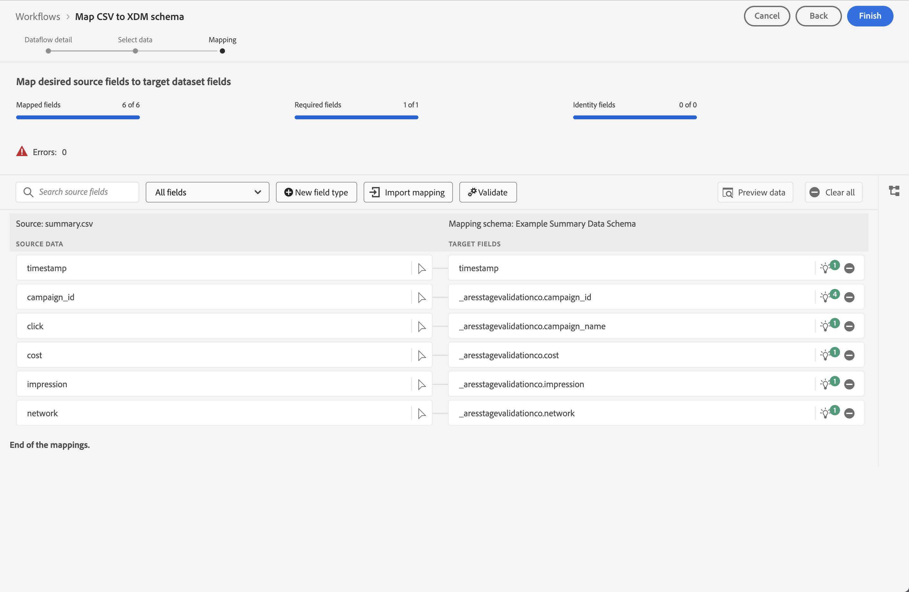

# Usar dados de resumo

Esse caso de uso ajuda você a entender como usar os dados de resumo em seus relatórios e análises. O caso de uso detalha todas as etapas necessárias para usar dados de resumo no Customer Journey Analytics:

- [Assimilar](#ingest) dados de resumo e outras fontes de dados na Experience Platform.
- Configure sua [Conexão](#connection) para os dados de resumo e outras fontes de dados.
- Configure sua [Visualização de dados](#data-view) para combinar suas fontes de dados.
- Relate e analise no [Workspace](#workspace) seus dados combinados.

O caso de uso fornece dados de exemplo para dados de resumo, dados de evento e dados de pesquisa. Todos os dados contêm valores aleatórios.

## Assimilar

Você usa os seguintes exemplos de dados de resumo para este caso de uso, mostrando os dados de resumo para executar campanhas no Facebook.

+++Dados de resumo

| _id | campaign_name | custo | impressão | campaign_id | rede | ad_group | carimbo de data e hora |
|---|---|---:|---:|---|---|---|---|
| 1 | 123 Campanha | 100 | 5000 | abc123 | facebook | abc-adgroup | 07-2024-18T18:20:39.000Z |
| 2 | 123 Campanha | 50 | 4000 | def123 | facebook | def-adgroup | 07-2024-18T18:20:39.000Z |
| 3 | 123 Campanha | 125 | 6000 | ghi123 | facebook | ghi-adgroup | 07-2024-18T18:20:39.000Z |
| 4 | Campanha 456 | 25 | 2500 | abc456 | facebook | abc-adgroup | 07-2024-18T18:20:39.000Z |
| 5 | Campanha 456 | 10 | 1000 | def456 | facebook | def-adgroup | 07-2024-18T18:20:39.000Z |
| 6 | Campanha 456 | 115 | 5500 | ghi456 | facebook | ghi-adgroup | 07-2024-18T18:20:39.000Z |
| 7 | Campanha 789 | 200 | 9000 | abc789 | facebook | abc-adgroup | 07-2024-18T18:20:39.000Z |
| 8 | Campanha 789 | 20 | 2000 | def789 | facebook | def-adgroup | 07-2024-18T18:20:39.000Z |
| 9 | Campanha 789 | 225 | 12000 | ghi789 | facebook | ghi-adgroup | 07-2024-18T18:20:39.000Z |
| 10 | Campanha 987 | 125 | 10000 | abc987 | facebook | abc-adgroup | 07-2024-18T18:20:39.000Z |
| 11 | Campanha 987 | 120 | 15000 | def987 | facebook | def-adgroup | 07-2024-18T18:20:39.000Z |
| 12 | Campanha 987 | 315 | 22500 | ghi987 | facebook | ghi-adgroup | 07-2024-18T18:20:39.000Z |
| 13 | Campanha 654 | 325 | 20000 | abc654 | facebook | abc-adgroup | 07-2024-18T18:20:39.000Z |
| 14 | Campanha 654 | 320 | 25000 | def654 | facebook | def-adgroup | 07-2024-18T18:20:39.000Z |
| 15 | Campanha 654 | 315 | 22500 | ghi654 | facebook | ghi-adgroup | 07-2024-18T18:20:39.000Z |
| 16 | Campanha 321 | 25 | 2000 | abc321 | facebook | abc-adgroup | 07-2024-18T18:20:39.000Z |
| 17 | Campanha 321 | 20 | 2500 | def321 | facebook | def-adgroup | 07-2024-18T18:20:39.000Z |
| 18 | Campanha 321 | 15 | 2250 | ghi321 | facebook | ghi-adgroup | 07-2024-18T18:20:39.000Z |

+++

Para usar os dados de resumo no Customer Journey Analytics, em um relatório ou como parte da análise de dados no Workspace, é necessário

- um schema de resumo no Experience Platform,
- um conjunto de dados de resumo no Experience Platform,
- uma conexão no Customer Journey Analytics configurada para usar o conjunto de dados de resumo,
- uma visualização de dados no Customer Journey Analytics, configurada corretamente com métricas e dimensões para os dados de resumo.

Use esses dados de resumo junto com um conjunto de dados para dados do evento e um conjunto de dados para dados de pesquisa.

+++Dados do evento

Os dados do evento estão disponíveis no Conjunto de dados de exemplo do evento. Os dados de amostra são assim:

| carimbo de data e hora | _id | page_name | person_id | tracking_code | ordens | revenue_amount |
|---|---:|---|---|---|---:|---:|
| 2024-07-18T19:15:39+00:00 | 1 | home page | person-1abc123 | abc123 |  |  |
| 2024-07-18T19:15:39+00:00 | 2 | página de confirmação | person-1abc123 |  | 1 | 174,25 |
| 2024-07-18T19:15:39+00:00 | 3 | home page | person-2def123 | def123 |  |  |
| 2024-07-18T19:15:39+00:00 | 4 | home page | person-3ghi123 | ghi123 |  |  |
| 2024-07-18T19:15:39+00:00 | 5 | página de confirmação | person-3ghi123 |  | 1 | 149,25 |
| 2024-07-18T19:15:39+00:00 | 6 | home page | person-4abc456 | abc456 |  |  |
| 2024-07-18T19:15:39+00:00 | 7 | home page | person-5def456 | def456 |  |  |
| 2024-07-18T19:15:39+00:00 | 8 | home page | pessoa-6ghi456 | ghi456 |  |  |
| 2024-07-18T19:15:39+00:00 | 9 | página de confirmação | pessoa-6ghi456 |  | 1 | 159,25 |
| 2024-07-18T19:15:39+00:00 | 10 | home page | person-7abc789 | abc789 |  |  |
| 2024-07-18T19:15:39+00:00 | 11 | home page | pessoa-8def789 | def789 |  |  |
| 2024-07-18T19:15:39+00:00 | 12 | home page | pessoa-9ghi789 | ghi789 |  |  |
| 2024-07-18T19:15:39+00:00 | 13 | página de confirmação | pessoa-9ghi789 |  | 1 | 124,25 |
| 2024-07-18T19:15:39+00:00 | 14 | home page | person-10abc987 | abc987 |  |  |
| 2024-07-18T19:15:39+00:00 | 15 | home page | person-11def987 | def987 |  |  |
| 2024-07-18T19:15:39+00:00 | 16 | home page | person-12ghi987 | ghi987 |  |  |
| 2024-07-18T19:15:39+00:00 | 17 | home page | person-13abc654 | abc654 |  |  |
| 2024-07-18T19:15:39+00:00 | 18 | home page | person-14def654 | def654 |  |  |
| 2024-07-18T19:15:39+00:00 | 19 | home page | person-15ghi654 | ghi654 |  |  |
| 2024-07-18T19:15:39+00:00 | 20 | página de confirmação | person-15ghi654 |  | 1 | 174,25 |
| 2024-07-18T19:15:39+00:00 | 21 | home page | person-16abc321 | abc321 |  |  |
| 2024-07-18T19:15:39+00:00 | 22 | home page | person-17def321 | def321 |  |  |
| 2024-07-18T19:15:39+00:00 | 23 | home page | pessoa-18ghi321 | ghi321 |  |  |
| 2024-07-18T19:15:39+00:00 | 24 | home page | person-19abc123 | abc123 |  |  |
| 2024-07-18T19:15:39+00:00 | 25 | home page | person-20def123 | def123 |  |  |
| 2024-07-18T19:15:39+00:00 | 26 | home page | person-21ghi123 | ghi123 |  |  |
| 2024-07-18T19:15:39+00:00 | 27 | página de confirmação | person-21ghi123 |  | 1 | 149,25 |
| 2024-07-18T19:15:39+00:00 | 28 | home page | person-22abc456 | abc456 |  |  |
| 2024-07-18T19:15:39+00:00 | 29 | home page | person-23def456 | def456 |  |  |
| 2024-07-18T19:15:39+00:00 | 30 | home page | person-24ghi456 | ghi456 |  |  |
| 2024-07-18T19:15:39+00:00 | 31 | home page | person-25abc789 | abc789 |  |  |
| 2024-07-18T19:15:39+00:00 | 32 | página de confirmação | person-25abc789 |  | 1 | 139,25 |
| 2024-07-18T19:15:39+00:00 | 33 | home page | person-26abc987 | abc987 |  |  |
| 2024-07-18T19:15:39+00:00 | 34 | home page | person-27def987 | def987 |  |  |
| 2024-07-18T19:15:39+00:00 | 35 | home page | person-28ghi987 | ghi987 |  |  |
| 2024-07-18T19:15:39+00:00 | 36 | home page | person-29abc654 | abc654 |  |  |
| 2024-07-18T19:15:39+00:00 | 37 | página de confirmação | person-29abc654 |  | 1 | 124,25 |
| 2024-07-18T19:15:39+00:00 | 38 | home page | person-30def654 | def654 |  |  |
| 2024-07-18T19:15:39+00:00 | 39 | home page | person-31ghi654 | ghi654 |  |  |
| 2024-07-18T19:15:39+00:00 | 40 | home page | person-32abc321 | abc321 |  |  |
| 2024-07-18T19:15:39+00:00 | 41 | home page | person-33ghi456 | ghi456 |  |  |
| 2024-07-18T19:15:39+00:00 | 42 | página de confirmação | person-33ghi456 |  | 1 | 174,25 |
| 2024-07-18T19:15:39+00:00 | 43 | home page | person-34abc789 | abc789 |  |  |
| 2024-07-18T19:15:39+00:00 | 44 | home page | person-35def789 | def789 |  |  |
| 2024-07-18T19:15:39+00:00 | 45 | home page | person-36ghi789 | ghi789 |  |  |
| 2024-07-18T19:15:39+00:00 | 46 | página de confirmação | person-36ghi789 |  | 1 | 149,25 |
| 2024-07-18T19:15:39+00:00 | 47 | home page | person-37abc987 | abc987 |  |  |
| 2024-07-18T19:15:39+00:00 | 48 | home page | person-38def987 | def987 |  |  |
| 2024-07-18T19:15:39+00:00 | 49 | home page | person-39ghi987 | ghi987 |  |  |
| 2024-07-18T19:15:39+00:00 | 50 | home page | person-40abc654 | abc654 |  |  |
| 2024-07-18T19:15:39+00:00 | 51 | página de confirmação | person-40abc654 |  | 1 | 124,25 |
| 2024-07-18T19:15:39+00:00 | 52 | home page | person-41def654 | def654 |  |  |
| 2024-07-18T19:15:39+00:00 | 53 | home page | person-42ghi654 | ghi654 |  |  |
| 2024-07-18T19:15:39+00:00 | 54 | home page | person-43abc321 | abc321 |  |  |
| 2024-07-18T19:15:39+00:00 | 55 | home page | person-44def321 | def321 |  |  |
| 2024-07-18T19:15:39+00:00 | 56 | home page | person-45ghi321 | ghi321 |  |  |
| 2024-07-18T19:15:39+00:00 | 57 | home page | person-46abc123 | abc123 |  |  |
| 2024-07-18T19:15:39+00:00 | 58 | página de confirmação | person-46abc123 |  | 1 | 174,25 |
| 2024-07-18T19:15:39+00:00 | 59 | home page | person-47def123 | def123 |  |  |
| 2024-07-18T19:15:39+00:00 | 60 | home page | person-48ghi123 | ghi123 |  |  |
| 2024-07-18T19:15:39+00:00 | 61 | home page | person-49abc456 | abc456 |  |  |
| 2024-07-18T19:15:39+00:00 | 62 | home page | person-50def456 | def456 |  |  |
| 2024-07-18T19:15:39+00:00 | 63 | home page | person-51ghi456 | ghi456 |  |  |
| 2024-07-18T19:15:39+00:00 | 64 | home page | person-52abc789 | abc789 |  |  |
| 2024-07-18T19:15:39+00:00 | 65 | página de confirmação | person-52abc789 |  | 1 | 149,25 |
| 2024-07-18T19:15:39+00:00 | 66 | home page | person-53abc987 | abc987 |  |  |
| 2024-07-18T19:15:39+00:00 | 67 | home page | person-54def987 | def987 |  |  |
| 2024-07-18T19:15:39+00:00 | 68 | home page | person-55ghi987 | ghi987 |  |  |
| 2024-07-18T19:15:39+00:00 | 69 | página de confirmação | person-55ghi987 |  | 1 | 124,25 |
| 2024-07-18T19:15:39+00:00 | 70 | home page | person-56abc123 | abc123 |  |  |
| 2024-07-18T19:15:39+00:00 | 71 | home page | person-57def123 | def123 |  |  |
| 2024-07-18T19:15:39+00:00 | 72 | página de confirmação | person-57def123 |  | 1 | 174,25 |
| 2024-07-18T19:15:39+00:00 | 73 | home page | person-58ghi123 | ghi123 |  |  |
| 2024-07-18T19:15:39+00:00 | 74 | home page | person-59abc456 | abc456 |  |  |
| 2024-07-18T19:15:39+00:00 | 75 | página de confirmação | person-59abc456 |  | 1 | 149,25 |
| 2024-07-18T19:15:39+00:00 | 76 | home page | person-60def456 | def456 |  |  |
| 2024-07-18T19:15:39+00:00 | 77 | home page | person-61ghi456 | ghi456 |  |  |
| 2024-07-18T19:15:39+00:00 | 78 | home page | person-62abc789 | abc789 |  |  |
| 2024-07-18T19:15:39+00:00 | 79 | página de confirmação | person-62abc789 |  | 1 | 159,25 |
| 2024-07-18T19:15:39+00:00 | 80 | home page | person-63def789 | def789 |  |  |
| 2024-07-18T19:15:39+00:00 | 81 | home page | person-64ghi789 | ghi789 |  |  |
| 2024-07-18T19:15:39+00:00 | 82 | home page | person-65abc987 | abc987 |  |  |
| 2024-07-18T19:15:39+00:00 | 83 | página de confirmação | person-65abc987 |  | 1 | 124,25 |
| 2024-07-18T19:15:39+00:00 | 84 | home page | person-66def987 | def987 |  |  |
| 2024-07-18T19:15:39+00:00 | 85 | home page | person-67ghi987 | ghi987 |  |  |
| 2024-07-18T19:15:39+00:00 | 86 | home page | person-68abc654 | abc654 |  |  |
| 2024-07-18T19:15:39+00:00 | 87 | home page | person-69def654 | def654 |  |  |
| 2024-07-18T19:15:39+00:00 | 88 | home page | person-70ghi654 | ghi654 |  |  |
| 2024-07-18T19:15:39+00:00 | 89 | home page | person-71abc321 | abc321 |  |  |
| 2024-07-18T19:15:39+00:00 | 90 | página de confirmação | person-71abc321 |  | 1 | 174,25 |
| 2024-07-18T19:15:39+00:00 | 91 | home page | person-72def321 | def321 |  |  |
| 2024-07-18T19:15:39+00:00 | 92 | home page | person-73ghi321 | ghi321 |  |  |
| 2024-07-18T19:15:39+00:00 | 93 | home page | person-74abc123 | abc123 |  |  |
| 2024-07-18T19:15:39+00:00 | 94 | home page | person-75def123 | def123 |  |  |
| 2024-07-18T19:15:39+00:00 | 95 | home page | person-76ghi123 | ghi123 |  |  |
| 2024-07-18T19:15:39+00:00 | 96 | home page | person-77abc456 | abc456 |  |  |
| 2024-07-18T19:15:39+00:00 | 97 | página de confirmação | person-77abc456 |  | 1 | 149,25 |
| 2024-07-18T19:15:39+00:00 | 98 | home page | person-78def456 | def456 |  |  |
| 2024-07-18T19:15:39+00:00 | 99 | home page | person-79ghi456 | ghi456 |  |  |
| 2024-07-18T19:15:39+00:00 | 100 | home page | person-80abc789 | abc789 |  |  |
| 2024-07-18T19:15:39+00:00 | 101 | home page | person-81abc987 | abc987 |  |  |
| 2024-07-18T19:15:39+00:00 | 102 | página de confirmação | person-81abc987 |  | 1 | 139,25 |
| 2024-07-18T19:15:39+00:00 | 103 | home page | person-82def987 | def987 |  |  |
| 2024-07-18T19:15:39+00:00 | 104 | home page | person-83ghi987 | ghi987 |  |  |
| 2024-07-18T19:15:39+00:00 | 105 | home page | person-84abc654 | abc654 |  |  |
| 2024-07-18T19:15:39+00:00 | 106 | home page | person-85def654 | def654 |  |  |
| 2024-07-18T19:15:39+00:00 | 107 | página de confirmação | person-85def654 |  | 1 | 124,25 |
| 2024-07-18T19:15:39+00:00 | 108 | home page | person-86ghi654 | ghi654 |  |  |
| 2024-07-18T19:15:39+00:00 | 109 | home page | person-87abc321 | abc321 |  |  |
| 2024-07-18T19:15:39+00:00 | 110 | home page | person-88ghi456 | ghi456 |  |  |
| 2024-07-18T19:15:39+00:00 | 111 | home page | person-89abc789 | abc789 |  |  |
| 2024-07-18T19:15:39+00:00 | 112 | página de confirmação | person-89abc789 |  | 1 | 174,25 |
| 2024-07-18T19:15:39+00:00 | 113 | home page | person-90def789 | def789 |  |  |
| 2024-07-18T19:15:39+00:00 | 114 | home page | person-91ghi789 | ghi789 |  |  |
| 2024-07-18T19:15:39+00:00 | 115 | home page | person-92abc987 | abc987 |  |  |
| 2024-07-18T19:15:39+00:00 | 116 | página de confirmação | person-92abc987 |  | 1 | 149,25 |
| 2024-07-18T19:15:39+00:00 | 117 | home page | person-93def987 | def987 |  |  |
| 2024-07-18T19:15:39+00:00 | 118 | home page | person-94ghi987 | ghi987 |  |  |
| 2024-07-18T19:15:39+00:00 | 119 | home page | person-95abc654 | abc654 |  |  |
| 2024-07-18T19:15:39+00:00 | 120 | home page | person-96def654 | def654 |  |  |
| 2024-07-18T19:15:39+00:00 | 121 | página de confirmação | person-96def654 |  | 1 | 124,25 |
| 2024-07-18T19:15:39+00:00 | 122 | home page | person-97ghi654 | ghi654 |  |  |
| 2024-07-18T19:15:39+00:00 | 123 | home page | person-98abc321 | abc321 |  |  |
| 2024-07-18T19:15:39+00:00 | 124 | home page | person-99def321 | def321 |  |  |
| 2024-07-18T19:15:39+00:00 | 125 | home page | person-100ghi321 | ghi321 |  |  |
| 2024-07-18T19:15:39+00:00 | 126 | home page | person-101abc123 | abc123 |  |  |
| 2024-07-18T19:15:39+00:00 | 127 | home page | person-102def123 | def123 |  |  |
| 2024-07-18T19:15:39+00:00 | 128 | página de confirmação | person-102def123 |  | 1 | 174,25 |
| 2024-07-18T19:15:39+00:00 | 129 | home page | person-103ghi123 | ghi123 |  |  |
| 2024-07-18T19:15:39+00:00 | 130 | home page | person-104abc456 | abc456 |  |  |
| 2024-07-18T19:15:39+00:00 | 131 | home page | person-105def456 | def456 |  |  |
| 2024-07-18T19:15:39+00:00 | 132 | home page | person-106ghi456 | ghi456 |  |  |
| 2024-07-18T19:15:39+00:00 | 133 | home page | person-107abc789 | abc789 |  |  |
| 2024-07-18T19:15:39+00:00 | 134 | home page | person-108abc987 | abc987 |  |  |
| 2024-07-18T19:15:39+00:00 | 135 | página de confirmação | person-108abc987 |  | 1 | 149,25 |
| 2024-07-18T19:15:39+00:00 | 136 | home page | person-109def987 | def987 |  |  |
| 2024-07-18T19:15:39+00:00 | 137 | home page | person-110ghi987 | ghi987 |  |  |
| 2024-07-18T19:15:39+00:00 | 138 | página de confirmação | person-110ghi987 |  |  |  |
| 2024-07-18T19:15:39+00:00 | 139 | home page | person-111def987 | def987 |  |  |
| 2024-07-18T19:15:39+00:00 | 140 | home page | person-112def987 |  | 1 | 124,25 |
| 2024-07-18T19:15:39+00:00 | 141 | página de confirmação | person-112def987 |  | 1 | 149,25 |
| 2024-07-18T19:15:39+00:00 | 142 | home page | person-113ghi987 | ghi987 |  |  |
| 2024-07-18T19:15:39+00:00 | 143 | home page | person-114abc654 | abc654 |  |  |
| 2024-07-18T19:15:39+00:00 | 144 | home page | person-115def654 | def654 |  |  |
| 2024-07-18T19:15:39+00:00 | 145 | página de confirmação | person-115def654 |  | 1 | 159,25 |
| 2024-07-18T19:15:39+00:00 | 146 | home page | person-116ghi654 | ghi654 |  |  |
| 2024-07-18T19:15:39+00:00 | 147 | home page | person-117abc321 | abc321 |  |  |
| 2024-07-18T19:15:39+00:00 | 148 | home page | person-118def321 | def321 |  |  |
| 2024-07-18T19:15:39+00:00 | 149 | página de confirmação | person-118def321 |  | 1 | 124,25 |
| 2024-07-18T19:15:39+00:00 | 150 | home page | person-119ghi321 | ghi321 |  |  |
| 2024-07-18T19:15:39+00:00 | 151 | home page | person-120abc123 | abc123 |  |  |
| 2024-07-18T19:15:39+00:00 | 152 | home page | person-121def123 | def123 |  |  |
| 2024-07-18T19:15:39+00:00 | 153 | home page | person-122ghi123 | ghi123 |  |  |
| 2024-07-18T19:15:39+00:00 | 154 | home page | person-123abc456 | abc456 |  |  |
| 2024-07-18T19:15:39+00:00 | 155 | home page | person-124def456 | def456 |  |  |
| 2024-07-18T19:15:39+00:00 | 156 | página de confirmação | person-124def456 |  | 1 | 174,25 |
| 2024-07-18T19:15:39+00:00 | 157 | home page | person-125ghi456 | ghi456 |  |  |
| 2024-07-18T19:15:39+00:00 | 158 | home page | person-126abc789 | abc789 |  |  |
| 2024-07-18T19:15:39+00:00 | 159 | home page | person-127abc987 | abc987 |  |  |
| 2024-07-18T19:15:39+00:00 | 160 | home page | person-128def987 | def987 |  |  |
| 2024-07-18T19:15:39+00:00 | 161 | home page | person-129ghi987 | ghi987 |  |  |
| 2024-07-18T19:15:39+00:00 | 162 | home page | person-130abc654 | abc654 |  |  |
| 2024-07-18T19:15:39+00:00 | 163 | página de confirmação | person-130abc654 |  | 1 | 149,25 |
| 2024-07-18T19:15:39+00:00 | 164 | home page | person-131def654 | def654 |  |  |
| 2024-07-18T19:15:39+00:00 | 165 | home page | person-132ghi654 | ghi654 |  |  |
| 2024-07-18T19:15:39+00:00 | 166 | home page | person-133abc321 | abc321 |  |  |
| 2024-07-18T19:15:39+00:00 | 167 | home page | person-134ghi456 | ghi456 |  |  |
| 2024-07-18T19:15:39+00:00 | 168 | página de confirmação | person-134ghi456 |  | 1 | 139,25 |
| 2024-07-18T19:15:39+00:00 | 169 | home page | person-135abc789 | abc789 |  |  |
| 2024-07-18T19:15:39+00:00 | 170 | home page | person-136def789 | def789 |  |  |
| 2024-07-18T19:15:39+00:00 | 171 | home page | person-137ghi789 | ghi789 |  |  |
| 2024-07-18T19:15:39+00:00 | 172 | home page | person-138abc987 | abc987 |  |  |
| 2024-07-18T19:15:39+00:00 | 173 | página de confirmação | person-138abc987 |  | 1 | 124,25 |
| 2024-07-18T19:15:39+00:00 | 174 | home page | person-139def987 | def987 |  |  |
| 2024-07-18T19:15:39+00:00 | 175 | home page | person-140ghi987 | ghi987 |  |  |
| 2024-07-18T19:15:39+00:00 | 176 | home page | person-141abc654 | abc654 |  |  |
| 2024-07-18T19:15:39+00:00 | 177 | home page | person-142def654 | def654 |  |  |
| 2024-07-18T19:15:39+00:00 | 178 | página de confirmação | person-142def654 |  | 1 | 174,25 |
| 2024-07-18T19:15:39+00:00 | 179 | home page | person-143ghi654 | ghi654 |  |  |

+++

+++ Dados de pesquisa

Os dados de pesquisa estão disponíveis no Conjunto de dados de pesquisa de exemplo. Os dados de amostra são assim:

| _id | tracking_code | ad_group | campaign_name |
|---|---|---|---|
| 1 | abc123 | abc-adgroup | 123 Campanha |
| 2 | def123 | def-adgroup | 123 Campanha |
| 3 | ghi123 | ghi-adgroup | 123 Campanha |
| 4 | abc456 | abc-adgroup | Campanha 456 |
| 5 | def456 | def-adgroup | Campanha 456 |
| 6 | ghi456 | ghi-adgroup | Campanha 456 |
| 7 | abc789 | abc-adgroup | Campanha 789 |
| 8 | def789 | def-adgroup | Campanha 789 |
| 9 | ghi789 | ghi-adgroup | Campanha 789 |
| 10 | abc987 | abc-adgroup | Campanha 987 |
| 11 | def987 | def-adgroup | Campanha 987 |
| 12 | ghi987 | ghi-adgroup | Campanha 987 |
| 13 | abc654 | abc-adgroup | Campanha 654 |
| 14 | def654 | def-adgroup | Campanha 654 |
| 15 | ghi654 | ghi-adgroup | Campanha 654 |
| 16 | abc321 | abc-adgroup | Campanha 321 |
| 17 | def321 | def-adgroup | Campanha 321 |
| 18 | ghi321 | ghi-adgroup | Campanha 321 |

[ Baixar dados de pesquisa de amostra](./assets/lookup-data.csv)
+++

>[!INFO]
>
>Mais detalhes para configurar esquemas e conjuntos de dados para o evento e dados de pesquisa não são fornecidos. Pressupõe-se que essa configuração seja de conhecimento comum e siga as mesmas etapas dos dados de pesquisa.
>

### Esquema de resumo

Os dados de resumo precisam de um esquema de resumo no Experience Platform. Um esquema de resumo é um esquema que está usando as Métricas de resumo XDM como sua classe base.

Para criar um esquema de resumo no Experience Platform:

1. Selecione **[!UICONTROL Experience Platform]** na      alternador de aplicativos.
1. Selecione **[!UICONTROL Esquemas]** no painel esquerdo.
1. Selecione  **[!UICONTROL Criar esquema]**.
1. Selecione **[!UICONTROL Manual]** na caixa de diálogo **[!UICONTROL Criar um esquema]**. Em seguida, use **[!UICONTROL Selecionar]** para continuar.
1. Na etapa **[!UICONTROL Selecionar uma classe]** do assistente **[!UICONTROL Esquemas]** > **[!UICONTROL Criar esquema]**, selecione **[!UICONTROL Outros]** nas opções **[!UICONTROL Selecionar uma classe base para este esquema]**.
1. Na lista, selecione **[!UICONTROL Métricas de resumo XDM]** (ou use o campo  para pesquisar) e selecione **[!UICONTROL Avançar]**.
1. Na etapa **[!UICONTROL Nome e revisão]** do assistente **[!UICONTROL Esquemas]** > **[!UICONTROL Criar esquema]**, digite um **[!UICONTROL Nome para exibição do esquema]**, por exemplo `Example Summary Data Schema`, e uma descrição opcional. Selecione **[!UICONTROL Concluir]** para concluir esta etapa.

A estrutura do esquema de resumo base é exibida, pronta para ser aumentada com os campos dos dados de resumo. Você adiciona campos a um esquema, usando grupos de campos.

Para adicionar um grupo de campos contendo os campos dos dados de amostra:

1. Selecione  **[!UICONTROL Add]** em **[!UICONTROL Grupos de campos]**.
1. No diálogo **[!UICONTROL Adicionar grupos de campos]**, selecione **[!UICONTROL Criar novo grupo de campos]**.
1. Insira um **[!UICONTROL Nome de exibição]** para o grupo de campos, por exemplo `Example Summary Data`. Opcionalmente, forneça uma descrição.
1. Selecione **[!UICONTROL Adicionar grupos de campos]**.
1. Você está de volta à interface do usuário da estrutura do esquema. Selecione o novo **[!UICONTROL Exemplo de Dados de Resumo]** em **[!UICONTROL Grupos de campos]**.
1. Selecione o  ao lado do nome do esquema **[!UICONTROL Example summary Data Schema]**. Um painel **[!UICONTROL Propriedades do campo]** é aberto, permitindo que você adicione detalhes para um campo.
   1. Insira um **[!UICONTROL Nome do campo]**: `campaign_id`
   1. Digite um **[!UICONTROL Nome de exibição]**: `campaign_id`
   1. Selecione um **[!UICONTROL Tipo]** na lista suspensa **[!UICONTROL Selecionar tipo de dados]**: **[!UICONTROL Cadeia de caracteres]**
   1. Verifique se **[!UICONTROL Atribuir a]** **[!UICONTROL Grupo de campos]** está selecionado e selecione **[!UICONTROL Exemplo de Dados de Resumo]** na lista suspensa.
   1. Role para baixo até a parte inferior e selecione **[!UICONTROL Aplicar]**.
1. Repita a etapa anterior para os outros campos dos dados de resumo. Consulte a tabela abaixo para obter os valores corretos.

   | Nome do campo | Nome de exibição | Tipo | Grupo de campos |
   |---|---|---|---|
   | `ad_group` | `ad_group` | Sequência de caracteres | Exemplo de dados de resumo |
   | `campaign_name` | `campaign_name` | Sequência de caracteres | Exemplo de dados de resumo |
   | `cost` | `cost` | Dupla | Exemplo de dados de resumo |
   | `impression` | `impression` | Número inteiro | Exemplo de dados de resumo |
   | `network` | `network` | Sequência de caracteres | Exemplo de dados de resumo |

1. Para salvar seu grupo de campos **[!UICONTROL Dados de Resumo de Exemplo]** como parte do esquema, selecione **[!UICONTROL Salvar]**. Você verá uma confirmação quando o esquema for salvo com êxito.

Agora você definiu um esquema, detalhando o modelo para seus dados de resumo. Semelhante ao abaixo.

### Conjunto de dados de resumo

Para armazenar os dados de resumo na Experience Platform, primeiro é necessário criar um conjunto de dados e, em seguida, fazer upload dos dados de resumo no conjunto de dados.

Para criar um conjunto de dados:

1. Selecione **[!UICONTROL Experience Platform]** na      alternador de aplicativos.
1. Selecione **[!UICONTROL Conjuntos de dados]** no painel esquerdo.
1. Selecione  **[!UICONTROL Criar conjunto de dados]**.
1. Na tela **[!UICONTROL Conjuntos de Dados]** > **[!UICONTROL Criar conjuntos de dados]**, selecione **[!UICONTROL Criar conjunto de dados do esquema]**.
1. Na etapa **[!UICONTROL Selecionar esquema]** do assistente **[!UICONTROL Fluxos de Trabalho]** > **[!UICONTROL Criar conjunto de dados a partir do esquema]**,  e selecione seu **[!UICONTROL Exemplo de Esquema de Dados de Resumo]**.
1. Selecione **[!UICONTROL Próximo]**.
1. Na etapa **[!UICONTROL Configurar conjunto de dados]** do assistente **[!UICONTROL Workflows]** > **[!UICONTROL Criar conjunto de dados a partir do esquema]**:
   1. Digite um **[!UICONTROL Nome]** para o conjunto de dados, por exemplo: `Example Summary Data Dataset`. Opcionalmente, forneça uma descrição.
   1. Selecione **[!UICONTROL Concluir]**.

Você verá uma tela exibindo os detalhes do novo conjunto de dados.

Para fazer upload dos dados de amostra neste conjunto de dados:

1. Selecione **[!UICONTROL Experience Platform]** na      alternador de aplicativos.
1. Selecione **[!UICONTROL Fluxos de trabalho]** no painel esquerdo.
   1. Selecione **[!UICONTROL Mapear CSV para esquema XDM]** nas opções **[!UICONTROL Assimilação de dados]** na tela **[!UICONTROL Fluxos de trabalho]**.
   1. Selecione **[!UICONTROL Iniciar]** no painel **[!UICONTROL Mapear CSV para esquema XDM]**.
1. Na etapa **[!UICONTROL detalhes do fluxo de dados]** do assistente **[!UICONTROL Fluxos de trabalho]** > **[!UICONTROL Mapear CSV para esquema XDM]**:
   1. Selecione **[!UICONTROL Conjunto de dados existente]** para **[!UICONTROL Conjunto de dados de destino]**.
   1. Selecione **[!UICONTROL Exemplo de Conjunto de Dados de Resumo]** na lista suspensa.
   1. Selecione **[!UICONTROL Próximo]**.
1. Na etapa **[!UICONTROL Selecionar dados]** do assistente **[!UICONTROL Fluxos de Trabalho]** > **[!UICONTROL Mapear CSV para esquema XDM]**:
   1. Arraste e solte seu arquivo com dados de resumo no formato CSV em **[!UICONTROL Arraste e solte arquivos]**. Como alternativa, use **[!UICONTROL Escolher arquivos]** para selecionar seu arquivo.
   1. Verifique se o **[!UICONTROL Formato dos dados]** e o **[!UICONTROL Delimitador]** têm os valores corretos para seus dados de amostra. Por exemplo, **[!UICONTROL Delimitado]** como o **[!UICONTROL Formato dos dados]**, e **[!UICONTROL ,]** como o **[!UICONTROL Delimitador]**.
   1. Uma amostra (10 registros) de seus dados de resumo é mostrada em **[!UICONTROL Dados de amostra]**.
   1. Selecione **[!UICONTROL Próximo]**.
1. Na etapa **[!UICONTROL Mapping]** do assistente **[!UICONTROL Workflows]** > **[!UICONTROL Mapear CSV para esquema XDM]**:
   
   1. Verifique se todos os campos de dados dos **[!UICONTROL Dados do Source]** estão mapeados corretamente para os **[!UICONTROL Campos de destino]** correspondentes no esquema. Para os dados de amostra, nenhum erro é relatado, pois você nomeou explicitamente os campos no esquema de forma semelhante aos nomes de campos nos dados de amostra. Caso contrário, você pode usar essa tela para corrigir o mapeamento.
   1. Opcionalmente, você pode selecionar  **[!UICONTROL Validar]** para (mais uma vez) validar os dados.
   1. Opcionalmente, você pode selecionar  **[!UICONTROL Visualizar dados]** para abrir uma caixa de diálogo com uma visualização dos dados depois de carregados no conjunto de dados.
   1. Selecione **[!UICONTROL Concluir]**.

Em **[!UICONTROL Fontes]** > **[!UICONTROL Fluxo de dados - XX/XX/XXXX, XX:XX]**, o status do carregamento é exibido. Atualize para ver as atualizações do upload. Quando bem-sucedido, seus dados de amostra são carregados no Experience Platform.

## Conexão

Para usar seus dados de exemplo no Customer Journey Analytics, você cria uma conexão que inclui o Conjunto de dados de resumo de exemplo da Experience Platform.

1. Selecione **[!UICONTROL Customer Journey Analytics]** na      alternador de aplicativos.
1. Selecione **[!UICONTROL Conexões]**, opcionalmente de **[!UICONTROL Gerenciamento de dados]**, no menu superior.
1. Selecione **[!UICONTROL Criar nova conexão]**.
1. Em **[!UICONTROL Conexões]** > **[!UICONTROL Conexão sem título]**:
   1. Insira um **[!UICONTROL Nome da conexão]**, por exemplo `Example Connection Using Summary Data`.
   1. Selecione a sandbox que contém o conjunto de dados criado e os outros conjuntos de dados que deseja incluir na lista suspensa Sandbox.
   1. Selecione **[!UICONTROL menos de 1 milhão]** na lista suspensa **[!UICONTROL Número médio de eventos diários]**.
   1. Selecione **[!UICONTROL Adicionar conjuntos de dados]**.
   1. Na etapa **[!UICONTROL Selecionar conjuntos de dados]** do assistente **[!UICONTROL Adicionar conjuntos de dados]**:
      1. Pesquise  e selecione **[!UICONTROL Exemplo de Conjunto de Dados de Resumo]**, **[!UICONTROL Exemplo de Conjunto de Dados de Evento]** e **[!UICONTROL Exemplo de Conjunto de Dados de Pesquisa]**.
      1. Selecione **[!UICONTROL Próximo]**.
   1. Na etapa **[!UICONTROL Configurações de conjuntos de dados]** do assistente **[!UICONTROL Adicionar conjuntos de dados]**:

      1. Para o **[!UICONTROL Exemplo de Conjunto de Dados de Evento]**:

         1. Confirme se as seleções de **[!UICONTROL ID de Pessoa]** (`person_id`) e **[!UICONTROL Carimbo de data/hora]** estão corretas.
         1. Selecione **[!UICONTROL Dados da Web]** do **[!UICONTROL Tipo de fonte de dados]**.
         1. Habilitar **[!UICONTROL Importar todos os dados novos]**.
         1. Habilitar **[!UICONTROL Preencher retroativamente todos os dados existentes]**.

      1. Para o **[!UICONTROL Exemplo de Conjunto de Dados de Pesquisa]**:

         1. Selecione **[!UICONTROL tracking_code]** como a **[!UICONTROL Key]** e **[!UICONTROL tracking_code (Conjuntos de dados de eventos)]** como a **[!UICONTROL Matching]** Key.
         1. Selecione **[!UICONTROL Dados da Web]** do **[!UICONTROL Tipo de fonte de dados]**.
         1. Habilitar **[!UICONTROL Importar todos os dados novos]**.
         1. Habilitar **[!UICONTROL Preencher retroativamente todos os dados existentes]**.

      1. Para o **[!UICONTROL Exemplo de Conjunto de Dados de Resumo]**:

         1. Confirme se as seleções de **[!UICONTROL Carimbo de data/hora]** e **[!UICONTROL Fuso horário]** estão corretas.
         1. Habilitar **[!UICONTROL Importar todos os dados novos]**.
         1. Habilitar **[!UICONTROL Preencher retroativamente todos os dados existentes]**.

      1. Selecione **[!UICONTROL Adicionar conjuntos de dados]**.

1. Na tela de conexão **[!UICONTROL Conexões]** > **[!UICONTROL Exemplo de Conexão usando Dados de Resumo]**, selecione **[!UICONTROL Salvar]** para salvar a conexão.

Os dados dos conjuntos de dados são adicionados ao Customer Journey Analytics, o que pode levar algumas horas. Por favor, seja paciente antes de continuar.

Após algum tempo, verifique se os dados dos conjuntos de dados foram carregados corretamente na Customer Journey Analytics.

1. Selecione **[!UICONTROL Customer Journey Analytics]** na      alternador de aplicativos.
1. Selecione **[!UICONTROL Conexões]**, opcionalmente de **[!UICONTROL Gerenciamento de dados]**, no menu superior.
1. Selecione sua conexão, por exemplo **[!UICONTROL Exemplo de Conexão Usando Dados de Resumo]**.
1. Selecione um intervalo de datas apropriado nos detalhes de **[!UICONTROL Conexão]** > **[!UICONTROL Exemplo de Conexão Usando dados de Resumo]**.
   1. Selecione  e **[!UICONTROL Últimos 7 dias]**.
   1. Selecione **[!UICONTROL Aplicar]**.

Na lista de **[!UICONTROL Conjuntos de dados]**, os valores na coluna **[!UICONTROL Registros adicionados]** devem confirmar se os dados dos seus conjuntos de dados agora fazem parte da Customer Journey Analytics.

## Visualização de dados

Para garantir que você possa relatar os dados corretos no Workspace, é necessário criar uma visualização de dados contendo as métricas e dimensões relevantes.

1. Selecione **[!UICONTROL Customer Journey Analytics]** na      alternador de aplicativos.
1. Selecione **[!UICONTROL Visualizações de dados]**, opcionalmente em **[!UICONTROL Gerenciamento de dados]**, no menu superior.
1. Selecione **[!UICONTROL Criar nova visualização de dados]**.
1. Em **[!UICONTROL Visualizações de dados]**, passe pelas telas do assistente para configurar sua visualização de dados.
   1. Na etapa **[!UICONTROL Configurar]** de **[!UICONTROL Visualizações de dados]**:
      1. Selecione sua conexão em **[!UICONTROL Configurações]** | **[!UICONTROL Conexão]**. Por exemplo, **[!UICONTROL Exemplo de Conexão Usando Dados de Resumo]**.
      1. Digite um **[!UICONTROL Nome]** para sua visualização de dados, por exemplo `Example Data View Using Summary Data`.
      1. Deixe todas as outras configurações.
      1. Selecione **[!UICONTROL Salvar e continuar]**.
   1. Na etapa **[!UICONTROL Componentes]** de **[!UICONTROL Visualizações de dados]** > **[!UICONTROL Exemplo de Visualização de Dados Usando Dados de Resumo]**:
      1. Adicione os seguintes componentes à lista Dimensões e Métricas. Observe que, para maior clareza, os nomes dos componentes são modificados a partir do nome padrão, usando **[!UICONTROL Nome do componente]** em **[!UICONTROL Configurações do componente]** no painel do componente (à direita).

         **Métricas**

         | Nome do componente | Conjunto de dados | Tipo de dados de esquema | Caminho do esquema |
         |---|---|---|---|
         | Custo | Exemplo de conjunto de dados de resumo | Dupla | *_locatário*.custo |
         | Impressões | Exemplo de conjunto de dados de resumo | Número inteiro | *_tenant*.impression |
         | Pedidos | Exemplo de conjunto de dados de evento | Número inteiro | *_locatário*.pedidos |
         | Receita | Exemplo de conjunto de dados de evento | Dupla | *_locatário*.valor_de_receita |

         **Dimensões**

         | Nome do componente | Conjunto de dados | Tipo de dados de esquema | Caminho do esquema |
         |---|---|---|---|
         | Grupo de publicidade (pesquisa) | Exemplo de conjunto de dados de pesquisa | Sequência de caracteres | *_tenant*.ad_group |
         | Grupo de publicidade (resumo) | Exemplo de conjunto de dados de resumo | Sequência de caracteres | *_tenant*.ad_group |
         | ID da campanha | Exemplo de conjunto de dados de resumo | Sequência de caracteres | *_tenant*.campaign_id |
         | Nome da campanha (pesquisa) | Exemplo de conjunto de dados de pesquisa | Sequência de caracteres | *_tenant*.campaign_name |
         | Nome da campanha (resumo) | Exemplo de conjunto de dados de resumo | Sequência de caracteres | *_tenant*.campaign_name |
         | Rede | Exemplo de conjunto de dados de resumo | Sequência de caracteres | *_locatário*.rede |
         | Nome da página | Exemplo de conjunto de dados de evento | Sequência de caracteres | *_tenant*.page_name |
         | ID de pessoa | Exemplo de conjunto de dados de evento | Sequência de caracteres | *_tenant*.person_id |
         | Código de rastreamento (evento) | Exemplo de conjunto de dados de evento | Sequência de caracteres | *_locatário*.tracking_code |
         | Código de rastreamento (pesquisa) | Exemplo de conjunto de dados de pesquisa | Sequência de caracteres | *_locatário*.tracking_code |

      1. Selecione a dimensão **[!UICONTROL Código de rastreamento (Evento)]** na lista **[!UICONTROL Dimensões]**. No painel do componente:

         
         1. Expandir  **[!UICONTROL Grupo de Dados de Resumo]**.
         1. Habilitar **[!UICONTROL Criar agrupamento]**.
         1. Selecione **[!UICONTROL ID da Campanha]** na lista suspensa **[!UICONTROL Dimension]**. Essa etapa garante que os dados do evento e os dados de resumo sejam combinados corretamente para os relatórios.
         1. Você pode, opcionalmente, habilitar **[!UICONTROL Ocultar nos relatórios]**. [!UICONTROL Ocultar nos relatórios] garante que a dimensão selecionada ([!UICONTROL ID da campanha]) fique oculta no Analysis Workspace e em outras ferramentas de relatório do Customer Journey Analytics. Se você ativou essa opção, é possível verificar a opção:
            1. Selecione a dimensão **[!UICONTROL ID da Campanha]** na lista **[!UICONTROL Dimensões]**.
            1. Você percebe que **[!UICONTROL Ocultar componente nos relatórios]** em **[!UICONTROL Configurações de componente]** agora é habilitado automaticamente.

      1. Crie um novo campo derivado, por exemplo `Campaign Name (Lookup Derived Field)`, para garantir que você possa relatar no Workspace usando a dimensão Nome da campanha (Pesquisa) do conjunto de dados Exemplo de dados de Pesquisa.

         

         1. Selecione **[!UICONTROL campaign_id]** para **[!UICONTROL Value]**.
         1. Selecione **[!UICONTROL Exemplo de Conjunto de Dados de Pesquisa]** no menu suspenso **[!UICONTROL Conjunto de Dados de Pesquisa]**.
         1. Selecione **[!UICONTROL tracking_code]** do menu suspenso **[!UICONTROL Chave de Correspondência]**.
         1. Selecione **[!UICONTROL campaign_name]** no menu suspenso **[!UICONTROL Valores para retornar]**.
         1. Selecione **[!UICONTROL Salvar]**.

      1. Adicione o campo derivado recém-criado, **[!UICONTROL Nome da Campanha (Campo Derivado de Pesquisa)]**, à lista de componentes **[!UICONTROL Dimensões]**.

      1. Selecione a dimensão **[!UICONTROL Nome da campanha (Pesquisa)]** na lista **[!UICONTROL Dimensões]**. No painel do componente:

         

         1. Expandir  **[!UICONTROL Grupo de Dados de Resumo]**.
         1. Habilitar **[!UICONTROL Criar agrupamento]**.
         1. Selecione **[!UICONTROL Nome da Campanha (Campo Derivado da Pesquisa)]** na lista suspensa **[!UICONTROL Dimension]**. Esta etapa garante que o Nome da Campanha (Pesquisa) do Conjunto de Dados de Pesquisa de Exemplo possa ser usado com segurança nos relatórios (consulte [Workspace](#workspace)).

      1. Selecione a métrica **[!UICONTROL Receita]** na lista **[!UICONTROL Métricas]**. No painel do componente:

         
         1. Expandir  **[!UICONTROL Atribuição]**.
            1. Selecione  **[!UICONTROL Last Touch]** na lista suspensa **[!UICONTROL Modelo de atribuição]**.
            1. Selecione **[!UICONTROL 30 Day]** na lista suspensa **[!UICONTROL Janela de pesquisa]**.
         1. Expandir  **Formato**.
            1. Selecione **[!UICONTROL Moeda]** na lista suspensa **[!UICONTROL Formato]**.
            1. Selecione **[!UICONTROL 2]** na lista suspensa **[!UICONTROL Casas decimais]**.

      1. Selecione a métrica **[!UICONTROL Pedidos]** na lista **[!UICONTROL Métricas]**. No painel do componente:

         
         1. Expandir  **[!UICONTROL Atribuição]**.
            1. Selecione  **[!UICONTROL Last Touch]** na lista suspensa **[!UICONTROL Modelo de atribuição]**.
            1. Selecione **[!UICONTROL 30 Day]** na lista suspensa **[!UICONTROL Janela de pesquisa]**.
         1. Expandir  **[!UICONTROL Formato]**.
            1. Selecione **[!UICONTROL Decimal]** na lista suspensa **[!UICONTROL Formato]**.
            1. Selecione **[!UICONTROL Bom (verde)]** na lista suspensa **[!UICONTROL Mostrar tendência ascendente como]**.

      1. Selecione **[!UICONTROL Salvar e continuar]**.

   1. Na etapa **[!UICONTROL Configurações]** de **[!UICONTROL Visualizações de dados]**:
      1. Deixe todas as configurações como padrão.
      1. Selecione **[!UICONTROL Salvar e concluir.]**

Agora você configurou a visualização de dados para o relatório adequado sobre os dados de resumo.

## Workspace

Para relatar os dados de resumo, crie um novo Projeto no Analysis Workspace.

1. Selecione **[!UICONTROL Customer Journey Analytics]** na      alternador de aplicativos.
1. Selecione **[!UICONTROL Workspace]** no menu superior.
1. Selecione **[!UICONTROL Criar projeto]**.
1. Selecione **[!UICONTROL Projeto do Workspace em branco]** na caixa de diálogo com opções para criar um projeto do Workspace em branco.
1. Selecione **[!UICONTROL Criar]**.

Você vê uma tela vazia com um painel [!UICONTROL Forma livre], que consiste em uma [!UICONTROL Tabela de forma livre] vazia.

1. Verifique se a visualização de dados, selecionada para o painel, refere-se à visualização de dados que contém a configuração dos dados de resumo. Por exemplo, **[!UICONTROL Exemplo de Visualização de Dados Usando Dados de Resumo.]**
1. Verifique se o intervalo de datas é válido para os dados que você deseja relatar. Por exemplo: **[!UICONTROL Últimos 2 meses completos]**.
1. Arraste **[!UICONTROL Código de Rastreamento (Evento)]** de **[!UICONTROL Dimensões]** e solte a dimensão na tabela de Forma livre vazia.
1. Arraste **[!UICONTROL Pedidos]** de **[!UICONTROL Métricas]** e solte a métrica na coluna **[!UICONTROL Eventos]** para substituir essa coluna na tabela de Forma livre.
1. Arraste **[!UICONTROL Receita]** de **[!UICONTROL Métricas]** e solte a métrica para adicionar como uma coluna adicional à tabela de Forma livre.
1. Arraste **[!UICONTROL Impressões (Resumo)]** de **[!UICONTROL Métricas]** e solte a métrica para adicioná-la como uma coluna adicional à tabela de Forma livre.
1. Arraste **[!UICONTROL Custo (Resumo)]** de **[!UICONTROL Métricas]** e solte a métrica para adicionar como uma coluna adicional à tabela de Forma livre.
1. Para salvar seu projeto, selecione **[!UICONTROL Projeto]** > **[!UICONTROL Salvar]** e forneça um nome para o seu projeto. Por exemplo, `Example Project Using Summary Data`.

Você deseja usar o potencial de criar relatórios sobre dados de resumo e gerar relatórios sobre custo por impressão e ROAS (Return on Ad Gaste, retorno sobre o investimento em anúncios). Para relatar essas métricas, é necessário criar duas métricas calculadas.

1. Selecione **[!UICONTROL Componentes]** > **[!UICONTROL Métricas calculadas]**.
1. Selecione  **[!UICONTROL Add]** para adicionar uma nova métrica calculada.
   1. Especifique `Cost per Impression` para o **[!UICONTROL Nome]**.
   1. Selecione **[!UICONTROL Moeda]** para **[!UICONTROL Formato]**.
   1. Especifique `4` para **[!UICONTROL Casas decimais]**.
   1. Use  **[!UICONTROL Custo (Resumo)]** **** **[!UICONTROL Impressões (Resumo)]** como **[!UICONTROL Definição]**.
   1. Selecione **[!UICONTROL Salvar]**.
1. Selecione  **[!UICONTROL Add]** para adicionar outra métrica calculada nova.
   1. Especifique `Return on Ad Spend` para o **[!UICONTROL Nome]**.
   1. Selecione **[!UICONTROL Moeda]** para **[!UICONTROL Formato]**.
   1. Selecione `2` para **[!UICONTROL Casas decimais]**.
   1. Usar Receita De  **[!UICONTROL De Uso (Último Contato | 30 Dias)]** **[!UICONTROL -]**  **[!UICONTROL Custo (Resumo)]** como **[!UICONTROL Definição]**.
   1. Selecione **[!UICONTROL Salvar]**.

Adicione suas métricas calculadas ao relatório.

1. Arraste **[!UICONTROL Custo por Impressão]**  de **[!UICONTROL Métricas]** e solte a métrica para adicionar como uma coluna adicional à tabela de Forma livre.
   1. Selecione as configurações de coluna .
      1. Desabilitar **[!UICONTROL Percentual]**.
1. Arraste **[!UICONTROL Retornar no gasto de anúncio]**  de **[!UICONTROL Métricas]** e solte a métrica para adicionar como uma coluna adicional à tabela de Forma livre.
   1. Selecione as configurações de coluna .
      1. Desabilitar **[!UICONTROL Percentual]**.
      1. Habilitar **[!UICONTROL Formatação condicional]**.
         1. Selecione **[!UICONTROL Gerado automaticamente]**.
         1. Selecione uma **[!UICONTROL paleta de formatação condicional]** preferencial.
   1. Selecione **[!UICONTROL Salvar]** para salvar seu projeto.

Se você quiser relatar o Nome da campanha em vez do Código de rastreamento (Evento), siga estas etapas:

1. Duplique a visualização da tabela de forma livre **[!UICONTROL Relatório de dados de resumo]**.
1. Renomeie a visualização duplicada para `Summary Data Report (using Campaign Name)`.
1. Substitua  a dimensão **[!UICONTROL Código de Rastreamento (Evento)]** pela dimensão **[!UICONTROL Nome da Campanha (Pesquisa)]**.

Você pode criar relatórios corretamente sobre o Nome da campanha (Pesquisa) devido ao campo derivado criado e à configuração do componente de grupo de dados de resumo para o Nome da campanha (Pesquisa). Consulte [Visualização de dados](#data-view).

O projeto final deve ser semelhante ao mostrado abaixo.

>[!MORELIKETHIS]
>
>[Dados de resumo](/help/data-views/summary-data.md)
>[Configurações do componente do grupo de dados de resumo](/help/data-views/component-settings/summary-data-group.md)
