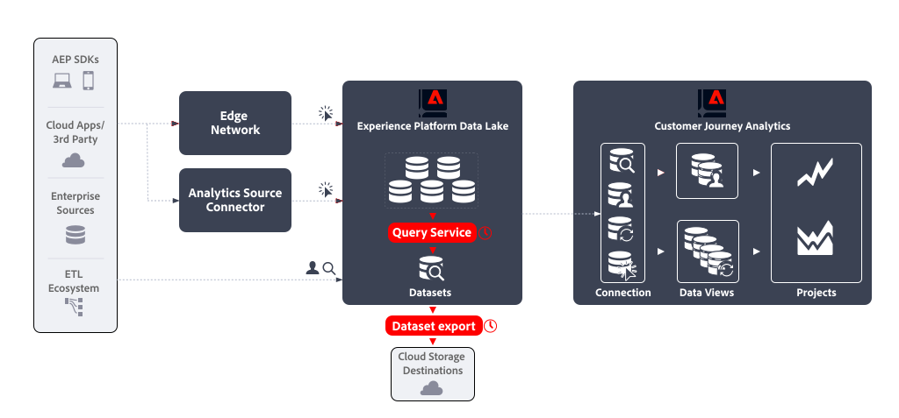

# Emular a funcionalidade do feed de dados

Os feeds de dados do Adobe Analytics são uma maneira avançada de obter dados brutos do Adobe Analytics. Esse caso de uso descreve como obter dados brutos semelhantes do Experience Platform para que você possa usar os dados em outras plataformas, ferramentas fora do Adobe e a critério da sua organização.

## Introdução

A emulação de um feed de dados do Adobe Analytics envolve:

* definição de um **consulta programada** que gera os dados do feed de dados como um conjunto de dados de saída , utilizando **Serviço de consulta**.
* definição de um **exportação do conjunto de dados agendada** que exporta o conjunto de dados de saída para um destino de armazenamento na nuvem, usando **Exportação do conjunto de dados**.




## Pré-requisitos 

Certifique-se de atender a todos os requisitos a seguir antes de usar a funcionalidade descrita neste caso de uso:

* Uma implementação em funcionamento que coleta dados no data lake do Experience Platform.
* Acesse o complemento Data Distiller para garantir que você esteja autorizado a executar consultas em lote. Consulte [Empacotamento do Serviço de consulta](https://experienceleague.adobe.com/docs/experience-platform/query/packaging.html?lang=en) para obter mais informações.
* Acesso à funcionalidade Exportar conjuntos de dados, disponível após a compra do pacote do Real-Time CDP Prime ou Ultimate, Adobe Journey Optimizer ou Customer Journey Analytics. Consulte [Exportar conjuntos de dados para destinos de armazenamento na nuvem](https://experienceleague.adobe.com/docs/experience-platform/destinations/ui/activate/export-datasets.html?lang=pt-BR) para obter mais informações.
* Um ou mais destinos (por exemplo: Amazon S3, Google Cloud Storage) configurados para onde você pode exportar os dados brutos do feed de dados.


## Serviço de consulta

O Serviço de consulta de Experience Platform permite consultar e associar qualquer conjunto de dados no data lake de Experience Platform como se fosse uma tabela de banco de dados. Você pode capturar os resultados como um novo conjunto de dados para uso em relatórios ou para exportação.

Usar o Serviço de consulta [interface do usuário](https://experienceleague.adobe.com/docs/experience-platform/query/ui/overview.html?lang=en), um [cliente conectado por meio do protocolo PostgresQL](https://experienceleague.adobe.com/docs/experience-platform/query/clients/overview.html?lang=pt-BR)ou [APIs RESTful](https://experienceleague.adobe.com/docs/experience-platform/query/api/getting-started.html?lang=en) para criar e agendar consultas que coletam os dados do feed de dados.

### Criar consulta

Você pode usar toda a funcionalidade do SQL ANSI padrão para instruções SELECT e outros comandos limitados para criar e executar queries que geram os dados para seu feed de dados. Consulte [Sintaxe SQL](https://experienceleague.adobe.com/docs/experience-platform/query/sql/syntax.html?lang=en) para obter mais informações. Além dessa sintaxe SQL, o Adobe suporta:

* pré-criado [Funções definidas por Adobe (ADF)](https://experienceleague.adobe.com/docs/experience-platform/query/sql/adobe-defined-functions.html?lang=en) que ajudam a executar tarefas comerciais comuns em dados de eventos armazenados no data lake do Experience Platform, incluindo funções para [Sessões](https://experienceleague.adobe.com/docs/analytics/components/virtual-report-suites/vrs-mobile-visit-processing.html?lang=pt-BR) e [Atribuição](https://experienceleague.adobe.com/docs/analytics/analyze/analysis-workspace/attribution/overview.html?lang=pt-BR),
* vários integrados [Funções do Spark SQL](https://experienceleague.adobe.com/docs/experience-platform/query/sql/spark-sql-functions.html?lang=en),
* [comandos PostgreSQL de metadados](https://experienceleague.adobe.com/docs/experience-platform/query/sql/metadata.html?lang=en),
* [instruções preparadas](https://experienceleague.adobe.com/docs/experience-platform/query/sql/prepared-statements.html?lang=en).


#### Identidades

No Experience Platform, várias identidades estão disponíveis. Ao criar suas consultas, verifique se você está consultando identidades corretamente.

Geralmente você encontra identidades em um grupo de campos separado. Em uma implementação da ECID (`ecid`) pode ser definido como parte de um grupo de campos com um `core` que faz parte de um `identification` objeto. (por exemplo: `_sampleorg.identification.core.ecid`). As ECIDs podem ser organizadas de forma diferente em seus esquemas.

Como alternativa, você pode usar `identityMap` para consultar identidades. Este objeto é do tipo `Map` e usa um [estrutura de dados aninhada](#nested-data-structure).


#### Colunas de feed de dados

Os campos XDM que você pode usar no query dependem da definição de esquema em que seus conjuntos de dados se baseiam. Entenda o esquema subjacente ao conjunto de dados.

Para facilitar o mapeamento entre as colunas do Feed de dados e os campos XDM, considere incluir o [Modelo de evento de experiência do Adobe Analytics](https://github.com/adobe/xdm/blob/master/extensions/adobe/experience/analytics/experienceevent-all.schema.json) grupo de campos no esquema de evento de experiência. Consulte [Práticas recomendadas para modelagem de dados](https://experienceleague.adobe.com/docs/experience-platform/xdm/schema/best-practices.html?lang=en) e mais especificamente [Grupos de campos de esquema do aplicativo Adobe](https://experienceleague.adobe.com/docs/experience-platform/xdm/schema/best-practices.html?lang=en#adobe-application-schema-field-groups).

Por exemplo, caso deseje usar *nome da página* como parte do feed de dados:

* Na interface do Feed de dados do Adobe Analytics, você selecionaria **[!UICONTROL pagename]** como a coluna a ser adicionada à definição do feed de dados.
* No Serviço de consulta, você inclui `web.webPageDetails.name` do `sample_event_dataset_for_website_global_v1_1` (com base no **Exemplo de esquema de evento para site (Global v1.1)** (esquema de evento de experiência) na sua query. Consulte a [Grupo de campos de esquema Detalhes da Web](https://experienceleague.adobe.com/docs/experience-platform/xdm/field-groups/event/web-details.html?lang=en) para obter mais informações.

Para entender o mapeamento entre antigas colunas do feed de dados do Adobe Analytics e campos XDM no conjunto de dados do evento de experiência e esquema subjacente, consulte [Mapeamento de campos do Analytics](https://experienceleague.adobe.com/docs/experience-platform/sources/connectors/adobe-applications/mapping/analytics.html?lang=pt-BR) e a variável [Grupo de campos de esquema de Extensão completa do Adobe Analytics ExperienceEvent](https://experienceleague.adobe.com/docs/experience-platform/xdm/field-groups/event/analytics-full-extension.html?lang=en) para obter mais informações.

Além disso, a [informações coletadas automaticamente pelo SDK da Web do Experience Platform (pronto para uso)](https://experienceleague.adobe.com/docs/experience-platform/edge/data-collection/automatic-information.html?lang=en) pode ser relevante para identificar colunas para sua consulta.

#### Dados e identificação do nível de ocorrência

Com base na implementação, os dados de nível de ocorrência tradicionalmente coletados no Adobe Analytics agora são armazenados como dados de evento com carimbo de data e hora no Experience Platform. A tabela a seguir é extraída de [Mapeamento de campo do Analytics](https://experienceleague.adobe.com/docs/experience-platform/sources/connectors/adobe-applications/mapping/analytics.html?lang=en#generated-mapping-fields) O e o mostram exemplos de como mapear colunas do Feed de dados da Adobe Analytics específicas do nível de ocorrência com campos XDM correspondentes em suas consultas. A tabela também mostra exemplos de como as ocorrências, visitas e visitantes são identificados usando campos XDM.

| Coluna de feed de dados | Campo XDM | Tipo | Descrição |
|---|---|---|---|
| hitid_high + hitid_low | _id | string | Um identificador exclusivo para identificar uma ocorrência. |
| hitid_low | _id | string | Usado em conjunto com hitid_high para identificar uma ocorrência de maneira exclusiva. |
| hitid_high | _id | string | Usado em conjunto com hitid_high para identificar uma ocorrência de maneira exclusiva. |
| hit_time_gmt | receivedTimestamp | string | O carimbo de data e hora da ocorrência, com base no horário Unix. |
| first_hit_time_gmt | _experience.analytics.endUser.firstTimestamp | string | Carimbo de data e hora, em horário Unix, da primeira ocorrência de um visitante. |
| cust_hit_time_gmt | carimbo de data e hora | string | Isso só é usado em conjuntos de dados habilitados para carimbo de data e hora. Esse é o carimbo de data e hora enviado com o it, com base no horário Unix. |
| visid_high + visid_low | identityMap | objeto | Um identificador exclusivo para uma visita. |
| visid_high + visid_low | endUserIDs._experience.aaid.id | string | Um identificador exclusivo para uma visita. |
| visid_high | endUserIDs._experience.aaid.primary | booleano | Usado em conjunto com visid_low para identificar uma visita de maneira exclusiva. |
| visid_high | endUserIDs._experience.aaid.namespace.code | string | Usado em conjunto com visid_low para identificar uma visita de maneira exclusiva. |
| visid_low | identityMap | objeto | Usado em conjunto com visid_high para identificar uma visita de maneira exclusiva. |
| cust_visid | identityMap | objeto | A ID do visitante do cliente |
| cust_visid | endUserIDs._experience.aacustomid.id | objeto | A ID de visitante do cliente. |
| cust_visid | endUserIDs._experience.aacustomid.primary | booleano | O código de namespace da ID de visitante do cliente. |
| cust_visid | endUserIDs._experience.aacustomid.namespace.code | string | Usado em conjunto com visid_low para identificar exclusivamente a ID de visitante do cliente. |
| geo\_* | placeContext.geo.* | sequência, número | Dados de geolocalização, como país, região, cidade e outros |
| visit_page_num | _experience.analytics.session.depth | number | Uma variável usada na dimensão Profundidade da ocorrência. Esse valor aumenta em uma unidade para cada ocorrência gerada pelo usuário e é redefinido após cada visita. |
| event_list | commerce.purchases, commerce.productViews, commerce.productListOpens, commerce.checkouts, commerce.productListAdds, commerce.productListRemovals, commerce.productListViews, \_experience.analytics.event101to200.*, ..., \_experience.analytics.event901_1000.\* | string | Eventos de comércio padrão e personalizados acionados na ocorrência. |
| page_event | web.webInteraction.type | string | O tipo de ocorrência enviado na solicitação da imagem (ocorrência padrão, link de download, link de saída ou link personalizado clicado). |
| page_event | web.webInteraction.linkClicks.value | number | O tipo de ocorrência enviado na solicitação da imagem (ocorrência padrão, link de download, link de saída ou link personalizado clicado). |
| page_event_var_1 | web.webInteraction.URL | string | Uma variável usada somente em solicitações de imagem de rastreamento de link. Essa variável contém o URL do link de download, link de saída, ou link personalizado clicado. |
| page_event_var_2 | web.webInteraction.name | string | Uma variável usada somente em solicitações de imagem de rastreamento de link. Isso lista o nome personalizado do link, se for especificado. |
| first_hit_ref_type | _experience.analytics.endUser.firstWeb.webReferrer.type | string | A ID numérica, que representa o tipo do primeiro referenciador do visitante. |
| first_hit_time_gmt | _experience.analytics.endUser.firstTimestamp | inteiro | Carimbo de data e hora, em horário Unix, da primeira ocorrência de um visitante. |
| paid_search | search.isPaid | booleano | Um sinalizador que é definido se a ocorrência corresponder à detecção de pesquisa paga. |
| ref_type | web.webReferrertype | string | Uma ID numérica que representa o tipo de referência para a ocorrência. |

#### Publicar colunas

Os feeds de dados do Adobe Analytics usam o conceito de colunas com uma `post_` prefixo, que são colunas que contêm dados após o processamento. Consulte [Perguntas frequentes sobre feeds de dados](https://experienceleague.adobe.com/docs/analytics/export/analytics-data-feed/df-faq.html?lang=en#post) para obter mais informações.

Os dados coletados em conjuntos de dados por meio da Rede de borda do Experience Platform (SDK da Web, SDK móvel, API do servidor) não têm conceito de `post_` campos, o que explica o porquê `post_` com prefixo e *não* `post_` colunas de feed de dados com prefixo no mapeamento de campos do Analytics são mapeadas para os mesmos campos XDM. Por exemplo, ambos `page_url` e `post_page_url` as colunas do feed de dados são mapeadas para a mesma `web.webPageDetails.URL` Campo XDM.

Consulte [Comparar o processamento de dados entre o Adobe Analytics e o Customer Journey Analytics](https://experienceleague.adobe.com/docs/analytics-platform/using/compare-aa-cja/cja-aa-comparison/data-processing-comparisons.html?lang=pt-BR) para obter uma visão geral da diferença no processamento de dados.

A variável `post_` o tipo de dados da coluna de prefixo, quando coletado no data lake do Experience Platform, requer, no entanto, transformações avançadas antes que possa ser usado com êxito em um caso de uso do feed de dados. A execução dessas transformações avançadas em seus queries envolve o uso de [Funções definidas pelo Adobe](https://experienceleague.adobe.com/docs/experience-platform/query/sql/adobe-defined-functions.html?lang=en) para sessão, atribuição e desduplicação. Consulte [Exemplos](#examples) sobre como usar essas funções.

#### Pesquisas

Para pesquisar dados de outros conjuntos de dados, use a funcionalidade SQL padrão (`WHERE` cláusula, `INNER JOIN`, `OUTER JOIN`e outros).

#### Cálculos

Para realizar cálculos em campos (colunas), use as funções SQL padrão (por exemplo `COUNT(*)` ou o [funções e operadores matemáticos e estatísticos](https://experienceleague.adobe.com/docs/experience-platform/query/sql/spark-sql-functions.html?lang=en#math) parte do Spark SQL. Além disso, [funções de janela](https://experienceleague.adobe.com/docs/experience-platform/query/sql/adobe-defined-functions.html?lang=en#window-functions) fornecer suporte para atualizar agregações e retornar itens únicos para cada linha em um subconjunto ordenado. Consulte [Exemplos](#examples) sobre como usar essas funções.

#### Estrutura de dados aninhada

Os esquemas nos quais os conjuntos de dados são baseados geralmente contêm tipos de dados complexos, incluindo estruturas de dados aninhadas. Anteriormente mencionado `identityMap` é um exemplo de estrutura de dados aninhada. Veja abaixo um exemplo de `identityMap` dados.

```json
{
   "identityMap":{
      "FPID":[
         {
            "id":"55613368189701342632255821452918751312",
            "authenticatedState":"ambiguous"
         }
      ],
      "CRM":[
         {
            "id":"2394509340-30453470347",
            "authenticatedState":"authenticated"
         }
      ]
   }
}
```

Você pode usar o [`explode()` ou outras funções de Arrays](https://experienceleague.adobe.com/docs/experience-platform/query/sql/spark-sql-functions.html?lang=en#arrays) do Spark SQL para obter os dados dentro de uma estrutura de dados aninhada, por exemplo:

```sql
select explode(identityMap) from demosys_cja_ee_v1_website_global_v1_1 limit 15;
```

Como alternativa, você pode consultar elementos individuais usando a notação de pontos. Por exemplo:

```sql
select identityMap.ecid from demosys_cja_ee_v1_website_global_v1_1 limit 15;
```

Consulte [Trabalho com estruturas de dados aninhadas no Query Service](https://experienceleague.adobe.com/docs/experience-platform/query/key-concepts/nested-data-structures.html?lang=en) para obter mais informações.


#### Exemplos

Por exemplo, consultas que usam dados de conjuntos de dados no data lake do Experience Platform, estão aproveitando os recursos adicionais de Funções definidas pelo Adobe e/ou Spark SQL, e que forneceriam resultados semelhantes a um feed de dados equivalente do Adobe Analytics, consulte

* [navegação abandonada](https://experienceleague.adobe.com/docs/experience-platform/query/use-cases/abandoned-browse.html?lang=en),
* [análise de atribuição](https://experienceleague.adobe.com/docs/experience-platform/query/use-cases/attribution-analysis.html?lang=en),
* [filtragem de bot](https://experienceleague.adobe.com/docs/experience-platform/query/use-cases/bot-filtering.html?lang=en),
* e outros casos de uso de exemplo no guia Serviço de consulta.


### Agendar consulta

Você programa a consulta para garantir que ela seja executada e que os resultados sejam gerados no intervalo de sua preferência.

#### Uso do Editor de consultas

Você pode agendar uma consulta usando o Editor de consultas. Ao agendar a query, você define um conjunto de dados de saída. Consulte [Agendamentos de consulta](https://experienceleague.adobe.com/docs/experience-platform/query/ui/query-schedules.html?lang=en) para obter mais informações.


#### Uso da API do Serviço de consulta

Como alternativa, você pode usar as APIs RESTful para definir uma consulta e um agendamento para a consulta. Consulte [Guia da API do Serviço de consulta](https://experienceleague.adobe.com/docs/experience-platform/query/api/getting-started.html?lang=en) para obter mais informações.
Certifique-se de definir o conjunto de dados de saída como parte da variável `ctasParameters` propriedade ao criar a consulta ([Criar uma consulta](https://developer.adobe.com/experience-platform-apis/references/query-service/#tag/Queries/operation/createQuery)) ou ao criar o agendamento para um query ([Criar uma consulta agendada](https://developer.adobe.com/experience-platform-apis/references/query-service/#tag/Schedules/operation/createSchedule)).


## Exportação do conjunto de dados

Depois de criar e agendar a consulta e verificar se os resultados nos conjuntos de dados de saída estão de acordo com seus requisitos, você pode exportar os conjuntos de dados brutos para destinos de armazenamento na nuvem. Essa exportação está na terminologia Destinos do Experience Platform, conhecida como Destinos de exportação do conjunto de dados. Consulte [Exportar conjuntos de dados para destinos de armazenamento na nuvem](https://experienceleague.adobe.com/docs/experience-platform/destinations/ui/activate/export-datasets.html?lang=pt-BR) para obter uma visão geral.

Os seguintes destinos de armazenamento em nuvem são compatíveis:

* [Armazenamento Azure Data Lake Gen2](https://experienceleague.adobe.com/docs/experience-platform/destinations/catalog/cloud-storage/adls-gen2.html?lang=en)
* [Data Landing Zone](https://experienceleague.adobe.com/docs/experience-platform/destinations/catalog/cloud-storage/data-landing-zone.html?lang=en)
* [Armazenamento em nuvem Google](https://experienceleague.adobe.com/docs/experience-platform/destinations/catalog/cloud-storage/google-cloud-storage.html?lang=en)
* [Amazon S3](https://experienceleague.adobe.com/docs/experience-platform/destinations/catalog/cloud-storage/amazon-s3.html?lang=en#changelog)
* [Azure Blob](https://experienceleague.adobe.com/docs/experience-platform/destinations/catalog/cloud-storage/azure-blob.html?lang=en#changelog)
* [SFTP](https://experienceleague.adobe.com/docs/experience-platform/destinations/catalog/cloud-storage/sftp.html?lang=en#changelog)


### IU DO EXPERIENCE PLATFORM

Você pode exportar e agendar a exportação dos conjuntos de dados de saída por meio da interface do usuário do Experience Platform. Esta seção descreve as etapas envolvidas.

#### Selecionar destino

Quando tiver determinado para qual destino do armazenamento na nuvem deseja exportar o conjunto de dados de saída, [selecionar o destino](https://experienceleague.adobe.com/docs/experience-platform/destinations/ui/activate/export-datasets.html?lang=en#select-destination). Quando ainda não tiver configurado um destino para seu armazenamento em nuvem preferido, você deverá [criar uma nova conexão de destino](https://experienceleague.adobe.com/docs/experience-platform/destinations/ui/connect-destination.html?lang=en).

Como parte da configuração de um destino, você pode definir o tipo de arquivo (JSON ou Parquet), se o arquivo resultante deve ser compactado ou não e se um arquivo de manifesto deve ser incluído ou não.


#### Selecionar conjunto de dados

Ao selecionar o destino, no próximo **[!UICONTROL Selecionar conjuntos de dados]** etapa é necessário selecionar o conjunto de dados de saída na lista de conjuntos de dados. Se você tiver criado várias consultas programadas e quiser que os conjuntos de dados de saída enviem para o mesmo destino de armazenamento na nuvem, poderá selecionar os conjuntos de dados de saída correspondentes. Consulte [Selecione seus conjuntos de dados](https://experienceleague.adobe.com/docs/experience-platform/destinations/ui/activate/export-datasets.html?lang=en#select-datasets) para obter mais informações.

#### Programar exportação do conjunto de dados

Por fim, você deseja agendar a exportação do conjunto de dados como parte da **[!UICONTROL Agendamento]** etapa. Nessa etapa, é possível definir o agendamento e se a exportação do conjunto de dados de saída deve ser incremental ou não. Consulte [Agendar exportação do conjunto de dados](https://experienceleague.adobe.com/docs/experience-platform/destinations/ui/activate/export-datasets.html?lang=en#scheduling) para obter mais informações.


#### Etapas finais

[Revisão](https://experienceleague.adobe.com/docs/experience-platform/destinations/ui/activate/export-datasets.html?lang=en#review) sua seleção e quando correto, comece a exportar seu conjunto de dados de saída para o destino do armazenamento na nuvem.

Você deve [verificar](https://experienceleague.adobe.com/docs/experience-platform/destinations/ui/activate/export-datasets.html?lang=en#verify) uma exportação de dados bem-sucedida. Ao exportar conjuntos de dados, o Experience Platform cria um ou vários `.json` ou `.parquet` arquivos no local de armazenamento definido em seu destino. Espere que os novos arquivos sejam depositados no local de armazenamento de acordo com o agendamento de exportação configurado. O Experience Platform cria uma estrutura de pastas no local de armazenamento especificado como parte do destino selecionado, onde deposita os arquivos exportados. Uma nova pasta é criada para cada exportação, seguindo o padrão: `folder-name-you-provided/datasetID/exportTime=YYYYMMDDHHMM`. O nome de arquivo padrão é gerado aleatoriamente e garante que os nomes de arquivo exportados sejam exclusivos.

### API do serviço de fluxo

Como alternativa, você pode exportar e agendar a exportação de conjuntos de dados de saída usando APIs. As etapas envolvidas estão documentadas em [Exportar conjuntos de dados usando a API do Serviço de fluxo](https://experienceleague.adobe.com/docs/experience-platform/destinations/api/export-datasets.html).

#### Introdução

Verifique se você tem o [permissões necessárias](https://experienceleague.adobe.com/docs/experience-platform/destinations/api/export-datasets.html#permissions) para exportar conjuntos de dados e que o destino para onde você deseja enviar o conjunto de dados de saída é compatível com a exportação de conjuntos de dados. Você deve [colete os valores dos cabeçalhos obrigatórios e opcionais](https://experienceleague.adobe.com/docs/experience-platform/destinations/api/export-datasets.html#gather-values-headers) usadas nas chamadas de API, bem como [identificar as IDs de especificação de conexão e especificação de fluxo do destino](https://experienceleague.adobe.com/docs/experience-platform/destinations/api/export-datasets.html#gather-connection-spec-flow-spec) você pretende exportar conjuntos de dados para o.

#### Recuperar conjuntos de dados qualificados

Você pode [recuperar uma lista de conjuntos de dados qualificados](https://experienceleague.adobe.com/docs/experience-platform/destinations/api/export-datasets.html#retrieve-list-of-available-datasets) para exportar e verificar se o conjunto de dados de saída faz parte dessa lista usando o [`GET /connectionSpecs/{id}/configs`](https://developer.adobe.com/experience-platform-apis/references/destinations/#tag/Configurations/operation/getDatasets) API.


#### Criar conexão de origem

Em seguida, você deve [criar uma conexão de origem](https://experienceleague.adobe.com/docs/experience-platform/destinations/api/export-datasets.html#create-source-connection) para o conjunto de dados de saída, usando sua ID exclusiva, que você deseja exportar para o destino do armazenamento na nuvem. Você usa o [`POST /sourceConnections`](https://developer.adobe.com/experience-platform-apis/references/destinations/#tag/Source-connections/operation/postSourceConnection) API.

#### Autenticar para destino (criar conexão base)

Agora você deve [criar uma conexão base](https://experienceleague.adobe.com/docs/experience-platform/destinations/api/export-datasets.html#create-base-connection) para autenticar e armazenar com segurança as credenciais no destino do armazenamento na nuvem usando o [`POST /targetConection`](https://developer.adobe.com/experience-platform-apis/references/destinations/#tag/Target-connections/operation/postTargetConnection) API.


#### Fornecer parâmetros de exportação

Em seguida, você deve [criar uma conexão de destino adicional que armazene os parâmetros de exportação](https://experienceleague.adobe.com/docs/experience-platform/destinations/api/export-datasets.html#create-target-connection) para seu conjunto de dados de saída usando, mais uma vez, o [`POST /targetConection`](https://developer.adobe.com/experience-platform-apis/references/destinations/#tag/Target-connections/operation/postTargetConnection) API. Esses parâmetros de exportação incluem local, formato de arquivo, compactação e muito mais.

#### Configurar fluxo de dados

Finalmente, você [configurar o fluxo de dados](https://experienceleague.adobe.com/docs/experience-platform/destinations/api/export-datasets.html#create-dataflow) para garantir que seu conjunto de dados de saída seja exportado para o destino do armazenamento em nuvem usando o [`POST /flows`](https://developer.adobe.com/experience-platform-apis/references/destinations/#tag/Dataflows/operation/postFlow) API. Nesta etapa, é possível definir o agendamento da exportação, usando o `scheduleParams` parâmetro.

#### Validar fluxo de dados

Para [verificar execuções bem-sucedidas do fluxo de dados](https://experienceleague.adobe.com/docs/experience-platform/destinations/api/export-datasets.html#get-dataflow-runs), use o [`GET /runs`](https://developer.adobe.com/experience-platform-apis/references/destinations/#tag/Dataflow-runs/operation/getFlowRuns) API, especificando a ID do fluxo de dados como parâmetro de consulta. Essa ID de fluxo de dados é um identificador retornado ao configurar o fluxo de dados.

[Verificar](https://experienceleague.adobe.com/docs/experience-platform/destinations/ui/activate/export-datasets.html?lang=en#verify) uma exportação de dados bem-sucedida. Ao exportar conjuntos de dados, o Experience Platform cria um ou vários `.json` ou `.parquet` arquivos no local de armazenamento definido em seu destino. Espere que os novos arquivos sejam depositados no local de armazenamento de acordo com o agendamento de exportação configurado. O Experience Platform cria uma estrutura de pastas no local de armazenamento especificado como parte do destino selecionado, onde deposita os arquivos exportados. Uma nova pasta é criada para cada exportação, seguindo o padrão: `folder-name-you-provided/datasetID/exportTime=YYYYMMDDHHMM`. O nome de arquivo padrão é gerado aleatoriamente e garante que os nomes de arquivo exportados sejam exclusivos.

## Conclusão

Resumindo, emular a funcionalidade do Feed de dados do Adobe Analytics implica configurar consultas agendadas usando o Serviço de consulta e usando os resultados dessas consultas em exportações agendadas de conjuntos de dados.

>[!IMPORTANT]
>
>Dois schedulers estão envolvidos neste caso de uso. Para garantir o funcionamento adequado da funcionalidade do feed de dados emulado, verifique se os agendamentos configurados no Serviço de consulta e nas exportações de dados não interferem.

