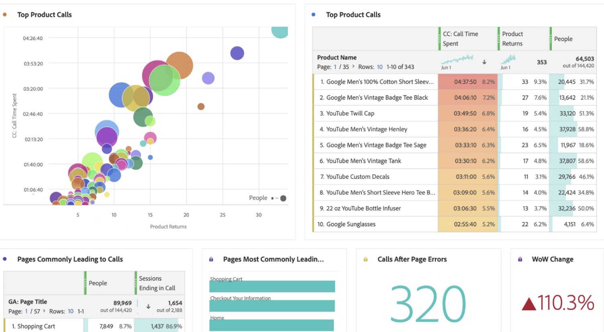

# Relatório de dados do Google Analytics no Customer Journey Analytics

Agora que você [assimilou os dados do Google Analytics na Experience Platform e no Customer Journey Analytics (CJA)](/help/use-cases/ga-to-cja.md), mostraremos alguns cenários úteis para os relatórios sobre esses dados.

## Visualizar dados da Web e dados do aplicativo como conjuntos de dados combinados

Este diagrama de Venn mostra a sobreposição de usuários em seu site (dos dados do Google Analytics) e em seu aplicativo móvel (dos dados do Firebase) e na central de atendimento. Você também pode ver os produtos com melhor desempenho, não apenas na Web, mas também no aplicativo móvel. Você ainda pode obter o total da receita de ambos usando uma métrica calculada. Observe como os principais produtos contam uma história diferente quando você examina a receita combinada. Sem os conjuntos de dados combinados, você nunca saberia que &quot;Gorro de sarja&quot; tinha um desempenho tão bom.

## Identificar os motivos da chamada e reduzir o volume de chamadas

Para verificar se você tem recebido muitas chamadas, consulte em nossa central de atendimento as tendências de tempo gasto ao longo dos últimos dois meses. É fácil ver o aumento da tendência. Isso é preocupante, já que você gasta dinheiro a cada minuto que os representantes da central de atendimento estão ao telefone. Isso pode definitivamente afetar o resultado final.

Vamos analisar os principais motivos que causam o aumento das chamadas para a central de atendimento. Observe que &quot;Cartão de crédito negado&quot;, &quot;Remover cartão de crédito&quot; e &quot;Produto danificado&quot; são os principais motivos. Isso já pode indicar maneiras de melhorar a experiência online. Você também pode direcionar esses motivos de chamada e ver quais contribuíram mais para o pico geral. É interessante ver que os clientes com &quot;Produto danificado&quot; gastaram mais de 3 minutos por chamada.

Vamos analisar mais detalhadamente e ver quais produtos estão causando a maioria das chamadas para a central de atendimento e quantos clientes fizeram essas chamadas. O gráfico de bolhas indica que 20.000 pessoas telefonaram, gastaram mais de 4 horas e 30 minutos e devolveram 33 unidades do produto &quot;Camiseta masculina de manga curta&quot;.

Podemos detalhar esse insight e ver por que essas pessoas retornaram o produto arrastando a dimensão &quot;Motivo da chamada&quot;. Como você pode ver, o motivo pelo qual este produto está recebendo tantas chamadas é devido a &quot;Produto danificado&quot;. O próximo passo seria entrar em contato com o departamento de controle de qualidade e ver por que os clientes têm recebido camisetas com defeito.

Agora vamos ver quais páginas de site determinaram as chamadas recebidas na central de atendimento. Isso permite que você saiba onde estão as experiências com baixo desempenho no site e ajude seus Gerentes de produto a resolverem esses desafios.

Fazemos isso ao

* Usar uma métrica calculada para filtrar os dados somente para sessões que terminaram com uma chamada para a central de atendimento.
* Uso do modelo de &quot;participação&quot; no [Attribution IQ](https://experienceleague.adobe.com/docs/analytics-platform/using/cja-workspace/attribution/models.html?lang=pt-BR#cja-workspace) do CJA.

Você pode ver com facilidade quais páginas participam com mais frequência em uma sessão que termina em uma chamada. Você pode ver que as páginas &quot;Carrinho de compras&quot; e &quot;Informações de check-out&quot; determinaram a maioria das chamadas. Como também incluiu os dados do aplicativo móvel Firebase, você pode até ver erros de página e falhas do aplicativo que geram as chamadas. Esse é um ponto de dados muito importante se você quer oferecer excelentes experiências na web e no aplicativo móvel.

Por fim, usando a tabela de coorte no Analysis Workspace, é fácil visualizar quanto tempo os usuários normalmente levam para chamar nossa central de atendimento depois de visitarem o site. Aqui você pode ver que o tempo médio está entre 3 e 4 semanas.

## Usar atribuição de marketing avançada

O CJA permite usar modelos de atribuição sofisticados em seus dados entre canais. No exemplo a seguir, é possível ver uma comparação da aplicação de Último contato, primeiro contato, forma de u e atribuição algorítmica de receita à dimensão Agrupamento de canal do Google Analytics.

Usando uma métrica calculada, você pode aplicar essa atribuição à receita da Web, à receita do aplicativo móvel e até mesmo remover devoluções de produtos. Como resultado, você pode ver a verdadeira receita líquida de cada canal de marketing.

O Attribution IQ também permite filtrar os dados com facilidade. Você pode ver a atribuição em relação apenas a conjuntos específicos de usuários, como aqueles que estão usando mais de um dispositivo.

Por último, você também pode atribuir sua receita da Web e do aplicativo ao seu conteúdo de anúncio do Google. Você perceberá que obteve mais receita com o aplicativo móvel impulsionado pelo Google Ads online do que com a web. Classificando anúncios por receita da Web e do aplicativo, você obtém uma imagem bem diferente do que eram seus anúncios do Google com melhor desempenho.

Sem o CJA, você não poderia saber que seus anúncios online estavam afetando produtos comprados em seu aplicativo móvel. Agora você pode ver que a receita do aplicativo móvel do Google Ads representa US$ 14 mil a US$ 5 mil adicionais em comparação somente com a Web.

