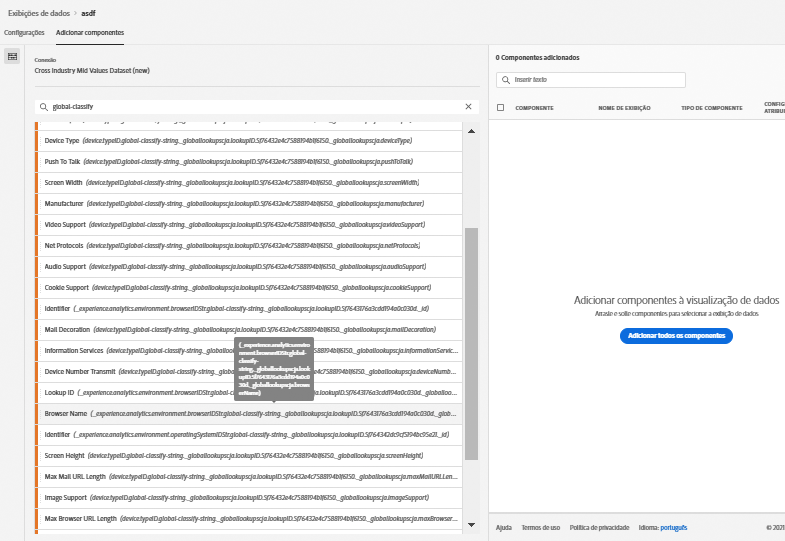
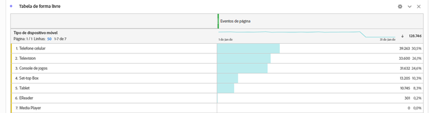

# Adicionar pesquisas globais aos seus conjuntos de dados

Pesquisas globais aprimoram a capacidade da Customer Journey Analytics de relatar sobre algumas dimensões/atributos que não são úteis por si mesmos, mas são úteis quando unidos a outros dados. Exemplos incluem atributos de dispositivos móveis e atributos de dimensões de SO e navegador, como números de versão do navegador. Uma &#39;Pesquisa global&#39; é muito semelhante a um conjunto de dados de pesquisa (conhecido como classificações no Adobe Analytics tradicional). No entanto, as pesquisas globais são aplicáveis em organizações Experience Cloud. Pesquisas globais são automaticamente aplicadas a todos os conjuntos de dados de evento que contêm determinados campos de schema XDM (consulte abaixo para obter os campos específicos).
Para cada localização de schema que o Adobe está classificando, existe um conjunto de dados de pesquisa global. Você pode usar conjuntos de dados de pesquisa global com o Conector de origem do Analytics ou com outros conjuntos de dados personalizados que podem aceitá-los.

Na Adobe Analytics tradicional, essas dimensões são exibidas sozinhas, enquanto no CJA, é necessário incluir essas dimensões ativamente ao criar visualizações de dados. Quando um usuário, no fluxo de trabalho Conexões, seleciona um conjunto de dados que é sinalizado como um com uma chave para pesquisas globais, então a interface do usuário do visualização de dados sabe que inclui todas as dimensões de pesquisa global como disponíveis para o relatórios. O fluxo de trabalho do visualização de dados sabe que inclui essas dimensões globais de pesquisa como disponíveis para a visualização de dados. Os arquivos de pesquisa são mantidos automaticamente atualizados e disponíveis em todas as regiões e para todas as contas. Eles são armazenados em organizações específicas da região associadas ao cliente.

## Usar pesquisas globais com conjuntos de dados do Conector de dados de Adobe

Os conjuntos de dados de pesquisa global são aplicados automaticamente no momento do relatório. Se você estiver usando o [Conector de dados do Analytics](https://experienceleague.adobe.com/docs/experience-platform/sources/connectors/adobe-applications/analytics.html?lang=en#connectors) e trazer uma dimensão para a qual o Adobe fornece uma pesquisa global, nós automaticamente aplicamos essa pesquisa global. Se um conjunto de dados de evento contiver campos [XDM](https://experienceleague.adobe.com/docs/experience-platform/xdm/home.html?lang=en), nós poderemos aplicar pesquisas globais a ele.

## Usar pesquisas globais com conjuntos de dados personalizados

É necessário haver uma chave no conjunto de dados do evento que seja compatível com os conjuntos de dados de pesquisa global. Contanto que você preencha os campos XDM corretos adicionando alguns de nossos schemas padrão [Adobe Experience Platform mixins](https://experienceleague.adobe.com/docs/experience-platform/xdm/mixins/event/environment-details.html?lang=en#mixins), poderá fazer com que conjuntos de dados personalizados funcionem com pesquisas globais.

## Campos de pesquisa globais disponíveis

* `browser`
   * `browser`,  `group_id`,  `id`
* `browser_group`
   * `browser_group`, `id`
* `os`
   * `os`,  `group_id`,  `id`
* `os_group`
   * `os_group`,  `id`
* `mobile_audio_support - multi`
* `mobile_color_depth`
* `mobile_cookie_support`
* `mobile_device_name`
* `mobile_device_number_transmit`
* `mobile_device_type`
* `mobile_drm - multi`
* `mobile_image_support - multi`
* `mobile_information_services`
* `mobile_java_vm - multi`
* `mobile_mail_decoration`
* `mobile_manufacturer`
* `mobile_max_bookmark_url_length`
* `mobile_max_browser_url_length`
* `mobile_max_mail_url_length`
* `mobile_net_protocols - multi`
* `mobile_os`
* `mobile_push_to_talk`
* `mobile_screen_height`
* `mobile_screen_size`
* `mobile_screen_width`
* `mobile_video_support - multi`

## Relatório sobre dimensões de pesquisa globais

Para relatar as dimensões de pesquisa global, é necessário adicioná-las ao criar uma visualização de dados no Customer Journey Analytics:

Você pode ver os dados de pesquisa no Workspace:

