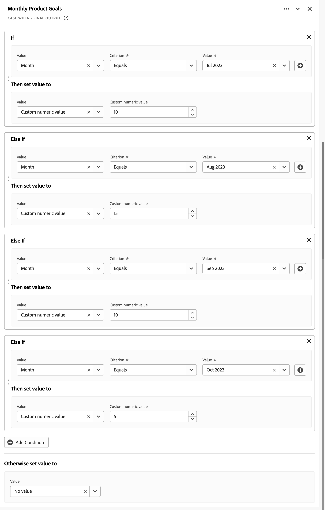

# Usar campos derivados para relatar metas

Este caso de uso descreve como usar a força de campos derivados para definir metas para uma dimensão específica e, em seguida, usar essas metas no projeto do Workspace.

Se não estiver familiarizado com campos derivados, consulte a [tutorial](https://experienceleague.adobe.com/docs/customer-journey-analytics-learn/tutorials/data-views/derived-fields-in-cja.html?lang=en) e [documentação](../data-views/derived-fields/derived-fields.md) para uma introdução.

## Definir metas

Para definir metas, crie um novo campo derivado em que você defina explicitamente valores numéricos personalizados direta ou indiretamente usando os valores resultantes das regras anteriores na definição do campo derivado.

### Metas de pedidos mensais de vale-presente

Você deseja definir metas explicitamente para seus pedidos de cartão-presente por quatro meses, de julho de 2023 a outubro de 2023. Para fazer isso:

1. Criar um novo campo derivado com o nome `Monthly Gift Certificate Orders Goal (Incremental)`.

1. Defina valores estáticos, usando uma REGRA CASE WHEN para cada mês, definindo um **[!UICONTROL Valor numérico personalizado]**. Consulte a regra de Metas mensais do produto abaixo.

   

### Metas de receita do canal de marketing

Você deseja definir uma meta de receita mensal para cada canal de marketing. Para fazer isso:

1. Criar um novo campo derivado, usando o [Modelo de função dos canais de marketing](/help/data-views/derived-fields/derived-fields.md#marketing-channels) com o nome `Monthly Marketing Channel Revenue Goal (Incremental)`.

1. Defina todas as regras para identificar corretamente cada um dos canais de marketing com base em uma combinação das regras URL PARSE e CASE WHEN. Por exemplo:

   

1. Defina explicitamente valores estáticos, representando metas mensais de receita, para os canais de marketing específicos em uma regra CASE WHEN final, definindo uma **[!UICONTROL Valor numérico personalizado]**. Consulte a [!DNL Monthly Goal] regra abaixo.

   

## Usar metas

Para usar metas no projeto do Workspace, use a funcionalidade de métrica calculada para &quot;normalizar&quot; o campo derivado de volta ao valor estático original. Essa normalização é necessária, pois os valores estáticos definidos para os campos derivados que definem metas são incrementados com cada evento.

### Metas de pedidos mensais de vale-presente

1. Crie um campo de métrica calculada chamado `Monthly Gift Certificate Orders Goal`, definida como:

   

1. É possível criar campos calculados adicionais, por exemplo `% of Monthly Gift Certificate Orders Goal`, para mostrar o progresso real em relação às metas, por exemplo:

   

Você pode usar essas métricas calculadas para relatar o progresso em tabelas e visualizações de forma livre. Por exemplo:

### Metas de receita do canal de marketing

1. Crie um campo de métrica calculada chamado `Marketing Channel Revenue Goal`, definida como:

   

1. É possível criar campos calculados adicionais, por exemplo `% of Marketing Channel Revenue Goal`, para mostrar o progresso real em relação às metas, por exemplo:

   

Você pode usar essas métricas calculadas para relatar o progresso em tabelas e visualizações de forma livre. Por exemplo:

