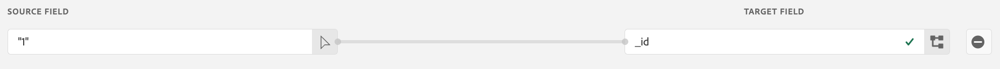

# Assimilar dados históricos do Google Analytics

Esta página foca em como assimilar seus dados históricos do Google Analytics na Adobe Experience Platform como um conjunto de dados, permitindo referenciar esse conjunto de dados em uma visualização de dados no Customer Journey Analytics. Você pode combinar as etapas desta página com a [Configuração de uma implementação em tempo real do Google Analytics](streaming.md), que gera um conjunto de dados recorrente. Combine esse conjunto de dados histórico com o seu conjunto de dados da implementação atual para obter uma visualização contínua dos dados no Customer Journey Analytics com dados atuais e preenchidos retroativamente.

## Pré-requisitos

Para realizar essas tarefas, você precisa do seguinte acesso e permissões:

* Acesso à Adobe Experience Platform
* Acesso ao Google Analytics (GA Standard ou GA 360)
* [Acesso de administrador](/help/technotes/access-control.md) ao Customer Journey Analytics.

## Configurar uma exportação do BigQuery

A estrutura de dados nas propriedades do Universal Analytics é diferente da estrutura de dados nas propriedades do Google Analytics 4. Configure uma exportação do BigQuery com base no tipo de propriedade da qual você deseja exportar dados:

* [Configurar uma exportação do BigQuery para uma propriedade do Universal Analytics](https://support.google.com/analytics/answer/3416092)
* [Configurar uma exportação do BigQuery para uma propriedade do Google Analytics 4](https://support.google.com/analytics/answer/9823238)

### Requisitos adicionais para propriedades do Universal Analytics

>[!NOTE]
>
>Esta seção se aplica somente às propriedades do Universal Analytics. Se estiver exportando de uma propriedade do GA4, você pode prosseguir para [Exportar dados para a Google Cloud Platform](#export-gcp).

As propriedades do Universal Analytics armazenam cada registro em seus dados como uma sessão de usuário, em vez de eventos individuais. É necessária uma consulta SQL para converter os dados do Universal Analytics em um formato compatível com a Adobe Experience Platform. Aplique a função `UNNEST` ao campo `hits` no esquema do GA, e salve-o como uma tabela do BigQuery.


>[!BEGINSHADEBOX]

Assista a  [From Google Analytics to Customer Journey Analytics - BigQuery](https://video.tv.adobe.com/v/332634?quality=12&learn=on){target="_blank"} para ver um vídeo de demonstração.

>[!ENDSHADEBOX]


```sql
SELECT
   *,
   timestamp_seconds(`visitStartTime` + hit.time) AS `timestamp` 
FROM
   (
      SELECT
         fullVisitorId,
         visitNumber,
         visitId,
         visitStartTime,
         trafficSource,
         socialEngagementType,
         channelGrouping,
         device,
         geoNetwork,
         hit 
      FROM
         `example_bq_table_*`,
         UNNEST(hits) AS hit 
   )
```

## Exportar dados para a Google Cloud Platform {#export-gcp}

Na Google Cloud Platform, navegue até **Exportar > Exportar para o GCS**. Quando os dados estiverem no Google Cloud Storage, eles estarão prontos para serem transferidos para a Adobe Experience Platform.

## Importar os dados do Google Cloud Storage para a Experience Platform

1. Na Adobe Experience Platform, selecione **[!UICONTROL Fontes]** à esquerda.
1. No Catálogo, localize a opção **[!UICONTROL Google Cloud Storage]**. Clique em **[!UICONTROL Adicionar dados]**.


>[!BEGINSHADEBOX]

Consulte  [Importar dados do Google Analytics para o Adobe Experience Platform](https://video.tv.adobe.com/v/332676?quality=12&learn=on){target="_blank"} para ver um vídeo de demonstração.

>[!ENDSHADEBOX]


>[!TIP]
>
>Se você planeja importar dados históricos e transmitidos em tempo real do Google Analytics, certifique-se de usar o mesmo esquema para ambos os conjuntos de dados. Você pode mesclar os conjuntos de dados em uma Customer Journey Analytics usando um [Conjunto de dados combinado](/help/connections/combined-dataset.md).

Você pode mapear os dados do evento do GA em um conjunto de dados existente criado anteriormente ou criar um conjunto de dados usando um esquema XDM de sua escolha. Depois que você seleciona o esquema, a Experience Platform aplica o aprendizado de máquina para mapear automaticamente cada um dos campos nos dados do Google Analytics para o [esquema XDM](https://experienceleague.adobe.com/docs/experience-platform/xdm/home.html?lang=pt-BR#ui).


Quando terminar de mapear os campos no esquema XDM, você poderá agendar essa importação de forma recorrente e aplicar a validação de erros durante o processo de ingestão. Essa validação garante que não haja problemas com os dados importados.

## Campos XDM obrigatórios

Determinados campos XDM na Platform exigem o formato correto para que os dados sejam processados corretamente.

* **`timestamp`**: criar um campo calculado especial na interface do esquema da Experience Platform. Clique em **[!UICONTROL Adicionar campo calculado]** e envolva a string `timestamp` com uma função `date`:

  `date(timestamp, "yyyy-MM-dd HH:mm:ssZ")`

  Salve o campo calculado na estrutura de dados do carimbo de data e hora do esquema:

  

* **`_id`**: Este campo deve conter um valor. A Customer Journey Analytics não se importa com o valor. Você pode adicionar o valor “1” ao campo:

  

## Próximas etapas

* Se tiver dados atuais que deseja transmitir para a Adobe Experience Platform, consulte [Configurar a transmissão de dados do Google Analytics](streaming.md).
* Se quiser começar a criar relatórios sobre dados preenchidos retroativamente, consulte [Criar uma conexão](/help/connections/create-connection.md).
